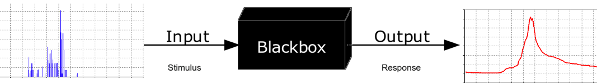
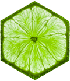

<style>
p.caption {
  font-size: 0.5em;
}
</style>

```{r setup, include = FALSE}
knitr::opts_chunk$set(echo = FALSE, warning = FALSE, message = FALSE)
```

# Motivation for <span style="color:lime">LIME</span>

## Black Box Prediction Models

```{r, out.width = "600px", fig.align = "center", fig.cap = "https://en.wikipedia.org/wiki/Black_box"}

```

**Examples**: random forests, neural networks, etc.

**Benefit**: offer better predictive ability than more interpretable models such as linear regression models, regression and classification trees, etc.

**Disadvantages**:

* Loss of interpretability
* Difficult to assess whether model is trustworthy
    + Can check predictive ability with cross validation
    + Does not indicate if predictions are made based on reasonable features

## Enter <span style="color:lime">LIME</span>...

LIME (Local Interpretable Model-agnostic Explanations)

* Procedure developed and implemented in Python by computer scientists (Ribeiro, Singh, and Guestrin) at the University of Washington
* Addresses the issue of whether a black box predictive model is trustworthy
* Produces "explanations" for individual predictions 
      + Explanations indicate which variables/features most influence the prediction and in what way
* Thomas Pedersen created the package `lime` to implement the method in R

```{r, out.width = "75px", fig.align = "left"}

```

# What is <span style="color:lime">LIME</span>?

## Example from paper 

* A model is built to predict whether a patient has the flu
* Suppose the model predicts that a new patient has the flu 
* LIME considers this case and highlights which variables led to the prediction:
    + <span style="color:green">green</span>: evidence supporting the prediction
    + <span style="color:red">red</span>: evidence against the prediction
* In this case, did the model make a prediction based on reasonable variables?

```{r, out.width = "700px", fig.align = "center", fig.cap = "Figure 1 in Ribeiro et al."}

```

## <span style="color:lime">L</span> I M E: <span style="color:lime">Local</span>

* Model may be too complex to explain globally, so consider how it behaves close to a specific case
* At the local level, a simpler and more interpretable model such as linear regression or decision trees could be used to determine the driving variables
* "Behind the workings of lime lies the (big) assumption that every complex model is linear on a local scale."
    - Thomas Pedersen

```{r, out.width = "350px", fig.align = "center", fig.cap = "Figure 3 in Ribeiro et al."}

```

## L <span style="color:lime">I</span> M E: <span style="color:lime">Interpretable</span>

* Algorithm was developed with a goal of creating easily interpretable "explanations" for the predictions
* The explanations should be interpretable enough that people who are not well versed in machine learning or statistics can tell if the prediction was made in a reasonable manner

```{r, out.width = "600px", fig.align = "center", fig.cap = "Figure 2 in Ribeiro et al."}

```

## L I <span style="color:lime">M</span> E: <span style="color:lime">Model-agnostic</span>

* Algorithm was developed so that it would work with any black-box predictor
* Details in the algorithm need to be adjusted depending on the type of prediction model
* Currently the `lime` R package supports:
    + Models from the `caret` and `mlr` packages
    + Tabular and text data

## L I M <span style="color:lime">E</span>: <span style="color:lime">Explanations</span>

* The goal of LIME is to obtain explanations for individual predictions
* These explanations can take on different forms depending on the type of data
    - text classification: presence or absence of a word
    - image classification: image with unimportant pixels colored grey
    - random forest: cutoffs for numeric variables
    
```{r, out.width = "600px", fig.align = "center", fig.cap = "Figure 4 in Ribeiro et al."}
knitr::include_graphics("./figures/image_explanation.png")
```

# <span style="color:lime">LIME</span> Procedure with Iris Data (in R)

## Step 0: Split iris data into training and testing datasets

```{r, echo = TRUE}
# Iris dataset
iris[1:3, ]

# Split up the data set into training and testing datasets
iris_test <- iris[1:5, 1:4]
iris_train <- iris[-(1:5), 1:4]

# Create a vector with the responses for the training dataset
iris_lab <- iris[[5]][-(1:5)]
```

## Step 1: Fit a complex model to the training data

```{r, echo = TRUE}
# Create random forest model on iris data
library(caret)
rf_model <- train(iris_train, iris_lab, method = 'rf')

# Can use the complex model to make predictions
Pred <- predict(rf_model, iris_test)
Actual <- iris[1:5, 5]
data.frame(iris_test, Pred, Actual)
```

## Step 2: Obtain distributions of the variables from the training data

```{r, echo = TRUE}
# Create an explainer object
library(lime); explainer <- lime(iris_train, rf_model)

# Sepal length quantiles obtained from training data
explainer$bin_cuts$Sepal.Length

# Probability distribution for sepal length
explainer$feature_distribution$Sepal.Length
```

## | Histogram of Sepal Length from Training Data

```{r, fig.width = 8, fig.height = 5, fig.align = "center"}

# Histogram of sepal length from training data
ggplot(iris_train, aes(x = Sepal.Length)) +
  geom_histogram(bins = 10, color = "grey") +
  geom_vline(xintercept = explainer$bin_cuts[[1]][[1]], color = "green", size = 1) +
  geom_vline(xintercept = explainer$bin_cuts[[1]][[2]], color = "green", size = 1) +
  geom_vline(xintercept = explainer$bin_cuts[[1]][[3]], color = "green", size = 1) +
  geom_vline(xintercept = explainer$bin_cuts[[1]][[4]], color = "green", size = 1) +
  geom_vline(xintercept = explainer$bin_cuts[[1]][[5]], color = "green", size = 1) +
  labs(x = "Sepal Length", y = "Count")
```

## Step 3: Sample from each of the variable distributions $n$ times

Histograms of predictor variables from training data

```{r, out.width = "500px", fig.align = "center"}

```

## | Histograms of $n=5000$ samples from distributions of training variables for each of the five testing cases

```{r, out.width = "550px", fig.align = "center"}

```

## Step 4: Obtain predictions for sampled values using the complex model

* For each testing case use the random forest model to make a prediction for each of the $n=5000$ samples
* In the iris data, the predictions are represented by the probability that a flower is a particular species

```{r}
perturb <- read.csv("./data/perturb_predictions.csv")
perturb
```

## Step 5: Obtain similarity score between data observation and sampled values

We need to determine how similar a sampled case is to the observed case in the testing data

Case 1 from testing data:
```{r}
iris_test[1, ]
```

First sample from training data variable distributions associated with case 1 of testing data:
```{r}
perturb[1, 1:4]
```

---- 

LIME uses exponential kernel function
  $$\pi_{x_{obs}}(x_{sampled}) = exp\left\{\frac{−D(x_{obs}, \ x_{sampled})^2}{σ^2}\right\}$$
where

$x_{obs}$: observed data vector to predict  

$x_{sampled}$: sampled data vector from distribution of training variables  

$D(\cdot \ , \ \cdot)$: distance function such as euclidean distance, cosine distance, etc.  

$\sigma$: width (default set to 0.75 in `lime`)
    
## Step 6: Perform feature selection by fiting a model to the sampled data and associated predictions (weighted by the similarity scores)

* The user can specify the number of variables (features) they would like to select: $m$
* With the iris data, the following three models will be fit to perform variable selection to select $m=2$ features:

$$\mbox{P(setosa)} \sim \mbox{Sepal.Length} + \mbox{Sepal.Width} + \mbox{Petal.Length} + \mbox{Petal.Width}$$
$$\mbox{P(versicolor)} \sim \mbox{Sepal.Length} + \mbox{Sepal.Width} + \mbox{Petal.Length} + \mbox{Petal.Width}$$
$$\mbox{P(virginica)} \sim \mbox{Sepal.Length} + \mbox{Sepal.Width} + \mbox{Petal.Length} + \mbox{Petal.Width}$$

----

* To perform variable selection `lime` supports: 
    - forward selection with ridge regression
    - highest weight with ridge regression
    - LASSO
    - tree models
    - auto: forward selection if $m\le6$, highest weight otherwise

## Step 7: Fit a simple model to regress the predictions on the $m$ selected predictor variables (weighted by the similarity scores)

* Currently, `lime` is programmed to use ridge regression as the "simple" model
* If the response is categorical, the user can select how many categories they want to explain
* In this example, only setosa will be explained
* If petal length and sepal length were selected as the most important features for the first case in the testing data, then the simple model is

  $$\mbox{P(Setosa)} \sim \mbox{Petal.Length} + \mbox{Sepal.Length} $$
  
## Step 8: Extract the feature weights and use them as the explanations

* Steps 3 through 8 are all performed using the `explain` function in `lime`
* Steps 3 through 7 all happen behind the scenes
* The "feature weights" that are extracted are the coefficients for the predictor variables from the ridge regression

```{r, echo = TRUE}
# Explain new observation
explanation <- explain(iris_test, explainer, n_labels = 1, 
                       n_features = 2, n_permutations = 5000,
                       feature_select = 'auto')
```

----

```{r, echo = TRUE}
explanation[1:2, 1:6]
explanation[1:2, 7:10]
explanation[1:2, 11:13]
```

## | Plot of explanations for predictions from random forest model trained on iris data

```{r, echo = TRUE}
plot_features(explanation)
```

# Wolf and Husky Example

## Set up of Wolf and Husky Experiment

* The developers trained a neural network to distinguish between a husky and a wolf
* They used the model to make predictions on new images of wolves and huskies
* Neural network got 8/10 correct

```{r, out.width = "600px", fig.align = "center", fig.show = 'hold'}
knitr::include_graphics("./figures/wolfhusky.png")
```

## Recreation of Experiment from Paper

* Go to the link below
* You will be shown images with the predictions from the model and asked to determine whether you think the model is doing a good job
* Then you will see the predictions and the LIME explanations and again asked to determine whether you think the model is doing a good job
* https://docs.google.com/forms/d/e/1FAIpQLSc86tBg_Q-A-x0jOwq2fzkFPCmdQi0g-oe3lGtON50owqmKfg/viewform

## Predictions from the Neural Network

```{r, out.width = "800px", fig.align = "center"}

```

## Wolf and Husky Lime Explanations

```{r, out.width = "750px", fig.align = "center"}
knitr::include_graphics("./figures/wolf_husky_explanations.png")
```

## Predictions from the Neural Network with LIME Explanations 

Based on these explanations, how is the neural network distinguishing between wolves and huskies?

```{r, out.width = "800px", fig.align = "center"}

```

## Results from Experiment in the Paper

* Showed the predictions with and with the explanations to graduate students who have had at least one machine learning course
* Asked the participants: 
    - Do they trust the algorithm to work well in the real world?
    - Why?
    - How do they think the algorithm is able to distinguish between these photos of wolves and huskies?

Response                              | Without Explanations  | With Explanations
------------------------------------  | --------------------- | ---------------------
Trusted the bad model                 | 10 out of 27          | 3 out of 27
Mentioned snow as a potential feature | 12 out of 27          | 25 out of 27

# Links to <span style="color:lime">LIME</span>

## Interesting Links Related to LIME

**Original paper**: Marco Tulio Ribeiro, Sameer Singh, and Carlos Guestrin. “Why should I trust you?”: Explaining the predictions of any classifier. In Knowledge Discovery and Data Mining (KDD), 2016.
https://arxiv.org/abs/1602.04938

**Informative Video**: https://www.youtube.com/watch?v=hUnRCxnydCc

**Python Code on Marco's GitHub**:  https://github.com/marcotcr/lime

**`lime` R Package on Thomas Pedersen's GitHub**: https://github.com/thomasp85/lime

**`lime` Vignette**: https://github.com/thomasp85/lime/blob/master/vignettes/Understanding_lime.Rmd


