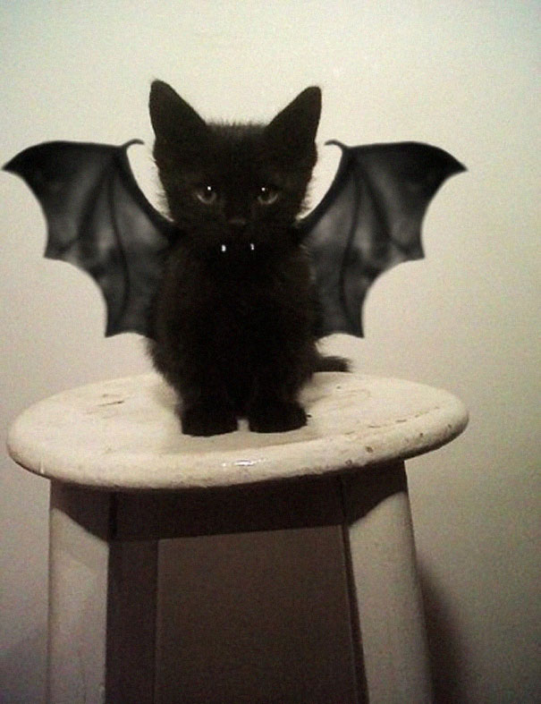

<style>

.remark-slide-content {
  background-color: #FFFFFF;
  border-top: 80px solid #F9C389;
  font-size: 20px;
  font-weight: 300;
  line-height: 1.5;
  padding: 1em 2em 1em 2em
}

.inverse {
  background-color: #696767;
  border-top: 80px solid #696767;
  text-shadow: none;
  background-image: url(https://github.com/goodekat/presentations/blob/master/2019-isugg-gganimate-spooky/figures/spider.png?raw=true);
	background-position: 50% 75%;
  background-size: 150px;
}

.your-turn{
  background-color: #8C7E95;
  border-top: 80px solid #F9C389;
  text-shadow: none;
  background-image: url(https://github.com/goodekat/presentations/blob/master/2019-isugg-gganimate-spooky/figures/spider.png?raw=true);
	background-position: 95% 90%;
  background-size: 75px;
}

.title-slide {
  background-color: #F9C389;
  border-top: 80px solid #F9C389;
  background-image: none;
}

.title-slide > h1  {
  color: #111111;
  font-size: 40px;
  text-shadow: none;
  font-weight: 400;
  text-align: left;
  margin-left: 15px;
  padding-top: 80px;
}
.title-slide > h2  {
  margin-top: -25px;
  padding-bottom: -20px;
  color: #111111;
  text-shadow: none;
  font-weight: 300;
  font-size: 35px;
  text-align: left;
  margin-left: 15px;
}
.title-slide > h3  {
  color: #111111;
  text-shadow: none;
  font-weight: 300;
  font-size: 25px;
  text-align: left;
  margin-left: 15px;
  margin-bottom: -30px;
}

</style>

```{css, echo=FALSE}
.left-code {
  color: #777;
  width: 40%;
  height: 92%;
  float: left;
}
.right-plot {
  width: 59%;
  float: right;
  padding-left: 1%;
}
```

```{r setup, include = FALSE}

# R markdown options
knitr::opts_chunk$set(echo = TRUE, 
                      cache = TRUE, 
                      fig.width = 10,
                      fig.height = 5,
                      fig.align = "center", 
                      message = FALSE)

# Load packages
library(gapminder)
library(gganimate)
library(ggplot2)
library(tidyverse)

```

# Overview

.pull-left[
1. Introduction

2. Transition functions 

3. View functions

4. Shadow functions

5. Other
]

.pull-right[
```{r, out.height = "500px", echo = FALSE}

```
]

---

class: inverse, middle, center

# Introduction

---

# What is gganimate?

- An extension to ggplot2 for creating animated graphics in R

- Originally written by David Robinson

- Updated by Thomas Lin Pedersen in 2018/2019 

- Code from a year(ish) ago will probably not work anymore

- Uses the R package [tweenr](https://github.com/thomasp85/tweenr) (also by Lin Pedersen)

- Pedersen describes it as... 

> "a theoretical backbone of how to describe animation, and it's also an implementation of set theoretical backbones."

```{r logo, fig.align="right", out.width = "150px", echo = FALSE}
knitr::include_graphics("figures/logo.png")
```

---

# gapminder Example

```{r gapminder, echo = FALSE, fig.height = 7.5, fig.width = 10}
ggplot(gapminder, aes(gdpPercap, lifeExp, size = pop, colour = continent)) +
  geom_point(alpha = 0.7, show.legend = FALSE) +
  scale_colour_manual(values = c("darkorchid4", "orange", 
                                 "purple", "darkorange", "black")) +
  scale_size(range = c(2, 12)) +
  scale_x_log10() +
  facet_wrap(~continent) +
  labs(title = 'Year: {frame_time}', 
       x = 'GDP per capita', 
       y = 'life expectancy') +
  transition_time(year) +
  ease_aes('linear')
```

---

# How does it work?

From the documentation...

> gganimate provides "a range of new grammar classes that can be added to the plot object in order to customize how it should change with time."  

<br>

| New Grammar Classes | |
| :----- | :------------ | 
| transitions | defines how the data changes in the graphic across time |
| views | defines changes in the viewpoint of the graphic (i.e. x and y axes) | 
| shadows | defines how to display "memories" in the animation |
| enter/exit | defines how the data transitions from one time point to the next |
| ease_aes | defines how the aesthetics associated with the ease during transitions |

---

# Set up

Packages to load if you are following along

```{r packages, eval = FALSE}
# Installs gganimate
install.packages("gganimate")

# Loads the library
library(gganimate)

# Other libraries that will be used
library(ggplot2)
library(tidyverse)
```

---

# Bat Data

Study recorded the flying trajectories of bats (individual and paired)

- **Paper**: Giuggioli L, McKetterick TJ, Holderied M (2015) Delayed response and biosonar perception explain movement coordination in trawling bats. PLOS Computational Biology. [doi:10.1371/journal.pcbi.1004089.t001](https://journals.plos.org/ploscompbiol/article/figure?id=10.1371/journal.pcbi.1004089.t001)

- **Original Data**: Holderied M, Giuggioli L, McKetterick TJ (2015) Data from: Delayed response and biosonar perception explain movement coordination in trawling bats. Movebank Data Repository. [doi:10.5441/001/1.62h1f7k9](https://www.datarepository.movebank.org/handle/10255/move.421)

- **My Subset of the Data**:
    - extracted the first 5 individual bat trajectories
    - selected 4 variables
        - `id`: bat id
        - `time`: time of observed location (in milliseconds)
        - `latitude`: latitude at the time of observation
        - `longitude`: longitude at the time of observation

---

# Bat Data

**How to access my subset of the data:**

```{r bat link}
# Link where the data are stored
link <- "https://raw.githubusercontent.com/goodekat/presentations/master/2019-isugg-gganimate-spooky/bat-data/bats-subset.csv"
```

```{r bat data}
# Access the data and convert id to a factor
bats <- read.csv(link) %>% 
  mutate(id = factor(id))
```

```{r bat str}
# Data structure
str(bats)
```

---

# Bat Data

Plot of the 5 bat trajectories

```{r echo = FALSE, fig.height = 7, fig.width = 10}
bats %>%
  ggplot(aes(x = longitude, y = latitude, color = time)) +
  geom_point() + 
  facet_wrap(. ~ id) +
  scale_color_gradient2(midpoint = 6, 
                        low = "orange", 
                        mid = "purple",
                        high = "black")
```

---

# Basics for creating a gganimation

**Step 1**: Start with a ggplot data and mapping

.left-code[
```{r step1, eval = FALSE, echo = TRUE}
ggplot(bats %>% filter(id == 1), #<<
       aes(x = longitude, #<<
           y = latitude, #<<
           color = time)) #<<
```
]
.right-plot[
```{r output1, ref.label = "step1", echo = FALSE, cache = TRUE, fig.height = 6, fig.width = 7}
```
]

---

# Basics for creating a gganimation

**Step 2**: Add layers using geoms to create static

.left-code[
```{r step2, eval = FALSE, echo = TRUE}
ggplot(bats %>% filter(id == 1), 
       aes(x = longitude,
           y = latitude,
           color = time)) + 
  geom_point() #<<
```
]
.right-plot[
```{r output2, ref.label = "step2", echo = FALSE, cache = TRUE, fig.height = 6, fig.width = 7}
```
]

---

# Basics for creating a gganimation

**Step 3**: Add formatting options

.left-code[
```{r step3, eval = FALSE, echo = TRUE}
ggplot(bats %>% filter(id == 1), 
       aes(x = longitude,
           y = latitude,
           color = time)) + 
  geom_point() +
  scale_color_gradient2( #<<
    midpoint = 6, #<<
    low = "orange", #<<
    mid = "purple", #<<
    high = "black") #<<
```
]
.right-plot[
```{r output3, ref.label = "step3", echo = FALSE, cache = TRUE, fig.height = 6, fig.width = 7}
```
]

---

# Basics for creating a gganimation

**Step 4**: Add gganimate options

.left-code[
```{r step4, eval = FALSE, echo = TRUE}
ggplot(bats %>% filter(id == 1), 
       aes(x = longitude,
           y = latitude,
           color = time)) + 
  geom_point() +
  scale_color_gradient2(
    midpoint = 6,
    low = "orange",
    mid = "purple",
    high = "black") +
  transition_reveal(time) #<<
```
]
.right-plot[
```{r output4, ref.label = "step4", echo = FALSE, cache = TRUE, fig.height = 6, fig.width = 7}
```
]

---

# Rendering process

<video width="800" height="550" controls>
  <source src="./figures/rendering.mp4" type="video/mp4">
</video>

---

class: inverse, middle, center

# Transitions

---

# Transition: <font color="black"> States </font>

`transition_states`: Transition between several *distinct stages* of the data

Options:

- `states`: The unquoted name of the column holding the state levels in the data.

- `transition_length`: The relative length of the transition. Will be recycled to match the number of states in the data

- `state_length`:	The relative length of the pause at the states. Will be recycled to match the number of states in the data

- `wrap = TRUE`: Should the animation wrap-around? If TRUE the last state will be transitioned into the first.

---

# Transition: <font color="black"> States </font>

Static plot of the 5 trajectories colored by time 

.left-code[
```{r states1, eval = FALSE, echo = TRUE}
bats %>%
  ggplot(aes(x = longitude, 
             y = latitude, 
             color = time)) +
  geom_point() + 
  scale_color_gradient2(
    midpoint = 6, 
    low = "orange", 
    mid = "purple",
    high = "black")
```
]
.right-plot[
```{r statesout1, ref.label = "states1", echo = FALSE, cache = TRUE, fig.height = 6, fig.width = 7}
```
]

---

# Transition: <font color="black"> States </font>

Add `transition_states` with `states = id` 

Something is a bit strange...

.left-code[
```{r states2, eval = FALSE, echo = TRUE}
bats %>%
  ggplot(aes(x = longitude, 
             y = latitude, 
             color = time)) +
  geom_point() + 
  scale_color_gradient2(
    midpoint = 6, 
    low = "orange", 
    mid = "purple",
    high = "black") + 
  transition_states(states = id) #<<
```
]
.right-plot[
```{r statesout2, ref.label = "states2", echo = FALSE, cache = TRUE, fig.height = 6, fig.width = 7}
```
]

---

# Transition: <font color="black"> States </font>

From the documentation on the importance of specifying the `group`:

<br> 

> The group aesthetic, if not set, will be calculated from the interaction of all discrete aesthetics in the layer (excluding label)

> It is often better to set it explicitly when animating, to make sure your data is interpreted in the right way. 

> Unmatched rows will appear/disappear, potentially using an enter or exit function.

---

# Transition: <font color="black"> States </font>

Add `group = id`

.left-code[
```{r states3, eval = FALSE, echo = TRUE}
bats %>%
  ggplot(aes(x = longitude, 
             y = latitude, 
             color = time, 
             group = id)) + #<<
  geom_point() + 
  scale_color_gradient2(
    midpoint = 6, 
    low = "orange", 
    mid = "purple",
    high = "black") + 
  transition_states(states = id)
```
]
.right-plot[
```{r statesout3, ref.label = "states3", echo = FALSE, cache = TRUE, fig.height = 6, fig.width = 7}
```
]

---

# Transition: <font color="black"> States </font>

Add a label to describe the state and change the transition length and time

.left-code[
```{r states4, eval = FALSE, echo = TRUE}
bats %>%
  ggplot(aes(x = longitude, 
             y = latitude, 
             color = time,
             group = id)) +
  geom_point() + 
  scale_color_gradient2(
    midpoint = 6, 
    low = "orange", 
    mid = "purple",
    high = "black") + 
  labs(title = #<<
         "Bat {previous_state}") + #<<
  transition_states(
    states = id, 
    transition_length = 3, #<<
    state_length = 3) #<<
```
]
.right-plot[
```{r statesout4, ref.label = "states4", echo = FALSE, cache = TRUE, fig.height = 6, fig.width = 7}
```
]

---

# Transition: <font color="#8B16CE"> Time </font>

`transition_time`: Transition through distinct states in *time*

Options:

- `time`: An unquoted expression giving the time, and thus state membership, of each observation.

- `range`: The time range to animate. If NULL it will be set to the range of time

---

# Transition: <font color="#8B16CE"> Time </font>

Static plot of trajectory for bat 1

.left-code[
```{r time1, eval = FALSE, echo = TRUE}
bats %>%
  filter(id == 1) %>%
  ggplot(aes(x = longitude, 
             y = latitude)) +
  geom_point()
```
]
.right-plot[
```{r timeout1, ref.label = "time1", echo = FALSE, cache = TRUE, fig.height = 6, fig.width = 7}
```
]

---

# Transition: <font color="#8B16CE"> Time </font>

Add `transition_time` with `time = time`

Duplicate points appearing in the same frame

.left-code[
```{r time2, eval = FALSE, echo = TRUE}
bats %>%
  filter(id == 1) %>%
  ggplot(aes(x = longitude, 
             y = latitude)) +
  geom_point() +
  transition_time(time = time) #<<
```
]
.right-plot[
```{r timeout2, ref.label = "time2", echo = FALSE, cache = TRUE, fig.height = 6, fig.width = 7}
```
]

---

# Transition: <font color="#8B16CE"> Time </font>

Try adjusting the number of frames using `animate`

.left-code[
```{r time3, eval = FALSE, echo = TRUE}
time_plot <- bats %>% #<<
  filter(id == 1) %>%
  ggplot(aes(x = longitude, 
             y = latitude)) +
  geom_point() +
  transition_time(time = time)

animate(plot = time_plot, #<<
        nframes = 300) #<<
```
]
.right-plot[
```{r timeout3, ref.label = "time3", echo = FALSE, cache = TRUE}
```
]

---

# Transition: <font color="#8B16CE"> Time </font>

Example of adjusting the time range

.left-code[
```{r time4, eval = FALSE, echo = TRUE}
bats %>%
  filter(id == 1) %>%
  ggplot(aes(x = longitude, 
             y = latitude)) +
  geom_point() +
  transition_time(time = time, 
                  range = c(1, 3)) #<<
```
]
.right-plot[
```{r timeout4, ref.label = "time4", echo = FALSE, cache = TRUE, fig.height = 6, fig.width = 7}
```
]

---

# Transition: <font color="black"> Reveal </font>

`transition_reveal`: Reveal data along a given *dimension*

Options:

- `along`: An unquoted expression giving the dimension to tween along. For a gradually revealing time series this should be set to the same as the x aesthetic.

- `range`: The time range to animate. If NULL it will be set to the range of along

- `keep_last = TRUE`: For non-path/polygon layers should the last row be kept for subsequent frames.

---

# Transition: <font color="black"> Reveal </font>

Static plot of trajectory for bat 1 (again)

.left-code[
```{r reveal1, eval = FALSE, echo = TRUE}
bats %>%
  filter(id == 1) %>%
  ggplot(aes(x = longitude, 
             y = latitude)) +
  geom_point()
```
]
.right-plot[
```{r revealout1, ref.label = "reveal1", echo = FALSE, cache = TRUE, fig.height = 6, fig.width = 7}
```
]

---

# Transition: <font color="black"> Reveal </font>

Add `transition_reveal` with `along = time`

Note: No duplicated observations in a frame

.left-code[
```{r reveal2, eval = FALSE, echo = TRUE}
bats %>%
  filter(id == 1) %>%
  ggplot(aes(x = longitude, 
             y = latitude)) +
  geom_point() +
  transition_reveal(along = time) #<<
```
]
.right-plot[
```{r revealout2, ref.label = "reveal2", echo = FALSE, cache = TRUE, fig.height = 6, fig.width = 7}
```
]

---

# Transition: <font color="black"> Reveal </font>

`transition_time` vs `transition_reveal` (from the documentation):

> In contrast to e.g. transition_time() transition_reveal() calculates intermediary values at exact positions instead of  coercing raw values into the closest frame. 

> It further keeps old data for path and polygon type layers so that they are gradually build up instead of being a set of disconnected segments...

---

# Transition: <font color="black"> Reveal </font>

Change to using `geom_path` instead of `geom_point` - allows data to gradually appear with `transition_reveal`

.left-code[
```{r reveal3, eval = FALSE, echo = TRUE}
bats %>%
  filter(id == 1) %>%
  ggplot(aes(x = longitude, 
             y = latitude)) +
  geom_path() + #<<
  transition_reveal(along = time) 
```
]
.right-plot[
```{r revealout3, ref.label = "reveal3", echo = FALSE, cache = TRUE, fig.height = 6, fig.width = 7}
```
]

---

# Transition: <font color="black"> Reveal </font>

If using both `geom_path` and `geom_point`, the history of the path will appear for the whole animation, but the point will only appear at the current time.

.left-code[
```{r reveal4, eval = FALSE, echo = TRUE}
bats %>%
  filter(id == 1) %>%
  ggplot(aes(x = longitude, 
             y = latitude)) +
  geom_path() + #<<
  geom_point() + #<<
  transition_reveal(time)
```
]
.right-plot[
```{r revealout4, ref.label = "reveal4", echo = FALSE, cache = TRUE, fig.height = 6, fig.width = 7}
```
]

---

# Transition: <font color="black"> Reveal </font>

History of points can be kept by assigning the `along` variable to a group

.left-code[
```{r reveal5, eval = FALSE, echo = TRUE}
bats %>%
  filter(id == 1) %>%
  ggplot(aes(x = longitude, 
             y = latitude)) +
  geom_path() +
  geom_point(aes(group = time)) + #<<
  transition_reveal(along = time)
```
]
.right-plot[
```{r revealout5, ref.label = "reveal5", echo = FALSE, cache = TRUE, fig.height = 6, fig.width = 7}
```
]

---

# Transition: <font color="black"> Reveal </font>

Use the ggimage R package to replace the point with an image

.left-code[
```{r reveal6, eval = FALSE, echo = TRUE}
library(ggimage)

bat_image_link <- 
  "https://raw.githubusercontent.com/goodekat/presentations/master/2019-isugg-gganimate-spooky/figures/bat-cartoon.png"

bats %>%
  mutate(
    image = bat_image_link #<< 
  ) %>% 
  filter(id == 1) %>%
  ggplot(aes(x = longitude, 
             y = latitude)) +
  geom_path() +
  geom_image(aes(image = image), #<<
             size = 0.3) + #<<
  transition_reveal(time)
```
]
.right-plot[
```{r revealout6, ref.label = "reveal6", echo = FALSE, cache = TRUE, fig.height = 6, fig.width = 7}
```
]

---

class: your-turn

# Your Turn

Use a transition to create the animation shown below.

If you want to use the same colors, add `scale_color_manual(values = bat_colors)` with `bat_colors <- c("darkorange", "orangered", "violetred", "purple", "black")`.

```{r echo = FALSE, fig.height = 6, fig.width = 7, fig.align = 'center'}
bat_colors <- c("darkorange", "orangered", "violetred", "purple", "black")

bats %>%
  mutate(image = bat_image_link) %>%
  ggplot(aes(x = longitude, 
             y = latitude,
             group = id,
             color = id)) +
  geom_path() +
  geom_image(aes(image = image),
             size = 0.1) +
  scale_color_manual(values = bat_colors) +
  transition_reveal(along = time)
```

---

class: your-turn

# Your Turn: Static Version

```{r eval = FALSE}
bats %>%
  mutate(image = bat_image_link) %>%
  ggplot(aes(x = longitude, y = latitude, group = id, color = id)) +
  geom_path() +
  geom_image(aes(image = image), size = 0.1) +
  scale_color_manual(values = bat_colors)
```

---

class: your-turn

# Your Turn: Solution

```{r fig.height = 5, fig.width = 6, fig.align = 'center'}
bats %>%
  mutate(image = bat_image_link) %>%
  ggplot(aes(x = longitude, y = latitude, group = id, color = id)) +
  geom_path() +
  geom_image(aes(image = image), size = 0.1) +
  scale_color_manual(values = bat_colors) +
  transition_reveal(along = time)
```

---

# Other Transitions

<br>

| Function | Use | 
| :-------- | :---------------- |
| transition_events | Transition individual events in and out |
| transition_filter | Transition between different filters | 
| transition_layers | Build up a plot, layer by layer |
| transition_components | Transition individual components through their own lifecycle |
| transition_manual | Create an animation by specifying the frame membership directly |
| transition_null | Keep all data constant across the animation |

---

class: inverse, middle, center

# Views

---

# View: <font color="#8B16CE"> Follow </font>

Adjusts the axes to follow the data in the frame

.left-code[
```{r view_follow, eval = FALSE, echo = TRUE}
bats %>%
  mutate(image = bat_image_link) %>% 
  filter(id == 3) %>%
  ggplot(aes(x = longitude, 
             y = latitude)) +
  geom_image(aes(image = image),
             size = 0.1) +
  geom_path() +
  transition_reveal(time) +
  view_follow() #<<
```
]
.right-plot[
```{r view_follow_out, ref.label = "view_follow", echo = FALSE, cache = TRUE, fig.height = 6, fig.width = 7}
```
]

---

# View: <font color="black"> Step </font>

Follows the data but switches between being static and changing to the range of the data

.left-code[
```{r view_step1, eval = FALSE, echo = TRUE}
bats %>%
  mutate(image = bat_image_link) %>% 
  filter(id == 3) %>%
  ggplot(aes(x = longitude, 
             y = latitude)) +
  geom_image(aes(image = image),
             size = 0.1) +
  geom_path() +
  transition_reveal(time) +
  view_step(pause_length = 3, #<<
            step_length = 1, #<<
            nsteps = 5) #<<#<<
```
]
.right-plot[
```{r view_step_out1, ref.label = "view_step1", echo = FALSE, cache = TRUE, fig.height = 6, fig.width = 7}
```
]

---

# View: <font color="black"> Step </font>

Works will with `transistion_states`

.left-code[
```{r view_step2, eval = FALSE, echo = TRUE}
bats %>%
  ggplot(aes(x = longitude, 
             y = latitude, 
             color = time, 
             group = id)) +
  geom_point() + 
  scale_color_gradient2(
    midpoint = 6, 
    low = "orange", 
    mid = "purple",
    high = "black"
  ) + 
  transition_states(states = id) +
  view_step(pause_length = 3, #<<
            step_length = 1, #<<
            nsteps = 5) #<<
```
]
.right-plot[
```{r view_step_out2, ref.label = "view_step2", echo = FALSE, cache = TRUE, fig.height = 6, fig.width = 7}
```
]

---

# Other Views

| Function | Use |
| -------- | :----------------- |
| view_zoom | Pan and zoom smoothly between different states |
| view_static | Keep a fixed view that include all of the data | 

---

class: your-turn

# Your Turn

Apply a viewing option to the animation from the last 'your turn' to create an animation such as the one below.

```{r echo = FALSE, fig.height = 6, fig.width = 7, fig.align = 'center'}
bats %>%
  mutate(image = bat_image_link) %>%
  ggplot(aes(x = longitude, 
             y = latitude,
             group = id,
             color = id)) +
  geom_path() +
  geom_image(aes(image = image),
             size = 0.1) +
  scale_color_manual(values = bat_colors) +
  transition_reveal(along = time) + 
  view_follow()
```

---

class: your-turn

# Your Turn: Solution 

```{r fig.height = 4.5, fig.width = 5.5, fig.align = 'center'}
bats %>%
  mutate(image = bat_image_link) %>%
  ggplot(aes(x = longitude, y = latitude, group = id, color = id)) +
  geom_path() +
  geom_image(aes(image = image), size = 0.1) +
  scale_color_manual(values = bat_colors) +
  transition_reveal(along = time) + 
  view_follow()
```

---

class: inverse, middle, center

# Shadows

---

# Shadow: <font color="#8B16CE"> Wake </font>

Leaves a "wake" behind the points as they move through time - options allow for the adjustment of length of wake, size of wake, and so forth

.left-code[
```{r shadow_wake, eval = FALSE, echo = TRUE}
bats %>%
  filter(id == 3) %>%
  ggplot(aes(x = longitude, 
             y = latitude)) +
  geom_point() +
  transition_reveal(time) +
  shadow_wake(wake_length = 0.1, #<<
              alpha = 0.5) #<<
```
]
.right-plot[
```{r shadow_wake_out, ref.label = "shadow_wake", echo = FALSE, cache = TRUE, fig.height = 6, fig.width = 7}
```
]

---

# Shadow:  <font color="black"> Trail </font>

Leaves points behind as a memory of the trajectory the points followed (keeps every nth frame) - allows for the adjustments of the distance between points to remember, alpha of memory, and so forth

.left-code[
```{r shadow_trail, eval = FALSE, echo = TRUE}
bats %>%
  filter(id == 3) %>%
  ggplot(aes(x = longitude, 
             y = latitude)) +
  geom_point() +
  transition_reveal(time) +
  shadow_trail(distance = 0.01, #<<
               alpha = 0.5, #<<
               shape = 2) #<<
```
]
.right-plot[
```{r shadow_trail_out, ref.label = "shadow_trail", echo = FALSE, cache = TRUE, fig.height = 6, fig.width = 7}
```
]

---

# Other Shadows

| Function | Use |
| -------- | :----------------- |
| shadow_mark | Show original data as background marks |
| shadow_null | A non-existent shadow | 

---

class: your-turn

# Your Turn

Apply use a shadow option to create an animation such as the one below

```{r echo = FALSE, fig.height = 6, fig.width = 7, fig.align = 'center'}
bats %>%
  mutate(image = bat_image_link) %>%
  ggplot(aes(x = longitude, y = latitude, group = id, color = id)) +
  geom_point() +
  scale_color_manual(values = bat_colors) +
  transition_reveal(along = time) + 
  shadow_wake(wake_length = 0.2, size = 5, alpha = FALSE, colour = 'grey92')
```

---

class: your-turn

# Your Turn: Solution 

```{r fig.height = 4.5, fig.width = 5.5, fig.align = 'center'}
bats %>%
  mutate(image = bat_image_link) %>%
  ggplot(aes(x = longitude, y = latitude, group = id, color = id)) +
  geom_point() +
  scale_color_manual(values = bat_colors) +
  transition_reveal(along = time) + 
  shadow_wake(wake_length = 0.2, size = 5, alpha = FALSE, colour = 'grey92')
```

---

class: inverse, middle, center

# Other

---

# Enter/Exit

Specifies how the objects transition from one time to the next

.pull-left[
`enter_manual()`  
`enter_appear()`   
`enter_fade()`  
`enter_grow()`  
`enter_recolour()`  
`enter_recolor()`  
`enter_fly()`  
`enter_drift()`  
`enter_reset()` 
]

.pull-right[
`exit_manual()`  
`exit_disappear()`  
`exit_fade()`  
`exit_shrink()`   
`exit_recolour()`  
`exit_recolor()`   
`exit_fly()`   
`exit_drift()`  
`exit_reset()`  
]

---

# Enter/Exit

.left-code[
```{r enter_exit, eval = FALSE, echo = TRUE}
bats %>%
  ggplot(aes(
    x = longitude, 
    y = latitude, 
    color = time, 
    group = id)) + 
  geom_point() + 
  scale_color_gradient2(
    midpoint = 6, 
    low = "orange", 
    mid = "purple",
    high = "black") +
  transition_states(
    states = id, 
    transition_length = 2, 
    state_length = 1) + 
  enter_fade() + #<<
  exit_fade() + #<<
  exit_fly(x_loc = -2.66300, #<<
           y_loc = 51.40692) #<<
```
]
.right-plot[
```{r enter_exit_out, ref.label = "enter_exit", echo = FALSE, cache = TRUE, fig.height = 6, fig.width = 7}
```
]

---

# ease_aes

"defines how the aesthetics associated with the ease during transitions"

- `quadratic`: Models a power-of-2 function
- `cubic`: Models a power-of-3 function
- `quartic`: Models a power-of-4 function
- `quintic`: Models a power-of-5 function
- `sine`: Models a sine function
- `circular`: Models a pi/2 circle arc
- `exponential`: Models an exponential function
- `elastic`: Models an elastic release of energy
- `back`: Models a pullback and release
- `bounce`: Models the bouncing of a ball

Modifiers: `-in`, `-out`, `-in-out`

Demonstrations of the easings: [https://easings.net/en](https://easings.net/en)

---

# ease_aes

Use `sine-in-out` to smooth the fade transitions

.left-code[
```{r ease_aes, eval = FALSE, echo = TRUE}
bats %>%
  ggplot(aes(
    x = longitude, 
    y = latitude, 
    color = time, 
    group = id)) + 
  geom_point() + 
  scale_color_gradient2(
    midpoint = 6, 
    low = "orange", 
    mid = "purple",
    high = "black") +
  transition_states(
    states = id, 
    transition_length = 2, 
    state_length = 1) + 
  enter_fade() +
  exit_fade() +
  ease_aes('sine-in-out') #<<
```
]
.right-plot[
```{r ease_aes_out, ref.label = "ease_aes", echo = FALSE, cache = TRUE, fig.height = 6, fig.width = 7}
```
]

---

# Rendering and Output

.pull-left[
Render a gganim object

- `animate()`
- `print()` 
- `knit_print.gganim()`

<br>

Renderers provided by gganimate

- `gifski_renderer()` 
- `file_renderer()` 
- `av_renderer()` 
- `ffmpeg_renderer()` 
- `magick_renderer()` 
- `sprite_renderer()`
]

.pull-right[
Output

- `anim_save()`: Save an animation to a file
- `last_animation()`: Retrieve the last rendered animation
- `frame_vars()`: Access metadata about the frames in an animation
- `split_animation()`: Split an animation into chunks
]

---

# Resources

Official Website: https://gganimate.com/index.html

GitHub: https://github.com/thomasp85/gganimate

Talks on gganimate: https://gganimate.com/articles/extra/talks.html

Workshop by Mitchell O'Hara-Wild: https://github.com/numbats/gganimate-workshop

```{r, out.width = "625px", echo = FALSE}
knitr::include_graphics("figures/halloween-dogs.png")
```


