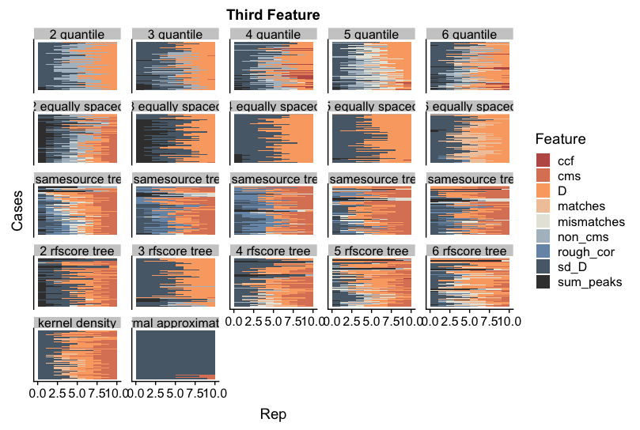

```{r setup, include = FALSE}
options(htmltools.dir.version = FALSE, eval = FALSE)

# Load libraries
library(gt)
library(randomForest)
library(tidyverse)
```

# Overview

.pull-left[
### The plan

1. Explanation of LIME 
2. Hamby bullet data
3. Applying LIME to the random forest
4. Issues and attempts at a solution
6. Conclusions and future work
]

.pull-right[
<br>
<br>

]

---

class: inverse, center, middle

# What is <span style="color:lime">LIME</span>?

---

# Motivation for LIME

<br>


### Black Box Prediction Models

- Offer great predictive ability 
- Loss of interpretability
- Difficult to assess trustworthiness

### Enter LIME...

- **L**ocal **I**nterpretable **M**odel-Agnostic **E**xplanations
- Developed by computer scientists ([Ribeiro, Singh, and Guestrin](https://arxiv.org/pdf/1602.04938.pdf))
- Designed to assess if a black box predictive model is trustworthy
- Produces "explanations" for individual predictions

---

# Meaning of LIME

.pull-left[
### <span style="color:lime">L</span>ocal

- Focuses on behavior of a complex model at a local level

### <span style="color:lime">I</span>nterpretable

- Produces easily interpretable "explanations"

### <span style="color:lime">M</span>odel-Agnostic

- Works with any predictive model

### <span style="color:lime">E</span>xplanations

- Provides insight into individual predictions
]

.pull-right[
<br>
<br>
.center[]
.center[<font size="4">Figure 3 in Ribeiro, Singh, and Guestrin (2016)</font>]
<br>
<br>
.center[]
.center[<font size="4">Figure 4 in Ribeiro, Singh, and Guestrin (2016)</font>]
]

---

# An Example <font size="3">(from Ribeiro, Singh, and Guestrin (2016))</font>

.pull-left[
### 1. Black Box Model 
- Model predicts whether a patient has the flu
- Apply the model to a new patient
- Predicts that the patient has the flu
- Can this prediction be trusted?
]

.pull-right[
### 2. LIME
- Apply LIME to *this* case
- LIME returns the most important variables in *this* prediction
- Colors indicate
    + <span style="color:green">green</span>: evidence supporting the flu
    + <span style="color:red">red</span>: evidence against the flu
- Can this prediction be trusted?
]

.center[]
.center[<font size="4">Figure 1 in Ribeiro, Singh, and Guestrin (2016)</font>]
 
---

# General LIME Procedure

**Start with**: (1) training data, (2) complex model, (3) one prediction from the testing data
1. Create perturbations from training data
2. Input each perturbation into complex model to get predictions
3. Compute similarity scores between test observation and each perturbation 
4. Perform feature selection to choose $k$ features
5. Fit a simple and interpretable model weighted by the similarity scores to the perturbations
  $$\mbox{Example: } \mbox{prediction} \sim \mbox{feature 2} + \mbox{feature 3} \ \ \ \mbox{(with features standardized)}$$
6. Interpret the simple model to "explain" the predictions

| | Feature 1 | <span style="color:blue">Feature 2</span> | <span style="color:blue">Feature 3</span> | Feature 4 | Similarity Score | <span style="color:blue">Prediction</span>|
| --: | :--: | :--: | :--: | :--: | :--: | :--: |
| test observation | 2 | 4 | 2 | 10 | exact | $\hat{y}_{\mbox{obs}}$ |
| perturbation 1 | 2 | 3 | 2 | 12 | very close | $\hat{y}_1$ |
| $\vdots$ | $\vdots$ | $\vdots$ | $\vdots$ | $\vdots$ | $\vdots$ | 
| perturbation 5000  | 10 | 0 | 13 | 22 | not close | $\hat{y}_{5000}$ |

---

# Using LIME

### Implementations of LIME

- Developers created a Python package called [lime](https://github.com/marcotcr/lime)
- Thomas Pedersen created an R package also called [lime](https://github.com/thomasp85/lime)


### Key Functions in the lime R package

```{r eval = FALSE}
#install.packages("lime")
library(lime)
?lime
?explain
```

---

class: inverse, center, middle

# Hamby Bullet Matching Data

---

# Hamby Bullet Study [<font size="3">James E. Hamby et. al. (2009)</font>](https://cdn2.hubspot.net/hub/71705/file-15668427-pdf/docs/aftespringvol41no2pages99-110.pdf)

- Sets of bullets from both “known” and “unknown” gun barrels were sent to firearm examiners around the world
- 240 total sets created
    - 10 barrels used to create a set
    - 35 bullets in a set 
        - 20 knowns (2 from the same barrel)
        - 15 unknowns (at least 1 and no more than 3 from each barrel)
- Examiners asked to use the known bullets to identify which barrels the unknown bullets were fired from

.center[]
.center[<font size="4">Results table from Hamby et. al. (2009)</font>]

---

# Automated Bullet Matching Algorithm

- CSAFE has access to some of the bullet sets
- [Hare, Hofmann, and Carriquiry ](https://projecteuclid.org/euclid.aoas/1514430288)(2017) develop an automated algorithm to determine whether two bullets are a match
- High definition scans of bullets used to obtain signatures associated with each land
- Developed variables that measure how similar two signatures are
- Fit a random forest model to predict whether two bullets were a match

.center[]
.center[<font size="4">Figure from Hare, Hofmann, and Carriquiry (2017)</font>]

---

# Training Data

#### Sets 173 and 252

```{r}
hamby173and252_train <- read.csv("./data/hamby173and252_train.csv") # first 5 rows
```

#### Variables Identifying the Bullets

```{r}
hamby173and252_train %>% select(1:8) %>% slice(1:5)
```

---

# Training Data

#### Signature Similarity Features

```{r}
hamby173and252_train %>% select(9:17) %>% slice(1:5) %>% round(2)
```

#### Response and RF Score

```{r}
hamby173and252_train %>% select(18:19) %>% slice(1:5)
```

---

# Random Forest Model

The random forest model fit to the training data in Hare, Hofmann, and Carriquiry can be found in the bulletxtrctr R package. It is called `rtrees`.

.pull-left[
```{r}
# Load the bulletxtrctr library
library(bulletxtrctr)
```
```{r}
# Importance values from 
# the random forest
rtrees$importance
```
]

.pull-right[
```{r}
# Number of trees
rtrees$ntree

# Number of variables randomly 
# sampled at each split
rtrees$mtry

# Confusion matrix
rtrees$confusion
```
]

---

# Testing Data

```{r}
hamby224_test <- read.csv("./data/hamby224_test.csv") # first 5 rows
glimpse(hamby224_test)
```

---

# Testing Data

#### Results from Applying `rtrees` to Hamby 224 (Sets 1 and 11)

<br>

```{r echo = FALSE}
data.frame(Truth = hamby224_test$samesource %>% na.omit(),
           RF_Prediction = as.logical(predict(rtrees, hamby224_test %>%
                                       select(ccf:sum_peaks) %>% 
                                       na.omit()))) %>%
  count(Truth, RF_Prediction) %>%
  rename(Count = n) %>%
  gt::gt()
```

<br>

- Want to determine the driving variables for individual predictions
- Especially helpful when the model is wrong
- Variable importance scores provide global interpretations
- We want local interpretations

---

class: inverse, center, middle

# Applying <span style="color:lime">LIME</span> to the Random Forest

---

# Step 0: Starting Objects

**Training Data**: `hamby173and252_train`

**Complex Model**: `rtrees`

**Case of Interest**: case 1 from `hamby224_test`

<br>

```{r echo = FALSE}
hamby224_test %>% filter(case == 1) %>% select(case:land2) %>% gt()
```

<br>

```{r echo = FALSE}
hamby224_test %>% filter(case == 1) %>% select(ccf:rfscore) %>% round(2) %>% gt()
```

---

# Step 1: Create Perturbations

#### Estimate the feature distributions

.pull-left[
- quantile bins (default with 4 bins)
- equally spaced bins
]
.pull-right[
- normal approximation 
- kernel density estimation
]
.center[
```{r echo = FALSE, fig.height = 4.5, fig.width = 9, warning = FALSE}
limeout <- lime::lime(x = hamby173and252_train %>% select(ccf:sum_peaks), model = rtrees)
ggplot(hamby173and252_train, aes(x = ccf)) + 
  geom_histogram(bins = 30) + 
  geom_vline(xintercept = limeout$bin_cuts$ccf[[1]], color = "green", size = 1) +
  geom_vline(xintercept = limeout$bin_cuts$ccf[[2]], color = "green", size = 1) +
  geom_vline(xintercept = limeout$bin_cuts$ccf[[3]], color = "green", size = 1) +
  geom_vline(xintercept = limeout$bin_cuts$ccf[[4]], color = "green", size = 1) +
  geom_vline(xintercept = limeout$bin_cuts$ccf[[5]], color = "green", size = 1) +
  geom_vline(xintercept = hamby224_test %>% 
               filter(case == 1) %>% 
               select(ccf) %>%
               pull(), color = "blue", size = 1) +
  labs(x = "CCF", y = "Frequency") +
  theme(text = element_text(size = 18))
```
]
.center[<font size="4">Histogram of CCF from training data with LIME quantile bins (blue line is ccf value of case 1)</font>]

---

# Step 1: Create Perturbations

#### Draw many samples from the estimated feature distributions

- If a binning estimation method is used, numeric features are converted to indicator variables.
    - 1 if in same bin as case 1
    - 0 o.w.

| | ccf same bin? | rough_cor same bin? | $\cdots$ | sum_peaks same bin?|
| --: | :--: | :--: | :--: | :--: | 
| case 1 | 1 | 1 | $\cdots$ | 1 |
| perturbation 1 | 0 | 1 | $\cdots$ | 1 |
| $\vdots$ | $\vdots$ | $\vdots$ | $\vdots$ | $\vdots$ |
| perturbation 5000  | 0 | 0 | $\cdots$ | 1|

- Otherwise, features are left as is.

---

# Step 2: Obtain Predictions

#### Use the complex model to obtain a prediction for each perturbation

- Use the `rtrees` model to do this

<br>

| | ccf same bin? | rough_cor same bin? | $\cdots$ | sum_peaks same bin?| prediction |
| --: | :--: | :--: | :--: | :--: | :--: |
| case 1 | 1 | 1 | $\cdots$ | 1 | not a match |
| perturbation 1 | 0 | 1 | $\cdots$ | 1 | match |
| $\vdots$ | $\vdots$ | $\vdots$ | $\vdots$ | $\vdots$ | $\vdots$ |
| perturbation 5000  | 0 | 0 | $\cdots$ | 1 | not a match |

---

# Step 3: Similarity Score 

#### Compute a similiarity score between the test observation and each perturbation.

- Default method in R package is Gower distance
    - between 0 and 1 
    - 0 indicates exactly the same
- Other distance metrics can be specified
    
| | ccf same bin? | rough_cor same bin? | $\cdots$ | sum_peaks same bin?| distance | prediction |
| --: | :--: | :--: | :--: | :--: | :--: |
| case 1 | 1 | 1 | $\cdots$ | 1 | 0 | not a match |
| perturbation 1 | 0 | 1 | $\cdots$ | 1 | 0.1 | match |
| $\vdots$ | $\vdots$ | $\vdots$ | $\vdots$ | $\vdots$ | $\vdots$ |
| perturbation 5000  | 0 | 0 | $\cdots$ | 1 | 0.8 | not a match |

---

# Step 4: Feature Selection

#### Perform feature selection to choose $k$ features.

- Can specify the number of features to select
    - We have been choosing 3 features
- Options in lime
     - auto: forward selection if $k\le6$, highest weight otherwise (default)
     - forward selection with ridge regression
     - highest weight with ridge regression
     - LASSO
     - tree models
- We have been using the default method

<br>

$$\hat{\mbox{rf score}}=\hat{\beta_0} + \hat{\beta_1} I[\mbox{ccf in same bin}] + \hat{\beta_2} I[\mbox{rough_cor in same bin}] +\cdots + \hat{\beta_9} I[\mbox{sum_peaks in same bin}]$$

---

# Step 5: Simple Model

#### Fit a linear regression (weighted by the similarity scores) to the perturbations with the 3 chosen features.

- Features are standardized
- Currently, lime uses ridge regression as the "simple" model
- If the response is categorical, the user can select how many categories they want to explain
    - We have only been explaining "TRUE"
- Example model: 

<br>

$$\hat{\mbox{rf score}}=\hat{\beta_0} + \hat{\beta_1} I[\mbox{ccf in same bin}] + \hat{\beta_2} I[\mbox{cms in same bin}] + \hat{\beta_3} I[\mbox{matches in same bin}]$$

---

# Step 6: Interpret 

#### Use the coefficients from the regression to "explain" the predictions.

- Since features are standardized, we can compare the coefficients
- Largest $\hat{\beta}_i$ is considered the most important

---

# R Code

## lime Function

The `lime` function estimates the feature distributions (first part of step 1).

```{r}
set.seed(20190229)
out_lime <- lime::lime(x = hamby173and252_train %>% select(ccf:sum_peaks), 
                      model = lime::as_classifier(rtrees))
out_lime$bin_cuts$ccf
out_lime$feature_distribution$ccf
```

---

# R Code

## explain Function

The `explain` function performs the rest of the steps.

```{r}
out_explain <- lime::explain(x = hamby224_test %>% filter(case == 1) %>%
                               select(ccf:sum_peaks),
                             explainer = out_lime,
                             labels = TRUE,
                             n_features = 3)
out_explain[,1:6]
out_explain[,7:10]
```

---

# R Code

## R Package Plot of Explanations 

The function `plot_features` let you visualize the explanations.

```{r fig.width = 10, fig.height = 5}
lime::plot_features(out_explain)
```

---

# Shiny App

<br>

.center[]

---
class: inverse, center, middle

# Issues with <span style="color:lime">LIME</span> and Attempts at a Solution

---

# Initial Concerns

We first applied lime using all default settings.
- Explanations did not make sense
- $R^2$ values were very low
- Predictions from the simple model were poor
    
.center[]
.center[<font size="4">Example where the random forest prediction is wrong. The explanations are from 4 quantile bins.</font>]

---

# More Issues

Then we tried more of the feature distribution estimation methods
- Explanations still not great
- $R^2$ values still very low
- Predictions from the simple model still poor
- Explanations dependent on the input

.center[]
.center[<font size="4">This is the same case with explanations from 3 equally spaced bins.</font>]

---

# New Binning Method

Next we created our own way to select bins using trees

```{r echo = FALSE, message = FALSE}
source("./code/helper_functions.R")
```

.pull-left[
```{r}
# Example using treebink
treebink(
  y = hamby173and252_train$samesource, 
  x = hamby173and252_train$ccf, 
  k = 5
)
```
]
.pull-right[
.center[]
]
---

# Comparing Methods

#### Feature distribution estimaton methods:

- 2 to 5 quantile bins
- 2 to 5 equally spaced bins
- 2 to 5 tree based bins with `samesoure` as the response
- 2 to 5 tree based bins with `rfscore` as the response
- normal approximation
- kernel density estimation

#### Comparison metrics:

- MSEs (rf prediction vs simple model predictions)
- $R^2$
- Consistency across number of bins
- Consistency across 10 reps

---

# Comparing MSEs

.center[]

---

# Comparing $R^2$ Values

.center[]

---

# Comparing Consistency Across Bins

.center[]

---

# Comparing Consistency Across Bins

.center[]

---

# Comparing Consistency Across Bins

.center[]

---

# Comparing Consistency Across Reps

.center[]

---

# Comparing Consistency Across Reps

.center[]

---

# Comparing Consistency Across Reps

.center[]

---

class: middle, center, inverse

# Conclusions and Future Work

---

# Conclusions

- Equally spaced bins are dependent on the number of bins
- Tree based bins usually have the lowest MSEs
- `rfscore` tree based bins usually have the highest $R^2$ for the binning options
- All options results in low $R^2$ values
    - We think that the linear regression is not similar enough to a random forest to produce good explanations
- Explanations are relatively consistent across reps for first and second features
- Non-binning methods produce very different results compared to the binning methods

---

# Future Work

- Apply LIME to a logistic regression model
    - We know how to interpret a logistic regression
    - Can compare to LIME explanations
- Run some sort of simulation to assess LIME explanations
- Adjust and compare weighting methods and the feature selection methods
- Allow the number of bins to vary across features
- Use a tree as the simple model
- Find other ways to interpret random forest models

---

# Image Credits

- slide 1: https://www.flickr.com/photos/lincolnian/300262799
- slide 2: https://ayoqq.org/explore/lime-drawing/
- slide 3: https://en.wikipedia.org/wiki/Black_box 
- slide 8: https://github.com/thomasp85/lime

