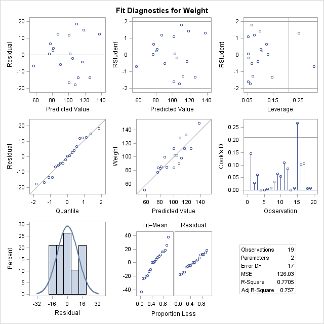
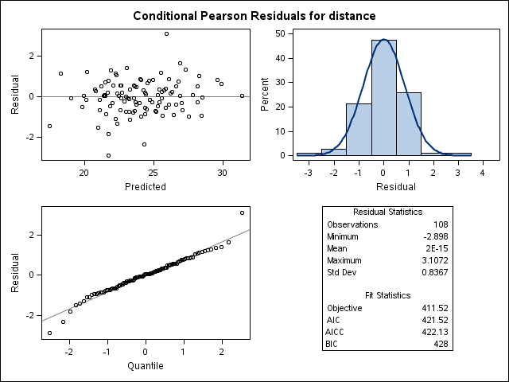
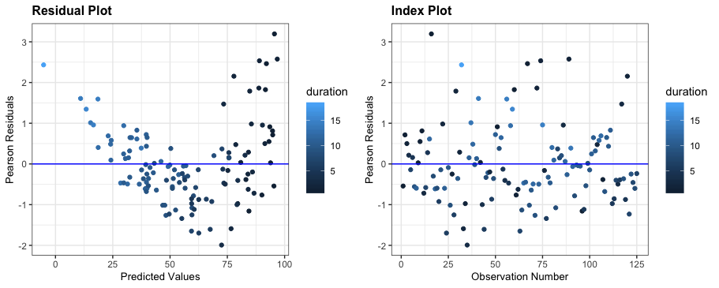

<style>

.remark-slide-content {
  background-color: #FFFFFF;
  border-top: 80px solid #404040;
  font-size: 24px;
  font-weight: 300;
  line-height: 1.5;
  padding: 1em 2em 1em 2em
}

.inverse {
  background-color: #404040;
  text-shadow: none;
}

.title-slide {
  background-color: #FFFFFF;
  border-top: 80px solid #FFFFFF;
}

.remark-slide-number {
  position: inherit;
}

.remark-slide-number .progress-bar-container {
  position: absolute;
  bottom: 0;
  height: 4px;
  display: block;
  left: 0;
  right: 0;
}

.remark-slide-number .progress-bar {
  height: 100%;
  background-color: #0D06C0;
}

</style>

```{r setup, include = FALSE}
options(htmltools.dir.version = FALSE)
knitr::opts_chunk$set(echo = TRUE,  
                      fig.align = 'center', 
                      message = FALSE, 
                      warning = FALSE)

# Load packages
library(ggplot2)
library(qqplotr)
library(ggResidpanel)
library(tidyverse)
library(widgetframe)
```

# Overview

1. Introduction: background and motivation

2. ggResidpanel Functionality

3. Current Development

4. Resources

<br> 

For following along...

```{r eval = FALSE}
# Installs package
install.packages("ggResidpanel")

# Loads package
library(ggResidpanel)
```

---

# Example Data: Trees

`trees` data available in base R

"This data set provides measurements of the diameter, height and volume of timber in 31 felled black cherry trees." - R documentation

```{r}
str(trees)
```

*Linear Model*

```{r}
# Example linear model
tree_model <- lm(Volume ~ Height + Girth, data = trees)
```

---

# Example Data: Penguins

`penguins` data available in ggResidpanel

Data from a study on how the heart rate of the emperor penguins relates to the depth and duration during a dive. Multiple observations taken from 9 penguins.

```{r}
str(ggResidpanel::penguins)
```

*Mixed effects model*

```{r}
penguin_model <- lme4::lmer(heartrate ~ depth + duration + (1|bird), 
                            data = penguins)
```

---

class: inverse, center, middle

# Introduction

---

# Example of Model Assumptions

### Linear Model

For $i=1,...,n$:

  $$y_i=\beta_0+\beta_1x_{1,i}+\cdots+\beta_px_{p,i}+\epsilon_i$$ 

where 

  $$\epsilon_i\overset{iid}{\sim}N(0,\sigma^2)$$

### Assumptions (in words)

- independence of residuals
- linearity
- constant variance of residuals
- normality of residuals

---

# Examples of Diagnostic Plots

.center[
```{r echo = FALSE, fig.width = 10, fig.height = 7}
set.seed(10)
ex <- data.frame(resid = rnorm(100, 0, 3),
                 pred = rnorm(100, 20, 4))
ggplot(ex, aes(x = pred, y = resid)) + 
  geom_point() + 
  geom_hline(yintercept = 0) + 
  labs(x = "Predicted Values", 
       y = "Residuals",
       title = "Residual Plot") + 
  theme_grey(base_size = 22)
```
]

---

# Examples of Diagnostic Plots

.center[
```{r echo = FALSE, fig.width = 7.5, fig.height = 7, warning = FALSE}
ggplot(ex, aes(sample = resid)) + 
  stat_qq_line() + 
  stat_qq_point() + 
  labs(x = "Theoretical Quantiles", 
       y = "Sample Quantiles",
       title = "Normal Quantile Plot") + 
  theme_grey(base_size = 22)
```
]

---

# What is ggResidpanel?

R package for the easy creation of panels of diagnostics plots using ggplot2 (joint work with Katie Rey)

```{r echo = TRUE, fig.width = 7, fig.height = 5, fig.align = 'center'}
resid_panel(tree_model)
```

---

# Motivation

- Katie Rey and I worked as stats consultants

- Encourage checking of model assumptions

- Annoyed by the base R plotting option

    `> plot(model)`  
    `Hit <Return> to see next plot:`  
    `Hit <Return> to see next plot:`  
    .  
    .  
    .
    
- Wanted to develop a tool for easy creation of residual plots using ggplot

---

# Other Tools: plot.lm

```{r fig.height = 6.5}
par(mfrow = c(2, 2)) # specifies the layout
plot(tree_model) # plots 'lm' default diagnostic plots
```

---

# Other Tools: plot.merMod

```{r fig.height = 6}
plot(penguin_model)
```

---

# Other Tools: ggfortify

```{r fig.height = 6}
library(ggfortify)
autoplot(tree_model)
```

---

# Other Tools: ggfortify

```{r error = TRUE}
autoplot(penguin_model)
```

---

# Other Tools: broom + ggplot2

```{r}
library(broom)

# extracts model info in a dataframe
tree_model_values <- augment(tree_model) 
head(tree_model_values)
```

---

# Other Tools: broom + ggplot2

```{r fig.height = 6}
ggplot(tree_model_values, aes(x = .fitted, y = .resid)) + 
  geom_point()
```

---

# Other Tools: SAS residual panels

### Residual Panels from SAS Procedures

 


---

# Goals for ggResidpanel

- simple creation of panels of diagnostic plots

- ggplot2 framework

- functionality for linear and mixed models

- more plot options and choice of plots

- additional features: 

    - interactive
    - comparison of models
    - more residual choices

---

class: inverse, center, middle

# ggResidpanel Functionality

---

# Functions Available

**Models of type**: “lm”, “glm”, “lme”, “lmer”, “glmer”, and “lmerTest”

- `resid_panel`: panel of diagnostic plots 
- `resid_interact`: interactive panel of diagnostic plots
- `resid_xpanel`: panel of diagnostic plots of the predictor variables
- `resid_compare`: panel of diagnostic plots from multiple models

**Any model type**

- `resid_auxpanel`: mimics (to a certain extent) `resid_panel` for any model type

---

# resid_panel

```{r fig.height = 6, fig.width = 8}
resid_panel(penguin_model)
```

---

# resid_panel: plot options

| Plot | Description |
| :--------- | :-------------------- |
| boxplot | boxplot of residuals |
| cookd | Cook's D values versus observation numbers | 
| hist | histogram of residuals |
| index | residuals versus observation numbers |
| ls | location scale plot of the residuals |
| qq | normal quantile plot of residuals |
| lev | standardized residuals versus leverage values |
| resid | residuals versus predicted values |
| yvp | observed response values versus predicted values | 

*Note: cookd, ls, lev only available for "lm" and "glm" models*

---

# resid_panel: plot options

**Additional Options**

- `bins` = number of bins for the histogram
- `qqbands` = include 95% confidence bands line on qq plot?
- `qqline` = include 1-1 line on qq plot?
- `smoother` = include a smoother on index, ls, lev, and resid plots?

---

# resid_panel: individual plot

```{r fig.height = 6, fig.width = 8}
resid_panel(penguin_model, plots = "yvp")
```

---

# resid_panel: vector of plots

```{r fig.width = 12, fig.height = 5}
resid_panel(penguin_model, plots = c("resid", "qq", "yvp"), nrow = 1)
```

---

# resid_panel: prespecified panels

```{r fig.height = 6, fig.width = 8}
resid_panel(penguin_model, plots = "SAS")
```

---

# resid_panel: prespecified panels

```{r fig.height = 6, fig.width = 8}
resid_panel(penguin_model, plots = "all")
```

---

# resid_panel: prespecified panels

```{r fig.height = 6, fig.width = 8}
resid_panel(tree_model, plots = "all", 
            smoother = TRUE, qqbands = TRUE)
```

---

# resid_panel: prespecified panels

```{r fig.height = 6, fig.width = 8}
resid_panel(tree_model, plots = "R", smoother = TRUE) # for lm and glm models only
```

---

# resid_panel: residual types

.pull-left[
**“lm” model:**

- pearson
- response*
- standardized

**“glm” model:**

- pearson
- deviance*
- response
- stand.deviance
- stand.pearson

]

.pull-right[
**“lmer”, “lmerTest”, and “lme” models:**

- pearson*
- response

**“glmer” model:**

- pearson
- deviance*
- response

*Note: plots of ls and lev only accept standardized residuals*
]

*** Denotes default residual type 

---

# resid_panel: residual types

```{r fig.height = 6, fig.width = 8}
resid_panel(tree_model, type = "standardized")
```

---

# resid_panel: residual types

```{r fig.height = 6, fig.width = 8}
resid_panel(penguin_model, type = "response")
```

---

# resid_panel: panel formatting

**Format Options**

- `axis.text.size` = adjust axis text size

- `title.text.size` = adjust title text size

- `nrow` = number of rows in the panel

- `scale` = adjusts the size of the graphics

- `theme` = “bw”, “classic”, and “grey” (or “gray”)

- `title.opt` = whether to include a title

---

# resid_panel: formatting options

.pull-left[
```{r}
formatted <- resid_panel(
  penguin_model,
  plots = c("yvp", "index"),
  axis.text.size = 24,
  title.text.size = 30,
  nrow = 2, 
  scale = 0.9,
  theme = "grey"
)
```
]

.pull-right[
```{r fig.height = 8}
formatted
```
]

---

# resid_interact

```{r eval = FALSE}
resid_interact(penguin_model)
```

```{r fig.align = 'center', echo = FALSE}
# Code for printing the plot
interact_default <- resid_interact(penguin_model)
frameWidget(interact_default, height = '105%')
```

---

# resid_interact: options

Same options as `resid_panel` <small> (except `qqbands` is not available) </small>

```{r eval = FALSE}
resid_interact(penguin_model, plots = c("resid", "yvp"), 
               theme = "classic", smoother = TRUE)
```

```{r echo = FALSE}
interact_format <- resid_interact(penguin_model, 
                                  plots = c("resid", "yvp"), 
                                  theme = "classic", 
                                  smoother = TRUE)
frameWidget(interact_format)
```

---

# resid_xpanel

```{r, fig.height = 6.5}
resid_xpanel(penguin_model)
```

---

# resid_xpanel: options

- `yvar`: "residual" (default) or "response"
- `smoother`: indicates whether to add a smoother or not
- `type`: residual types (same as `resid_panel`)
- format options: same as `resid_panel`

```{r fig.height = 4, fig.width = 12}
resid_xpanel(penguin_model, yvar = "response", 
             smoother = TRUE, nrow = 1)
```

---

# resid_compare

.pull-left[
```{r}
# Fit a new model to the 
# penguin data
penguin_model_log2 <- 
  lme4::lmer(
    log(heartrate) ~ 
      depth + 
      duration +
      I(duration^2) + 
      (1|bird), 
    data = penguins)

# Compare the residuals from 
# the two penguin models
compare_panel <- 
  resid_compare(
    list(penguin_model, 
         penguin_model_log2))
```
]

.pull-right[
```{r fig.height = 8}
compare_panel
```
]

---

# resid_compare: options

Same options as resid_panel <small> (expect no `nrow`) </small>

```{r fig.height = 5}
resid_compare(models = list(penguin_model, penguin_model_log2), 
              plots = c("resid", "yvp"), smoother = TRUE, 
              theme = "gray")
```

---

# resid_auxpanel

.pull-left[
```{r warning = FALSE}
# Fit a regression tree
penguin_tree <- rpart::rpart(
  heartrate ~ depth + duration, 
  data = penguins)

# Obtain the predicted values
tree_pred <- 
  predict(penguin_tree)

# Obtain the residuals
tree_resid <- 
  penguins$heartrate - 
  tree_pred

# Create default panel
tree_panel <- resid_auxpanel(
  residuals = tree_resid,
  predicted = tree_pred)
```
]

.pull-right[
```{r fig.height = 8}
tree_panel
```
]

---

# resid_auxpanel: options

Same as `resid_panel` (except for available plots)

**Plots Options**: boxplot, hist, index, qq, resid  
**Prespecified Panels**: all, default, SAS

```{r fig.height = 4, fig.width = 8.5}
resid_auxpanel(residuals = tree_resid, predicted = tree_pred,
               plots = c("resid", "index"), smoother = TRUE)
```

---

class: inverse, center, middle

# Current Development

---

# In progress...

- Additional residual types 
    - such as standardized residuals for mixed models  
    
- Interactions in resid_xpanel  

- Option to color by a variable

.center[ ]

---

class: inverse, center, middle

# Resources

---

# Helpful Links

- [Website](https://goodekat.github.io/ggResidpanel/)
- [Introduction Vignette](https://cran.r-project.org/web/packages/ggResidpanel/vignettes/introduction.html)
- [Tutorial and User Manual](https://goodekat.github.io/ggResidpanel-tutorial/tutorial.html)
- [GitHub Repository](https://github.com/goodekat/ggResidpanel)

.center[]
