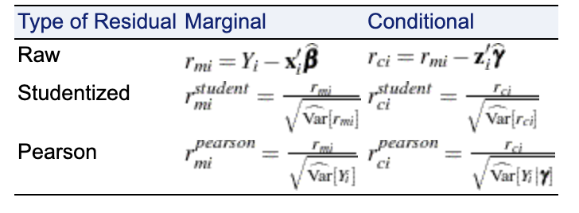
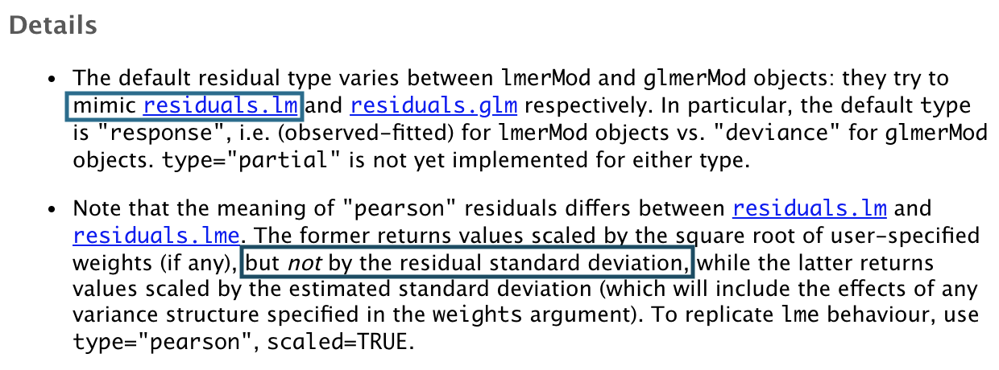

<style>
.remark-slide-number {
  position: inherit;
}

.remark-slide-number .progress-bar-container {
  position: absolute;
  bottom: 0;
  height: 4px;
  display: block;
  left: 0;
  right: 0;
}

.remark-slide-number .progress-bar {
  height: 100%;
  background-color: #EB811B;
}

.tiny { font-size: 40% }
.small { font-size: 75% }

</style>

```{r setup, include = FALSE}
knitr::opts_chunk$set(echo = FALSE)
```

```{r message = FALSE}
library(ggplot2)
library(tidyverse)
```

# Goals for this Talk

1. Motivate my interest in this topic

2. Provide an overview of residuals available for mixed models

3. Describe residual computations in R and SAS

4. Discussion questions

---

class: inverse, center, middle

# Motivation

<html>
  <div style='float:left'></div>
  <hr color='#009999' size=1px width=800px>
</html>

---

# Consulting

### Experiences

- Work with graduate students from many departments at Iowa State
- Frequently help with mixed models
- Clients often forget to check residual plots

### Produce Drop Study Example (based on a consulting project)

- 10 reps
- drop one head of lettuce and one apple per rep
- bacteria measured at 3 times points on each produce item (30 sec, 10 min, 1 hr)

```{r}
# Simulate drop study data
set.seed(20190619)
drop_study <- data.frame(produce = rep(c("apple", "lettuce"), each = 30),
                         time = factor(rep(rep(c("30 s", "10 m", "1 h"), each = 10), 2),
                                       levels = c("30 s", "10 m", "1 h")),
                         rep = factor(paste("Rep", rep(1:10, 6)), 
                                      levels = c("Rep 1", "Rep 2", "Rep 3", "Rep 4", 
                                                 "Rep 5", "Rep 6", "Rep 7", "Rep 8",
                                                 "Rep 9", "Rep 10")),
                         bacteria = c(exp(sort(rnorm(n = 10, mean = 3.70, sd = 1))),
                                      exp(sort(rnorm(n = 10, mean = 2.37, sd = 1.1))),
                                      exp(sort(rnorm(n = 10, mean = 2.34, sd = 1.2))),
                                      exp(sort(rnorm(n = 10, mean = 4.55, sd = 2))),
                                      exp(sort(rnorm(n = 10, mean = 3.29, sd = 2.1))),
                                      exp(sort(rnorm(n = 10, mean = 3.21, sd = 2.2)))))
```

```{r fig.align = "center", fig.width = 15, fig.height = 4}
drop_study %>%
  ggplot(aes(x = time, y = produce, fill = produce)) +
  geom_tile(color = "black") +
  facet_grid(. ~ rep) +
  theme_bw() +
  labs(x = "Time", y = "Produce") +
  theme(text = element_text(size = 22),
        axis.text.x = element_text(angle = 45, hjust = 1),
        legend.position = "none")
```

---

class: clear

### Model for Drop Study

<br>

| Terms |
| :---: | 
| Rep  |
| Produce |
| Produce * Rep (r.e.) |
| Time | 
| Time * Produce |
| Error |

<br>

```{r echo = TRUE}
# Fits the model in R
drop_model <- lme4::lmer(bacteria ~ rep + produce*time + (1|produce:rep), 
                         data = drop_study)
```

---

# ggResidpanel .tiny[developed with Katie Rey]

```{r message = FALSE, echo = TRUE, fig.align = "center", fig.height = 5.5, fig.width = 8}
# Loads the package
library(ggResidpanel)

# Creates the default of panel of residual plots
resid_panel(drop_model)
```

---

class: clear

```{r echo = TRUE, fig.align = "center", fig.height = 5.5, fig.width = 8}
# Refits the model with a log transformation of the reponse
drop_model_log <- lme4::lmer(log(bacteria) ~ rep + produce*time + (1|produce:rep), 
                         data = drop_study)

# Creates a panel to compare the models
resid_compare(models = list(drop_model, drop_model_log), 
              plots = c("resid", "qq"))
```

---

# My Questions

- What residual types are available for mixed models?

- How are the residuals types computed? 

- Which types are available in R and SAS?

- How to determine which residual type to use in practice?

---

class: inverse, center, middle

# Residual Types

<html>
  <div style='float:left'></div>
  <hr color='#009999' size=1px width=800px>
</html>

---

# Linear Mixed Model Review

Model formula:

$$\textbf{Y}=\textbf{X}\boldsymbol{\beta}+\textbf{Z}\boldsymbol{\gamma}+\boldsymbol{\epsilon}$$

<br>

Assumptions:

$$\begin{bmatrix} \boldsymbol{\gamma} \\ \textbf{e} \end{bmatrix}
  \sim N
    \begin{pmatrix}
      \begin{bmatrix} \textbf{0} \\ 
      \textbf{0} 
      \end{bmatrix},
      \begin{bmatrix} 
      \textbf{G} & \textbf{0} \\ 
      \textbf{0} & \textbf{R} 
      \end{bmatrix}
    \end{pmatrix}$$
    
<br>

Marginal and Conditional Distributions:

$$\textbf{Y} \sim N(\textbf{X}\boldsymbol{\beta}, \ \textbf{ZGZ}'+\textbf{R})$$
$$\textbf{Y}|\boldsymbol{\gamma} \sim N(\textbf{X}\boldsymbol{\beta}+\textbf{Z}\boldsymbol{\gamma}, \ \textbf{R})$$


---

# Raw Residuals

The raw residuals are computed as the observed response values minus the predicted response values. The marginal version does not account for the random effects while the conditional version does.

- **marginal** raw residuals
  $$r^m_i = Y_i-\textbf{x}'_i\widehat{\boldsymbol{\beta}}$$
  
- **conditional** raw residuals
  $$r^c_i = Y_i-\textbf{x}'_i\boldsymbol{\widehat{\beta}}-\textbf{z}'_i\widehat{\boldsymbol{\gamma}}$$

### Issues

- residuals may not be from populations with equal variances
- conditional residuals tend to be correlated
- conditional residuals are not well suited for detecting outliers

---

# Pearson Residuals

The Pearson residuals are computed as the raw residuals divided by the square root of the estimated variance of the response values.

- **marginal** Pearson residuals
  $$r^{m,Pearson}_{i} = \frac{r^m_i}{\sqrt{\widehat{Var}[Y_i]}}$$
  
- **conditional** Pearson residuals
  $$r^{c,Pearson}_{i} = \frac{r^c_i}{\sqrt{\widehat{Var}[Y_i|\boldsymbol{\gamma}]}}$$

### Issues

- still may not be from populations with equal variances
- only appropriate if the variability of $\hat{\boldsymbol{\beta}}$ can be ignored

---

# Standardized Residuals

The standardized residuals are computed as the raw residuals divided by the square root of the variance of the raw residuals.

- **marginal** studentized residuals
  $$r_i^{m,stand}=\frac{r_i^m}{\sqrt{Var[r_i^m]}}$$
  
- **conditional** studentized residuals
  $$r_i^{c,stand}=\frac{r_i^c}{\sqrt{Var[r_i^c]}}$$
  
### Reasons for Standardization

- to deal with residuals being from populations with different variances
- "to normalize the residuals into a signal-to-noise ratio" (Stroup, SAS for Mixed Models)


---

# Studentized Residuals

The studentized residuals are computed as the standardized residuals with the variances of the raw residuals replaced by the estimated variances.

- **marginal** studentized residuals
  $$r_i^{m,stud}=\frac{r_i^m}{\sqrt{\widehat{Var}[r_i^m]}}$$
  
- **conditional** studentized residuals
  $$r_i^{c,stud}=\frac{r_i^c}{\sqrt{\widehat{Var}[r_i^c]}}$$

### Reasons for Studentization

- same as with standardization

---

# Other Types

Other types exist:

- externally studentized
- error recovery residuals

---

class: inverse, center, middle

# Residuals in R and SAS

<html>
  <div style='float:left'></div>
  <hr color='#009999' size=1px width=800px>
</html>

---

# SAS

### [proc mixed residuals](https://support.sas.com/documentation/cdl/en/statug/63962/HTML/default/viewer.htm#statug_mixed_sect027.htm)

- offer the key six types discussed so far and "scaled" residuals

<br>

```{r fig.align = "center"}

```

---

# R

### lme4

- offers conditional "pearson" and "response" (raw)
- default is "response"
- see details from the `residuals.merMod` function below

<br> 

```{r fig.align = "center"}

```

---

class: clear

### `lme4` Pearson Residuals vs `ggResidpanel` Pearson Residuals

.pull-left[
```{r echo = TRUE}
plot(drop_model_log,
     form = resid(., type = "pearson") ~ 
       fitted(.),
     abline = 0)
```
]

.pull-right[
```{r echo = TRUE}
resid_panel(drop_model_log,
            plot = "resid", 
            type = "pearson",
            title.text.size = 24, axis.text.size = 16)
```
]

---

class: clear

### `lme4` Scaled Pearson Residuals vs `ggResidpanel` Pearson Residuals

.pull-left[
```{r echo = TRUE}
plot(drop_model_log,
     form = resid(., type = "pearson", 
                  scaled = TRUE) ~ 
       fitted(.), abline = 0)
```
]

.pull-right[
```{r echo = TRUE}
resid_panel(drop_model_log,
            plot = "resid", 
            type = "pearson", 
            title.text.size = 24, axis.text.size = 16)
```
]

---

class: clear

### `lme4` Pearson Residuals vs `ggResidpanel` Response Residuals

.pull-left[
```{r echo = TRUE}
plot(drop_model_log,
     form = resid(., type = "pearson") ~ 
       fitted(.),
     abline = 0)
```
]

.pull-right[
```{r echo = TRUE}
resid_panel(drop_model_log,
            plot = "resid", 
            type = "response",
            title.text.size = 24, axis.text.size = 16)
```
]

---

class: inverse, center, middle

# Discussion

<html>
  <div style='float:left'></div>
  <hr color='#009999' size=1px width=800px>
</html>

---

# Marginal versus Conditional Residuals?

- Residual plots will look different when conditioning on random effects
- Should you always look at both? 
- Is just looking at conditional fine? If so, why?


.pull-left[
```{r fig.align = "center", fig.width = 5, fig.height = 4}
redres::plot_redres(drop_model_log, type = "raw_mar") +
  theme(text = element_text(size = 18))
```
]

.pull-right[
```{r fig.align = "center", fig.width = 5, fig.height = 4}
redres::plot_redres(drop_model_log, type = "raw_cond") + 
  theme(text = element_text(size = 18))
```
]

---

# Residuals in Practice?

- Which residual types do you use in practice?
    - raw
    - Pearson
    - studentized
    - other
- What motivates you to use this type of residual? 
- What information do you want to gain from using a specific residual type?

