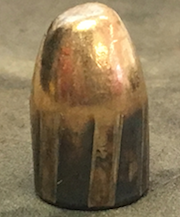
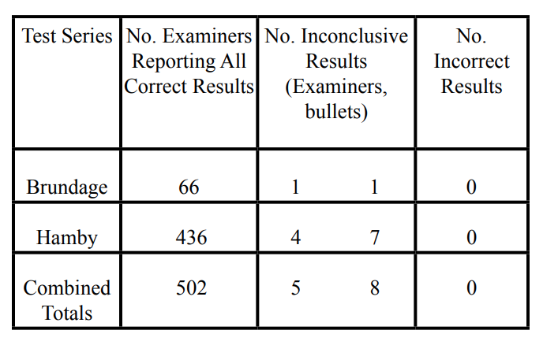
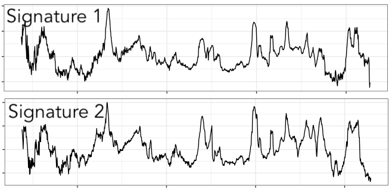
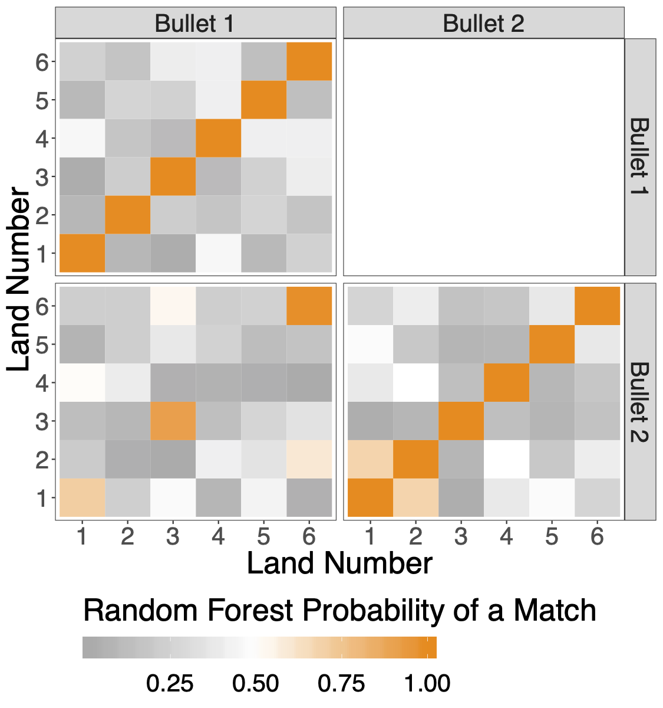
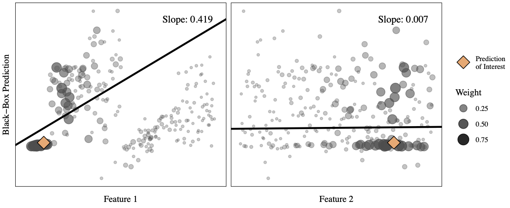
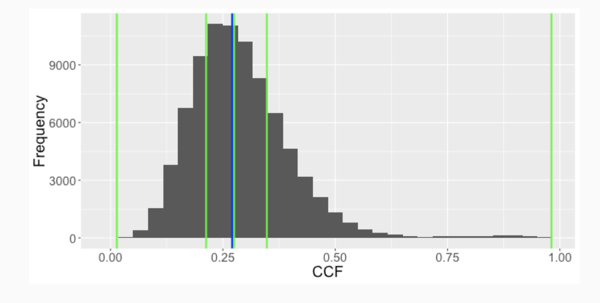
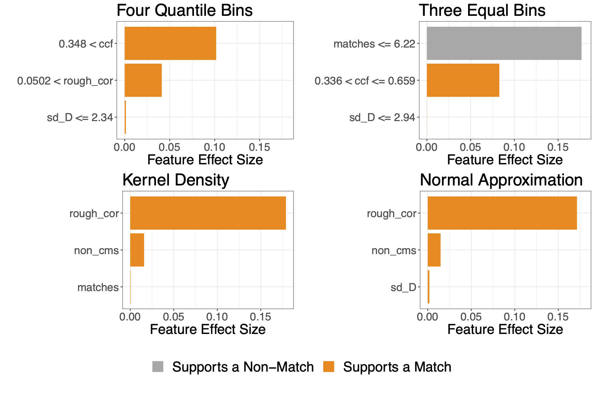
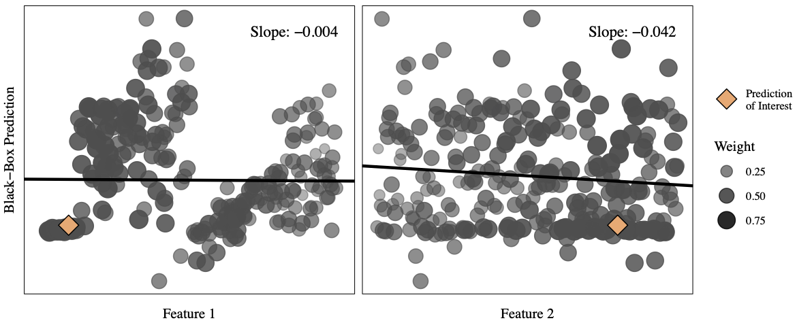
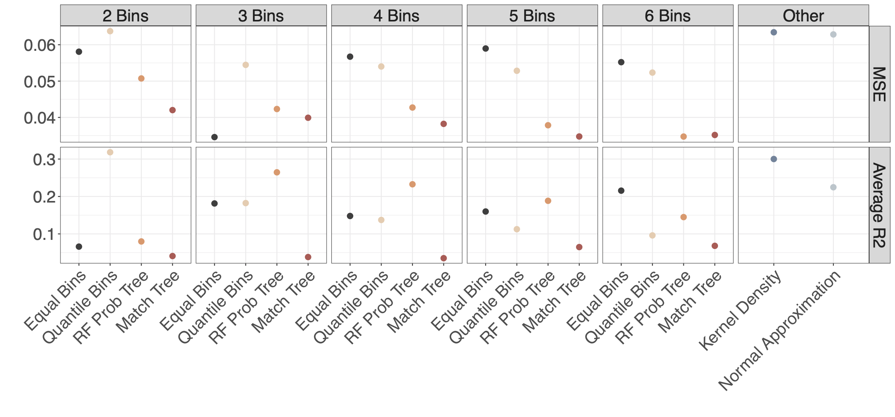
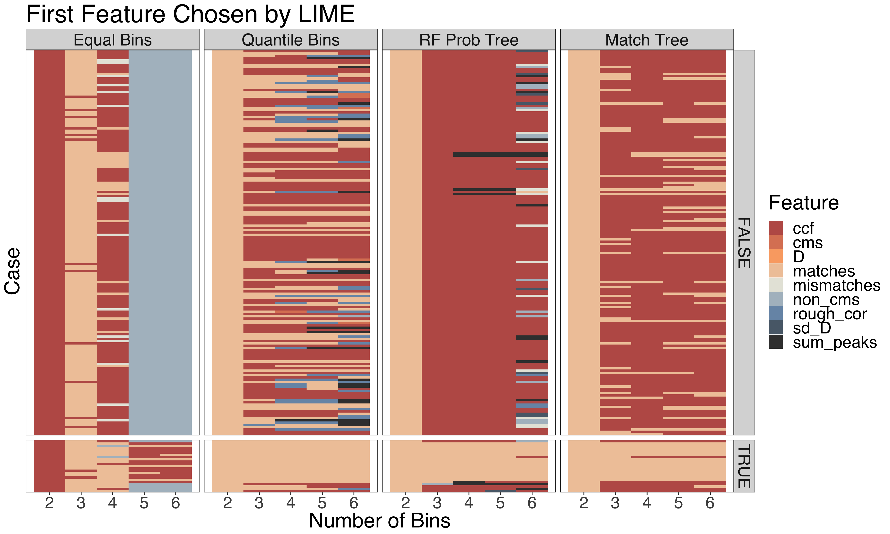

<style>
.remark-slide-content {
  background-color: #FFFFFF;
  border-top: 80px solid #404040;
  font-size: 24px;
  font-weight: 300;
  line-height: 1.5;
  padding: 1em 2em 1em 2em
}
.inverse {
  background-color: #404040;
  text-shadow: none;
}
.title-slide {
  background-color: #FFFFFF;
  border-top: 80px solid #FFFFFF;
}
.remark-slide-number {
  position: inherit;
}
.remark-slide-number .progress-bar-container {
  position: absolute;
  bottom: 0;
  height: 4px;
  display: block;
  left: 0;
  right: 0;
}
.remark-slide-number .progress-bar {
  height: 100%;
  background-color: #009999;
}
</style>

```{r setup, echo = FALSE, message = FALSE}
knitr::opts_chunk$set(echo = FALSE, message = FALSE)

# Load packages
library(bulletr)
library(dplyr)
library(ggplot2)

```

# Overview

<br> 

1. Motivational Dataset

2. LIME

3. Motivation for Assessing LIME

4. Diagnostic Plots

5. Discussion and Current Work

---

class: inverse, center, middle

# Motivational Dataset

---

# Bullet Matching

.center[ ]

---

# Hamby Bullet Study <font size="5"> Hamby et. al. (2009)</font>

- Bullets from “known” and “unknown” gun barrels
- Sent to firearm examiners around the world
- Examiners asked to use the known bullets to identify which barrels the unknown bullets were fired from

.center[]

---

# CSAFE and Hamby Bullets

- Center for Statistics and Applications in Forensic Evidence
- Has access to Hamby bullets
- Took high definition scans

<br>

.right[]

---

# Automated Bullet Matching Algorithm

- Hare, Hofmann, and Carriquiry (2017): 
  - Extracted signatures from scans
  - Developed variables that measure similarity between signatures
  - Fit a random forest to automate bullet matching
  - 100% bullet matching accuracy with test set in paper (0.0039 land to land error)
  
.center[]

---

# Model Explanations

Random forest model: 

- High accuracy - great!

- Interpretability - not so great

Importance of explanations:

- Understanding the model could help improve it

- Firearm examiners can assess model prediction

- Important to explain predictions to a jury

---

# Global Explanations

```{r fig.width = 12}
# Importance values from the random forest
data.frame(vi = as.vector(rtrees$importance), 
           v = rownames(rtrees$importance)) %>%
  arrange(vi) %>%
  mutate(order = factor(v, levels = v)) %>%
  ggplot(aes(x = order, y = vi)) + 
  geom_col() +
  coord_flip() + 
  theme_bw(base_size = 20) + 
  labs(y = "Variable Importance", x = "Variable")
```

---

# Local Explanations

- Feature importance may vary on a local level

- What if we are interested a particular prediction?

.center[]

---

class: inverse, center, middle

# <span style="color:lime">LIME</span>

---

# Enter LIME

- Model explainer developed by computer scientists Ribeiro, Singh, and Guestrin (2016)

- Designed to assess if a black box predictive model is trustworthy

- Produces "explanations" for individual predictions

- Meaning:
  - **L**ocal 
  - **I**nterpretable
  - **M**odel-Agnostic 
  - **E**xplanations

---

# LIME Concept

<br>
<br>

.center[]

---

# LIME Procedure

For **one** prediction of interest...

1. Data Simulation and Interpretable Transformation
  - Simulate data from the original data 
  - Apply a transformation that will allow for easily interpretable explanations
  
2. Fit an Interpretable Model:
  - Response = Black-box predictions from simulated data
  - Predictors = transformed simulated data
  - Weights = distances between simulated values and prediction of interest
  
3. Interpret the Explainer

---

# Interpretable Transformation

.center[]

---

# LIME Explanations

Bullet 1, land 2 to bullet 2, land 2

.center[]

---

class: inverse, center, middle

# Motivation for Assessing <span style="color:lime">LIME</span>

---

# Quality of Explanation

- LIME uses an interpretable model to mimic the complex model

- Quality of the explanation depends on the approximation

<br>
.center[]

---

# Input Options

- LIME has been implemented in Python and R

- Ridge regression used as the interpretable model

- Offer various implementation settings:

  - Simulation method
  - Feature selection method
  - Computation of the weights
  - etc.
  
- Provide a default method

- Otherwise, no advice on how to adjust settings

---

class: middle, center, inverse

# Diagnostic Plots

---

# Metric Comparison

.center[]

---

# Top Feature Selected Comparison

.center[]

---

class: middle, center, inverse

# Discussion and Current Work

---

- Visual diagnostics allow for the assessment of 
  - local explanation
  - accuracy of local approximation
  - consistency across implementation options
  
- Currently working on
  - creating a set of visuals to assessing each step in the LIME procedure
  - formalize the assumptions made by LIME
  - developing an R package for the creation of these plots
  