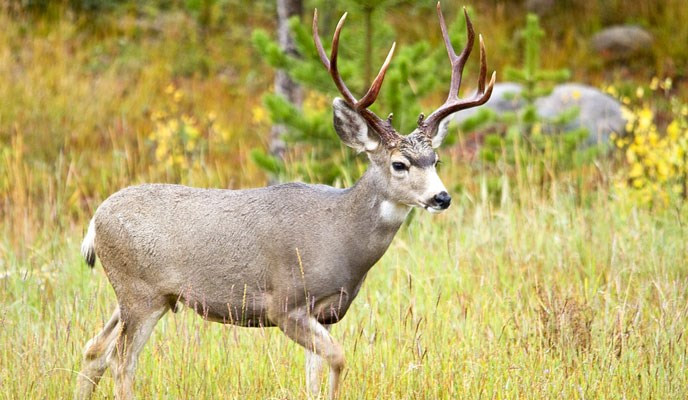

```{css, echo = FALSE}
.tiny{font-size: 30%}
.small{font-size: 50%}
.medium{font-size: 90%}
.content-box { 
  box-sizing: content-box;
  background-color: #e2e2f9;
  Total width: 160px + (2 * 20px) + (2 * 8px) = 216px
  Total height: 80px + (2 * 20px) + (2 * 8px) = 136px
  Content box width: 160px
  Content box height: 80px */
}
```

```{r setup, include = FALSE}
# R packages
library(knitr)
library(xaringanthemer)
options(htmltools.dir.version = FALSE)
# R markdown options
opts_chunk$set(
  dpi = 200,
  message = FALSE,
  fig.align = "center"
)
```

```{r xaringan-themer, include = FALSE, warning = FALSE}
style_mono_accent(
  base_color = "#1c5253",
  header_font_google = google_font("Josefin Sans"),
  text_font_google = google_font("Montserrat", "300", "300i"),
  code_font_google = google_font("Fira Mono"),
  text_slide_number_color = "black",
  header_h1_font_size = "2rem",
  header_h2_font_size = "1.75rem",
  header_h3_font_size = "1.25rem",
  colors = c(orange = "#ff8811"), 
  link_color = "#07A1D3", 
  code_highlight_color = "#B8F752"
)
```

## Background: AES stats consulting

- Offer help with data analyses for ISU researchers (includes graduate students, post docs, faculty, and staff)

- Consulting website: [https://www.stat.iastate.edu/statistical-consulting](https://www.stat.iastate.edu/statistical-consulting)

```{r echo = FALSE, out.width = "90%"}

```

---

# Slide structure

<br>

1. What is the delta method?  

2. Mathematical details  

3. Delta method in R by hand

4. Delta method in R via `msm`

5. A more complicated example

---

class: inverse, center, middle

# What is the delta method?

---

## Computing a confidence interval

Suppose you take measurements of the length of 30 frogs and want to compute:

- mean length

- standard deviation of lengths

- confidence interval for the mean

What do you need to compute a confidence interval for a mean?

<br>

```{r echo = FALSE, out.width = "45%"}

```

---

## Standard error

**Standard error**: estimate of variability associated with a statistic

**Example:**

Confidence interval for a sample mean:

<br>

$$\bar{y} \pm z \cdot \mbox{SE}\left[\bar{y}\right]$$

<br>

where $\bar{y}$ is the sample mean, $z$ is a normal quantile, and

<br>

$$\mbox{SE}\left[\bar{y}\right] = \mbox{sd}\left[\bar{y}\right] = \sqrt{Var\left[\bar{y}\right]} = \frac{s}{\sqrt{n}}$$

<br>

where $s$ is the sample standard deviation and $n$ is the sample size.

---

## Computing standard errors

Some standard errors are easy to derive/compute (like a sample mean)

<br>

$$
\begin{array}
\mbox{SE}\left[\bar{y}\right] & = & \sqrt{Var\left[\frac{1}{n} \sum_{i=1}^n y_i \right]} \\
& = & \sqrt{\left(\frac{1}{n}\right)^2\left(\sum_{i=1}^n Var\left[y_i\right]\right)}\\
& = & \sqrt{\frac{1}{n^2}\left(n Var\left[y_i \right]\right)}\\
& = & \sqrt{\frac{1}{n}Var\left[y_i\right]}\\
& = & \frac{\sqrt{Var\left[y_i\right]}}{\sqrt{n}}\\
& = & \frac{s}{\sqrt{n}}
\end{array}
$$

<br>

Others do not...

---

## Estimating tricky standard errors

When computing "tricky" standard errors, it may be helpful to use the...

> **Delta method**: approach to approximate standard errors of transformed parameters

If

- want a SE for a parameter estimate

- doesn't have a commonly used formula, is accessible via software, or derived easily

and

- parameter estimate is a function of other parameters with known SEs

- some other assumptions are met (to be discussed)

then

- **delta method** can be used to compute the standard error

---

## Mule deer example

Suppose you have data on mule deer survival and calculate several quantities:

**(1) Logistic regression equation in MARK for quarterly survival:**

$$\log\left(\frac{S}{1-S}\right)=\beta_0+\beta_1\cdot\mbox{age}+\beta_2\cdot \mbox{age}^2$$

where $S$ represents the quarterly survival for a given $\mbox{age}$

.pull-left[
**(2) Quarterly survival estimates for specific ages:**

$$S=\frac{\exp\left(\beta_0+\beta_1\cdot\mbox{age}+\beta_2\cdot\mbox{age}^2\right)}{1+\exp\left(\beta_0+\beta_1\cdot\mbox{age}+\beta_2\cdot\mbox{age}^2\right)}$$

<br>

**(3) Annual survival for a specific age:** 
  $$\ \ \ (S)^4$$
]

.pull-right[
<br>
```{r echo = FALSE, out.width = "90%"}

```
]

---

## Try it out

Suppose that you are interested in obtaining confidence intervals for the $\hat{\boldsymbol{\beta}}$'s, $\hat{S}$ and $\hat{(S)^4}$. Which would you need to use the delta method to derive?

<br>
<br>

- $\hat{\boldsymbol{\beta}}$'s

<br>

- $\hat{S}$

<br>

- $\hat{(S)^4}$

---

## Try it out: Solution

Suppose that you are interested in obtaining confidence intervals for the $\hat{\boldsymbol{\beta}}$'s, $\hat{S}$ and $\hat{(S)^4}$. Which would you need to use the delta method to derive?

<br>
<br>

- $\hat{\boldsymbol{\beta}}$'s - No

<br>

- $\hat{S}$ - Can get from MARK but is (probably) derived using the delta method

<br>

- $\hat{(S)^4}$ - Will need to derive the standard error using delta method

---

## Summary

<br>

- Standard errors estimate variability associated with a statistic

<br>

- Standard errors are often used to compute confidence intervals

<br>

- **Delta method can be used to approximate standard errors of transformed parameters that are not easy to compute**

---

class: inverse, center, middle

# Mathematical details

---

## Notation

| Value | Definition |
| :---: | :--------: |
| $$\boldsymbol{\theta}=(\theta_1,...,\theta_p)$$ | parameter vector of length $p$ |
| $$\hat{\boldsymbol{\theta}}$$ | sequence of estimators of $\boldsymbol{\theta}$ |
| $$g(\boldsymbol{\theta})$$ | function of $\boldsymbol{\theta}$ |
| $$g\left(\hat{\boldsymbol{\theta}}\right)$$ | estimate of $g(\boldsymbol{\theta})$ |
| $\textbf{d}$ | vector of partial derivatives of length $p$ with a $j$th element of $$\frac{\partial g(\boldsymbol{\theta})}{\partial \theta_j}$$ |

---

## Try it out

Want to compute standard error for $S^4$ where 

$$S=\frac{\exp\left(\beta_0+\beta_1\cdot\mbox{age}+\beta_2\cdot\mbox{age}^2\right)}{1+\exp\left(\beta_0+\beta_1\cdot\mbox{age}+\beta_2\cdot\mbox{age}^2\right)}$$

What is the notation in this context?

- $\boldsymbol{\theta}=(\theta_1,...,\theta_p)$

- $\hat{\boldsymbol{\theta}}_n$

- $g(\boldsymbol{\theta})$

- $g\left(\hat{\boldsymbol{\theta}}\right)$

- $\textbf{d}$

---

## Try it out: Solution

Want to compute standard error for $S^4$ where 

$$S=\frac{\exp\left(\beta_0+\beta_1\cdot\mbox{age}+\beta_2\cdot\mbox{age}^2\right)}{1+\exp\left(\beta_0+\beta_1\cdot\mbox{age}+\beta_2\cdot\mbox{age}^2\right)}$$

What is the notation in this context?

- $\boldsymbol{\theta}=(\theta_1,...,\theta_p)=\boldsymbol{\beta}=\left(\beta_0, \beta_1, \beta_2\right)$

- $\hat{\boldsymbol{\theta}}_n=\hat{\boldsymbol{\beta}}_n=\left(\hat{\beta}_0, \hat{\beta}_1, \hat{\beta}_2\right)$

- $g(\boldsymbol{\theta})=S^4=g\left(\boldsymbol{\beta}\right) =\left(\frac{\exp\left(\beta_0+\beta_1\cdot\mbox{age}+\beta_2\cdot\mbox{age}^2\right)}{1+\exp\left(\beta_0+\beta_1\cdot\mbox{age}+\beta_2\cdot\mbox{age}^2\right)}\right)^4$

- $g\left(\hat{\boldsymbol{\theta}}\right)=\hat{S^4} = g\left(\hat{\boldsymbol{\beta}}_n\right)=\left(\frac{\exp\left(\hat{\beta}_0+\hat{\beta}_1\cdot\mbox{age}+\hat{\beta}_2\cdot\mbox{age}^2\right)}{1+\exp\left(\hat{\beta}_0+\hat{\beta}_1\cdot\mbox{age}+\hat{\beta}_2\cdot\mbox{age}^2\right)}\right)^4$

- $\textbf{d}=\left(\frac{\partial g(\boldsymbol{\beta})}{\partial \beta_0}, \frac{\partial g(\boldsymbol{\beta})}{\partial \beta_1}, \frac{\partial g(\boldsymbol{\beta})}{\partial \beta_2}\right)$ $\left( \right.$estimate partial derivatives in practice using $\left.\hat{\boldsymbol{\beta}}\right)$

---

## The Delta Method

**Situation/conditions**

- $\boldsymbol{\theta}$ has mean $\boldsymbol{\theta}$ and variance covariance matrix $Cov\left(\hat{\boldsymbol{\theta}}\right)$
- $g\left(\boldsymbol{\theta}\right)$ is a function of parameters $\boldsymbol{\theta}$ and is real-valued and continuously differentiable in a neighborhood of $\boldsymbol{\theta}$
- $\hat{\boldsymbol{\theta}}$ are asymptotically normal estimators of $\boldsymbol{\theta}$

**Results**

- $g\left(\hat{\boldsymbol{\theta}}\right)$ follows a normal distribution:


$$g\left(\hat{\boldsymbol{\theta}}\right) \sim N\left(g(\boldsymbol{\theta}), \ \textbf{d}Cov\left(\hat{\boldsymbol{\theta}}\right)\textbf{d}'\right)$$


.content-box[
- Standard error of $g\left(\hat{\boldsymbol{\theta}}\right)$ can be computed as
$$SE\left(g\left(\hat{\boldsymbol{\theta}}\right)\right)=\sqrt{Cov\left(g\left(\hat{\boldsymbol{\theta}}\right)\right)}=\sqrt{\textbf{d}Cov\left(\hat{\boldsymbol{\theta}}\right)\textbf{d}'}.$$ <small> (Note that $Cov\left(\hat{\boldsymbol{\theta}}\right)$ is estimated by the negative inverse Hessian matrix) </small>
]

---

## Computing mule deer standard error

Now, how to compute the standard error for $\hat{S^4}$?

<br>

$$SE\left(\hat{S^4}\right)=SE\left(g\left(\hat{\boldsymbol{\beta}}\right)\right)=\sqrt{\textbf{d}Cov\left(\hat{\boldsymbol{\beta}}\right)\textbf{d}'}$$ 

<br>

Would need to:

- Derive partial derivatives in $\textbf{d}$ (see next slide)

- Compute partial derivatives using estimated parameters from the logistic regression model

- Extract variance-covariance matrix from logistic regression for $Cov\left(\hat{\boldsymbol{\beta}}\right)$

- Use formula above to put it all together  for computing $SE\left(g\left(\hat{\boldsymbol{\beta}}\right)\right)$

---

**Mule deer derivatives**

The partial derivatives of $g\left(\boldsymbol{\beta}\right)$ in terms of $\beta_0, \beta_1$, and $\beta_2$ (note that the partial derivatives are functions of age):

<small>
$$\begin{array}{ccl}
\textbf{d}' & = & \left[\begin{array}{ccc} \frac{\partial}{\partial\beta_0} \left(S^4\right) & \frac{\partial}{\partial\beta_1} \left(S^4\right) & \frac{\partial}{\partial\beta_2} \left(S^4\right) \end{array}\right]'\\
& = & \left[\begin{array}{l} \frac{\partial}{\partial \beta_0} \left(\frac{\exp\left(\beta_0+
\beta_1\cdot\mbox{age}+\beta_2\cdot\mbox{age}^2\right)}{1+\exp\left(\beta_0+
\beta_1\cdot\mbox{age}+\beta_2\cdot\mbox{age}^2\right)}\right)^4 \\ \frac{\partial}{\partial \beta_1} \left(\frac{\exp\left(\beta_0+
\beta_1\cdot\mbox{age}+\beta_2\cdot\mbox{age}^2\right)}{1+\exp\left(\beta_0+
\beta_1\cdot\mbox{age}+\beta_2\cdot\mbox{age}^2\right)}\right)^4 \\ 
\frac{\partial}{\partial \beta_2} \left(\frac{\exp\left(\beta_0+
\beta_1\cdot\mbox{age}+\beta_2\cdot\mbox{age}^2\right)}{1+\exp\left(\beta_0+
\beta_1\cdot\mbox{age}+\beta_2\cdot\mbox{age}^2\right)}\right)^4 \end{array} \right]\\
& = & \left[\begin{array}{l}
4\left(\frac{\exp\left(\beta_0+\beta_1\cdot\mbox{age}+\beta_2\cdot\mbox{age}^2\right)}{1+\exp\left(\beta_0+\beta_1\cdot\mbox{age}+\beta_2\cdot\mbox{age}^2\right)}\right)^4\left(1-\frac{\exp\left(\beta_0+\beta_1\cdot\mbox{age}+\beta_2\cdot\mbox{age}^2\right)}{1+\exp\left(\beta_0+\beta_1\cdot\mbox{age}+\beta_2\cdot\mbox{age}^2\right)}\right)\\
4\left(\frac{\exp\left(\beta_0+\beta_1\cdot\mbox{age}+\beta_2\cdot\mbox{age}^2
\right)}{1+\exp\left(\beta_0+\beta_1\cdot\mbox{age}+\beta_2\cdot\mbox{age}^2\right)}
\right)^4\left(1-\frac{\exp\left(\beta_0+\beta_1\cdot\mbox{age}+\beta_2\cdot\mbox{age}^2\right)}{1+\exp\left(\beta_0+\beta_1\cdot\mbox{age}+\beta_2\cdot\mbox{age}^2\right)}\right)(\mbox{age})\\
4\left(\frac{\exp\left(\beta_0+\beta_1\cdot\mbox{age}+\beta_2\cdot\mbox{age}^2\right)}{1+\exp\left(\beta_0+\beta_1\cdot\mbox{age}+\beta_2\cdot\mbox{age}^2\right)}\right)^4\left(1-\frac{\exp\left(\beta_0+\beta_1\cdot\mbox{age}+\beta_2\cdot\mbox{age}^2\right)}{1+\exp\left(\beta_0+\beta_1\cdot\mbox{age}+\beta_2\cdot\mbox{age}^2\right)}\right)(\mbox{age}^2)
\end{array}\right]\\
& = & \left[\begin{array}{l} 4S^4(1-S) \\ 4S^4(1-S)(\mbox{age}) \\ 4S^4(1-S)(\mbox{age})^2 \end{array}\right]
\end{array}.$$
</small>

---

## Summary

- For parameters $\hat{\boldsymbol{\theta}}$ with a known variance covariance matrix $Cov\left(\hat{\boldsymbol{\theta}}\right)$:

  - Can use the delta method to obtain a standard error for a transformation of the parameters: $g\left(\hat{\boldsymbol{\theta}}\right)$ 
  
- Delta method standard error formula:

$$SE\left(g\left(\hat{\boldsymbol{\theta}}\right)\right)=\sqrt{\textbf{d}Cov\left(\hat{\boldsymbol{\theta}}\right)\textbf{d}'}$$

- Involves computing partial derivatives

---

class: inverse, center, middle

# Delta method in R by hand

---

## Mule deer example in R

**MARK model results**

```{r}
# R packages
library(dplyr); library(readr)
```

```{r}
# Load data frame of quarterly survival, quarterly survival, 
# standard error of quarterly survival, and annual survival 
# computed based on the logistic regression model fit in MARK
survival_data <- read_csv("data/deer_model_results.csv")
# Print the head of the data
head(survival_data)
```

---

## Mule deer logisitc regression estimates

**Model coefficients**

```{r}
# Load logistic regression coefficient estimates
deer_betas <- read_csv("data/deer_betas.csv", col_names = FALSE) %>% 
  as.matrix()
deer_betas
```

**Variance-covariance matrix**

```{r}
# Load estimated variance covariance matrix of the logistic regression coefficients
deer_vcov <- read_csv("data/deer_vcov.csv", col_names = FALSE) %>% 
  as.matrix()
deer_vcov
```

---

## Hand written R function 

`compute_annual_se`: Function for computing annual survival standard error via the delta method

Inputs:  

- `age`: age at which to compute annual survival estimate and standard error
- `betas`: estimated logistic regression coefficients (vector of length 3)
- `vcov`: estimated variance covariance matrix of logistic regression coefficients (3x3 matrix)

Output: data frame with the variables of...

- `age`: age specified for computations
- `annual_survival`: estimated annual survival for specified `age`
- `se`: standard error for annual survival (estimated using delta method)
- `lower`: lower bound of 95% confidence interval for annual survival
- `upper`: upper bound of 95% confidence interval for annual survival

---

.tiny[
```{r}
# Function for computing annual survival standard error
compute_annual_se <- function(age, betas, vcov){
  
  # Separate the betas
  b0 <- betas[1]; b1 <- betas[2]; b2 <- betas[3]
  
  # Compute logit of quarterly survival for given age
  logit_s <- b0 + (b1 * age) + (b2 * (age^2))
  
  # Compute quarterly and annual survival
  s <- exp(logit_s) / (1 + exp(logit_s))
  annual <- s^4
  
  # Create empty 1x3 matrix to store the elements of d
  d <- matrix(NA, nrow = 1, ncol = 3)
  
  # Compute elements of d (partial derivatives of g(beta))
  d[1] <- 4 * (s^4) * (1 - s)
  d[2] <- 4 * age * (s^4) * (1 - s)
  d[3] <- 4 * (age^2) * (s^4) * (1 - s)
  
  # Compute standard error of annual survival (using delta method)
  se <- sqrt(d %*% vcov %*% t(d)) #<<
  
  # Compute lower and upper bounds of 95% CI for annual survival
  lower <- annual - (1.96 * se); upper <- annual + (1.96 * se) #<<
  
  # Return age, annual survival estimate, standard error, 95% CI
  return(data.frame(age, annual_survival = annual, se, lower, upper))
}
```
]

---

## Applying the function to one age

```{r fig.showtext = TRUE}
# Apply compute_annual_se when age is 1
age1_se <-
  compute_annual_se(
    age = survival_data$age[1],
    betas = deer_betas,
    vcov = deer_vcov
  )
```

```{r}
# Print the results
age1_se
```

---

## Applying the function to multiple ages

```{r}
# Apply compute_annual_se to all of the ages in survival data
# using map_df from purrr to apply .f to all elements of .x
survival_data_annual <- 
  purrr::map_df(
    .x = survival_data$age, 
    .f = compute_annual_se, #<<
    betas = deer_betas,
    vcov = deer_vcov
  )
```

```{r}
# Print part of the results
head(survival_data_annual)
```

---

## Annual surival by age with confidence intervals

```{r fig.width = 8, fig.height = 4, out.width = "75%"}
# Plot the estimated annual survival and confidence intervals
library(ggplot2)
ggplot(survival_data_annual, aes(x = age, y = annual_survival)) +
  geom_line() +
  geom_line(aes(x = age, y = lower), linetype = "dashed", color = "blue") +
  geom_line(aes(x = age, y = upper), linetype = "dashed", color = "blue") +
  scale_x_continuous(breaks = seq(1, 11, 1)) +
  labs(x = "Age", y = "Annual Surivial") +
  theme_xaringan()
```

---

## Summary

- Could write a function to compute a delta method standard error in R by hand

- Can use the functions from `purrr` to apply a function easily to multiple inputs 

---

class: inverse, center, middle

# Delta method in R via msm

---

## msm R package

**Package overview**

- **M**ulti-**S**tate **M**arkov models

- From the online [documentation](https://cran.r-project.org/web/packages/msm/index.html):

> R package for continuous-time multi-state modeling of panel data
- From the [vignette](https://cran.r-project.org/web/packages/msm/vignettes/msm-manual.pdf):

> The multi-state Markov model is a useful way of describing a process in which an individual moves through a series of states in continuous time. The msm package for R allows a general multi-state model to be fitted to longitudinal data.
.content-box[
- Provides an easier way to apply the delta method:

  - Includes a `deltamethod` function
  
  - Prevents the computation of partial derivatives (Yay! `r emo::ji("smile")`)
]

---

## `deltamethod` function from `msm`

Inputs:

- `g` = a formula representing the function: $g(\cdot)$ 
  
> The variables must be labeled `x1`, `x2`,...   
>
> For example, if 
> $$g(\hat{\boldsymbol{\beta}})=\frac{1}{\hat{\beta}_0+\hat{\beta}_1}$$
>
> then type function as: `g = ~ 1 / (x1 + x2)`
- `mean	` = vector of estimated parameters: $\hat{\boldsymbol{\theta}}$

- `cov` = estimated variance-covariance matrix: $Cov\left(\hat{\boldsymbol{\theta}}\right)$

- `ses`: 
  - If TRUE, returns the standard errors of $g(\cdot)$ (default). 
  - If FALSE, returns the variance-covariance matrix of $g(\cdot)$.

---

## Example 1

.pull-left[
Simple linear regression:

$$\hat{y}=\hat{\beta}_0+\hat{\beta}_1x_1$$
]

.pull-right[
Compute standard error for 

$$\frac{1}{\hat{\beta}_0+\hat{\beta}_1}$$
]

```{r}
# Simple linear regression
set.seed(1000)
x1 <- 1:100; y <- rnorm(100, 4*x1, 5)
m1 <- lm(y ~ x1)
# Extract the model coefficients and variance-covariance matrix
bhat1 <- coef(m1)
vc1 <- vcov(m1)
# Estimate of (1 / (b0hat + b1hat))
1 / (bhat1[[1]] + bhat1[[2]])
# Approximate standard error
msm::deltamethod(g = ~ 1 / (x1 + x2), mean = bhat1, cov = vc1)                     
```

---

## Example 2

.pull-left[
Simple linear regression:

$$\hat{y}=\hat{\beta}_0+\hat{\beta}_1x_1+\hat{\beta}_2x_2$$
]

.pull-right[
Compute standard error for 

$$\frac{1}{\hat{\beta}_0+\hat{\beta}_1}$$
]

```{r}
# Simple linear regression
set.seed(1000)
x1 <- 1:100; x2 <- runif(100); y <- rnorm(100, 4*x1, 5)
m2 <- lm(y ~ x1 + x2)
# Extract the model coefficients and variance-covariance matrix
bhat2 <- coef(m2)[1:2]
vc2 <- vcov(m2)[1:2,1:2]
# Estimate of (1 / (b0hat + b1hat))
1 / (bhat2[[1]] + bhat2[[2]])
# Approximate standard error
msm::deltamethod(g = ~ 1 / (x1 + x2), mean = bhat2, cov = vc2)
```

---

## Try it out

For the mule deer example, compute the standard error for $\hat{S^4}$ when $\mbox{age}=1$.

$$\hat{S^4}=\left(\frac{\exp\left(\hat{\beta}_0+\hat{\beta}_1\cdot\mbox{age}+\hat{\beta}_2\cdot\mbox{age}^2\right)}{1+\exp\left(\hat{\beta}_0+\hat{\beta}_1\cdot\mbox{age}+\hat{\beta}_2\cdot\mbox{age}^2\right)}\right)^4$$

<br>
<br>
<br>
<br>
<br>
<br>
<br>
<br>
<br>
<br>
<br>

Bonus: How to compute the standard error for $\hat{S^4}$ for an arbitrary age?

---

## Try it out: Solution

For the mule deer example, compute the standard error for $\hat{S^4}$ when $\mbox{age}=1$.

$$\hat{S^4}=\left(\frac{\exp\left(\hat{\beta}_0+\hat{\beta}_1\cdot\mbox{age}+\hat{\beta}_2\cdot\mbox{age}^2\right)}{1+\exp\left(\hat{\beta}_0+\hat{\beta}_1\cdot\mbox{age}+\hat{\beta}_2\cdot\mbox{age}^2\right)}\right)^4$$

```{r}
# Create the form of the formula to put in the deltamethod function
formula = "~ ((exp(x1 + x2 + x3)) / (1 + exp(x1 + x2 + x3)))^4"
# Apply the deltamethod function
se = msm::deltamethod(
  as.formula(formula),
  mean = deer_betas, 
  cov = deer_vcov
)
se
```

Bonus: How to compute the standard error for $\hat{S^4}$ for an arbitrary age in R?

> See next slide
---

## Arbitrary age

Function for applying the msm function deltamethod to a specified age:

```{r}
apply_msm_deltamethod <- function(age, betas, vcov){
  # Create the form of the formula to put in the deltamethod function
  formula <- 
    sprintf("~ (exp(x1 + (x2 * %f) + (x3 * %f)) /
            (1 + exp(x1 + (x2 * %f) + (x3 * %f))))^4", 
            age, age^2, age, age^2)
  # Apply the deltamethod function
  se = msm::deltamethod(as.formula(formula), mean = betas, cov = vcov)
  # Return the se in a dataframe
  return(data.frame(age, se))
}
```

```{r}
apply_msm_deltamethod(1, deer_betas, deer_vcov)
```

---

## Multiple ages

We could also use `map_df` to apply the function to multiple ages

```{r}
purrr::map_df(
  .x = 1:11, 
  .f = apply_msm_deltamethod, 
  betas = deer_betas, 
  vcov = deer_vcov
)
```

---

## Summary

- `deltamethod` function in `msm` R package allows application of delta method without computing derivatives

- Need to input a formula that uses `x1`, `x2`,... for the parameters $\hat{\boldsymbol{\theta}}$

- Only extract the parameter estimates and corresponding variance-covariance matrix cells needed to compute the transformed parameter

<br>
<br>

**Additional resources**

- A good reference on the delta method that also describes how to apply the delta method in R can be found on the [IDRE website](https://stats.idre.ucla.edu/r/faq/how-can-i-estimate-the-standard-error-of-transformed-regression-parameters-in-r-using-the-delta-method/).

- Another delta method function ([`delta.method`](https://www.rdocumentation.org/packages/alr3/versions/1.1.12/topics/delta.method#:~:text=estimated%20regression%20coefficients-,delta.,known%20or%20estimated%20covariance%20matrix)) from the [alr3](https://www.rdocumentation.org/packages/alr3/versions/1.1.12) R package

---

class: inverse, center, middle

# A more complicated example

---

## Canadian goose data

.pull-left[
- Canada goose banding and recovery data using Burnham joint live-dead mark recapture models in RMark

- Burnham model uses Seber parameterization 
  - $S$ = survival
  - $F$ = fidelity
  - $r$ = dead recovery rate
  - $p$ = live recapture rate
]

.pull-right[
```{r echo = FALSE, out.width = "100%"}
include_graphics("figures/geese.jpeg") 
```
]
 
- Interested in point estimate and 95% confidence intervals for Brownie parameterization of dead recovery rate $f$: 
  $$f=r(1-S)$$
  
- Not a way to change parameterization in RMark for Burnham models or a previously derived estimator for SE of $f$

- Let's use the delta method!

---

## More details on the data

**Three predictor variables:**

- Age (3 levels):  
  - Juvenile: 0 yrs old, binned as (0, 0.5]
  - Sub adult: 1 or 2 yrs old, binned as (0.5, 2.5]
  - Adult: 3 yrs or older, binned as (2.5, 23]
  
- Site (2 levels): 
  - Rural
  - Urban 

- Time (21 levels): 
  - Year as a factor from 1999-2019

---

## More details on the Rmark models

**Mark recapture models: **

  - $S$, $F$, $r$, and $p$ are all modeled using logistic regressions with formulas including age x site x time
  
  - For example: 

$$\log\left(\frac{r}{1-r}\right) \sim \mbox{age} \times \mbox{site} \times \mbox{time}$$
$$\log\left(\frac{S}{1-S}\right) \sim \mbox{age} \times \mbox{site} \times \mbox{time}$$

- Have beta estimates and the variance-covariance matrix for $r$ and $S$ 

<br>

**Load models and extract betas and variance-covariance matrix:**

```{r}
geese_models = readRDS("data/geese_model_results.rds")
geese_betas <- geese_models$results$beta
geese_vc <- geese_models$results$beta.vcv
```

---

## Coefficients and variance covariance matrix

```{r}
str(geese_betas)
```

```{r}
head(geese_betas)
```

```{r}
str(geese_vc)
```

---

## Applying the delta method

**Step 1: Need to determine $g\left(\boldsymbol{\beta}\right)$ (that is, how is $f$ related to the $\boldsymbol{\beta}$s)**

This relationship will be passed into the `deltamethod` function. 

Recall $f = r(1-S)$ and let...

.pull-left[
<small>
\begin{eqnarray*}
\eta_r\left(\boldsymbol{\beta}\right) & = & \log\left(\frac{r}{1-r}\right)\\
& = & \beta_{r,Intercept}\\
& & + \beta_{r,Sub Adult} \times I[\mbox{age = sub adult}]\\
& & + \beta_{r,Adult} \times I[\mbox{age = adult}]\\
& & + \beta_{r,Urban} \times I[\mbox{site = urban}]\\
& & + \beta_{r,2000} \times I[\mbox{time = 2000}]\\
& & + \beta_{r,2001} \times I[\mbox{time = 2001}]\\
& & \vdots\\
& & + \beta_{r,Adult,Urban,2019}\\
& & \ \ \ \times I[age = adult] \\ 
& & \ \ \ \times I[site = urban]\\
& & \ \ \ \times I[time = 2019]
\end{eqnarray*}
</small>
]

.pull-right[
<small>
\begin{eqnarray*}
\eta_S\left(\boldsymbol{\beta}\right) & = & \log\left(\frac{S}{1-S}\right)\\
& = & \beta_{S,Intercept}\\
& & + \beta_{S,Sub Adult} \times I[\mbox{age = sub adult}]\\
& & +\beta_{S,Adult} \times I[\mbox{age = adult}]\\
& & + \beta_{S,Urban} \times I[\mbox{site = urban}]\\
& & + \beta_{S,2000} \times I[\mbox{time = 2000}]\\
& & + \beta_{S,2001} \times I[\mbox{time = 2001}]\\
& & \vdots\\
& & + \beta_{S,Adult,Urban,2019}\\
& & \ \ \ \times I[age = adult] \\ 
& & \ \ \ \times I[site = urban]\\
& & \ \ \ \times I[time = 2019]
\end{eqnarray*}
</small>
]

---

If we solve

$$\eta_r\left(\boldsymbol{\beta}\right)=\log\left(\frac{r}{1-r}\right) \ \ \ \ \ \mbox{ and } \ \ \ \ \ \eta_S\left(\boldsymbol{\beta}\right)=\log\left(\frac{S}{1-S}\right)$$

<br>

for $r$ and $S$, we get:

$$r = \frac{e^{\eta_r\left(\boldsymbol{\beta}\right)}}{1+e^{\eta_r\left(\boldsymbol{\beta}\right)}} \ \ \ \ \ \mbox{ and } \ \ \ \ \ S = \frac{e^{\eta_S\left(\boldsymbol{\beta}\right)}}{1+e^{\eta_S\left(\boldsymbol{\beta}\right)}}$$

Finally, we can relate $f$ to the $\beta$s as:

$$ 
\begin{eqnarray}
f & = & r(1-S)\\
& = & \frac{e^{\eta_r\left(\boldsymbol{\beta}\right)}}{1+e^{\eta_r\left(\boldsymbol{\beta}\right)}}\left(1 -\frac{e^{\eta_S\left(\boldsymbol{\beta}\right)}}{1+e^{\eta_S\left(\boldsymbol{\beta}\right)}}\right)\\
& = & \frac{e^{\eta_r\left(\boldsymbol{\beta}\right)}}{1+e^{\eta_r\left(\boldsymbol{\beta}\right)}}\left(\frac{1+e^{\eta_S\left(\boldsymbol{\beta}\right)}-e^{\eta_S\left(\boldsymbol{\beta}\right)}}{1+e^{\eta_S\left(\boldsymbol{\beta}\right)}}\right)\\
& = & \frac{e^{\eta_r\left(\boldsymbol{\beta}\right)}}{(1+e^{\eta_r\left(\boldsymbol{\beta}\right)})(1+e^{\eta_S\left(\boldsymbol{\beta}\right)})}\\
& = & g\left(\boldsymbol{\beta}\right) 
\end{eqnarray}
$$

---

## Applying the delta method

**Step 2: Code $g(\boldsymbol{\beta})$ as a formula in R**

Let's consider two examples: 

(1) Age = Juvenile, Site = Rural, Time = 1999

> All of these categories are the reference categories in the model, which means they are contained in the intercept. As a result,
> $$g\left(\boldsymbol{\beta}\right)  = f=\frac{e^{\eta_r\left(\boldsymbol{\beta}\right)}}{(1+e^{\eta_r\left(\boldsymbol{\beta}\right)})(1+e^{\eta_S\left(\boldsymbol{\beta}\right)})}=\frac{e^{\beta_{r,0}}}{(1+e^{\beta_{r,0}})(1+e^{\beta_{S,0}})}.$$
> In R: 
```{r}
g_jr99 = "~ exp(x1) / ((1 + exp(x1)) * (1 + exp(x2)))"
```
<br>

(2) Age = Sub Adult, Site = Urban, Time = 2000

> None of these categories are reference categories, so this calculation will be a bit more complicated...
---

.medium[
Again, 

$$g\left(\boldsymbol{\beta}\right) = f=\frac{e^{\eta_r \left(\boldsymbol{\beta}\right)}}{(1+e^{\eta_r \left(\boldsymbol{\beta}\right)})(1+e^{\eta_S \left(\boldsymbol{\beta}\right)})},$$

but in this situation,

.pull-left[
\begin{eqnarray*}
\eta_r\left(\boldsymbol{\beta}\right) & = & \beta_{r,Intercept}\\
& & +\beta_{r,SubAdult}\\
& & +\beta_{r,Urban}\\
& & +\beta_{r,2000}\\
& & +\beta_{r,SubAdult,Urban}\\
& & +\beta_{r,SubAdult,2000}\\
& & +\beta_{r,Urban,2000}\\
& & +\beta_{r,SubAdult,Urban,2000}
\end{eqnarray*}
]

.pull-right[
\begin{eqnarray*}
\eta_S \left(\boldsymbol{\beta}\right) & = & \beta_{S,Intercept}\\
& & +\beta_{S,SubAdult}\\
& & +\beta_{S,Urban}\\
& & +\beta_{S,2000}\\
& & +\beta_{S,SubAdult,Urban}\\
& & +\beta_{S,SubAdult,2000}\\
& & +\beta_{S,Urban,2000}\\
& & +\beta_{S,SubAdult,Urban,2000}.
\end{eqnarray*}
]

In R:

```{r}
g_su00_part1 = "(exp(x1 + x2 + x3 + x4 + x5 + x6 + x7 + x8))" 
g_su00_part2 = "(1 + exp(x1 + x2 + x3 + x4 + x5 + x6 + x7 + x8))"
g_su00_part3 = "(1 + exp(x9 + x10 + x11 + x12 + x13 + x14 + x15 + x16))"
g_su00 = paste0("~", g_su00_part1, "/", 
                  "(", g_su00_part2, "*", g_su00_part3, ")")
```
]

---

## Applying the delta method

**Step 3: Obtain correct subset of $\boldsymbol{\beta}$s and variance-covariance matrix**

Source helpful function and cleaned up versions of betas and variance-covariance values:

```{r}
source("code/geese_functions.R")
geese_betas_clean = read.csv("data/geese_betas_df.csv")
geese_vc_clean = read.csv("data/geese_vc_df.csv")
```

I wrote `get_betas_and_vc` to extract the betas and vc in a nice way for use in the `deltamethod` function (see the file geese_functions.R for more info)

.pull-left[
```{r}
res_jr99 <-
  get_betas_and_vc(
    age = "Juvenile",
    site = "Rural",
    time = 1999,
    betas_full = 
      geese_betas_clean,
    vc_full = 
      geese_vc_clean
  )
```
]

.pull-right[
```{r}
res_su00 <-
  get_betas_and_vc(
    age = "Sub Adult",
    site = "Urban",
    time = 2000,
    betas_full = 
      geese_betas_clean,
    vc_full = 
      geese_vc_clean
  )
```
]

---

```{r}
str(res_jr99)
str(res_su00)
```

---

## Applying the delta method

**Step 4: Input formula, betas, and variance-covariance into the `deltamethod` function**

```{r}
msm::deltamethod(
  g = as.formula(g_jr99),
  mean = res_jr99$betas$beta,
  cov = res_jr99$vc
)
msm::deltamethod(
  g = as.formula(g_su00),
  mean = res_su00$betas$beta,
  cov = res_su00$vc
)
```

---

## Could go a step further and write a function

I wrote the function `compute_dmse` (see the file geese_functions.R for more info)

```{r}
compute_dmse(
  age = "Juvenile",
  site = "Rural",
  time = 1999,
  betas_full = geese_betas_clean,
  vc_full = geese_vc_clean
)
```

```{r}
compute_dmse(
  age = "Sub Adult",
  site = "Urban",
  time = 2000,
  betas_full = geese_betas_clean,
  vc_full = geese_vc_clean
)
```

---

## And even apply purrr

```{r}
# Create a data frame with all combinations of age, site, and year
var_values = expand.grid(
  age = c("Juvenile", "Sub Adult", "Adult"),
  site = c("Rural", "Urban"),
  time = 1999:2019
)
```

```{r}
# Apply compute_dmse to age, site, and time combinations
dmses <-
  purrr::pmap_df( #<<
    .l = list(
      age = var_values$age,
      site = var_values$site,
      time = var_values$time
    ),
    .f = compute_dmse,
    betas_full = geese_betas_clean,
    vc_full = geese_vc_clean
  )
```

Results on next slide...

---

```{r}
# Print the results
dmses
```

---

## Summary

- For more complicated problems, be careful figuring out relationship between quantity of interest and the $\boldsymbol{\beta}$s

- Writing functions in R to apply the delta method helps to make process more efficient