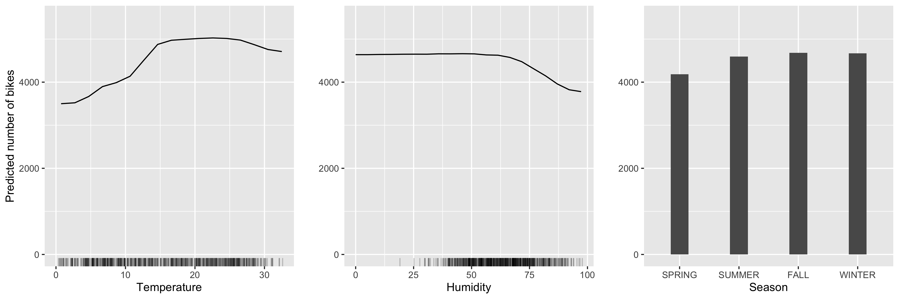

```{r setup, include=FALSE}
knitr::opts_chunk$set(echo = TRUE)
```

Machine learning models are excellent predictors, but it is impractical to interpret many of these models. Despite this impracticality, it is important to be able to explain predictions to assess and validate models. As a result, a field of research has recently developed in the explainability of machine learning models. In this talk, I will provide an overview of explainable machine learning with a focus on visualization methods. I will discuss philosophies of "explainability", model agnostic and model specific visualization methods, and code for creating some of the visualizations in R. I hope that this talk will provide listeners with an introduction to explainable machine learning and resources to learn more if desired.

```{r echo = FALSE}

```

