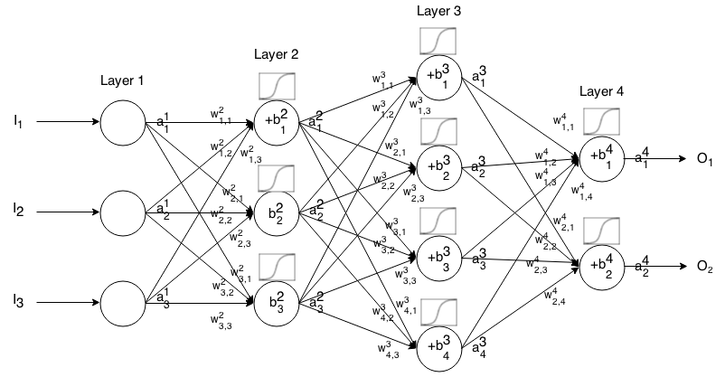
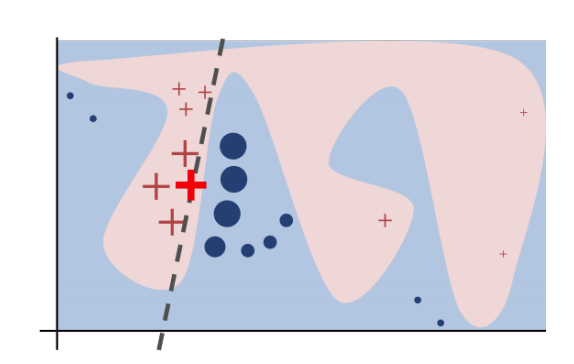
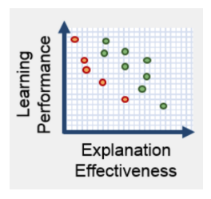
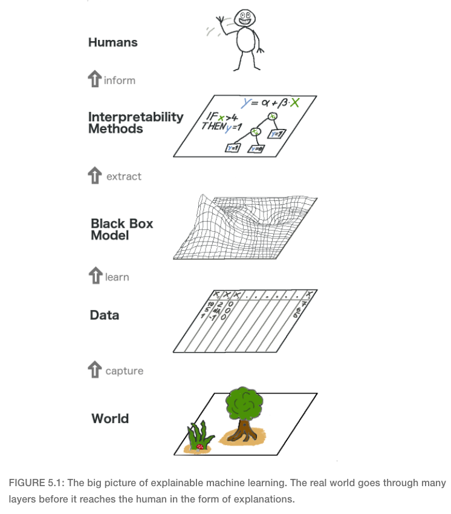
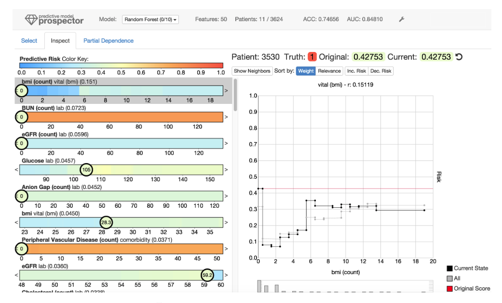
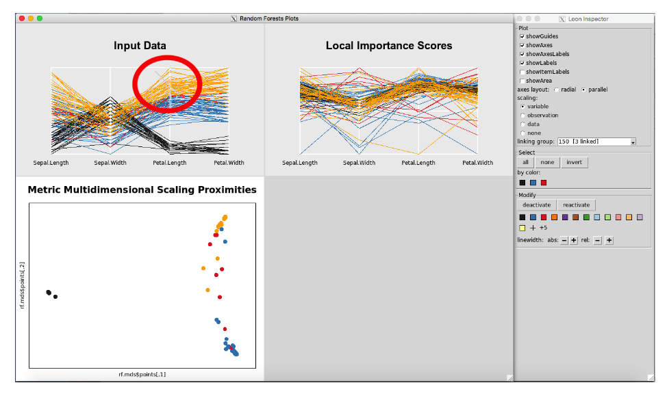
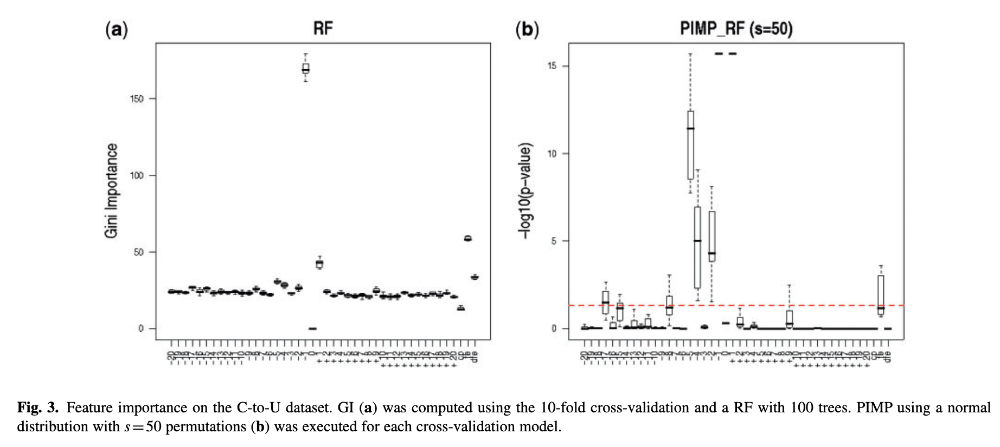
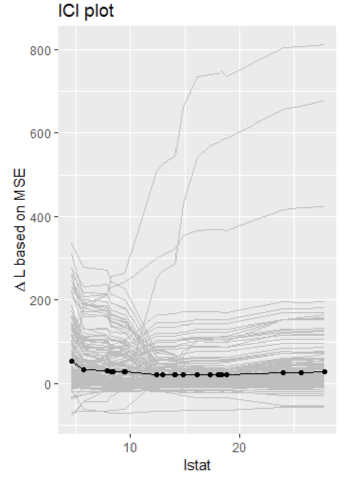
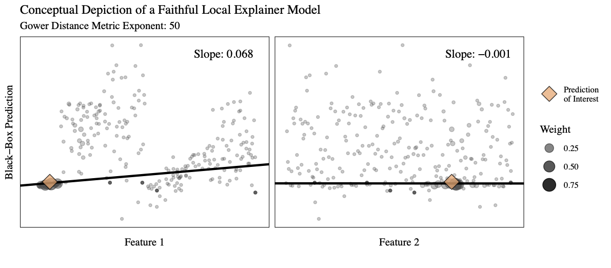

<style>

/* colors: #ffa41b, #000839, #005082, #00a8cc */
a, a > code {
  color: #ffa41b;
  text-decoration: none;
}

.remark-slide-content {
  background-color: #FFFFFF;
  border-top: 80px solid #005082;
  font-size: 20px;
  font-weight: 300;
  line-height: 1.5;
  padding: 1em 2em 1em 2em
}

.inverse {
  background-color: #000839;
  border-top: 80px solid #000839;
  text-shadow: none;
	background-position: 50% 75%;
  background-size: 150px;
}

.inverse2 {
  background-color: #00a8cc;
  border-top: 80px solid #00a8cc;
  text-shadow: none;
	background-position: 50% 75%;
  background-size: 150px;
}

.remark-slide-content > h1 {
  font-family: 'Skia';
  font-weight: normal;
  font-size: 45px;
  margin-top: -95px;
  margin-left: -00px;
  color: #FFFFFF;
}

.title-slide {
  background-color: #FFFFFF;
  border-top: 80px solid #FFFFFF;
  background-image: none;
}

.title-slide > h1  {
  color: #111111;
  font-size: 40px;
  text-shadow: none;
  font-weight: 400;
  text-align: left;
  margin-left: 15px;
  padding-top: 80px;
}
.title-slide > h2  {
  margin-top: -25px;
  padding-bottom: -20px;
  color: #111111;
  text-shadow: none;
  font-weight: 300;
  font-size: 35px;
  text-align: left;
  margin-left: 15px;
}
.title-slide > h3  {
  color: #111111;
  text-shadow: none;
  font-weight: 300;
  font-size: 25px;
  text-align: left;
  margin-left: 15px;
  margin-bottom: -30px;
}

body {
  font-family: 'Skia';
}

.remark-slide-number {
  font-size: 13pt;
  font-family: 'Skia';
  color: #272822;
  opacity: 1;
}

.inverse .remark-slide-number {
  font-size: 13pt;
  font-family: 'Skia';
  color: #FAFAFA;
  opacity: 1;
}

.inverse2 .remark-slide-number {
  font-size: 13pt;
  font-family: 'Skia';
  color: #FAFAFA;
  opacity: 1;
}

</style>

```{css, echo = FALSE}
.tiny{font-size: 30%}
.small{font-size: 50%}

.left-code {
  color: #777;
  width: 40%;
  height: 92%;
  float: left;
}
.right-plot {
  width: 59%;
  float: right;
  padding-left: 1%;
}
```

```{r setup, echo = FALSE, message = FALSE}
# Packages
library(caret)
library(dplyr)
library(iml)
library(ggplot2)
library(knitr)
library(limeaid)
library(randomForest)
library(tree)

# R markdown options
opts_chunk$set(echo = FALSE, dpi = 200, cache = TRUE)
```


# To Do

Materials to go through...

- Overviews:
  - IML by Molnar
  - Gilpin
  - Mohseni
  - Ming
  - Guidotti
  - Wickham
  
- Specific methods:
  - Cortez and Embrechts
  - Natalia's paper
  - Distill articles
  - Hara and Hayashi

---

# The Plan...

**Setting the Stage**

- Motivation

- Definitions and Philosophical Aspects

**Methods**

- Model Agnostic

- Random Forest Specific

- Neural Network Specific

**Concluding Thoughts**

- Additional Methods and Resources

- A Cautionary Conclusion

---

class: inverse, middle, center

# Motivation

---

# Machine Learning

Machine learning models may provide magical predictions,...

```{r out.width = "50%", fig.align = 'center'}

```

---

# Black Box Models

...but being able to explain how many machine learning models produce the predictions is not an easy task.

```{r out.width = "60%", fig.align = 'center'}

```

---

# The Importance of Explanability

```{r out.width = "600px", fig.align = 'center'}

```

```{r out.width = "33%"}


```

---

# Literature on Explanability

**General trends I've noticed:**

- Mnay recent (last 5 years)

- Often machine learning and computer science perspectives

- Many Eurpoean authors
  - [General Data Protection Regulation](https://en.wikipedia.org/wiki/General_Data_Protection_Regulation) (GDPR) implemented in 2018
  - [Goodman and Flaxman (2016)](https://arxiv.org/abs/1606.08813): "It is reasonable to suppose that any adequate explanation would, at a minimum, provide an account of how input features relate to predictions, allowing one to answer questions such as: Is the model more or less likely to recommend a loan if the applicant is a minority?"

**Key resource for this talk:**

- [Interpretable Machine Learning](https://christophm.github.io/interpretable-ml-book/) by Christoph Molnar
- Corresponding R package: [iml](https://github.com/christophM/iml)

---

class: inverse, middle, center

# Definitions and Philosophical Aspects

---

# Explainability versus Interpretability

I have not found agreed upon definitions.

**[Interpretable Machine Learning (Molnar 2020)](https://christophm.github.io/interpretable-ml-book/)**

- "I will use both the terms **interpretable** and **explainable** interchangeably"
- "I will use “**explanation**” for explanations of individual predictions."

**[Methods for Interpreting and Understanding Deep Neural Networks (Montavon, Samek, and Muller 2017)](https://arxiv.org/pdf/1706.07979.pdf)**

- "**post-hoc interpretability**, i.e. a trained model is given and our goal is to understand what the model predicts (e.g. categories) in terms what is readily interpretable (e.g. the input variables)"
- "Post-hoc interpretability should be contrasted to incorporating **interpretability directly** into the structure of the model..."
- "...when using the word “**understanding**”, we refer to a functional understanding of the model, in contrast to a lower-level mechanistic or algorithmic understanding of it."
- also distinguish between **interpretation** and **explanation**

---

# Explainability versus Interpretability

**[The Mythos of Model Interpretability (Lipton 2017)](https://arxiv.org/pdf/1606.03490.pdf)**

- Paper dedicated to the philosophical discussion of what interpretability is in machine learning

**[Explaining Explanations: An Overview of Interpretability of Machine Learning (Gilpin et. al. 2019)](https://arxiv.org/pdf/1806.00069.pdf)**

- "We take the stance that **interpretability** alone is insufficient.
In order for humans to trust black-box methods, we need **explainability** – models that are able to summarize the reasons for neural network behavior, gain the trust of users, or produce insights about the causes of their decisions"
- Implies that you need both interpretability and explainability?

---

# Explainability versus Interpretability

My definitions (based on a conversation with **[Nick Street](https://tippie.uiowa.edu/people/nick-street)** (University of Iowa))...

.pull-left[
**Interpretability** = the ability to directly use the parameters of a model to understand the mechanism of how the model makes predictions

- a linear model coefficient: indicates the amount the response variable changes based on a change in the predictor variable
  
<br>

$$\hat{y}=\hat{\beta}_0+\hat{\beta}_1x_1+\cdots+\hat{\beta}_px_p $$
]

.pull-right[
**Explainability** = the ability to use the model in an indirect manner to understand the relationships in the data captured by the mode

- LIME: model agnostic method that uses a surrogate model

```{r fig.cap = "Figure from LIME paper (Ribeiro 2016)"}

```

]


---

# Should we explain black-box models?

[**Stop Explaining Black Box Machine Learning Models for High Stakes Decisions and Use Interpretable Models Instead**](https://arxiv.org/pdf/1811.10154.pdf) by [**Cynthia Rudin**](https://users.cs.duke.edu/~cynthia/):

- Debunks the “accuracy-interpretability trade-off” myth

```{r out.width = "25%", fig.align = "center"}

```

- "Explanations must be wrong. They cannot have perfect fidelity with respect to the original model. If the explanation was completely faithful to what the original model computes, the explanation would equal the original model..."

- "...it is possible that the explanation leaves out so much information that it makes no sense."

- Rudin has worked on machine learning models with natural interpretability

---

class: inverse, middle, center

# Model Agnostic Methods

---

# Overview of Model Agnostic Methods

.pull-left[
**Advantages**

- Can be applied to any model

- Convenient if comparing various types of predictive models

- Visualization or model based approach

<br>

**Disadvantages**

- Must work with any model

]

.pull-right[
```{r out.width = "150%", fig.cap = "From Interpretable Machine Learning (Molnar)"}

```
]

---

# Washington D.C. Bike Rentals

Example data in Interpretable Machine Learning - can be accessed [here](https://github.com/christophM/interpretable-ml-book/blob/master/data/bike.RData)

```{r echo = TRUE}
bike <- load("data/bike.RData")
data(bike)
# Fit a random forest
bike_mod = randomForest::randomForest(x = bike %>% dplyr::select(-cnt), y = bike$cnt)
```

```{r}
DT::datatable(bike,
              class = 'cell-border stripe',
          options = list(dom = 'tp',
                         scrollX = TRUE, 
                         pageLength = 3))
```

---

class: inverse2, center, middle

# Model Agnostic Methods:

## .center[Visualizations Prediction]

---

# Partial Dependence Plots .tiny[[Friedman 2001](https://projecteuclid.org/euclid.aos/1013203451)]

**Purpose**: Visualize marginal relationship between one (or two) predictors and model predictions

**Estimated partial dependence function:**

$$\hat{f}_{x_{int}}(x_{int})=\frac{1}{n}\sum_{i=1}^n\hat{f}(x_{int},x^{(i)}_{other})$$

- $\hat{f}=$ machine learning model fit using predictor variables 
- $x_{int}=$ value of the predictor of interest
- $x^{(i)}_{other}=$ vector of training data values of other predictors in the model for observation $i$

```{r message = FALSE, warning = FALSE, fig.width = 9, fig.height = 2.5}
# Based on code from Molnar's IML GitHub repo
bike_pred = Predictor$new(bike_mod, data = bike, y = bike$cnt)
pdp = FeatureEffect$new(bike_pred, "temp", method = "pdp") 
p1 = pdp$plot() +  
  scale_x_continuous('Temperature', limits = c(0, NA)) + 
  scale_y_continuous('Predicted number of bikes', limits = c(0, 5500))
pdp$set.feature("hum")
p2 = pdp$plot() + 
  scale_x_continuous('Humidity', limits = c(0, NA)) + 
  scale_y_continuous('', limits = c(0, 5500))
pdp$set.feature("season")
p3 = ggplot(pdp$results) + 
  geom_col(aes(x = season, y = .value), width = 0.3) + 
  scale_x_discrete('Season') + 
  scale_y_continuous('', limits = c(0, 5500))
gridExtra::grid.arrange(p1, p2, p3, ncol = 3) 
```

---

# Partial Dependence Plots in iml

.pull-left[
```{r echo = TRUE, message = FALSE, eval = FALSE}
# Create a "predictor" object that 
# holds the model and the data
bike_pred = 
  Predictor$new( #<<
    model = bike_mod,
    data = bike)

# Compute the partial dependence 
# function for temp and windspeed
pdp = 
  FeatureEffect$new( #<<
    predictor = bike_pred, 
    feature = c("hum", "temp"), 
    method = "pdp") 

# Create the partial dependence plot
pdp$plot() + #<<
  viridis::scale_fill_viridis(
    option = "D") + 
  labs(x = "Humidity", 
       y = "Temperature", 
       fill = "Prediction")
```
]

.pull-right[
**Partial dependence plot with two variables**

```{r fig.width = 4.1, fig.height = 3, message = FALSE}
# Create a "predictor" object that 
# holds the model and the data
bike_pred = 
  Predictor$new( #<<
    model = bike_mod,
    data = bike)

# Compute the partial dependence 
# function for temp and windspeed
pdp = 
  FeatureEffect$new( #<<
    predictor = bike_pred, 
    feature = c("hum", "temp"), 
    method = "pdp") 

# Create the partial dependence plot
pdp$plot() + #<<
  viridis::scale_fill_viridis(
    option = "D") + 
  labs(x = "Humidity", 
       y = "Temperature", 
       fill = "Prediction")
```
]

---

# Interactive PDPs .tiny[[Krause, Perer, and Ng 2016](https://josuakrause.github.io/info/prospector.html)]

```{r out.width = "100%"}

```

---

# Individual Conditional Expectation .tiny[[Goldstein et. al. 2013](https://arxiv.org/pdf/1309.6392.pdf)]

**Purpose**: Similar to partial dependence plots, but consider each observation separately instead of taking an average.

**Estimated individual conditional expectation function:**

$$\hat{f}^{(i)}_{x_{int}}(x_{int})=\hat{f}(x_{int},x^{(i)}_{other})$$

- $\hat{f}=$ machine learning model fit using predictor variables 
- $x_{int}=$ value of the predictor of interest
- $x^{(i)}_{other}=$ vector of training data values of other predictors in the model for observation $i$

```{r message = FALSE, warning = FALSE, fig.width = 9, fig.height = 2.5}
# Based on code from Molnar's IML GitHub repo
ice = FeatureEffect$new(bike_pred, "temp", method = "ice") 
p4 = ice$plot() +  
  scale_x_continuous('Temperature', limits = c(0, NA)) + 
  scale_y_continuous('Predicted number of bikes', limits = c(0, 5500))
ice$set.feature("windspeed")
p5 = ice$plot() + 
  scale_x_continuous('Wind speed', limits = c(0, NA)) + 
  scale_y_continuous('', limits = c(0, 5500))
ice$set.feature("season")
p6 = ggplot(ice$results) + 
  geom_line(aes(x = season, y = .value, group = .id), alpha = 0.25) + 
  scale_x_discrete('Season') + 
  scale_y_continuous('', limits = c(0, 5500))
gridExtra::grid.arrange(p4, p5, p6, ncol = 3) 
```

---

# ICE Plots in iml

.left-code[
```{r echo = TRUE, eval = FALSE}
# Compute the ICE function
ice = 
  FeatureEffect$new( #<<
  predictor = bike_pred,
  feature = "temp",
  method = "ice")

# Create the plot
plot(ice) #<<
```

]

.right-plot[

.center[**ICE plot for temperature**]

```{r fig.width = 4, fig.height = 3.5}
# Compute the ICE function
ice = 
  FeatureEffect$new(
  predictor = bike_pred,
  feature = "temp",
  method = "ice")

# Create the plot
plot(ice) 
```
]

---

# Centered ICE Plots

"Sometimes it can be hard to tell whether the ICE curves differ between individuals because they start at different predictions. A simple solution is to center the curves at a certain point in the feature and display only the difference in the prediction to this point." - Molnar 

.left-code[
```{r echo = TRUE, eval = FALSE}
# Center the ICE function for 
# temperature at the 
# minimum temperature and 
# include the pdp
ice_centered = 
  FeatureEffect$new(#<<
  predictor = bike_pred,
  feature = "temp",
  center.at = min(bike$temp),
  method = "pdp+ice")

# Create the plot
plot(ice_centered) #<<
```
]

.right-plot[
```{r fig.width = 4, fig.height = 3.5}
# Center the ICE function for 
# temperature at the 
# minimum temperature and 
# include the pdp
ice_centered = 
  FeatureEffect$new(
  predictor = bike_pred,
  feature = "temp",
  center.at = min(bike$temp),
  method = "pdp+ice")

# Create the plot
plot(ice_centered)
```
]

---

# Addressing Correlation and Interactions

.pull-left[
**Accumulated Local Effects (ALE) Plots**  
[Apley and Zhu (2016)](https://arxiv.org/pdf/1612.08468.pdf)

- Similar to PDPs: consider how a feature influences predictions on average
- In contrast to PDPs: faster to create and account for correlation

```{r message = FALSE, fig.width = 4, fig.height = 3}
FeatureEffect$new(predictor = bike_pred, 
                  feature = c("hum", "temp"), 
                  method = "ale", grid.size = 40)$plot() +   
  scale_x_continuous("Relative Humidity") + 
  scale_y_continuous("Temperature")+
  viridis::scale_fill_viridis(option = "D") + 
  labs(fill = "ALE")
```

]

.pull-right[
**Feature Interaction Plots**

- Metrics that measure effect of interactions on the predictions
  - H-statistic [Friedman and Popescu (2008)](https://projecteuclid.org/euclid.aoas/1223908046)
  - Variable Interaction Networks (VIN) [Hooker (2004)](http://faculty.bscb.cornell.edu/~hooker/VIN-kdd.pdf)
  - PDPs based on interactions [Greenwell et. al. (2018)](https://arxiv.org/pdf/1805.04755.pdf)
  
```{r message = FALSE, fig.width = 4, fig.height = 2.5}
int = Interaction$new(predictor = bike_pred, 
                      grid.size = 100, 
                      feature = "season") 
plot(int) + 
  scale_x_continuous("2-way interaction strength")
```

]

---

# ALE and Interaction Plots in iml

Code for the plots on the previous slide

.pull-left[
**Accumulated Local Effects (ALE) Plot**

```{r eval = FALSE, echo = TRUE}
# Compute the ALEs
ale = FeatureEffect$new( #<<
  predictor = bike_pred,
  feature = c("hum", "temp"), 
  method = "ale", 
  grid.size = 40)

# Plot the ALEs
plot(ale) + #<<
  scale_x_continuous(
    "Relative Humidity") + 
  scale_y_continuous(
    "Temperature")+
  viridis::scale_fill_viridis(
    option = "D") + 
  labs(fill = "ALE")
```

]

.pull-right[
**Feature Interaction Plot**

```{r eval = FALSE, echo = TRUE}
# Compute the interaction metrics
int = 
  Interaction$new( #<<
    predictor = bike_pred,
    grid.size = 100, 
    feature = "season") 

# Plot the interaction metrics
plot(int) + #<<
  scale_x_continuous(
    "2-way interaction strength")
```

]
---

# Parallel Coordinate Plots

Provide a nice overview of the predictions across 

**PCP plot with bike data** (made with [ggpcp](https://github.com/yaweige/ggpcp))

```{r fig.width = 10, fig.height = 5.5}
# Determine the order of feature importances
bike_vi = bike_mod$importance %>%
  data.frame() %>%
  mutate(var = rownames(bike_mod$importance)) %>% #<<
  arrange(IncNodePurity)

# Determine order of features 
bike_ft_ordered = bike_vi %>% arrange(desc(IncNodePurity)) %>% pull(var)

# Create the pcp
bike %>%
  mutate(rf_pred = predict(bike_mod)) %>%
  ggplot(aes(color = rf_pred)) + 
  ggpcp::geom_pcp(aes(vars = dplyr::vars(all_of(bike_ft_ordered))), alpha = 0.4) + 
  viridis::scale_color_viridis(option = "D") + 
  labs(x = "Featured ordered by feature importance (left to right)",
       y = "Standardized Feature Value",
       color = "Random Forest Prediction") + 
  theme(legend.position = "bottom") + 
  guides(color = guide_colourbar(barwidth = 15))
```

---

# Parallel Coordinate Plots in ggpcp

Code for the plot on the previous slide

```{r eval = FALSE, echo = TRUE}
# Determine order of features 
bike_ft_ordered = bike_vi %>% arrange(desc(IncNodePurity)) %>% pull(var)

# Create the pcp
bike %>%
  mutate(rf_pred = predict(bike_mod)) %>% 
  ggplot(aes(color = rf_pred)) + 
  ggpcp::geom_pcp(aes(vars = dplyr::vars(all_of(bike_ft_ordered))), alpha = 0.4) + #<<
  viridis::scale_color_viridis(option = "D") + 
  labs(x = "Featured ordered by feature importance (left to right)",
       y = "Standardized Feature Value",
       color = "Random Forest Prediction") + 
  theme(legend.position = "bottom") + 
  guides(color = guide_colourbar(barwidth = 15))
```

---

# Interactive Parallel Coordinate Plots .tiny[[Beckett (2018)](https://digitalcommons.usu.edu/gradreports/1335/)]

R package [Rfviz] for interactive parallel coordinate plots with random forest models, but it could be extended to other machine learning models.

```{r out.width = "95%"}

```

---

class: inverse2, center, middle

# Model Agnostic Methods:

## .center[Feature Importance]

---

# Permutation Feature Importance

**Background**

- Idea originally proposed by [Brieman (2001)](https://www.stat.berkeley.edu/~breiman/randomforest2001.pdf) for random forests

- Adapted to be used with all models by [Fisher, Rudin, and Dominici (2018)](https://arxiv.org/pdf/1801.01489v1.pdf)

  - Call this measure the model class reliance

**Concept**

- Measure feature importance by seeing how much the prediction error is affected when a feature is permuted
  
  - important feature: one that affects the prediction error when changed
  
  - non-important feature: one that does not affect the prediction error when changed

---

# Permutation Feature Importance in iml

**Permutation feature importance of bike data random forest**
  
.left-code[
```{r eval = FALSE, echo = TRUE}
# Create the predictor 
# (seemingly FeatureImp 
# requires y)
bike_pred = 
  Predictor$new( #<<
    model = bike_mod, 
    data = bike, 
    y = bike$cnt)

# Compute the feature
# importance values
bike_imp = 
  FeatureImp$new( #<<
    predictor = bike_pred, 
    loss = 'mae')

# Plot the feature
# importance values
plot(bike_imp) #<<
```
]

.right-plot[

```{r fig.height = 4, fig.width = 6}
bike_pred = Predictor$new(bike_mod, data = bike, y = bike$cnt)
bike_imp = FeatureImp$new(predictor = bike_pred, loss = 'mae')
plot(bike_imp)
```

Point = median permutation importance  
Bars = 5th and 95th permutation importance quantiles

]

---

# Permutation FI with p-values .tiny[[Atlmann et. al. (2010)](https://academic.oup.com/bioinformatics/article/26/10/1340/193348)]

- Permutation based feature importance method that returns p-values

- Example from the paper comparing Gini importance values to their permutation feature importance method with p-values 

```{r}

```

---

# More Feature Importance .tiny[[Casalicchio, Molnar, and Bischl (2019)](https://arxiv.org/pdf/1804.06620.pdf)]

.pull-left[
Introduce three measures for feature importance: 

**Individual Conditional Importance (ICI)**

- "local" permutation feature importance metric 
- similar to ICE plots but "visualize the expected (conditional) feature importance instead of the expected (conditional)" prediction"

**Partial Importance (PI)**

- aggregate of ICI values

**Shapely Feature Importance (SFIMP)**

- based on shapely values

]

.pull-right[

```{r}

```

ICI and PI available in the [featureImportance](https://github.com/giuseppec/featureImportance) R package

]

---

class: inverse2, center, middle

# Model Agnostic Methods:

## .center[Surrogate Models]

---

# Global Surrogate Models

.pull-left[
**Idea**: Use an interpretable model to explain a black-box model

**Procedure**:

1. Train a black-box model

2. Obtain predictions from black-box model on a set of data (training data or other)

3. Fit an interpretable model (linear regression model, tree, etc)

.center[black-box predictions ~ predictor variables]
  
**Cautions**: How to know if the global surrogate is a good enough approximation of the complex model?
]

.pull-right[
```{r message = FALSE, fig.height = 5.75, fig.width = 4}
# Functions for rotating the data
rot_x <- function(x, y, theta) (x * cos(theta)) - (y * sin(theta))
rot_y <- function(x, y, theta) (x * sin(theta)) + (y * cos(theta))

# Parameters for the sine data
theta = -0.9
min = -10
max = 10

# Create points represting the rotated since curve
sinefun_data <- data.frame(xnew = seq(min(sine_data_train$x1new), 
                                      max(sine_data_train$x1new), 
                                      by = 0.01)) %>%
  mutate(ynew = 5 * sin(xnew)) %>%
  mutate(x = rot_x(xnew, ynew, -theta),
         y = rot_y(xnew, ynew, -theta)) %>%
  filter(y >= -10, y <= 10)

# Specify colors for predictions
sinecolor0 = "firebrick" #"tomato"
sinecolor1 = "steelblue" #"darkturquoise"

# Plot the training data observed classes
sine_obs = ggplot(sine_data_train, aes(x = x1, y = x2, color = y)) + 
  geom_point(aes(shape = y), alpha = 0.8) + 
  geom_path(data = sinefun_data, aes(x = x, y = y), 
            color = "black") +
  scale_colour_manual(values = c(sinecolor0, sinecolor1)) +
  theme_bw(base_size = 10) + 
  labs(title = "Training Data")

# Fit a random forest
set.seed(20191003)
rfsine <- randomForest::randomForest(
  x = sine_data_train %>% dplyr::select(x1, x2, x3),
  y = factor(sine_data_train$y))

# Apply lime with kernel density simulation
sine_lime_explain <- apply_lime(
    train = sine_data_train %>% dplyr::select(x1, x2, x3),
    test = sine_data_test %>% dplyr::select(x1, x2, x3),
    model = rfsine,
    label = "1",
    n_features = 2,
    sim_method = c("kernel_density"),
    nbins = 4,
    feature_select = "auto",
    dist_fun = "gower",
    kernel_width = NULL,
    gower_pow = 1, 
    return_perms = TRUE,
    seed = 20190914)

# Extract the perms and associated predictions pertaining to case 1
case1_perms <- sine_lime_explain$explain$perms_raw[[1]]
case1_perms$pred <- sine_lime_explain$explain$perms_pred_complex[[1]][,1]

# Plot the training data observed classes
sine_pred = ggplot(case1_perms, aes(x = x1, y = x2, color = pred)) + 
  geom_point(alpha = 0.8) +
  geom_path(data = sinefun_data, aes(x = x, y = y), 
            color = "black") +
  scale_color_gradient2(low = sinecolor0, 
                        mid = '#f7f7f7', 
                        high = sinecolor1, 
                        midpoint = 0.5) +
  theme_bw(base_size = 10) + 
  labs(title = "Simulated Data and RF Predictions")

# Join the plots
cowplot::plot_grid(sine_obs, sine_pred, nrow = 2)
```
]

---

# Using a Tree as the Global Surrogate

Using a classification tree as the global surrogates for the random forest model fit to the sine data

.left-code[
```{r fit-tree, message = FALSE, fig.height = 8, fig.width = 5}
tree <- tree::tree(pred ~ x1 + x2 + x3, data = case1_perms)
plot(tree)
text(tree, cex = 1)
```
]

```{r gg.partition.tree-func, include = FALSE}
gg.partition.tree <- function (tree, label = "yval", ordvars, ...) 
{
    ptXlines <- function(x, v, xrange, xcoord = NULL, ycoord = NULL, 
        tvar, i = 1L) {
        if (v[i] == "<leaf>") {
            y1 <- (xrange[1L] + xrange[3L])/2
            y2 <- (xrange[2L] + xrange[4L])/2
            return(list(xcoord = xcoord, ycoord = c(ycoord, y1, 
                y2), i = i))
        }
        if (v[i] == tvar[1L]) {
            xcoord <- c(xcoord, x[i], xrange[2L], x[i], xrange[4L])
            xr <- xrange
            xr[3L] <- x[i]
            ll2 <- Recall(x, v, xr, xcoord, ycoord, tvar, i + 
                1L)
            xr <- xrange
            xr[1L] <- x[i]
            return(Recall(x, v, xr, ll2$xcoord, ll2$ycoord, tvar, 
                ll2$i + 1L))
        }
        else if (v[i] == tvar[2L]) {
            xcoord <- c(xcoord, xrange[1L], x[i], xrange[3L], 
                x[i])
            xr <- xrange
            xr[4L] <- x[i]
            ll2 <- Recall(x, v, xr, xcoord, ycoord, tvar, i + 
                1L)
            xr <- xrange
            xr[2L] <- x[i]
            return(Recall(x, v, xr, ll2$xcoord, ll2$ycoord, tvar, 
                ll2$i + 1L))
        }
        else stop("wrong variable numbers in tree.")
    }
    if (inherits(tree, "singlenode")) 
        stop("cannot plot singlenode tree")
    if (!inherits(tree, "tree")) 
        stop("not legitimate tree")
    frame <- tree$frame
    leaves <- frame$var == "<leaf>"
    var <- unique(as.character(frame$var[!leaves]))
    if (length(var) > 2L || length(var) < 1L) 
        stop("tree can only have one or two predictors")
    nlevels <- sapply(attr(tree, "xlevels"), length)
    if (any(nlevels[var] > 0L)) 
        stop("tree can only have continuous predictors")
    x <- rep(NA, length(leaves))
    x[!leaves] <- as.double(substring(frame$splits[!leaves, "cutleft"], 
        2L, 100L))
    m <- model.frame(tree)
    if (length(var) == 1L) {
        x <- sort(c(range(m[[var]]), x[!leaves]))
        if (is.null(attr(tree, "ylevels"))) 
            y <- frame$yval[leaves]
        else y <- frame$yprob[, 1L]
        y <- c(y, y[length(y)])
        if (add) 
            lines(x, y, type = "s", ...)
        else {
            a <- attributes(attr(m, "terms"))
            yvar <- as.character(a$variables[1 + a$response])
            xo <- m[[yvar]]
            if (is.factor(xo)) 
                ylim <- c(0, 1)
            else ylim <- range(xo)
            plot(x, y, ylab = yvar, xlab = var, type = "s", ylim = ylim, 
                xaxs = "i", ...)
        }
        invisible(list(x = x, y = y))
    }
    else {
        if (!missing(ordvars)) {
            ind <- match(var, ordvars)
            if (any(is.na(ind))) 
                stop("unmatched names in vars")
            var <- ordvars[sort(ind)]
        }
        lab <- frame$yval[leaves]
        if (is.null(frame$yprob)) 
            lab <- format(signif(lab, 3L))
        else if (match(label, attr(tree, "ylevels"), nomatch = 0L)) 
            lab <- format(signif(frame$yprob[leaves, label], 
                3L))
        rx <- range(m[[var[1L]]])
        rx <- rx + c(-0.025, 0.025) * diff(rx)
        rz <- range(m[[var[2L]]])
        rz <- rz + c(-0.025, 0.025) * diff(rz)
        xrange <- c(rx, rz)[c(1, 3, 2, 4)]
        xcoord <- NULL
        ycoord <- NULL
        xy <- ptXlines(x, frame$var, xrange, xcoord, ycoord, 
            var)
        xx <- matrix(xy$xcoord, nrow = 4L)
        yy <- matrix(xy$ycoord, nrow = 2L)
        return(
          list(
            annotate(geom="segment", x=xx[1L, ], y=xx[2L, ], xend=xx[3L, ], yend=xx[4L, ]),
            annotate(geom="text", x=yy[1L, ], y=yy[2L, ], label=as.character(lab), ...)
          )
        )
    }
}
```

.right-plot[
```{r tree-boundaries, echo = FALSE, fig.height = 6, fig.width = 6}
ggplot(case1_perms, aes(x = x1, y = x2, color = pred)) + 
  geom_point(alpha = 0.8) +
  gg.partition.tree(tree) + 
  scale_color_gradient2(low = sinecolor0, 
                        mid = '#f7f7f7', 
                        high = sinecolor1, 
                        midpoint = 0.5) +
  theme_bw(base_size = 10) + 
  labs(title = "Simulated Data and RF Predictions with Classification Tree Boundaries",
       color = "Random Forest Prediction") + 
  theme(legend.position = "bottom")
```
]

---

# Local Surrogate Model: LIME

**LIME** = Local Interpretable Model-Agnostic Explanations

- Consider one prediction of interest
- Use a surrogate model to explain the black-box model in a "local" region about a point of interest

```{r out.width = "100%", fig.align = "center"}

```

---

# LIME in R

.pull-left[
**[lime](https://github.com/thomasp85/lime)**
  - written by Thomas Pedersen
  - package for implementing LIME
  
```{r message = FALSE, fig.height = 3, fig.width = 4}
# Apply lime with kernel density simulation
sine_qb <- limeaid::apply_lime(
    train = sine_data_train %>% dplyr::select(x1, x2, x3),
    test = sine_data_test %>% dplyr::select(x1, x2, x3),
    model = rfsine,
    label = "1",
    n_features = 2,
    sim_method = c("quantile_bins"),
    nbins = 4,
    feature_select = "auto",
    dist_fun = "gower",
    kernel_width = NULL,
    gower_pow = 1, 
    return_perms = TRUE,
    seed = 20190914)

lime::plot_features(sine_qb$explain[1:2,])
```

]

.pull-right[

**[limeaid](https://github.com/goodekat/limeaid)**
  - written by me `r emo::ji("smile")`
  - package for visually understanding and assessing LIME
  
```{r message = FALSE, fig.height = 5.5, fig.width = 6.5}
eoi_plot(sine_qb$explain[1:2,])
```
]

---

# Shapely Values

---

class: inverse, middle, center

# Random Forest Specific Techniques

---

# Feature Importance Plot

```{r fig.width = 7, fig.height = 3}
# Create a feature importance plot
bike_vi %>%
  mutate(var = factor(var, levels = pull(bike_vi, var))) %>%
  ggplot(aes(x = var, y = IncNodePurity)) + 
  geom_col() + 
  coord_flip() + 
  labs(x = "Feature")
```

---

# KLIMT

---

# ggRandomforest

---

# Rfviz

---

# Forest Floor Visualizations

Welling et. al. (2016)

---

class: inverse, middle, center

# Neural Network Specific Techniques

---

# Zooming In

https://distill.pub/2020/circuits/zoom-in/

---

# Other Distill Articles

---

class: inverse, middle, center

# Additional Methods and Resources

---

# Other Model Agnostic Methods

**Example-Based Explanations**

- Counterfactual Examples
  - Laugel et. al. 2019: "A counterfactual explanation is thus a data instance, close to this observation, that is predicted to belong to a different class. This form of explanation provides a user tangible explanations that are directly understandable and actionable, which can be seen as an advantage."
  
---

class: inverse, middle, center

# A Cautionary Conclusion

---

# Concerns with LIME

---

# Concerns with counterfactual examples

Laugel et. al. (2019) paper:

"Several troublesome issues have been identified: [Baehrens et al., 2010] e.g. notice that modeling the decision function of a black-box classifier with a surrogate model trained on generated instances can result in explanation vectors that point in the wrong directions in some areas of the feature space in a trivial problem. The stability of post-hoc explainer systems has been criticized as well, showing that some of these approaches are locally not stable enough [Alvarez Melis and Jaakkola, 2018] or on the contrary too stable and thus not locally accurate enough [Laugel et al., 2018b]."