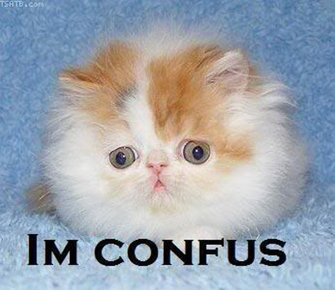

<style>

/* colors: #ffa41b, #000839, #005082, #00a8cc */
a, a > code {
  color: #ffa41b;
  text-decoration: none;
}

.remark-slide-content {
  background-color: #FFFFFF;
  border-top: 80px solid #005082;
  font-size: 20px;
  font-weight: 300;
  line-height: 1.5;
  padding: 1em 2em 1em 2em
}

.inverse {
  background-color: #000839;
  border-top: 80px solid #000839;
  text-shadow: none;
	background-position: 50% 75%;
  background-size: 150px;
}

.remark-slide-content > h1 {
  font-family: 'Skia';
  font-weight: normal;
  font-size: 45px;
  margin-top: -95px;
  margin-left: -00px;
  color: #FFFFFF;
}

.title-slide {
  background-color: #FFFFFF;
  border-top: 80px solid #FFFFFF;
  background-image: none;
}

.title-slide > h1  {
  color: #111111;
  font-size: 40px;
  text-shadow: none;
  font-weight: 400;
  text-align: left;
  margin-left: 15px;
  padding-top: 80px;
}
.title-slide > h2  {
  margin-top: -25px;
  padding-bottom: -20px;
  color: #111111;
  text-shadow: none;
  font-weight: 300;
  font-size: 35px;
  text-align: left;
  margin-left: 15px;
}
.title-slide > h3  {
  color: #111111;
  text-shadow: none;
  font-weight: 300;
  font-size: 25px;
  text-align: left;
  margin-left: 15px;
  margin-bottom: -30px;
}

body {
  font-family: 'Skia';
}

.remark-slide-number {
  font-size: 13pt;
  font-family: 'Skia';
  color: #272822;
  opacity: 1;
}
.inverse .remark-slide-number {
  font-size: 13pt;
  font-family: 'Skia';
  color: #FAFAFA;
  opacity: 1;
}

.tiny{font-size: 40%}

</style>

```{r setup, echo = FALSE, message = FALSE}
# Packages
library(dplyr)
library(iml)
library(ggplot2)
library(knitr)
library(mlr)

# R markdown options
opts_chunk$set(echo = FALSE, dpi = 200)
```

# To Do

Materials to go through...

- Overviews:
  - IML by Molnar
  - Gilpin
  - Mohseni
  - Ming
  - Guidotti
  - Wickham
  
- Specific methods:
  - Cortez and Embrechts
  - Natalia's paper
  - Distill articles
  - Hara and Hayashi

---

# The Plan...

**Setting the Stage**

- Motivation

- Definitions and Philosophical Aspects

- Washington D.C. Bike Rental Example Data

**Methods**

- Model Agnostic

- Random Forest Specific

- Neural Network Specific

**Concluding Thoughts**

- A Cautionary Conclusion

- Additional Resources

---

class: inverse, middle, center

# Motivation

---

# Machine Learning

Machine learning models may provide magical predictions,...

```{r out.width = "50%", fig.align = 'center'}

```

---

# Black Box Models

...but being able to explain how many machine learning models produce the predictions is not an easy task.

```{r out.width = "60%", fig.align = 'center'}

```

---

# The Importance of Explanability

```{r out.width = "600px", fig.align = 'center'}

```

```{r out.width = "33%"}
include_graphics("./figures/patient.jpeg")

include_graphics("./figures/court.jpg")
```

---

# Literature on Explanability

**General trends I've noticed:**

- Recent (last 10 years)

- Machine learning and computer science perspectives

- Eurpoean authors
  - [General Data Protection Regulation](https://en.wikipedia.org/wiki/General_Data_Protection_Regulation) (GDPR) implemented in 2018
  - [Goodman and Flaxman (2016)](https://arxiv.org/abs/1606.08813): "It is reasonable to suppose that any adequate explanation would, at a minimum, provide an account of how input features relate to predictions, allowing one to answer questions such as: Is the model more or less likely to recommend a loan if the applicant is a minority?"

**Key resource for this talk:**

- [Interpretable Machine Learning](https://christophm.github.io/interpretable-ml-book/) by Christoph Molnar

---

class: inverse, middle, center

# Definitions and Philosophical Aspects

---

# Explainability versus Interpretability

I have not found agreed upon definitions.

**[Interpretable Machine Learning (Molnar 2020)](https://christophm.github.io/interpretable-ml-book/)**

- "I will use both the terms **interpretable** and **explainable** interchangeably"
- "I will use “**explanation**” for explanations of individual predictions."

**[Methods for Interpreting and Understanding Deep Neural Networks (Montavon, Samek, and Muller 2017)](https://arxiv.org/pdf/1706.07979.pdf)**

- "**post-hoc interpretability**, i.e. a trained model is given and our goal is to understand what the model predicts (e.g. categories) in terms what is readily interpretable (e.g. the input variables)"
- "Post-hoc interpretability should be contrasted to incorporating **interpretability directly** into the structure of the model..."
- "...when using the word “**understanding**”, we refer to a functional understanding of the model, in contrast to a lower-level mechanistic or algorithmic understanding of it."
- also distinguish between **interpretation** and **explanation**

---

# Explainability versus Interpretability

**[The Mythos of Model Interpretability (Lipton 2017)](https://arxiv.org/pdf/1606.03490.pdf)**

- Paper dedicated to the philosophical discussion of what interpretability is in machine learning

**[Explaining Explanations: An Overview of Interpretability of Machine Learning (Gilpin et. al. 2019)](https://arxiv.org/pdf/1806.00069.pdf)**

- "We take the stance that **interpretability** alone is insufficient.
In order for humans to trust black-box methods, we need **explainability** – models that are able to summarize the reasons for neural network behavior, gain the trust of users, or produce insights about the causes of their decisions"
- Implies that you need both interpretability and explainability?

---

# Explainability versus Interpretability

My definitions (based on a conversation with **[Nick Street](https://tippie.uiowa.edu/people/nick-street)** (University of Iowa))...

.pull-left[
**Interpretability** = the ability to directly use the parameters of a model to understand the mechanism of how the model makes predictions

- a linear model coefficient: indicates the amount the response variable changes based on a change in the predictor variable
  
<br>

$$\hat{y}=\hat{\beta}_0+\hat{\beta}_1x_1+\cdots+\hat{\beta}_px_p $$
]

.pull-right[
**Explainability** = the ability to use the model in an indirect manner to understand the relationships in the data captured by the mode

- LIME: model agnostic method that uses a surrogate model

```{r fig.cap = "Figure from LIME paper (Ribeiro 2016)"}
include_graphics("./figures/lime.png")
```

]


---

# Should we explain black-box models?

[**Stop Explaining Black Box Machine Learning Models for High Stakes Decisions and Use Interpretable Models Instead**](https://arxiv.org/pdf/1811.10154.pdf) by [**Cynthia Rudin**](https://users.cs.duke.edu/~cynthia/):

- Debunks the “accuracy-interpretability trade-off” myth

```{r out.width = "25%", fig.align = "center"}

```

- "Explanations must be wrong. They cannot have perfect fidelity with respect to the original model. If the explanation was completely faithful to what the original model computes, the explanation would equal the original model..."

- "...it is possible that the explanation leaves out so much information that it makes no sense."

- Rudin has worked on machine learning models with natural interpretability

---

class: inverse, middle, center

# Washington D.C. Bike Rental Example Data

---

# Washington D.C. Bike Rentals

Used in Interpretable Machine Learning. I accessed the data [here](https://github.com/christophM/interpretable-ml-book/blob/master/data/bike.RData).

```{r echo = TRUE}
bike <- load("data/bike.RData")
data(bike)
```

```{r}
DT::datatable(bike,
              class = 'cell-border stripe',
          options = list(dom = 'tp',
                         scrollX = TRUE, 
                         pageLength = 4))
```

---

# Random Forest Model with Bike Data

Fit a random forest model using the `mlr` package

  - response: count of bicycles rented during a day
  - predictors: all other 11 variables in bike data (season, holiday indicator, year...)

```{r echo = TRUE}
# Create a task (specify data and response)
bike_task = mlr::makeRegrTask(data = bike, target = "cnt")

# Specify a learner (random forest)
bike_lrn = mlr::makeLearner(cl = 'regr.randomForest', id = 'bike-rf')

# Fit the random forest model
bike_mod = mlr::train(learner = bike_lrn, task = bike_task)
```

<br> 

Extra info:

- [`mlr`](https://mlr.mlr-org.com/) developed by [this](https://www.compstat.statistik.uni-muenchen.de/) working group
- [`mlr3`](https://mlr3.mlr-org.com/) new version of the package

---

class: inverse, middle, center

# Model Agnostic Methods

---

# Overview of Model Agnostic Methods

.pull-left[
**Advantages**

- Can be applied to any model

- Convenient if comparing various types of predictive models

- Visualization or model based approach

<br>

**Disadvantages**

- Must work with any model

]

.pull-right[
```{r out.width = "150%", fig.cap = "From Interpretable Machine Learning (Molnar)"}

```
]

---

# Partial Dependence Plots .tiny[[Friedman 2001](https://projecteuclid.org/euclid.aos/1013203451)]

**Use**: Visualzing the marginal relationship between one or two predictor variables and model predictions

**Method**: For a given model...

1. Obtain predictions for all observations in data
2. For one variable, compute average prediction...

```{r message = FALSE, warning = FALSE, fig.width = 12, fig.height = 4}
# Based on code from Molnar's IML GitHub repo
bike_pred = Predictor$new(bike_mod, data = bike)
pdp = FeatureEffect$new(bike_pred, "temp", method = "pdp") 
p1 = pdp$plot() +  
  scale_x_continuous('Temperature', limits = c(0, NA)) + 
  scale_y_continuous('Predicted number of bikes', limits = c(0, 5500))
pdp$set.feature("hum")
p2 = pdp$plot() + 
  scale_x_continuous('Humidity', limits = c(0, NA)) + 
  scale_y_continuous('', limits = c(0, 5500))
pdp$set.feature("windspeed")
p3 = pdp$plot() + 
  scale_x_continuous('Wind speed', limits = c(0, NA)) + 
  scale_y_continuous('', limits = c(0, 5500))
gridExtra::grid.arrange(p1, p2, p3, ncol = 3)
```

---

# Interactive Partial Dependence Plots

Krause, Perer, and Ng 2016

---

# Parallel Coordinate Plots

---

# Visualizing Feature Importance

Casalicchio, Molnar, and Bischl (2019)

---

# Counterfactual Examples 

Laugel et. al. 2019: "A counterfactual explanation is thus a data instance, close to this observation, that is predicted to belong to a different class. This form of explanation provides a user tangible explanations that are directly understandable and actionable, which can be seen as an advantage."

---

# LIME

---

# Shapely Values

---

class: inverse, middle, center

# Random Forest Specific Techniques

---

# KLIMT

---

# ggRandomforest

---

# Rfviz

---

# Forest Floor Visualizations

Welling et. al. (2016)

---

class: inverse, middle, center

# Neural Network Specific Techniques

---

# Zooming In

https://distill.pub/2020/circuits/zoom-in/

---

class: inverse, middle, center

# A Cautionary Conclusion

---

# Concerns with LIME

---

# Concerns with counterfactual examples

Laugel et. al. (2019) paper:

"Several troublesome issues have been identified: [Baehrens et al., 2010] e.g. notice that modeling the decision function of a black-box classifier with a surrogate model trained on generated instances can result in explanation vectors that point in the wrong directions in some areas of the feature space in a trivial problem. The stability of post-hoc explainer systems has been criticized as well, showing that some of these approaches are locally not stable enough [Alvarez Melis and Jaakkola, 2018] or on the contrary too stable and thus not locally accurate enough [Laugel et al., 2018b]."

---

class: inverse, middle, center

# Additional Resources

---