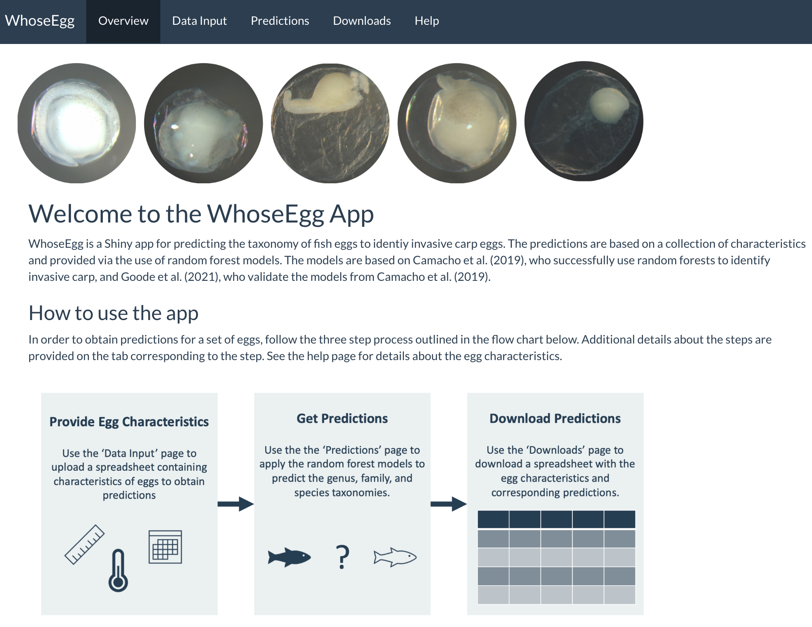

```{r setup, include=FALSE}
knitr::opts_chunk$set(echo = TRUE)
```

The fish species of Grass Carp (*Ctenopharyngodon idella*), Silver Carp (*Hypophthalmichthys molitrix*), and Bighead Carp (*H. nobilis*) are categorized as invasive carp in North America. There is interest from a natural resource management perspective to monitor the populations and spread of the fish species. A common monitoring practice is to collect and genetically identify fish eggs, but this process is both costly in money and time. [Camacho et al. (2019)](https://afspubs.onlinelibrary.wiley.com/doi/abs/10.1002/nafm.10380) demonstrated the use of machine learning as a possibility for a more efficient method of identifying invasive carp. Camacho et al. (2019) trained random forests on easy to measure egg characteristics such as water conductivity and average membrane diameter, and the models returned high accuracy.

In this talk, I will present my recent work with Dr. Michael Weber (NREM) and Dr. Philip Dixon on a Shiny app (WhoseEgg) for identifying invasive carp using random forests based on those from Camacho et al. (2019). The app is intended to be a tool for researchers to input their own fish egg data and easily obtain random forest predictions via a point-and-click user interface. We began work on the app in January, so it is still in development. I will share the current state of the app and our goals for enhancement. I will also ask the audience for feedback. We would greatly appreciate suggestions for adjustments to make the app more user friendly.

```{r echo = FALSE}

```

