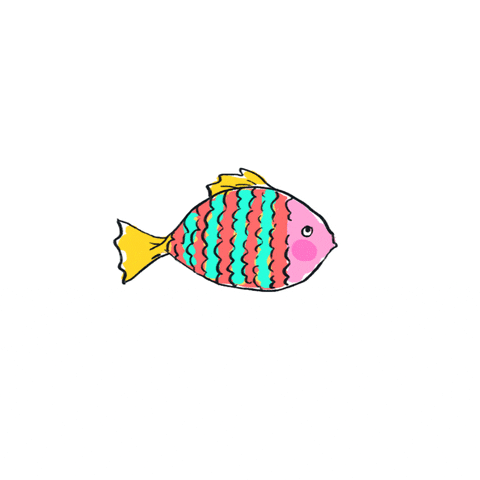
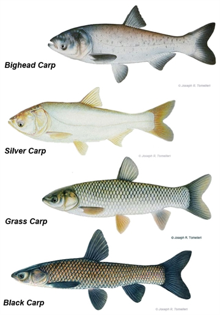

```{r setup, include = FALSE}
options(htmltools.dir.version = FALSE)
knitr::opts_chunk$set(echo = FALSE)
library(knitr)
```

```{r xaringan-themer, include = FALSE, warning = FALSE}
library(xaringanthemer)
style_mono_accent(
  base_color = "#273E52",
  header_font_google = google_font("Josefin Sans"),
  text_font_google = google_font("Montserrat", "300", "300i"),
  code_font_google = google_font("Fira Mono"),
  text_slide_number_color = "black",
  header_h1_font_size = "2rem",
  header_h2_font_size = "1.75rem",
  header_h3_font_size = "1.25rem",
  colors = c(teal = "#43d1b5"), 
  link_color = "#43d1b5", 
  code_highlight_color = "#43d1b5"
)
```

# Overview

.pull-left[
<br>

- Background on invasive carp

<br>

- Random forest approach to egg classification

<br>

- Shiny app
]

.pull-right[

]      
---

class: inverse, middle, center

# Background on Invasive Carp

---

# Invasive Carp

.pull-left[
Information from [National Park Service](https://www.nps.gov/miss/learn/nature/ascarpover.htm): 

- Native to Europe and Asia

- Brought to US in 1970's "to control algae, weed, and parasite growth in aquatic farms, weeds in canal systems, and as one form of sewage treatment"

- Now a problem in Mississippi River basin:

  - Threaten native fish populations
  - May lower water quality
  - Can endanger boaters by jumping out of water
  
]

.pull-right[

]

---

# Jumping Carp

<video width="320" height="240">
<source src="figures/jumping-carp.mp4" type="video/mp4">
</video>

---

# Invasive Carp Species

<iframe width="560" height="315" src="https://www.youtube.com/watch?v=pJ6WH28RvQU" frameborder="0" </iframe>

---

class: inverse, middle, center

# Random Forest Approach to egg classification

---

# Features

---

# Data collection

---

# Response variable

---

# Results

---

# Validation of models

---

# Augmented models
  
---

class: inverse, middle, center

# Shiny App

---

# Goals

---

# Models used

---

# Demonstrate app

---

# Plans for adding to the app

---

# Feedback from audience

- Data input process?
- What else to look at with predictions?
- Advice for instructions?
