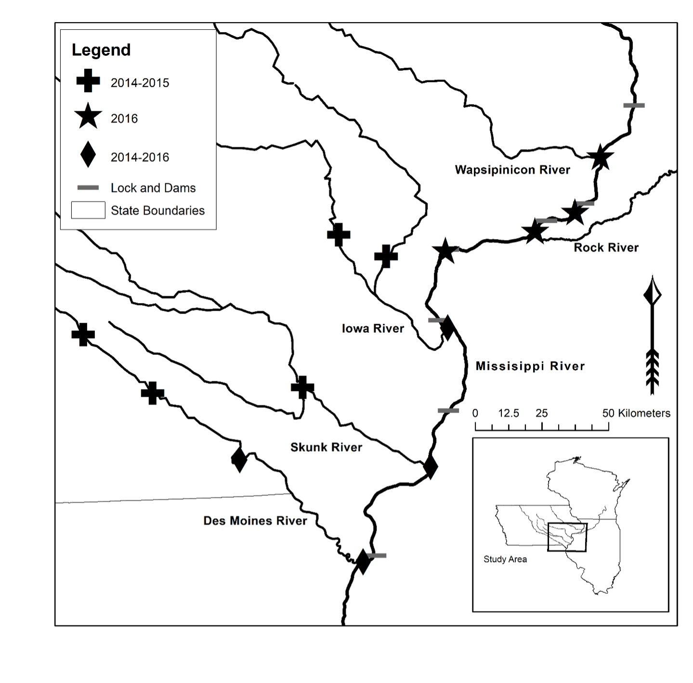
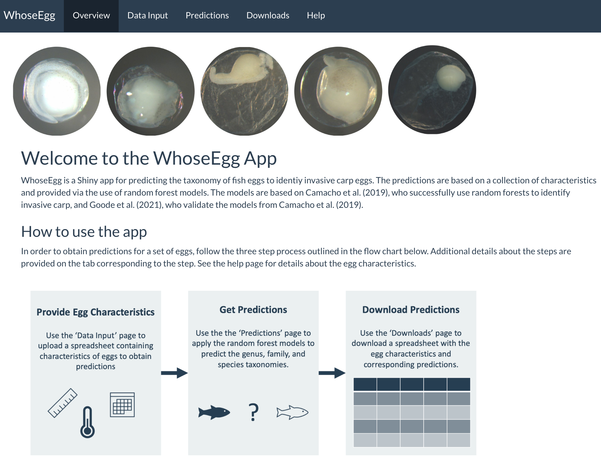
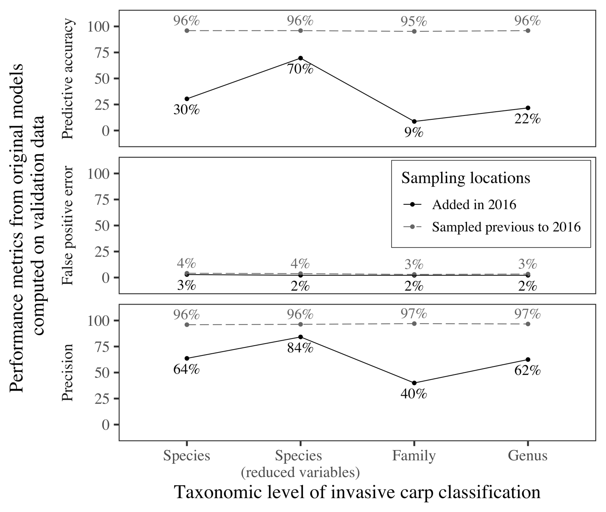

```{css, echo = FALSE}
.tiny{font-size: 30%}
.small{font-size: 50%}
.medium{font-size: 75%}
.left-code {
  color: #777;
  width: 37%;
  height: 92%;
  float: left;
}
.right-plot {
  width: 60%;
  float: right;
  padding-left: 1%;
}
```

```{r setup, include = FALSE}
options(htmltools.dir.version = FALSE)
knitr::opts_chunk$set(echo = FALSE)
library(knitr)
```

```{r xaringan-themer, include = FALSE, warning = FALSE}
library(xaringanthemer)
style_mono_accent(
  base_color = "#273E52", 
  title_slide_text_color = "#43d1b5",
  header_font_google = google_font("Josefin Sans"),
  text_font_google = google_font("Montserrat", "300", "300i"),
  code_font_google = google_font("Fira Mono"),
  text_slide_number_color = "black",
  header_h1_font_size = "2rem",
  header_h2_font_size = "1.75rem",
  header_h3_font_size = "1.25rem",
  colors = c(teal = "#43d1b5", white = "#ffffff"), 
  link_color = "#43d1b5", 
  code_highlight_color = "#43d1b5"
)
```

# Overview

.pull-left[
<br>

- Background on invasive carp
  
<br>

- Random forest approach to fish egg identification

<br>

- Shiny app

]

.pull-right[

]      
---

class: inverse, middle, center

# Background on Invasive Carp

---

# Invasive Carp

.pull-left[
Information from [National Park Service](https://www.nps.gov/miss/learn/nature/ascarpover.htm): 

- Native to Europe and Asia

- Brought to US in 1970's "to control algae, weed, and parasite growth in aquatic farms, weeds in canal systems, and as one form of sewage treatment"

- Escaped into wild

- Become a problem in Mississippi River basin:

  - Threaten native fish populations
  - May lower water quality
  - Possible danger to boaters
  
]

.pull-right[
<center>  <center/>
]

---

# Jumping Carp

<iframe width="900" height="510" src="https://www.youtube.com/embed/pJ6WH28RvQU" frameborder="0" allow="accelerometer; autoplay; clipboard-write; encrypted-media; gyroscope; picture-in-picture" allowfullscreen></iframe>

---

# More Jumping Carp

<iframe width="900" height="510" src="https://www.youtube.com/embed/yC-PSvlbogg" frameborder="0" allow="accelerometer; autoplay; clipboard-write; encrypted-media; gyroscope; picture-in-picture" allowfullscreen></iframe>

---

# Management of Carp

- Federal and state agencies monitor and try to manage invasive carp populations to: 

  - Control population
  - Keep out of new aquatic ecosystems (include Great Lakes)

- Management practices from [USGS](https://www.usgs.gov/ecosystems/invasive-species-program/science/asian-carp?qt-science_center_objects=0#qt-science_center_objects)

```{r out.width = "90%", fig.align = "center"}

```

---

# Egg Collection

<br>

- One method for monitoring carp is to collect eggs

- Common practice is to have eggs identified using genetic analysis

- Both expensive and timely 

- Led Camacho et al (2019) to try using machine learning to classify fish eggs

<br>

.center[
```{r out.width = "30%"}

include_graphics("figures/egg2.png")
include_graphics("figures/egg5.png")
```
]

---

class: inverse, middle, center

# Random Forest Approach to Egg Classification

---

# Overview of Random Forests

.pull-left[
**[Camacho et al. (2019)](https://afspubs.onlinelibrary.wiley.com/doi/abs/10.1002/nafm.10380)**

- Trained random forests 

- Predictor variables: egg characteristics

- Responses: taxonomy levels (family, genus, species)

- Models showed promise for identifying invasive carp 

]

.pull-right[

**[Goode et al. (submitted manuscript)](https://github.com/goodekat/carp-egg-rf-validation)**

- Validated models using a new year of data

- Trained new models with all years of data

<br>


]

---

# Sampling Site and Years

Three years of collection

```{r out.width = "70%", fig.align = "center"}

```

---

# Egg Collection

Collected eggs were taken to the lab for measurements and genetic identification

```{r out.width = "45%", fig.align = "center"}

```

---

# Predictor Variables

.left-code[
**Egg characteristics: ** 

- Month
- Julian day  
- Water temperature	 
- Water conductivity  	
- Deflated?	 
- Pigment?  
- Compact or diffuse?  	
- Sticky debris?  
- Egg stage  
- Membrane average  
- Membrane standard deviation  
- Membrane coefficient of variation  
- Yolk average
- Yolk standard deviation  
- Yolk coefficient of variation
- Yolk to membrane ratio
- Larval length  
]

.right-plot[

```{r out.width = "100%", fig.align = "center"}
include_graphics("figures/egg-characteristics.png")
```
]

---

# Response Variables

.pull-left[

**Taxonomy**: 

- Genus (17 levels)

- Species (29 levels)

<br> 

**Taxonomy with invasive carp categorized as on class**: 

- Family (8 levels)

- Genus (16 levels)

- Species (27 levels)

]

.pull-right[


<br> 
<small> Image source: https://www.watershedcouncil.org/asian-carp.html </small>
]

---

# Results: Metrics on Training Data

Models trained with 2014-2015 and 2014-2016 data

```{r out.width = "95%", fig.align = "center"}

```

---

# Results: Validation of Original Models

Metrics computed using 2014-2015 model on 2016 data

```{r}

```

---

class: inverse, middle, center

# Shiny App

---

# WhoseEgg

**Goal**

- Provide a tool for easily predicting the identification of fish eggs using the random forests

- Used to help identify areas where invasive carp are reproducing

<br>

**Audience**

- Scientists and natural resource management organization employees

- Many non-R users

- Users in upper Mississippi River basin (possibly other regions)

<br>

**Models used**

- Random forests for predicting family, genus, and species with invasive carp grouped

---

# Feedback from Audience

**Current version:**

- Version 1 of app (almost complete)

- Have ideas for improvement

- Would be great to hear thoughts!

<br>

**For example:**

- Suggestions to make more user friendly

- Data input process?

- What else to look at with predictions within the app?

- Advice for instructions?

- Organizing help page?

---

# App Demonstration

```{r out.width = "90%", fig.align = "center"}

```

---

# Plans for Adding to the App

Version 2: 

- Add visualizations of input data compared to training data

- Include prediction intervals

<br>

Version 3: 

- Add visualizations relating to explainability for individual predictions

- Add video showing how to use the app

- Add image during loading of swimming fish

---

class: inverse, center

# Thank you!

```{r out.width = "85%"}

```

---

class: inverse, center, middle

# Additional Figures

---

# Metrics on New/Old Sites

```{r out.width = "80%", fig.align = "center"}

```

---

# Feature Importance

```{r out.width = "100%", fig.align = "center"}
include_graphics("figures/feature-imp.png")
```

---

# Partial Dependence Plots

```{r out.width = "100%", fig.align = "center"}

```

---

# Correlation Between Features

```{r out.width = "80%", fig.align = "center"}
include_graphics("figures/correlation.png")
```

