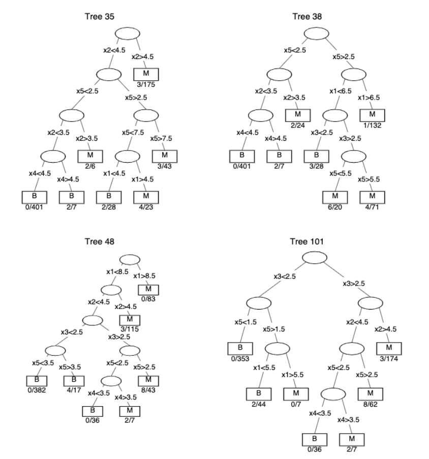

```{css, echo = FALSE}
.tiny{font-size: 30%}
.small{font-size: 50%}
.medium{font-size: 75%}
.left-code {
  color: #777;
  width: 39%;
  height: 92%;
  float: left;
}
.right-plot {
  width: 59%;
  float: right;
  padding-left: 2%;
}
.scroll-output {
  height: 90%;
  overflow-y: scroll;
}
.content-box {
  box-sizing: border-box;
  border-radius: 15px;
  margin: 0 0 15px;
  overflow: hidden;
  padding: 0px 20px 0px 20px;
  width: 100%;
  background-color: #c7cfb7;
}
```

```{r setup, include = FALSE}
# Knitr options
options(htmltools.dir.version = FALSE)
knitr::opts_chunk$set(
  echo = FALSE, 
  fig.align = "center", 
  dpi = 300
)

# Load packages
library(cowplot)
library(dplyr)
library(GGally)
library(ggpcp)
library(ggplot2)
library(knitr)
library(xaringanthemer)
```

```{r xaringan-themer, include = FALSE, warning = FALSE}
style_duo_accent(
  primary_color = "#557174",
  secondary_color = "#9dad7f",
  header_font_google = google_font("Josefin Sans"),
  title_slide_background_color = "#557174",
  text_font_google = google_font("Montserrat", "300", "300i"),
  code_font_google = google_font("Fira Mono"),
  header_h1_font_size = "2rem",
  header_h2_font_size = "1.75rem",
  header_h3_font_size = "1.25rem",
  title_slide_text_color = "#f7f7e8",
  inverse_header_color = "#f7f7e8",
  link_color = "#9dad7f",
  code_highlight_color = "#c7cfb7",
  colors = c(
    cream = "#f7f7e8",
    light_green = "#c7cfb7",
    medium_green = "#9dad7f",
    dark_green = "#557174",
    orange = "#D67236",
    light_orange = "#F1BB7B",
    purple = "#916a89",
    tan = "#E4D4C8"
  )
)
colors = c("#f7f7e8", "#c7cfb7", "#9dad7f", "#557174", "#D67236", "#F1BB7B", "#916a89", "#E4D4C8")
```

# Overview

- Background

  - Random forests 
  
  - Trace plots

<br>

- TreeTracer: Trace Plots in R

<br>

- Extending Trace Plots

<br>

- Patterns in the Forest

<br>

- Limitations and Ideas for Future Work

---

class: inverse, center, middle

# Background

---

## Random Forests

```{r}
knitr::include_graphics("figures/rf-diagram.png")
```

---

## Common Tree Visualization

From [Urbanek (2008)](https://link.springer.com/chapter/10.1007/978-3-540-33037-0_11):

```{r out.width = "100%"}

```

---

## Trace Plots (one tree)

From [Urbanek (2008)](https://link.springer.com/chapter/10.1007/978-3-540-33037-0_11):

```{r out.width = "100%"}
knitr::include_graphics("figures/trace.png")
```

---

## Trace Plots (forest of trees)

From [Urbanek (2008)](https://link.springer.com/chapter/10.1007/978-3-540-33037-0_11):

```{r out.width = "85%"}
knitr::include_graphics("figures/trace-plot.png")
```

---

## Example: Predicting Penguin Species

```{r echo = TRUE}
# Load the Palmer penguins data and extract features
penguins <- na.omit(palmerpenguins::penguins)
penguins_feat <- 
  penguins %>% 
  select(bill_depth_mm, bill_length_mm, flipper_length_mm, body_mass_g)
```

```{r fig.width = 12, fig.height = 6}
penguins %>%
  ggplot(aes(color = species)) +
  ggpcp::geom_pcp(aes(
    vars = vars(
      bill_length_mm,
      bill_depth_mm,
      flipper_length_mm,
      body_mass_g
    )
  ), alpha = 0.5) +
  scale_color_manual(values = c("#557174", "#9dad7f", "#916a89")) +
  theme_xaringan(text_font_size = 14) +
  theme(legend.position = "bottom")
```

---

```{r fig.width = 9, fig.height = 8, out.width = "90%"}
ggpairs(
  penguins,
  columns = 3:6,
  aes(colour = species, fill = species),
  progress = FALSE,
  diag = list(continuous = wrap("densityDiag", alpha=0.5 ))
) +
  scale_color_manual(values = c("#557174", "#9dad7f", "#916a89")) +
  scale_fill_manual(values = c("#557174", "#9dad7f", "#916a89")) +
  theme_xaringan(text_font_size = 14) +
  theme(legend.position = "bottom")
```

---

```{r echo = TRUE}
# Fit a random forest
set.seed(71)
penguins_rf <-
  randomForest::randomForest(
    species ~ 
      bill_length_mm + 
      bill_depth_mm + 
      flipper_length_mm + 
      body_mass_g,
    data = penguins, 
    ntree = 50
  )
```

```{r echo = TRUE}
# Print the confusion matrix
penguins_rf$confusion
```

---

<br>

```{r fig.height = 6, fig.width = 10}
vi <- 
  data.frame(penguins_rf$importance) %>%
  arrange(desc(MeanDecreaseGini)) %>%
  tibble::rownames_to_column(var = "feature")

vi %>%
  mutate(feature = factor(feature, levels = rev(vi$feature))) %>%
  ggplot(aes(x = feature, y = MeanDecreaseGini)) + 
  geom_col() + 
  coord_flip() + 
  labs(
    x = "Feature", 
    y = "Random Forest Variable Importance",
    title = "Variable Importance from Random Forest for Predicting Penguin Species"
  ) + 
  theme_xaringan(text_font_size = 14, title_font_size = 16)
```

---

```{r fig.height = 11, fig.width = 9, out.width = "65%"}
# Load package
library(TreeTracer)

# Create a trace plot of all trees in the forest
penguin_trace <-
  trace_plot(
    rf = penguins_rf,
    train = penguins_feat,
    tree_ids = 1:penguins_rf$ntree,
    alpha = 0.4
  ) + 
  theme_xaringan(text_font_size = 14) +
  labs(title = 
         paste(
           "Trace Plot of All", 
           penguins_rf$ntree, 
           "Trees in the Penguin Random Forest"
           )
        )
penguin_trace
```

---

class: inverse, center, middle

# TreeTracer: Trace Plots in R

---

## TreeTracer R Package

.content-box[
Functions for:

- Creating trace plots from random forests (with some extensions)

- Extract tree data in a data frame for trace plots

- Compute distances between trees
]

<br>

GitHub repo: [https://github.com/goodekat/TreeTracer](https://github.com/goodekat/TreeTracer)

<br>

```{r eval = FALSE, echo = TRUE}
# To install the package from GitHub
# Use with caution -- very much still in development
remotes::install_github("goodekat/TreeTracer")
```

---

## Individual Tree Data Frame

### randomForest

```{r echo = TRUE}
rf_tree1 <- randomForest::getTree(rfobj = penguins_rf, k = 1) 
```

```{r}
rf_tree1 %>%
  DT::datatable(
    options = list(
      scrollX = 600,
      scrollY = 300,
      pageLength = dim(rf_tree1)[1],
      dom = "ti",
      ordering = FALSE
    )
  )
```


---

## Individual Tree Data Frame

### TreeTracer

```{r echo = TRUE}
tt_tree1 = TreeTracer::get_tree_data(rf = penguins_rf, k = 1)
```

```{r}
tt_tree1 %>% 
  DT::datatable(
    options = list(
      scrollX = 600,
      scrollY = 300,
      pageLength = dim(tt_tree1)[1],
      dom = "ti",
      ordering = FALSE
    )
  )
```


---

## Trace Plot Data Frame

```{r echo = TRUE}
tree1_trace <-
  TreeTracer::get_trace_data( #<<
    tree_data = tt_tree1,
    rf = penguins_rf,
    train = penguins_feat
  )
```

```{r}
tree1_trace %>% 
  as.data.frame() %>%
  head() %>%
  DT::datatable(options = list(
      scrollX = 600,
      pageLength = 6,
      dom = "ti",
      ordering = FALSE
    ), height = 350)
```

---

## Trace Plot Function (one tree)

.left-code[
```{r echo = TRUE}
penguin_trace_tree1 <-
  TreeTracer::trace_plot( #<<
    rf = penguins_rf,
    train = penguins_feat,
    tree_ids = 1,
    alpha = 1
  )
```
]

.right-plot[
```{r fig.height = 10, fig.width = 8, out.width = "90%"}
penguin_trace_tree1 +
  theme_xaringan(text_font_size = 14, title_font_size = 14) +
  labs(title = "Trace Plot of Tree 1 in the Penguin Random Forest")
```
]

---

## Trace Plot Function (multiple trees)

.left-code[
```{r echo = TRUE}
ntrees = penguins_rf$ntree

penguin_trace <-
  TreeTracer::trace_plot( #<<
    rf = penguins_rf,
    train = penguins_feat,
    tree_ids = 1:ntrees,
    alpha = 0.4
  )
```
]

.right-plot[
```{r fig.height = 10, fig.width = 8, out.width = "90%"}
penguin_trace +
  theme_xaringan(text_font_size = 14, title_font_size = 14) +
  labs(title = 
         paste(
           "Trace Plot of All", 
           penguins_rf$ntree, 
           "Trees in the Penguin Random Forest"
           )
        )
```
]

---

class: inverse, center, middle

# Extending Trace Plots

---

## Coloring Trees

.left-code[
```{r echo = TRUE}
penguin_trace_col <-
  trace_plot( 
    rf = penguins_rf,
    train = penguins_feat,
    tree_ids = 1:ntrees,
    alpha = 0.4,
    tree_color = "#9dad7f" #<<
  )
```
]

.right-plot[
```{r fig.height = 10, fig.width = 8, out.width = "90%"}
penguin_trace_col +
  theme_xaringan(text_font_size = 14, title_font_size = 14) +
  labs(title = "Coloring All Tree Traces in the Penguin Random Forest")
```
]

---

## Display a Representative Tree 

.left-code[
```{r echo = TRUE}
penguin_trace_rep <-
  trace_plot( 
    rf = penguins_rf,
    train = penguins_feat,
    tree_ids = 1:ntrees,
    alpha = 0.4,
    tree_color = "#9dad7f",
    rep_tree = #<<
      get_tree_data( #<<
        rf = penguins_rf, #<<
        k = 12 #<<
      ), #<<
    rep_tree_size = 1.5, #<<
    rep_tree_alpha = 0.9, #<<
    rep_tree_color = "#557174" #<<
  ) + 
  labs(
    title = "Highlighting Tree 12"
  )
```
]

.right-plot[
```{r fig.height = 10, fig.width = 8, out.width = "90%"}
penguin_trace_rep +
  theme_xaringan(text_font_size = 14, title_font_size = 14)
```
]

---

## Color by ID

.left-code[
```{r echo = TRUE}
penguin_trace_by_id <-
  trace_plot( 
    rf = penguins_rf,
    train = penguins_feat,
    tree_ids = 1:6,
    alpha = 0.9, 
    color_by_id = TRUE #<<
  ) + 
  scale_color_manual(
    values = c(
      "#c7cfb7",
      "#9dad7f",
      "#557174",
      "#D67236",
      "#F1BB7B",
      "#916a89"
  ))
```
]

.right-plot[
```{r fig.height = 10, fig.width = 8, out.width = "90%"}
penguin_trace_by_id +
  theme_xaringan(text_font_size = 14, title_font_size = 14) +
  labs(title = "First Six Trees from Penguin Random Forest Colored by ID")
```
]

---

## Facet by ID

.left-code[
```{r echo = TRUE}
penguin_trace_facet <-
  trace_plot( 
    rf = penguins_rf,
    train = penguins_feat,
    tree_ids = 1:6,
    alpha = 0.9, 
    color_by_id = TRUE, 
    facet_by_id = TRUE #<<
  ) + 
  scale_color_manual(
    values = c(
      "#c7cfb7",
      "#9dad7f",
      "#557174",
      "#D67236",
      "#F1BB7B",
      "#916a89"
  ))
```
]

.right-plot[
```{r fig.height = 10, fig.width = 11, out.width = "100%"}
penguin_trace_facet +
  theme(axis.text.x = element_text(angle = 45, vjust = 1, hjust = 1)) +
  theme_xaringan(text_font_size = 14, title_font_size = 16) +
  labs(title = "First Six Trees from Penguin Random Forest Facetted by ID")
```
]

---

## Maximum Depth

.left-code[
```{r echo = TRUE}
penguin_trace_max <-
  trace_plot( 
    rf = penguins_rf,
    train = penguins_feat,
    tree_ids = 1:ntrees,
    alpha = 0.4,
    max_depth = 3 #<<
  )
```
]

.right-plot[
```{r fig.height = 6, fig.width = 7, out.width = "100%"}
penguin_trace_max +
  theme_xaringan(text_font_size = 14, title_font_size = 14) +
  labs(title = 
         paste(
           "First Three Levels of All", 
           penguins_rf$ntree, 
           "Trees in the Penguin Random Forest"
           )
        )
```
]

---

```{r out.width = "23%"}
knitr::include_graphics("figures/bullet-rf.png")
```

---

```{r}

```

---

class: inverse, center, middle

# Patterns in the Forest

---

## Two Approaches to Finding Patterns

### (1) Clusters of Trees

- Are there clusters of trees within a forest? 

- Would tell us if similar or different decision paths are used by the forest

### (2) Representative Tree

- Can we extract a tree that represents the forest?

- Can we extract a tree representative of each cluster?

.pull-left[
### Examples of Previous Work

.medium[
- [Sies and Van Mechelen (2020)](https://link.springer.com/article/10.1007/s00357-019-09350-4)
- [Weinberg and Last (2019)](https://journalofbigdata.springeropen.com/articles/10.1186/s40537-019-0186-3)
- [Weinberg and Last (2017)](https://sciendo.com/article/10.1515/amcs-2017-0051)
- [Banerjee, Ding, and Noone (2011)](https://onlinelibrary.wiley.com/doi/abs/10.1002/sim.4492)
- [Miglio and Soffritti (2004)](https://www.sciencedirect.com/science/article/abs/pii/S016794730300063X?via%3Dihub)
- [Shannon and Banks (1999)](https://onlinelibrary.wiley.com/doi/epdf/10.1002/%28SICI%291097-0258%2819990330%2918%3A6%3C727%3A%3AAID-SIM61%3E3.0.CO%3B2-2)
- [Chipman, George, and McCulloch (1998)](http://citeseerx.ist.psu.edu/viewdoc/summary?doi=10.1.1.42.2598)
]]

.pull-right[<br>.content-box[.center[
**Trace plots would be a great visualization tool for both approaches!**
]]]

---

## Visualizing Clusters

.pull-left[

Example of representative trees from clusters within a random forest from [Chipman, George, and McCulloch (1998)](http://citeseerx.ist.psu.edu/viewdoc/summary?doi=10.1.1.42.2598):

```{r out.width = "120%"}

```

]

.pull-right[

Same trees in a trace plot:

```{r fig.height = 6, fig.width = 4.5, out.width = "100%"}
tree35 <- data.frame(
  tree = factor(rep(35, 5*2)),
  tree_level = factor(c(1, 2, 2, 3, 2, 3, 3, 4, 3, 4), levels = 5:1),
  tree_branch = factor(c(1, 1, 2, 2, 3, 3, 4, 4, 5, 5)),
  feature = c("X2", "X5", "X5", "X2", "X5", "X5", "X2", "X4", "X5", "X1"),
  split = c(4.5, 2.5, 2.5, 3.5, 2.5, 7.5, 3.5, 4.5, 7.5, 4.5)
)

tree38 <- data.frame(
  tree = factor(rep(38, 5*2)),
  tree_level = factor(c(1, 2, 1, 2, 2, 3, 2, 3, 3, 4), levels = 5:1),
  tree_branch = factor(c(1, 1, 2, 2, 3, 3, 4, 4, 5, 5)),
  feature = c("X5", "X2", "X5", "X1", "X2", "X4", "X1", "X3", "X3", "X5"),
  split = c(2.5, 3.5, 2.5, 6.5, 3.5, 4.5, 6.5, 2.5, 2.5, 5.5)
)

tree48 <- data.frame(
  tree = factor(rep(48, 5*2)),
  tree_level = factor(c(1, 2, 2, 3, 3, 4, 3, 4, 4, 5), levels = 5:1),
  tree_branch = factor(c(1, 1, 2, 2, 3, 3, 4, 4, 5, 5)),
  feature = c("X1", "X2", "X2", "X3", "X3", "X5", "X3", "X5", "X5", "X4"),
  split = c(8.5, 4.5, 4.5, 2.5, 2.5, 3.5, 2.5, 2.5, 2.5, 3.5)
)

tree101 <- data.frame(
  tree = factor(rep(101, 5*2)),
  tree_level = factor(c(1, 2, 1, 2, 2, 3, 2, 3, 3, 4), levels = 5:1),
  tree_branch = factor(c(1, 1, 2, 2, 3, 3, 4, 4, 5, 5)),
  feature = c("X3", "X5", "X3", "X2", "X5", "X1", "X2", "X5", "X5", "X4"), 
  split = c(2.5, 1.5, 2.5, 4.5, 1.5, 5.5, 4.5, 2.5, 2.5, 3.5)
)

chipman_forest <- bind_rows(tree35, tree38, tree48, tree101)
chipman_n_tree_level = length(unique(chipman_forest$tree_level))
chipman_n_feat = length(unique(chipman_forest$feature))
chipman_grid_seg = 1:5
chipman_space = 0.2

chipman_tree_grid <-
  data.frame(
    tree_level = unique(chipman_forest$tree_level),
    feature = rep(unique(chipman_forest$feature), each = chipman_n_tree_level),
    seg_xmin = rep(chipman_grid_seg[1:chipman_n_feat] + chipman_space, 
                   each = chipman_n_tree_level),
    seg_xmax = rep(chipman_grid_seg - chipman_space, each = chipman_n_tree_level)
  ) %>%
  mutate(feature_label = seg_xmin)

chipman_tree_plot_data <-
  left_join(chipman_forest, chipman_tree_grid, by = c("tree_level", "feature")) %>%
  group_by(feature) %>%
  mutate(
    split_min = min(split),
    split_max = max(split),
    n_splits = length(unique(split))
  ) %>%
  mutate(split_scaled = ifelse(
    n_splits == 1,
    (seg_xmax + seg_xmin) / 2,
    (seg_xmax - seg_xmin) / (split_max - split_min) * (split - split_max) + seg_xmax
  ))

chipman_tree_plot_data %>%
  ggplot() +
  geom_segment(
    mapping = aes(
      x = seg_xmin,
      xend = seg_xmax,
      y = tree_level,
      yend = tree_level,
      group = tree_level:factor(feature)
    )
  ) +
  geom_line(mapping = aes(
    x = split_scaled,
    y = tree_level,
    group = tree:tree_branch,
    color = tree
  ), alpha = 0.9) +
  geom_point(mapping = aes(x = split_scaled, y = tree_level, color = tree), shape = 3) +
  scale_color_manual(
    values = c(
      "#9dad7f",
      "#557174",
      "#F1BB7B",
      "#916a89"
  )) + 
  scale_x_continuous(breaks = 1:5, labels = c("X1", "X2", "X3", "X4", "X5")) +
  theme_xaringan(text_font_size = 14, title_font_size = 14) + 
  labs(x = "Split variable", y = "Tree Level", color = "Tree")
```
]

---

## Visualizing Representative Trees with Variability

Two scenarios: 

```{r}
reptree <- data.frame(
  tree = factor(rep("rep", 5*2)),
  tree_level = factor(c(1, 2, 2, 3, 2, 3, 3, 4, 3, 4), levels = 5:1),
  tree_branch = factor(c(1, 1, 2, 2, 3, 3, 4, 4, 5, 5)),
  feature = c("X2", "X3", "X3", "X2", "X3", "X5", "X2", "X4", "X5", "X1"),
  split = c(4.5, 2.5, 2.5, 3.5, 2.5, 7.5, 3.5, 4.5, 7.5, 4.5)
)
```

.pull-left[
```{r fig.height = 8, fig.width = 6, out.width = "100%"}
# Create trees with variability
var1_tree1 <- reptree %>% 
  mutate(
    tree = factor(1), 
    split = c(4.3, 2.6, 2.6, 3.4, 2.6, 7.6, 3.4, 4.5, 7.6, 4.5)
  )
var1_tree2 <- reptree %>% 
  mutate(
    tree = factor(2), 
    split = c(4.6, 2.2, 2.2, 3.9, 2.2, 7.1, 3.9, 4.2, 7.1, 4.2)
  )
var1_tree3 <- reptree %>% 
  mutate(
    tree = factor(3), 
    split = c(4.1, 2.9, 2.9, 3.1, 2.9, 7.2, 3.1, 4.8, 7.2, 4.8)
  )
var1_tree4 <- reptree %>% 
  mutate(
    tree = factor(4), 
    split = c(4.0, 2.5, 2.5, 3.8, 2.5, 7.9, 3.8, 4.4, 7.9, 4.4)
  )

# Create the forest and get values for plotting
var1_forest <- bind_rows(reptree, var1_tree1, var1_tree2, var1_tree3, var1_tree4)
var1_forest_n_tree_level = length(unique(var1_forest$tree_level))
var1_forest_n_feat = length(unique(var1_forest$feature))
var1_forest_grid_seg = 1:5
var1_forest_space = 0.2

# Create the tree grid
var1_forest_tree_grid <-
  data.frame(
    tree_level = unique(var1_forest$tree_level),
    feature = rep(unique(var1_forest$feature), 
                  each = var1_forest_n_tree_level),
    seg_xmin = rep(var1_forest_grid_seg[1:var1_forest_n_feat] + var1_forest_space,
                   each = var1_forest_n_tree_level),
    seg_xmax = rep(var1_forest_grid_seg - var1_forest_space, 
                   each = var1_forest_n_tree_level)
  ) %>%
  mutate(feature_label = seg_xmin)

# Create the final plot data
var1_forest_tree_plot_data <-
  left_join(var1_forest, var1_forest_tree_grid, by = c("tree_level", "feature")) %>%
  group_by(feature) %>%
  mutate(
    split_min = min(split),
    split_max = max(split),
    n_splits = length(unique(split))
  ) %>%
  mutate(split_scaled = ifelse(
    n_splits == 1,
    (seg_xmax + seg_xmin) / 2,
    (seg_xmax - seg_xmin) / (split_max - split_min) * (split - split_max) + seg_xmax
  ))


# Plot forest
var1_forest_tree_plot_data %>%
  ggplot() +
  geom_segment(
    mapping = aes(
      x = seg_xmin,
      xend = seg_xmax,
      y = tree_level,
      yend = tree_level,
      group = tree_level:factor(feature)
    )
  ) +
  geom_line(
    mapping = aes(
      x = split_scaled,
      y = tree_level,
      group = tree:tree_branch,
      color = tree,
      size = tree
    ),
    alpha = 0.9
  ) +
  geom_point(
    mapping = aes(
      x = split_scaled,
      y = tree_level,
      color = tree,
      size = tree
    ),
    shape = 3
  ) +
  scale_color_manual(values = c("black", "#9dad7f", "#557174", "#F1BB7B", "#916a89")) +
  scale_size_manual(values = c(3, 1, 1, 1, 1)) +
  scale_x_continuous(breaks = 1:5,
                     labels = c("X1", "X2", "X3", "X4", "X5")) +
  theme_xaringan(text_font_size = 14, title_font_size = 14) +
  labs(x = "Split variable",
       y = "Tree Level",
       color = "Tree",
       size = "Tree")
```
]

.pull-right[
```{r fig.height = 8, fig.width = 6, out.width = "100%"}
# Create trees with variability
var2_tree1 <- reptree %>% 
  mutate(
    tree = factor(1), 
    feature = c("X3", "X3", "X3", "X1", "X3", "X5", "X1", "X4", "X5", "X4"),
    split = c(4.3, 2.6, 2.6, 3.4, 2.6, 7.6, 3.4, 4.5, 7.6, 4.5)
  )
var2_tree2 <- reptree %>% 
  mutate(
    tree = factor(2), 
    feature = c("X4", "X2", "X2", "X1", "X2", "X5", "X1", "X4", "X5", "X1"),
    split = c(4.6, 2.2, 2.2, 3.9, 2.2, 7.1, 3.9, 4.2, 7.1, 4.2)
  )
var2_tree3 <- reptree %>% 
  mutate(
    tree = factor(3), 
    feature = c("X2", "X1", "X1", "X2", "X1", "X3", "X2", "X4", "X3", "X4"),
    split = c(4.1, 2.9, 2.9, 3.1, 2.9, 7.2, 3.1, 4.8, 7.2, 4.8)
  )
var2_tree4 <- reptree %>% 
  mutate(
    tree = factor(4), 
    feature = c("X4", "X2", "X2", "X2", "X2", "X4", "X2", "X3", "X4", "X1"),
    split = c(4.0, 2.5, 2.5, 3.8, 2.5, 7.9, 3.8, 4.4, 7.9, 4.4)
  )

# Create the forest and get values for plotting
var2_forest <- bind_rows(reptree, var2_tree1, var2_tree2, var2_tree3, var2_tree4)
var2_forest_n_tree_level = length(unique(var2_forest$tree_level))
var2_forest_n_feat = length(unique(var2_forest$feature))
var2_forest_grid_seg = 1:5
var2_forest_space = 0.2

# Create the tree grid
var2_forest_tree_grid <-
  data.frame(
    tree_level = unique(var2_forest$tree_level),
    feature = rep(unique(var2_forest$feature), 
                  each = var2_forest_n_tree_level),
    seg_xmin = rep(var2_forest_grid_seg[1:var2_forest_n_feat] + var2_forest_space,
                   each = var2_forest_n_tree_level),
    seg_xmax = rep(var2_forest_grid_seg - var2_forest_space, 
                   each = var2_forest_n_tree_level)
  ) %>%
  mutate(feature_label = seg_xmin)

# Create the final plot data
var2_forest_tree_plot_data <-
  left_join(var2_forest, var2_forest_tree_grid, by = c("tree_level", "feature")) %>%
  group_by(feature) %>%
  mutate(
    split_min = min(split),
    split_max = max(split),
    n_splits = length(unique(split))
  ) %>%
  mutate(split_scaled = ifelse(
    n_splits == 1,
    (seg_xmax + seg_xmin) / 2,
    (seg_xmax - seg_xmin) / (split_max - split_min) * (split - split_max) + seg_xmax
  ))

# Plot forest
var2_forest_tree_plot_data %>%
  ggplot() +
  geom_segment(
    mapping = aes(
      x = seg_xmin,
      xend = seg_xmax,
      y = tree_level,
      yend = tree_level,
      group = tree_level:factor(feature)
    )
  ) +
  geom_line(
    mapping = aes(
      x = split_scaled,
      y = tree_level,
      group = tree:tree_branch,
      color = tree,
      size = tree
    ),
    alpha = 0.9
  ) +
  geom_point(
    mapping = aes(
      x = split_scaled,
      y = tree_level,
      color = tree,
      size = tree
    ),
    shape = 3
  ) +
  scale_color_manual(values = c("black", "#9dad7f", "#557174", "#F1BB7B", "#916a89")) +
  scale_size_manual(values = c(3, 1, 1, 1, 1)) +
  scale_x_continuous(breaks = 1:5,
                     labels = c("X1", "X2", "X3", "X4", "X5")) +
  theme_xaringan(text_font_size = 14, title_font_size = 14) +
  labs(x = "Split variable",
       y = "Tree Level",
       color = "Tree",
       size = "Tree")
```
]

---

## Process for Clustering Trees

1. Start with a distance metric to compare similarities between trees

  - Several implemented in TreeTracer

2. Obtain a distance matrix  

3. Apply a clustering method:
  
  - Hierarchical clustering

  - K-nearest neighbors

  - Multi-dimensional scaling

4. Visualize clusters using trace plots

---

## Step 1: Compute Distances

### Strategies to compare trees 

Figures from [Sies and Van Mechelen (2020)](https://link.springer.com/article/10.1007/s00357-019-09350-4)

.left-code[

.center[**Comparing Predictions**]

```{r out.width = "100%"}

```
]

.right-plot[

.center[**Comparing Topology**]

```{r out.width = "120%"}

```
]

---

### Current metrics implemented in TreeTracer

.pull-left[

**[Chipman, George, and McCulloch (1998)](http://citeseerx.ist.psu.edu/viewdoc/summary?doi=10.1.1.42.2598)**
 
```{r echo = TRUE}
# Fit metric: Compare 
# predictions from two trees
fit_metric <- 
  compute_fit_metric(
    rf = penguins_rf, 
    data = penguins_feat
  )
```

```{r eval = FALSE, echo = TRUE}
# Partition metric: Determine 
# whether two predictions fall
# in same leaf in two trees
tree_preds <- 
  get_tree_preds(
    data = penguins_feat, 
    rf = penguins_rf
  )
partition_metric <-
  compute_partition_metric(
    rf = penguins_rf,
    tree_preds = tree_preds
  )
```

```{r}
tree_preds <- readRDS("data/example_tree_preds.RDS")
partition_metric <- compute_partition_metric(rf = penguins_rf, tree_preds = tree_preds)
```

]

.pull-right[
**[Banerjee, Ding, and Noone (2011)](https://onlinelibrary.wiley.com/doi/abs/10.1002/sim.4492)**

```{r echo = TRUE}
# Covariate metric: Determine 
# the agreement in predictors 
# used by the trees
cov_metric <- 
  compute_covariate_metric(
    rf = penguins_rf
  )

cov_metric3 <-
  compute_covariate_metric(
    rf = penguins_rf, 
    max_depth = 3
  )
```
]

---

### Metric Details 

.medium[

.pull-left[
Let: 

- $T_1$ and $T_2$ two trees trained using $(y_i,\textbf{x}_i)$ for $i=1,...,n$

- $\textbf{x}_i=(x_{i1},...,x_{ik})$ a vector of $k$ covariates for observation $i$

<br>
**Fit metric:**

$$d\left(T_1,T_2\right)=\frac{1}{n}\sum_{i=1}^n m\left(\hat{y}_{i1},\hat{y}_{i2}\right)$$

where:

- $\hat{y}_{ij}$ is a fitted value for tree $j$

- $m$ is a metric such as
  - for a regression tree
    
    $$m\left(\hat{y}_1,\hat{y}_2\right)=\left(\hat{y}_1-\hat{y}_2\right)^2$$
  - for a classification tree
  
  $$m\left(y_1,y_2\right)=\begin{cases} 1 & \mbox{if} \ \ y_1=y_2 \\ 0 & \mbox{o.w.} \end{cases}$$
]

.pull-right[
**Partition metric:**

\begin{equation}
d\left(T_1, T_2\right)=\frac{\sum_{i>k}\left|I_1(i,k)-I_2(i,k)\right|}{n\choose2}
\end{equation}

where:

.medium[
$$I_1(i,k) =\begin{cases} 1 & \mbox{if } T_1 \mbox{ places observations } i \mbox{ and } k \mbox{ in the same terminal node} \\ 0 & \mbox{o.w.} \end{cases}$$
]

Note: The metric is scaled to the range of (0,1).

<br>

**Covariate metric**

.medium[$$d(T_1, T_2)=\frac{\mbox{# of covariate mismatches between } T_1 \mbox{ and } T_2}{k}$$]

]

]

---

## Step 2: Obtain Distance Matrix

```{r}
# Get the distance matrices
dist_matrix_fit <- get_dist_matrix(fit_metric)
dist_matrix_cov <- get_dist_matrix(cov_metric)
dist_matrix_cov3 <- get_dist_matrix(cov_metric3)
dist_matrix_par <- get_dist_matrix(partition_metric)
```

```{r}
# Join and prepare distances for plotting
dists <-
  purrr::map2_df(
    .x = list(
      dist_matrix_fit,
      dist_matrix_cov,
      dist_matrix_cov3,
      dist_matrix_par
    ),
    .y = c(
      "fit metric",
      "covariate metric",
      "covariate metric (max depth 3)",
      "partition metric"
    ),
    .f = function(dist, label) {
      dist %>%
        data.matrix() %>%
        data.frame() %>%
        tibble::rownames_to_column() %>%
        tidyr::pivot_longer(cols = -rowname) %>%
        dplyr::rename(rows = rowname, cols = name) %>%
        mutate(
          distance = label,
          rows = as.numeric(stringr::str_remove(rows, "tree")),
          cols = as.numeric(stringr::str_remove(cols, "tree"))
        )
    }
  )
```

```{r out.width = "75%", fig.height = 10, fig.width = 11}
# Plot distances
ggplot(dists, aes(x = rows, y = cols, fill = value)) + 
  geom_tile() + 
  facet_wrap(. ~ distance, nrow = 2) + 
  theme_xaringan(text_font_size = 14) +
  theme(
    axis.text.x = element_text(angle = 45, vjust = 1, hjust=1),
    strip.background = element_rect(fill = "white")
  ) + 
  scale_fill_gradient(low = "#c7cfb7", high = "#557174", limits = c(0,1)) +
  labs(
    x = "Tree",
    y = "Tree", 
    fill = "Distance",
    title = "Distance Matrices for all Four Metrics"
  )
```

---

## Step 3: Apply Clustering Method

```{r out.width = "75%", fig.height = 10, fig.width = 11}
mds <- 
  purrr::map2_df(
      .x = list(
      dist_matrix_fit,
      dist_matrix_cov,
      dist_matrix_cov3,
      dist_matrix_par
    ),
    .y = c(
      "fit metric",
      "covariate metric",
      "covariate metric (max depth 3)",
      "partition metric"
    ),
    .f = function(dist, label) {
      cmdscale(dist) %>%
        data.frame() %>%
        rename("Coordinate 1" = "X1", "Coordinate 2" = "X2") %>%
        tibble::rownames_to_column("Tree") %>%
        mutate(metric = label) %>%
        mutate(Tree = stringr::str_remove(Tree, "tree"))
    }
  )

mds %>% 
  ggplot(aes(x = `Coordinate 1`, y = `Coordinate 2`)) +
  geom_text(aes(label = Tree)) +
  facet_wrap(. ~ metric, scales = "free") +
  labs(title = "MDS for All Four Metrics") +
  theme_xaringan(text_font_size = 14) +
  theme(aspect.ratio = 1, strip.background = element_rect(fill = "white"))
```

---

## Step 4: Visualize clusters

### Covariate Metric 

- Coordinate 1 explains variability between trees that use 3 or 4 variables for splits

<br>

```{r}
plot_trees_in_cluster <- function(cluster_data, cluster_name, color = "black", alpha = 0.75) {
  
  # Get ids of trees in cluster
  trees = cluster_data %>% 
    mutate(Tree = stringr::str_remove(Tree, "tree")) %>%
    filter(cluster == cluster_name) %>% 
    pull(Tree) %>%
    as.numeric()
  
  # Plot the trees in the cluster
  trace_plot(
    rf = penguins_rf,
    train = penguins_feat,
    tree_ids = trees, 
    tree_color = color,
    alpha = alpha
  ) + 
    labs(title = paste("Cluster", cluster_name)) + 
    theme_xaringan(text_font_size = 14, title_font_size = 14) + 
    theme(axis.text.x = element_text(angle = 45, vjust = 1, hjust = 1))
  
}
```

```{r}
# Label clusters
mds_res_cov_clusters <-
  mds %>%
  filter(metric == "covariate metric") %>%
  mutate(cluster = ifelse(`Coordinate 1` > 0.2 , "A",
                          ifelse(`Coordinate 1` < -0.2, "B", "C")))
```

```{r fig.height = 10, fig.width = 24, warning = FALSE, out.width = "100%"}
# Plot clusters
plot_grid(
  ggplot(
    mds_res_cov_clusters,
    aes(x = `Coordinate 1`, y = `Coordinate 2`, color = cluster)
  ) +
    geom_text(aes(label = Tree), size = 14) +
    labs(title = "MDS from Covariate Metric") +
    theme_xaringan(text_font_size = 18, title_font_size = 20) +
    theme(aspect.ratio = 1) +
    scale_color_manual(values = colors[c(3, 4, 7)]),
  plot_grid(
    plot_trees_in_cluster(mds_res_cov_clusters, "A", color = colors[3]),
    plot_trees_in_cluster(mds_res_cov_clusters, "B", color = colors[4]),
    plot_trees_in_cluster(mds_res_cov_clusters, "C", color = colors[7]),
    nrow = 1
  ),
  rel_widths = c(0.4, 0.6)
)
```

---

### Covariate Metric (max depth 3)

- Coordinate 1 explains variability in trees that use body mass for splitting in the first three levels or not

- Coordinate 2 explains variability in trees that use flipper length for splitting in the first three levels or not

```{r}
# Label clusters
mds_res_cov3_clusters <-
  mds %>%
  filter(metric == "covariate metric (max depth 3)") %>%
  mutate(
    `Coordinate 1` = round(`Coordinate 1`, 2),
    `Coordinate 2` = round(`Coordinate 2`, 2)
  ) %>%
  mutate(cluster = factor(`Coordinate 1`):factor(`Coordinate 2`)) %>%
  mutate(cluster = as.factor(as.numeric(cluster))) %>%
  mutate(
    cluster = forcats::fct_recode(
      cluster,
      "A" = "6",
      "B" = "9",
      "C" = "16",
      "D" = "23",
      "E" = "26",
      "F" = "31"
    )
  )
```

```{r fig.height = 13, fig.width = 24, warning = FALSE, out.width = "100%"}
# Plot clusters
plot_grid(
  ggplot(
    mds_res_cov3_clusters,
    aes(x = `Coordinate 1`, y = `Coordinate 2`, color = cluster)
  ) +
    geom_text(aes(label = Tree), size = 10) +
    labs(title = "MDS from Covariate Metric (max depth 3)") +
    theme_xaringan(text_font_size = 16, title_font_size = 18) +
    theme(aspect.ratio = 1) +
    scale_color_manual(values = colors[2:7]),
  plot_grid(
      plot_trees_in_cluster(mds_res_cov3_clusters, "A", color = colors[2]),
  plot_trees_in_cluster(mds_res_cov3_clusters, "B", color = colors[3]),
  plot_trees_in_cluster(mds_res_cov3_clusters, "C", color = colors[4]),
  plot_trees_in_cluster(mds_res_cov3_clusters, "D", color = colors[5]),
  plot_trees_in_cluster(mds_res_cov3_clusters, "E", color = colors[6]),
  plot_trees_in_cluster(mds_res_cov3_clusters, "F", color = colors[7])

  ),
    rel_widths = c(0.3, 0.7)
)
```

---

### Fit Metric

Not clear why these trees are outliers based on the fit metric using a trace plot

  - Perhaps a different visualization would be more helpful in this situation or
  
  - Could focus on trying to understand the variability within the large cluster

```{r}
# Label clusters
mds_res_fit_clusters <-
  mds %>%
  filter(metric == "fit metric") %>%
  mutate(cluster = ifelse(Tree == "12", "A", ifelse(Tree == "32", "B", "C")))
```

```{r fig.height = 12, fig.width = 24, warning = FALSE, out.width = "100%"}
plot_mds_fit <-
  ggplot(mds_res_fit_clusters,
         aes(x = `Coordinate 1`, y = `Coordinate 2`, color = cluster)) +
  geom_text(aes(label = Tree), size = 14) +
  labs(title = "MDS from Fit Metric") +
  theme_xaringan(text_font_size = 18, title_font_size = 20) +
  theme(aspect.ratio = 1) +
  scale_color_manual(values = colors[c(4, 7, 3)])

plot_highlight12 <-
  trace_plot(
    rf = penguins_rf,
    train = penguins_feat,
    tree_ids = 1:ntrees,
    alpha = 0.4,
    tree_color = colors[3],
    rep_tree =
      get_tree_data(rf = penguins_rf,
                    k = 12),
    rep_tree_size = 1.5,
    rep_tree_alpha = 0.9,
    rep_tree_color = colors[4]
  ) +
  labs(title = "Highlighting Tree 12") +
  theme_xaringan(text_font_size = 14)

plot_highlight32 <-
  trace_plot(
    rf = penguins_rf,
    train = penguins_feat,
    tree_ids = 1:ntrees,
    alpha = 0.4,
    tree_color = colors[3],
    rep_tree =
      get_tree_data(rf = penguins_rf,
                    k = 32),
    rep_tree_size = 1.5,
    rep_tree_alpha = 0.9,
    rep_tree_color = colors[7]
  ) +
  labs(title = "Highlighting Tree 32") +
  theme_xaringan(text_font_size = 14)

# Plot clusters
plot_grid(plot_mds_fit, plot_highlight12, plot_highlight32, nrow = 1)
```

---

### Partition Metric

```{r}
plot_mds_gradient <- function(mds, coordinate, ntrees) {
  
  # Adjust number of trees as needed
  ntrees_adj <- floor(dim(mds)[1] / ntrees)
  
  # Subset mds
  if (coordinate == 1) {
    mds <-
      mds %>% 
      select(Tree, `Coordinate 1`, metric) %>% 
      rename(coordinate = `Coordinate 1`, tree = Tree)
  } else if (coordinate == 2) {
    mds <-
      mds %>% 
      select(Tree, `Coordinate 2`, metric) %>% 
      rename(coordinate = `Coordinate 2`, tree = Tree)
  }
  
  # Get tree numbers representing coordinate variability
  trees <-
    mds %>%
    arrange(coordinate) %>%
    slice(seq.int(1, dim(mds)[1], by = ntrees_adj))
  
  # Create plot
  trace_plot(
    rf = penguins_rf,
    train = penguins_feat,
    tree_ids = as.numeric(trees$tree),
    alpha = 1,
    facet_by_id = TRUE,
    id_order = trees$tree,
    cont_var = trees$coordinate,
    nrow = 1
  ) +
    labs(title = paste0(
      "Coordinate ",
      coordinate,
      " Variability (left to right --> low to high)")) +
    theme_xaringan(text_font_size = 14)
  
}
```

```{r out.width = "45%", fig.width = 8, fig.height = 6}
mds %>%
  filter(metric == "partition metric") %>%
  ggplot(aes(x = `Coordinate 1`, y = `Coordinate 2`, color = `Coordinate 1`)) +
  geom_text(aes(label = Tree), size = 10) +
  labs(title = "MDS from Fit Metric") +
  theme_xaringan(text_font_size = 18, title_font_size = 20) +
  scale_colour_gradient2(
    low = colors[7],
    mid = colors[8],
    high = colors[5],
    limits = c(-0.1, 0.1)
  )
```

```{r fig.width = 18, fig.height = 7}
plot_mds_gradient(
  mds = mds %>% filter(metric == "partition metric"),
  coordinate = 1,
  ntrees = 10
) +
  theme(
    legend.position = "none",
    strip.background = element_rect(fill = "white"),
    axis.text.x = element_text(
      angle = 45,
      vjust = 1,
      hjust = 1
    )
  ) +
  scale_colour_gradient2(
    low = colors[7],
    mid = colors[8],
    high = colors[5],
    limits = c(-0.1, 0.1)
  )
```

---

<br>

```{r out.width = "45%", fig.width = 8, fig.height = 6}
mds %>%
  filter(metric == "partition metric") %>%
  ggplot(aes(x = `Coordinate 1`, y = `Coordinate 2`, color = `Coordinate 2`)) +
  geom_text(aes(label = Tree), size = 10) +
  labs(title = "MDS from Fit Metric") +
  theme_xaringan(text_font_size = 18, title_font_size = 20) +
  scale_colour_gradient2(
    low = colors[7],
    mid = colors[8],
    high = colors[5],
    limits = c(-0.1, 0.1)
  )
```

```{r fig.width = 18, fig.height = 7}
plot_mds_gradient(
  mds = mds %>% filter(metric == "partition metric"),
  coordinate = 2,
  ntrees = 10
) +
  theme(
    legend.position = "none",
    strip.background = element_rect(fill = "white"),
    axis.text.x = element_text(
      angle = 45,
      vjust = 1,
      hjust = 1
    )
  ) +
  scale_colour_gradient2(
    low = colors[7],
    mid = colors[8],
    high = colors[5],
    limits = c(-0.1, 0.1)
  )
```

---

<br>
<br>

```{r fig.width = 24, fig.height = 6}
plot_mds_gradient(
  mds = mds %>% filter(metric == "partition metric"), 
  coordinate = 1,
  ntrees = 20
) + 
  theme(
    legend.position = "none", 
    strip.background = element_rect(fill = "white"),
    axis.text.x = element_text(angle = 45, vjust = 1, hjust = 1)
  ) + 
    scale_colour_gradient2(
    low = colors[7],
    mid = colors[8],
    high = colors[5],
    limits = c(-0.1, 0.1)
  )
```

<br>

```{r fig.width = 24, fig.height = 6}
plot_mds_gradient(
  mds = mds %>% filter(metric == "partition metric"), 
  coordinate = 2,
  ntrees = 20
) + 
  theme(
    legend.position = "none", 
    strip.background = element_rect(fill = "white"),
    axis.text.x = element_text(angle = 45, vjust = 1, hjust = 1)
  ) + 
    scale_colour_gradient2(
    low = colors[7],
    mid = colors[8],
    high = colors[5],
    limits = c(-0.1, 0.1)
  )
```

---

class: inverse, center, middle

# Limitations and Ideas for Future Work

---

## Limitations

### Cognitive load

- Too much information to extract understanding?

<br>

### Overplotting issues

- Too many trees hide the trends

<br>

### True trends? 

- Are we actually able to identify realistic similarities and differences between trees?

---

##  Ideas for Future Work

.pull-left[
### New Metrics

- Metric that compares two traces for similarities

- Compare the regions that are used to make a prediction

<br>

### Linking to other plots

- Sectioned scatterplots

- Visualizations of interactions created by splits

- Parallel coordinate plots with split points overlaid
]

.pull-right[
### Computing Representative Trees

- Implement developed methods

- Consider new methods

- Visualize rep tree in context of variability

<br>

### Other

- How to choose a maximum depth? (perhaps based on predictive accuracy)

- How to account for categorical variables?

]

---

class: inverse, center, middle

# Thank you!

```{r}

```

