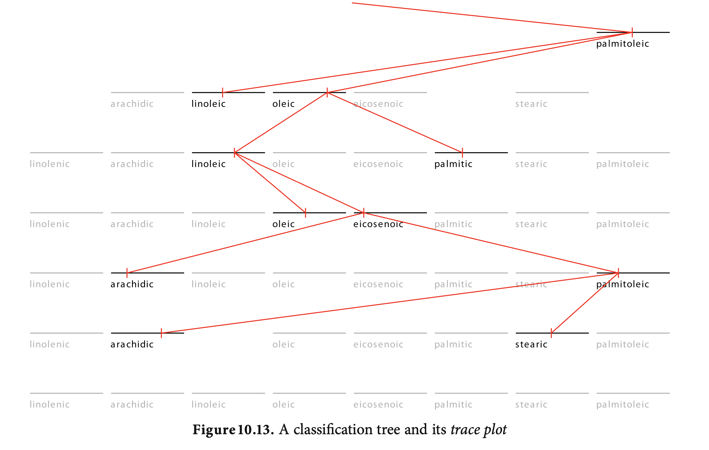

```{css, echo = FALSE}
.tiny{font-size: 30%}
.small{font-size: 50%}
.medium{font-size: 75%}
.left-code {
  color: #777;
  width: 39%;
  height: 92%;
  float: left;
}
.right-plot {
  width: 59%;
  float: right;
  padding-left: 2%;
}
```

```{r setup, include = FALSE}
# Knitr options
options(htmltools.dir.version = FALSE)
knitr::opts_chunk$set(
  echo = FALSE, 
  fig.align = "center", 
  dpi = 300
)

# Load packages
library(dplyr)
library(GGally)
library(ggpcp)
library(ggplot2)
library(knitr)
library(xaringanthemer)
```

```{r xaringan-themer, include = FALSE, warning = FALSE}
style_duo_accent(
  primary_color = "#557174",
  secondary_color = "#9dad7f",
  header_font_google = google_font("Josefin Sans"),
  title_slide_background_color = "#557174",
  text_font_google = google_font("Montserrat", "300", "300i"),
  code_font_google = google_font("Fira Mono"),
  header_h1_font_size = "2rem",
  header_h2_font_size = "1.75rem",
  header_h3_font_size = "1.25rem",
  title_slide_text_color = "#f7f7e8",
  inverse_header_color = "#f7f7e8",
  link_color = "#9dad7f",
  code_highlight_color = "#c7cfb7",
  colors = c(
    cream = "#f7f7e8",
    light_green = "#c7cfb7",
    medium_green = "#9dad7f",
    dark_green = "#557174",
    orange = "#D67236",
    tan = "#F1BB7B",
    purple = "#916a89"
  )
)
```

# Overview

- Background

  - Random forests 
  
  - Trace plots

<br>

- TreeTracer: Trace Plots in R

<br>

- Extending Trace Plots

<br>

- Patterns in the Forest

<br>

- Limitations and Next Steps

---

class: inverse, center, middle

# Background

---

## Random Forests

```{r}

```

---

## Common Tree Visualization

From [Urbanek (2008)](https://link.springer.com/chapter/10.1007/978-3-540-33037-0_11):

```{r out.width = "100%"}
knitr::include_graphics("figures/tree.png")
```

---

## Trace Plots (one tree)

From [Urbanek (2008)](https://link.springer.com/chapter/10.1007/978-3-540-33037-0_11):

```{r out.width = "100%"}

```

---

## Trace Plots (forest of trees)

From [Urbanek (2008)](https://link.springer.com/chapter/10.1007/978-3-540-33037-0_11):

```{r out.width = "85%"}
knitr::include_graphics("figures/trace-plot.png")
```

---

## Example: Predicting Penguin Species

```{r echo = TRUE}
# Load the Palmer penguins data and prepare training data
penguins <- na.omit(palmerpenguins::penguins)
penguins_train <- 
  penguins %>% 
  select(bill_depth_mm, bill_length_mm, flipper_length_mm, body_mass_g)
```

```{r fig.width = 12, fig.height = 6}
penguins %>%
  ggplot(aes(color = species)) +
  ggpcp::geom_pcp(aes(
    vars = vars(
      bill_length_mm,
      bill_depth_mm,
      flipper_length_mm,
      body_mass_g
    )
  ), alpha = 0.5) +
  scale_color_manual(values = c("#557174", "#9dad7f", "#916a89")) +
  theme_xaringan(text_font_size = 14) +
  theme(legend.position = "bottom")
```

---

```{r fig.width = 9, fig.height = 8, out.width = "90%"}
ggpairs(
  penguins,
  columns = 3:6,
  aes(colour = species, fill = species),
  progress = FALSE,
  diag = list(continuous = wrap("densityDiag", alpha=0.5 ))
) +
  scale_color_manual(values = c("#557174", "#9dad7f", "#916a89")) +
  scale_fill_manual(values = c("#557174", "#9dad7f", "#916a89")) +
  theme_xaringan(text_font_size = 14) +
  theme(legend.position = "bottom")
```

---

```{r echo = TRUE}
# Fit a random forest
set.seed(71)
penguins_rf <-
  randomForest::randomForest(
    species ~ 
      bill_length_mm + 
      bill_depth_mm + 
      flipper_length_mm + 
      body_mass_g,
    data = penguins, 
    ntree = 50
  )
```

```{r echo = TRUE}
# Print the confusion matrix
penguins_rf$confusion
```

---

<br>

```{r fig.height = 6, fig.width = 10}
vi <- 
  data.frame(penguins_rf$importance) %>%
  arrange(desc(MeanDecreaseGini)) %>%
  tibble::rownames_to_column(var = "feature")

vi %>%
  mutate(feature = factor(feature, levels = rev(vi$feature))) %>%
  ggplot(aes(x = feature, y = MeanDecreaseGini)) + 
  geom_col() + 
  coord_flip() + 
  labs(
    x = "Feature", 
    y = "Random Forest Variable Importance",
    title = "Variable Importance from Random Forest for Predicting Penguin Species"
  ) + 
  theme_xaringan(text_font_size = 14)
```

---

```{r fig.height = 11, fig.width = 9, out.width = "65%"}
# Load package
library(TreeTracer)

# Create a trace plot of all trees in the forest
penguin_trace <-
  trace_plot(
    rf = penguins_rf,
    train = penguins_train,
    tree_ids = 1:penguins_rf$ntree,
    alpha = 0.4
  ) + 
  theme_xaringan(text_font_size = 14) +
  labs(title = 
         paste(
           "Trace Plot of All", 
           penguins_rf$ntree, 
           "Trees in the Penguin Random Forest"
           )
        )
penguin_trace
```

---

class: inverse, center, middle

# TreeTracer: Trace Plots in R

---

## TreeTracer R Package

<br>

Functions for:

- Creating trace plots from random forests (with some extensions)

- Extract tree data in a data frame for trace plots

- Compute distances between trees

<br>

GitHub repo: [https://github.com/goodekat/TreeTracer](https://github.com/goodekat/TreeTracer)

<br>

```{r eval = FALSE, echo = TRUE}
# To install the package from GitHub
# Use with caution -- very much still in development
remotes::install_github("goodekat/TreeTracer")
```

---

## Individual Tree Data Frame

### randomForest

```{r echo = TRUE}
rf_tree1 <- randomForest::getTree(rfobj = penguins_rf, k = 1) 
```

```{r}
rf_tree1 %>% head() %>% kable()
```


---

## Individual Tree Data Frame

### TreeTracer

```{r echo = TRUE}
tt_tree1 = TreeTracer::get_tree_data(rf = penguins_rf, k = 1) #<<
```

```{r}
tt_tree1 %>% head() %>% kable()
```


---

## Trace Plot Data Frame

```{r echo = TRUE}
tree1_trace <-
  TreeTracer::get_trace_data( #<<
    tree_data = tt_tree1,
    rf = penguins_rf,
    train = penguins_train
  )
```

```{r}
tree1_trace %>% 
  as.data.frame() %>%
  head() %>%
  DT::datatable(options = list(
      scrollX = 600,
      pageLength = 6,
      dom = "ti",
      ordering = FALSE
    ), height = 350)
```

---

## Trace Plot Function (one tree)

.left-code[
```{r echo = TRUE}
penguin_trace_tree1 <-
  TreeTracer::trace_plot( #<<
    rf = penguins_rf,
    train = penguins_train,
    tree_ids = 1,
    alpha = 1
  )
```
]

.right-plot[
```{r fig.height = 10, fig.width = 8, out.width = "90%"}
penguin_trace_tree1 +
  theme_xaringan(text_font_size = 14, title_font_size = 14) +
  labs(title = "Trace Plot of Tree 1 in the Penguin Random Forest")
```
]

---

## Trace Plot Function (multiple trees)

.left-code[
```{r echo = TRUE}
ntrees = penguins_rf$ntree

penguin_trace <-
  TreeTracer::trace_plot( #<<
    rf = penguins_rf,
    train = penguins_train,
    tree_ids = 1:ntrees,
    alpha = 0.4
  )
```
]

.right-plot[
```{r fig.height = 10, fig.width = 8, out.width = "90%"}
penguin_trace +
  theme_xaringan(text_font_size = 14, title_font_size = 14) +
  labs(title = 
         paste(
           "Trace Plot of All", 
           penguins_rf$ntree, 
           "Trees in the Penguin Random Forest"
           )
        )
```
]

---

class: inverse, center, middle

# Extending Trace Plots

---

## Coloring Trees

.left-code[
```{r echo = TRUE}
penguin_trace_col <-
  TreeTracer::trace_plot( 
    rf = penguins_rf,
    train = penguins_train,
    tree_ids = 1:ntrees,
    alpha = 0.4,
    tree_color = "#9dad7f" #<<
  )
```
]

.right-plot[
```{r fig.height = 10, fig.width = 8, out.width = "90%"}
penguin_trace_col +
  theme_xaringan(text_font_size = 14, title_font_size = 14) +
  labs(title = "Coloring All Tree Traces in the Penguin Random Forest")
```
]

---

## Display a Representative Tree 

.left-code[
```{r echo = TRUE}
penguin_trace_rep <-
  TreeTracer::trace_plot( 
    rf = penguins_rf,
    train = penguins_train,
    tree_ids = 1:ntrees,
    alpha = 0.4,
    tree_color = "#9dad7f",
    rep_tree = #<<
      get_tree_data( #<<
        rf = penguins_rf, #<<
        k = 12 #<<
      ), #<<
    rep_tree_size = 1.5, #<<
    rep_tree_alpha = 0.9, #<<
    rep_tree_color = "#557174" #<<
  ) + 
  labs(
    title = "Highlighting Tree 12"
  )
```
]

.right-plot[
```{r fig.height = 10, fig.width = 8, out.width = "90%"}
penguin_trace_rep +
  theme_xaringan(text_font_size = 14, title_font_size = 14)
```
]

---

## Color by ID

.left-code[
```{r echo = TRUE}
penguin_trace_by_id <-
  TreeTracer::trace_plot( 
    rf = penguins_rf,
    train = penguins_train,
    tree_ids = 1:6,
    alpha = 0.9, 
    color_by_id = TRUE #<<
  ) + 
  scale_color_manual(
    values = c(
      "#c7cfb7",
      "#9dad7f",
      "#557174",
      "#D67236",
      "#F1BB7B",
      "#916a89"
  ))
```
]

.right-plot[
```{r fig.height = 10, fig.width = 8, out.width = "90%"}
penguin_trace_by_id +
  theme_xaringan(text_font_size = 14, title_font_size = 14) +
  labs(title = "First Six Trees from Penguin Random Forest Colored by ID")
```
]

---

## Facet by ID

.left-code[
```{r echo = TRUE}
penguin_trace_facet <-
  TreeTracer::trace_plot( 
    rf = penguins_rf,
    train = penguins_train,
    tree_ids = 1:6,
    alpha = 0.9, 
    color_by_id = TRUE, 
    facet_by_id = TRUE #<<
  ) + 
  scale_color_manual(
    values = c(
      "#c7cfb7",
      "#9dad7f",
      "#557174",
      "#D67236",
      "#F1BB7B",
      "#916a89"
  ))
```
]

.right-plot[
```{r fig.height = 10, fig.width = 11, out.width = "100%"}
penguin_trace_facet +
  theme(axis.text.x = element_text(angle = 45, vjust = 1, hjust = 1)) +
  theme_xaringan(text_font_size = 14, title_font_size = 16) +
  labs(title = "First Six Trees from Penguin Random Forest Facetted by ID")
```
]

---

## Maximum Depth

.left-code[
```{r echo = TRUE}
penguin_trace_max <-
  TreeTracer::trace_plot( 
    rf = penguins_rf,
    train = penguins_train,
    tree_ids = 1:ntrees,
    alpha = 0.4,
    max_depth = 3 #<<
  )
```
]

.right-plot[
```{r fig.height = 6, fig.width = 7, out.width = "100%"}
penguin_trace_max +
  theme_xaringan(text_font_size = 14, title_font_size = 14) +
  labs(title = 
         paste(
           "First Three Levels of All", 
           penguins_rf$ntree, 
           "Trees in the Penguin Random Forest"
           )
        )
```
]

---

class: inverse, center, middle

# Patterns in the Forest

---

## Two Approaches to Finding Patterns

### (1) Clusters of Trees

- Are there clusters of trees within a forest? 

- Would tell us if similar or different decision paths are used by the forest

### (2) Representative Tree

- Can we extract a tree that represents the forest?

- Can we extract a tree representative of each cluster?

<br>

### Examples of Previous Work

  - [Sies and Van Mechelen (2020)](https://link.springer.com/article/10.1007/s00357-019-09350-4)
  - [Weinberg and Last (2019)](https://journalofbigdata.springeropen.com/articles/10.1186/s40537-019-0186-3)
  - [Weinberg and Last (2017)](https://sciendo.com/article/10.1515/amcs-2017-0051)
  - [Banerjee, Ding, and Noone (2011)](https://onlinelibrary.wiley.com/doi/abs/10.1002/sim.4492)
  - [Miglio and Soffritti (2004)](https://www.sciencedirect.com/science/article/abs/pii/S016794730300063X?via%3Dihub)
  - [Shannon and Banks (1999)](https://onlinelibrary.wiley.com/doi/epdf/10.1002/%28SICI%291097-0258%2819990330%2918%3A6%3C727%3A%3AAID-SIM61%3E3.0.CO%3B2-2)
  - [Chipman, George, and McCulloch (1998)](http://citeseerx.ist.psu.edu/viewdoc/summary?doi=10.1.1.42.2598)

---

## Visualizing Clusters and Representative Trees

For both approaches, trace plots would be a great visualization tool!

```{r out.width = "120%", fig.cap = "(Left) From Chipman (1998). (Right) Early version of a trace plot I made to depict the four Chipman Trees."}
knitr::include_graphics("figures/chipman.png")
```

---

## My Current Process for Clustering Trees

1. Start with a distance metric to compare similarities between trees

  - Several implemented in TreeTracer

2. Obtain a distance matrix  

3. Apply a clustering method:
  
  - Hierarchical clustering

  - K-nearest neighbors

  - Multi-dimensional scaling

4. Visualize clusters using trace plots

---

## Step 1: Compute Distances

---

## Step 2: Obtain Distance Matrix

---

## Step 3: Apply Clustering Method

---

## Step 4: Visualize clusters

---

## More Examples

---

class: inverse, center, middle

# Limitations and Next Steps

---

## Limitations

### Cognitive load

- Too much information to extract understanding?

<br>

### Overplotting issues

- Too many trees hide the trends

<br>

### True trends? 

- Are we actually able to identify realistic similarities and differences between trees?

---

## Future Work

.pull-left[
### New Metrics

- Metric that compares two traces for similarities

- Compare the regions that are used to make a prediction

<br>

### Linking to other plots

- Sectioned scatterplots

- Visualizations of interactions created by splits

- Parallel coordinate plots with split points overlaid
]

.pull-right[
### Computing Representative Trees

- Implement developed methods

- Consider new methods

<br>

### Other

- How to choose a maximum depth? (perhaps based on predictive accuracy)

- How to account for categorical variables?

]