<script>
var slideshow = remark.create({slideNumberFormat : function (current, total) {
  return current + '/' + (this.getSlideByName("mylastslide").getSlideIndex() + 1); },
  highlightStyle: "github",
  highlightLines: true,
  countIncrementalSlides: false});
</script>

```{css, echo = FALSE}
.tiny{font-size: 30%}
.small{font-size: 60%}
.medium{font-size: 75%}
.left-code {
  color: #777;
  width: 37%;
  height: 92%;
  float: left;
}
.right-plot {
  width: 60%;
  float: right;
  padding-left: 1%;
}
```

```{r setup, include = FALSE}
options(htmltools.dir.version = FALSE)
knitr::opts_chunk$set(echo = FALSE)
library(knitr)
```

```{r xaringan-themer, include = FALSE, warning = FALSE}
library(xaringanthemer)
style_mono_accent(
  base_color = "#273E52", 
  title_slide_text_color = "#43d1b5",
  header_font_google = google_font("Josefin Sans"),
  text_font_google = google_font("Montserrat", "300", "300i"),
  code_font_google = google_font("Fira Mono"),
  text_slide_number_color = "black",
  header_h1_font_size = "2rem",
  header_h2_font_size = "1.75rem",
  header_h3_font_size = "1.25rem",
  colors = c(teal = "#43d1b5", white = "#ffffff"), 
  link_color = "#43d1b5", 
  code_highlight_color = "#43d1b5"
)
```

# Overview

.pull-left[
<br>

- Background on R Shiny
  
<br>

- Project Background

<br>

- WhoseEgg App

]

.pull-right[
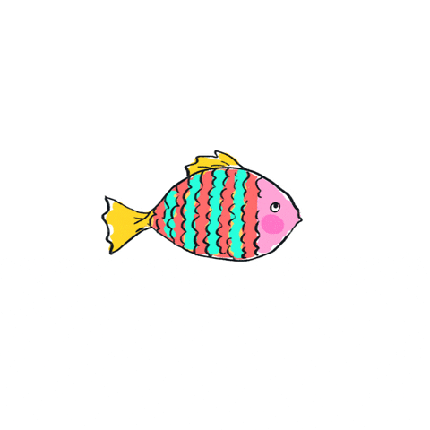
]      

---

class: inverse, middle, center

# Background on R Shiny

---

# What is Shiny?

Lets you create apps using R!

From the [Shiny website](https://shiny.rstudio.com/): 

> Shiny is an R package that **makes it easy to build interactive web apps straight from R**. You can host standalone apps on a webpage or embed them in R Markdown documents or build dashboards. You can also extend your Shiny apps with CSS themes, htmlwidgets, and JavaScript actions.

```{r out.width = "40%", fig.align = "center"}

```

---

<body>
<style type="text/css">
body, html
{
margin: 0; padding: 0; height: 100%; overflow: hidden;
}
#content
{
position:absolute; left: 0; right: 0; bottom: 0; top: 0px; 
}
</style>
<div id="content">
<iframe width="100%" height="100%" frameborder="0" src="https://shiny.rstudio.com/"/>
</div>
</body>

---

<iframe src="https://shiny.rstudio.com/" frameborder="0" width="1100" height="510" ></iframe>

---

class: inverse, middle, center

# Project Background

---

# Invasive Carp

.pull-left[

- Brought to US in 1960s

- Escaped into wild

- Threat to native fish populations in Mississippi River basin

- Interest in monitoring populations to prevent further spread

]

.pull-right[
<center> 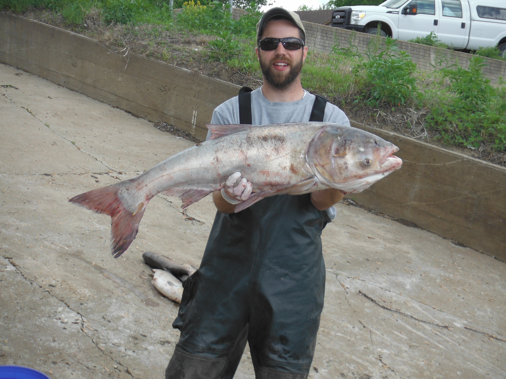 <center/>
]

---

# Egg Collection

<br>

- One method for monitoring carp is to collect eggs

- Common practice is to have eggs identified using genetic analysis

- Expensive

- Led Camacho et al (2019) to try using machine learning to classify fish eggs

<br>

.center[
```{r out.width = "30%"}
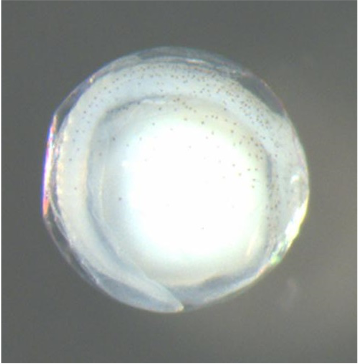
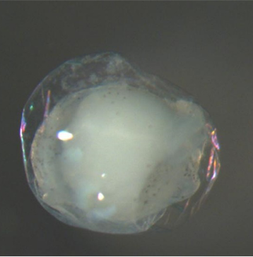
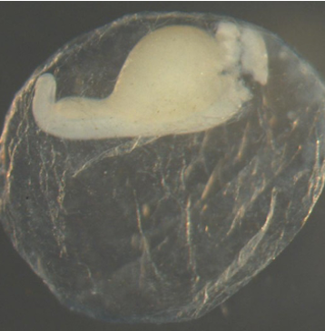
```
]

---

# Machine Learning Appraoch

.pull-left[
**[Camacho et al. (2019)](https://afspubs.onlinelibrary.wiley.com/doi/abs/10.1002/nafm.10380)**

- Trained random forests 

- Predictor variables: 
  - egg characteristics

- Responses: 
  - family, genus, and species

- Models showed promise for identifying invasive carp 

]

.pull-right[

**[Goode et al. (2021)](https://afspubs.onlinelibrary.wiley.com/doi/10.1002/nafm.10616)**

- Validated models using a new year of data

- Trained new models with all years of data

<br>


]

---

# Sampling Site and Years

Three years of collection

```{r out.width = "70%", fig.align = "center"}
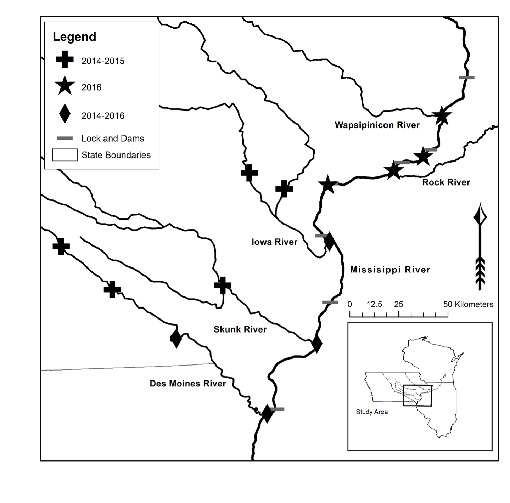
```

---

# Egg Collection

Collected eggs were taken to the lab for measurements and genetic identification

```{r out.width = "45%", fig.align = "center"}
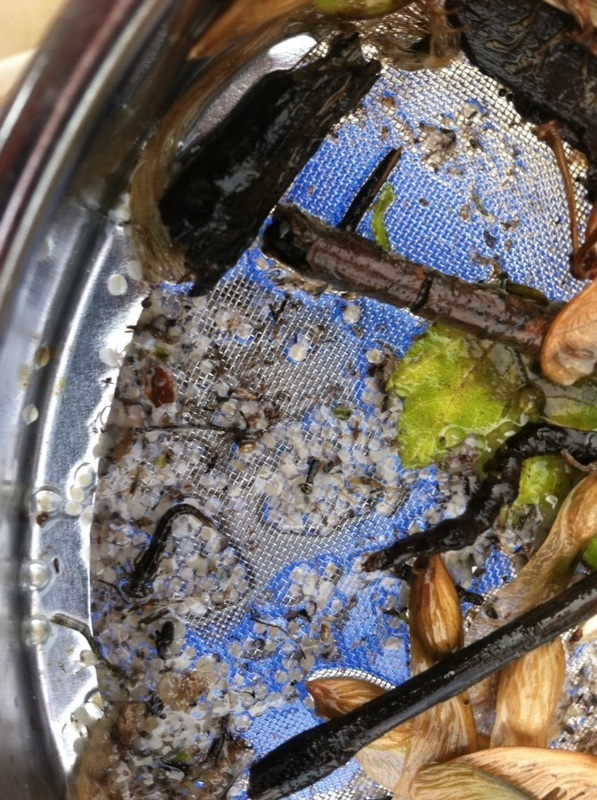
```

---

# Predictor Variables

.left-code[
**Egg characteristics: ** 

- Month
- Julian day  
- Water temperature	 
- Water conductivity  	
- Deflated?	 
- Pigment?  
- Compact or diffuse?  	
- Sticky debris?  
- Egg stage  
- Membrane average  
- Membrane standard deviation  
- Membrane coefficient of variation  
- Yolk average
- Yolk standard deviation  
- Yolk coefficient of variation
- Yolk to membrane ratio
- Larval length  
]

.right-plot[

```{r out.width = "100%", fig.align = "center"}
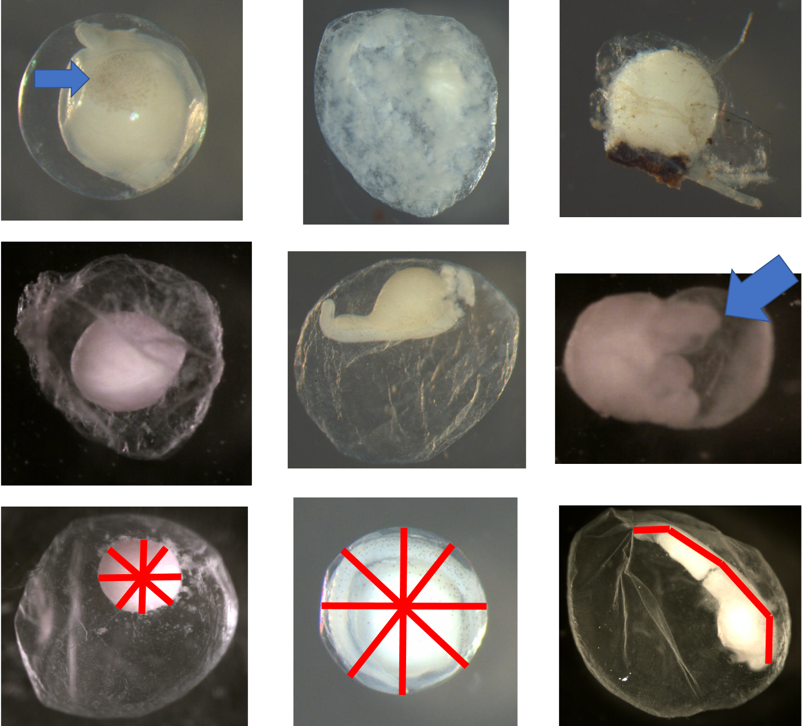
```
]

---

# Response Variables

.pull-left[

**Taxonomy**: 

- Genus (17 levels)

- Species (29 levels)

<br> 

**Taxonomy with invasive carp categorized as on class**: 

- Family (8 levels)

- Genus (16 levels)

- Species (27 levels)

]

.pull-right[
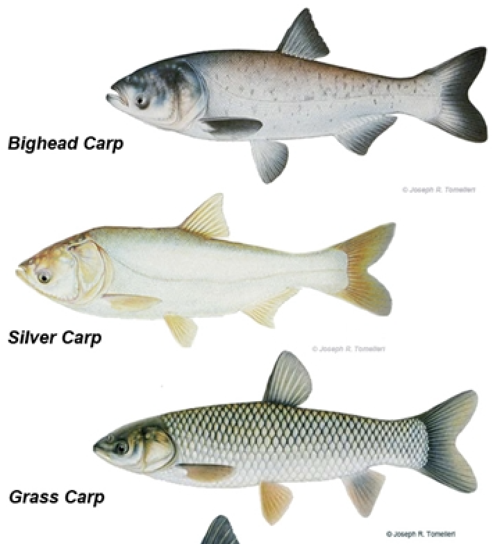

<br> 
<small> Image source: https://www.watershedcouncil.org/asian-carp.html </small>
]

---

# Metrics on Training Data

Models trained with 2014-2015 and 2014-2016 data

```{r out.width = "95%", fig.align = "center"}
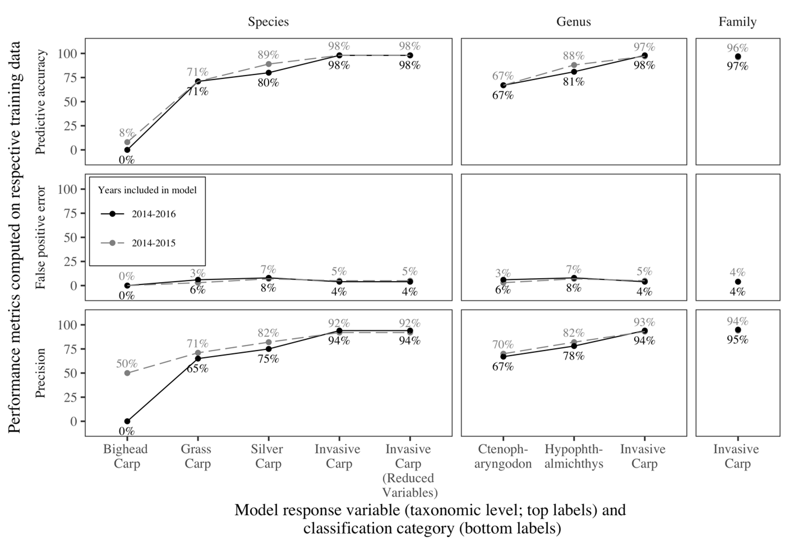
```

---

# Validation of Original Models

Metrics computed using 2014-2015 model on 2016 data

```{r}
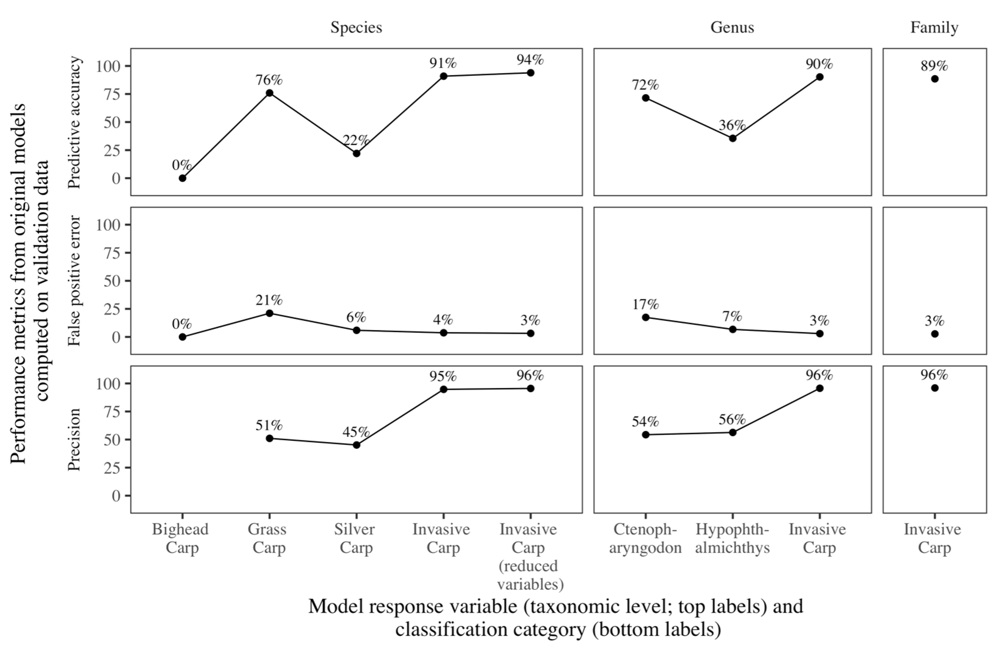
```

---

class: inverse, middle, center

# WhoseEgg App

---

# WhoseEgg

**Goal**

- Provide a tool for easily predicting the identification of fish eggs using the random forests

- Used to help identify areas where invasive carp are reproducing

<br>

**Models used**

- Random forests:

  - trained all three years of data
  
  - responses of family, genus, and species with invasive carp grouped

---

# App Demonstration

App available at: https://whoseegg.stat.iastate.edu/

```{r out.width = "95%", fig.align = "center"}
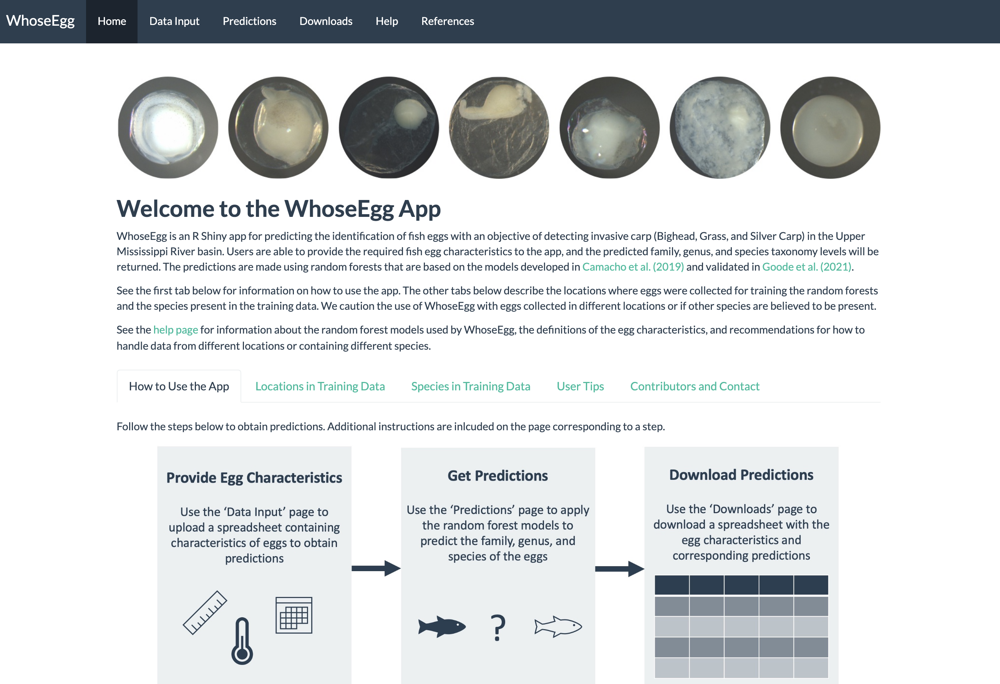
```

---

name: mylastslide

# Possible Updates

- Add visualizations of input data compared to training data

- Include prediction intervals

- Add visualizations relating to explainability for individual predictions

- Add video showing how to use the app

- Add image during loading of swimming fish

---

class: inverse, center

<br>
<br>

# Thank you!

```{r out.width = "85%"}
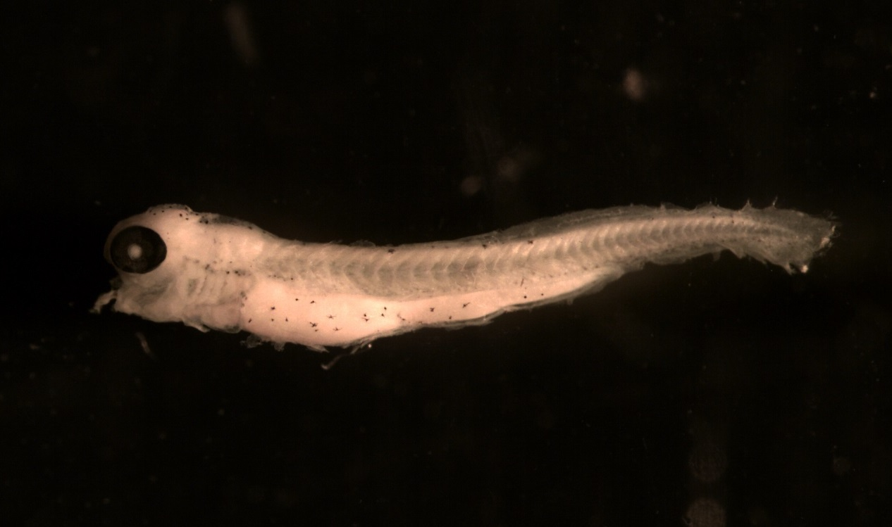
```

---

class: inverse, center, middle

# Additional Figures

---

# Metrics on New/Old Sites

```{r out.width = "80%", fig.align = "center"}
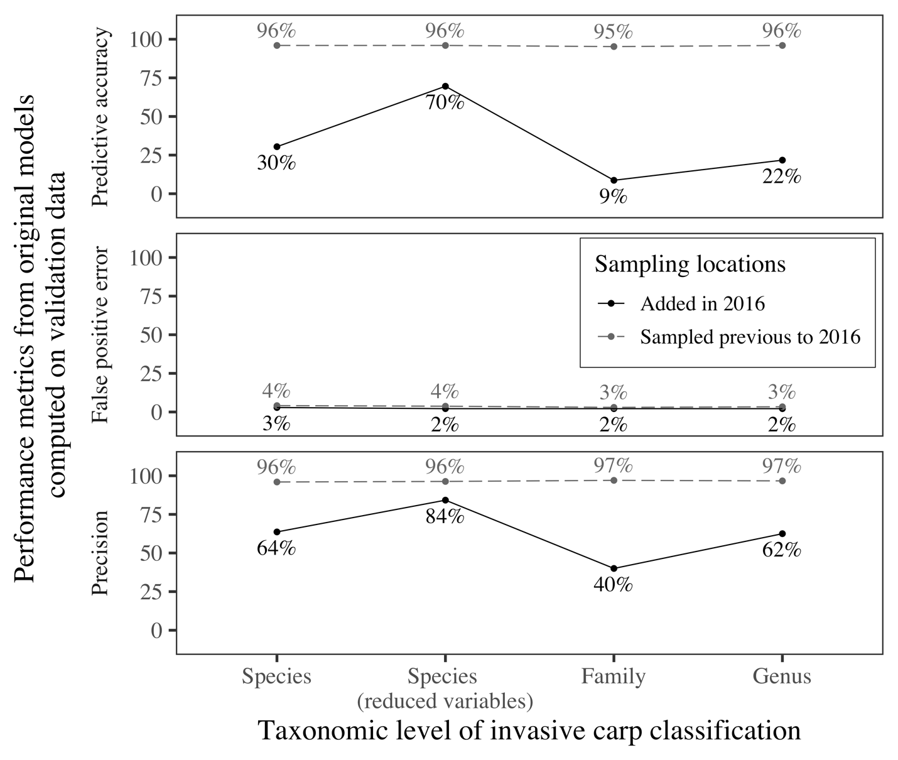
```

---

# Feature Importance

```{r out.width = "100%", fig.align = "center"}
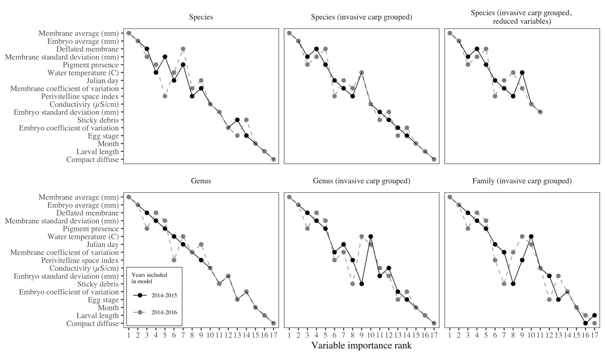
```

---

# Partial Dependence Plots

```{r out.width = "100%", fig.align = "center"}
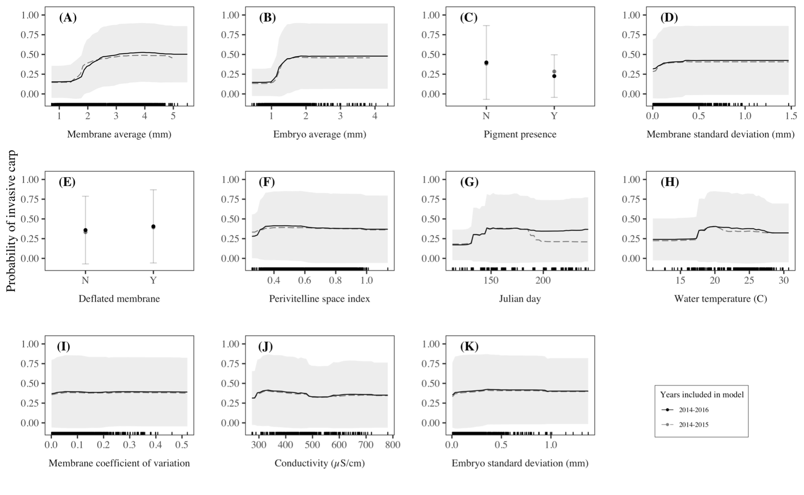
```

---

# Correlation Between Features

```{r out.width = "80%", fig.align = "center"}
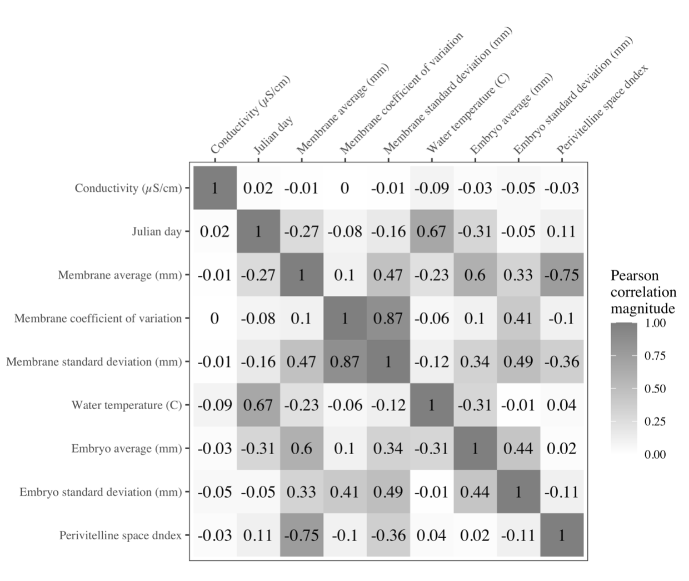
```

