<script>
var slideshow = remark.create({slideNumberFormat : function (current, total) {
  return current + '/' + (this.getSlideByName("mylastslide").getSlideIndex() + 1); },
  highlightStyle: "github",
  highlightLines: true,
  countIncrementalSlides: false});
</script>

```{css, echo = FALSE}
.tiny{font-size: 30%}
.small{font-size: 50%}
.smallmedium{font-size: 65%}
.medium{font-size: 75%}
.left-code {
  color: #777;
  width: 39%;
  height: 92%;
  float: left;
}
.right-plot {
  width: 59%;
  float: right;
  padding-left: 2%;
}
.scroll-output {
  height: 90%;
  overflow-y: scroll;
}
.content-box {
  box-sizing: border-box;
  border-radius: 15px;
  margin: 0 0 15px;
  overflow: hidden;
  padding: 0px 20px 0px 20px;
  width: 100%;
  background-color: #c7cfb7;
}

.pull-left-v2 {
  width: 60%;
  height: 92%;
  float: left;
}
.pull-right-v2 {
  width: 35%;
  float: right;
  padding-left: 1%;
}

.pull-left-v3 {
  width: 75%;
  height: 92%;
  float: left;
}
.pull-right-v3 {
  width: 24%;
  float: right;
  padding-left: 1%;
}

.pull-left-v4 {
  width: 39%;
  height: 92%;
  float: left;
}
.pull-right-v4 {
  width: 60%;
  float: right;
  padding-left: 1%;
}
```

```{r setup, include = FALSE, echo = FALSE, message = FALSE, warning = FALSE}
# Knitr options
options(htmltools.dir.version = FALSE)
knitr::opts_chunk$set(
  echo = FALSE, 
  fig.align = "center", 
  dpi = 300
)

# Load packages
library(cowplot)
library(dplyr)
library(GGally)
library(ggpcp)
library(ggplot2)
library(knitr)
library(palmerpenguins)
library(randomForest)
library(RefManageR)
library(tidyr)
library(TreeTracer)
library(xaringanthemer)

# Bib options
BibOptions(check.entries = FALSE,
           bib.style = "authoryear",
           cite.style = "authoryear",
           style = "markdown",
           hyperlink = FALSE,
           dashed = FALSE)
bib <- ReadBib("references.bib", check = FALSE)

# Create file paths
fp_figures = "figures/"

# Specify color palettes
penguin_colors = c(
   "#dcd6d6",
   "#246a99",
   "#24202b",
   "#619ad1",
   "#939293",
   "#717e88",
   "#282f49",
   "#474752",
   "#d53316",
   "#98bdd6",
   "#e17856"
)
```

```{r xaringan-themer, include = FALSE, warning = FALSE}
style_duo_accent(
  # Colors
  primary_color = "#246a99",
  secondary_color = "#dcd6d6",
  title_slide_background_color = "#474752",
  title_slide_text_color = "#dcd6d6",
  inverse_header_color = "#246a99",
  inverse_background_color = "#dcd6d6",
  link_color = "#e17856", 
  text_bold_color = "#619ad1",
  # Fonts
  header_font_google = google_font("Josefin Sans"),
  text_font_google = google_font("Montserrat", "300", "300i"),
  code_font_google = google_font("Fira Mono"),
  header_h1_font_size = "2rem",
  header_h2_font_size = "1.75rem",
  header_h3_font_size = "1.25rem",
  colors = c(
    light_grey = "#dcd6d6",
    blue = "#246a99",
    black = "#24202b",
    light_blue = "#619ad1",
    grey = "#939293",
    medium_grey = "#717e88",
    navy = "#282f49",
    dark_grey = "#474752",
    red = "#d53316",
    ice_blue = "#98bdd6",
    salmon = "#e17856"
  )
)
colors = c("#f7f7e8", "#c7cfb7", "#9dad7f", "#557174", "#D67236", "#F1BB7B", "#916a89", "#E4D4C8")
```

```{r penguins-data}
# Prepare the penguin training data
penguins_train <-
   penguins %>%
   select(
      bill_length_mm,
      bill_depth_mm,
      flipper_length_mm,
      body_mass_g,
      species
   ) %>%
   na.omit() %>%
   rename(
      "bill_length" = "bill_length_mm",
      "bill_depth" = "bill_depth_mm",
      "flipper_length" = "flipper_length_mm",
      "body_mass" = "body_mass_g"
   )
```

```{r peguins-model}
# Fit a random forest
set.seed(71)
penguins_rf <-
  randomForest(
    species ~ .,
    data = penguins_train,
    ntree = 50
  )

# Compute model predictions on the training data
penguins_pred <- predict(penguins_rf, penguins_train, predict.all = TRUE)

# Print a message if the random forest predicts an observation wrong
if (sum(penguins_train$species != penguins_pred$aggregate) != 0) {
   print("NOTE: Random forest predicted some penguin training
         data observations wrong!")
}
```

## Introduction to Katherine

.pull-left-v3[

Research and development statistician in 5573

**Education**

- BA in mathematics from [Lawrence University](https://www.lawrence.edu/academics/college/mathematics)
- MS in statistics from [University of Wisconsin - Madison](https://stat.wisc.edu/)
- PhD in statistics from [Iowa State University](https://www.stat.iastate.edu/)

**Sandia Journey**

- Dec 2019: Intern (mentored by Daniel Ries, 5574)
- Sep 2021: Post-doc (mentored by J. Derek Tucker, 5573)
- Dec 2021: FTE (mentored by J. Derek Tucker, 5573)

**Research Interests**

- Explainable machine learning
- Data visualization
- Model assessment

Personal website: [goodekat.github.io](https://goodekat.github.io)  
Personal github: [github.com/goodekat](https://github.com/goodekat)

]

.pull-right-v3[
```{r out.width = "90%"}

```

<br>

```{r out.width = "90%"}

```
]

---

## Overview

<br>

- **Background**: Trace Plots

<br>

- **Methods**: Extending Trace Plots

  - .medium_grey[TreeTracer]: Implementation and Structural Augmentations in R 

  - .medium_grey[Tree Summaries]: Identifying Representative Trees

<br>

- **Music Example**: Application with "larger" random forest

<br>

- **Conclusions**: Pros, Cons, and Possible Research Directions

<br>

.center[*Credits: Joint work with Heike Hofmann (Professor at Iowa State University)*]

---

class: inverse, center, middle

# .dark_grey[Background:] Trace Plots

---

## Common Tree Visualization

<br> 

```{r out.width = "100%"}
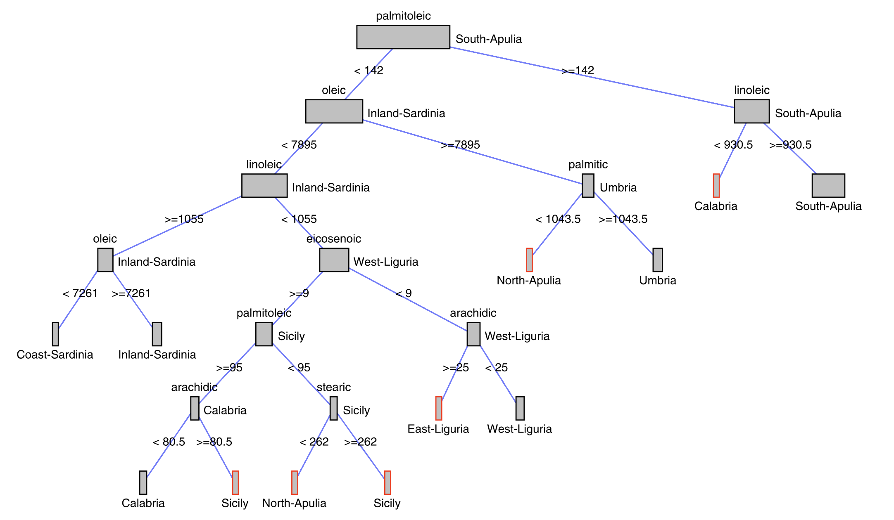
```

.right[.small[Image source: `r Citet(bib, "urbanek:2008")`]]

---

## Visual Comparisons of Multiple Trees

.pull-left[
**Issues with "traditional" visuals**: 

 - Difficult direct visual comparison
 
 - Non-efficient use of space
 
 - Identifying patterns is cognitively difficult (figure classification .small[`r Citet(bib, "french:1963")`])
   
<br>

```{r out.width = "100%"}
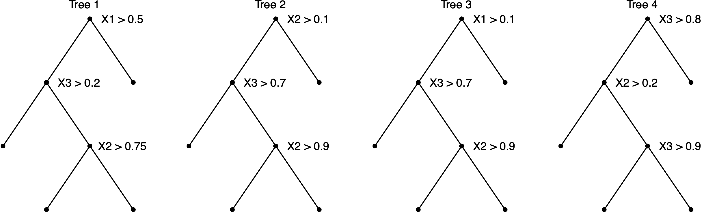
```

]

.pull-right[

```{r out.width = "90%"}
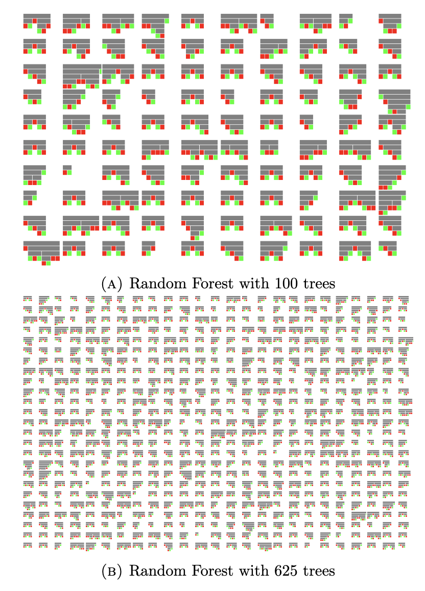
```

.right[.small[Image source: `r Citet(bib, "kuznetsova:2014")`]]

]

---

## Trace Plots (one tree) [.small[`r Citet(bib, "urbanek:2008")`]](https://link.springer.com/chapter/10.1007/978-3-540-33037-0_11)

```{r out.width = "100%"}
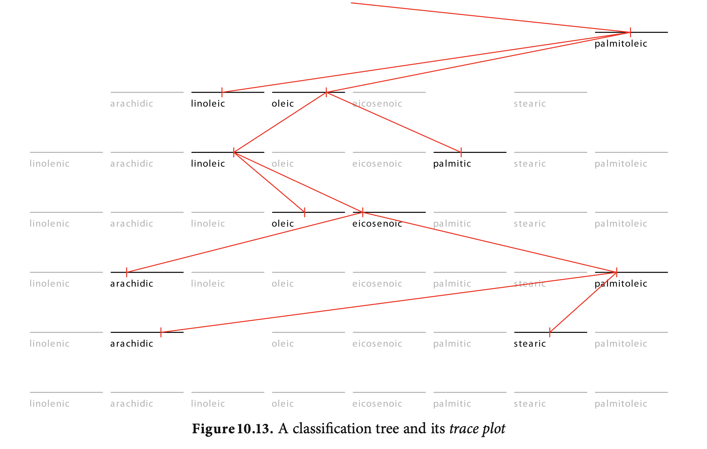
```

.right[.small[Image source: `r Citet(bib, "urbanek:2008")`]]

---

## Trace Plots (esemble of trees) [.small[`r Citet(bib, "urbanek:2008")`]](https://link.springer.com/chapter/10.1007/978-3-540-33037-0_11)

Designed to compare (1) variables used for splitting, (2) location of split points, and (3) hierarchical structure

```{r out.width = "75%"}
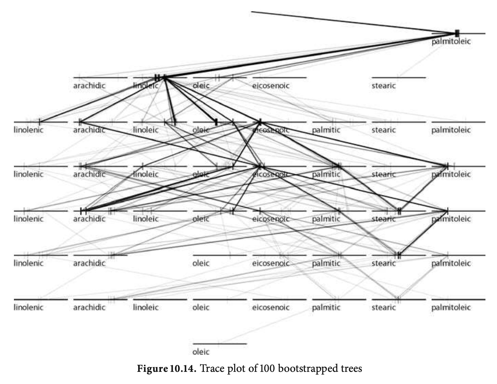
```

.right[.small[Image source: `r Citet(bib, "urbanek:2008")`]]

---

## Limitations of Trace Plots

Example: 
  
- **Objective**: Are two bullets fired from same gun?

- **Model**: Random forest (300 trees) .small[`r Citet(bib, "hare:2017")`]

- **Response variable**: Same gun?

- **Predictor variables**: 9 characteristics comparing two signatures such as cross correlation function (CCF)

.pull-left[  
```{r out.width = "70%"}

```
]

.pull-right[  
```{r out.width = "100%"}
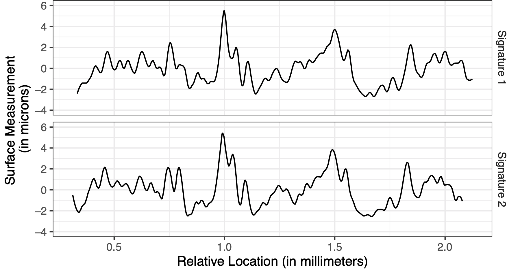
```
]

---

## Limitations of Trace Plots

.pull-left[
```{r out.width = "40%"}
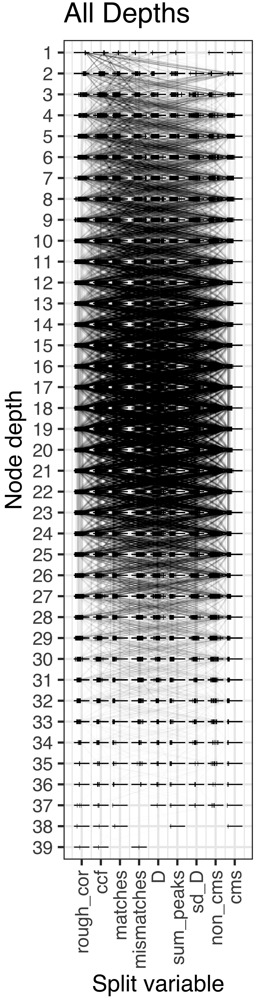
```
]

.pull-right[

**Info gained**

- Deep trees (max node depth of 39)

- Certain variables more commonly used for first split

- All variables commonly used between node depths of 3 and 30

<br> 

**Difficult to extract patterns when...**

- Many trees in a forest

- Deep trees

- Large number of predictors

]

---

class: inverse, center, middle

# .dark_grey[Methods:] Extending Trace Plots

---

## Overview

**Objective**: Extend trace plots to improve ability to find patterns in random forest architecture

| | Intentions |
| --- | :------ |
| **Who** <br> <br> | Data analysts <br> <br> |
| **What** <br> <br> | - Visualization of random forest architecture <br> - .red[One tool in toolbox for explaining random forests] <br> <br> |
| **When/Where** <br> <br> | - After model training <br> - Model assessment <br> - Model "explanation" <br> <br> |
| **Why** <br> <br> | - Help understand how variables are used <br> - Compare variability in split locations at different node depths <br> - Identify patterns to explore further <br> <br> |
| **How** <br> <br> | Using `TreeTracer` R package <br> <br> |

---

## Approaches

.pull-left[
.red[Structural Augmentations]

- Highlight patterns

- Lessen cognitive load

```{r out.width = "70%"}
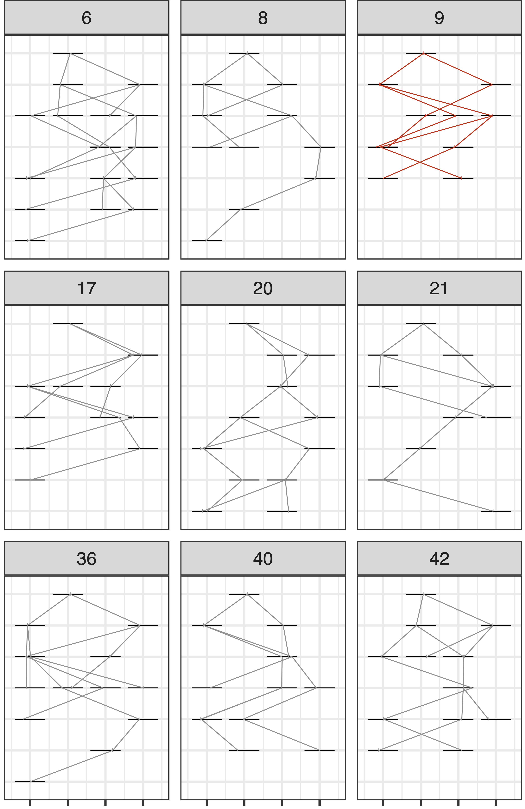
```

]

.pull-right[
.medium_grey[Tree Summaries]

- Identify summary trees

- Re-purpose trace plots for highlighting summary trees

```{r out.width = "55%"}
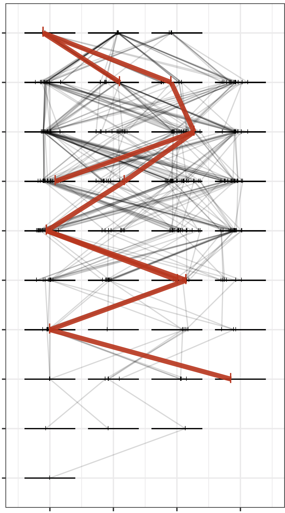
```

]

---

## Example: Palmer Penguins

- **Data**: 342 penguins from Palmer Archipelago in Antarctica

- **Three species**: Adelie, Chinstrap, and Gentoo

- **Four body measurements**: Bill length, bill depth, flipper length, body mass

- **Random Forest**: Predict species using 50 trees

.pull-left-v2[
```{r out.width = "80%", fig.width = 6.5, fig.height = 4}
# Create parallel coordinate plot of penguin data
penguins_train %>%
   rename(
      "Bill Length (mm)" = bill_length,
      "Bill Depth (mm)" = bill_depth,
      "Flipper Length (mm)" = flipper_length,
      "Body Mass (g)" = body_mass
   ) %>%
   ggplot(aes(color = species)) +
   geom_pcp(aes(
      vars = vars(
         `Bill Length (mm)`,
         `Bill Depth (mm)`,
         `Flipper Length (mm)`,
         `Body Mass (g)`
      )
   ), alpha = 0.5) +
   theme_bw(base_family = "Helvetica") +
   theme(legend.position = "bottom") +
   scale_color_manual(values = penguin_colors[c(10,7,11)]) +
   labs(x = "Predictor Variables", color = "Penguin Species")
```

.small[
```{r}
# Print the confusion matrix
data.frame(penguins_rf$confusion) %>%
  mutate(class.error = round(class.error, 2)) %>%
  rename("Class Error" = class.error) %>%
  kable()
```
]

]

.pull-right-v2[

<br>

```{r fig.height = 11, fig.width = 10, out.width = "100%"}
vi <-
  data.frame(penguins_rf$importance) %>%
  arrange(desc(MeanDecreaseGini)) %>%
  tibble::rownames_to_column(var = "feature")

vi %>%
  mutate(feature = factor(feature, levels = rev(vi$feature))) %>%
  ggplot(aes(x = feature, y = MeanDecreaseGini)) +
  geom_col() +
  coord_flip() +
  labs(
    x = "Feature",
    y = "Random Forest Variable Importance"
  ) + 
  theme_bw(base_size = 26)
```

]

---

## Implementation of trace plots (and extensions)

.pull-left[

**Overview**

- R package `TreeTracer`

- First readily available implementation in R

- GitHub repo: [https://github.com/goodekat/TreeTracer](https://github.com/goodekat/TreeTracer)

<br>

**Functions**

- Create trace plots from `randomForest` R package

- Structural augmentations

- Compute distances between trees

]

.pull-right[
```{r out.width = "90%"}
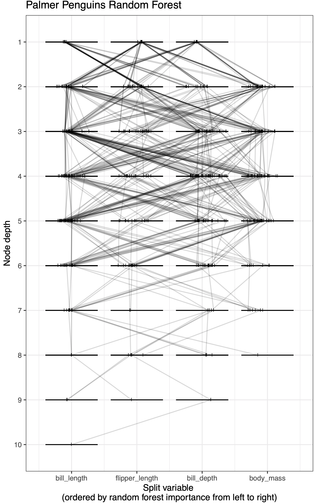
```
]

---

## Extensions: .red[Structural Augmentations]

**Ordering of split variables**: Provides different perspectives

```{r fig.height = 10, fig.width = 12, out.width = "75%"}
# Trace plot of penguin random forest
tp1 <- trace_plot(
  rf = penguins_rf,
  train = penguins_train %>% select(-species),
  tree_ids = 1:penguins_rf$ntree,
  alpha = 0.25
) +
  labs(title = "Variables arranged by variable importance",
       x = "Split variable") +
  theme_bw(base_family = "Helvetica", base_size = 16)

# Trace plot of penguin random forest
tp2 <- trace_plot(
  rf = penguins_rf,
  train = penguins_train %>% select(-species),
  tree_ids = 1:penguins_rf$ntree,
  alpha = 0.25,
  split_var_order = names(penguins_train)[c(2, 1, 4, 3)]
) +
  labs(title = "Variables arranged alphabetically",
       x = "Split variable") +
  theme_bw(base_family = "Helvetica", base_size = 16)

plot_grid(tp1, tp2)
```

---

## Extensions: .red[Structural Augmentations]

**Subsets of trees**: Lessen cognitive load

```{r out.width = "100%"}
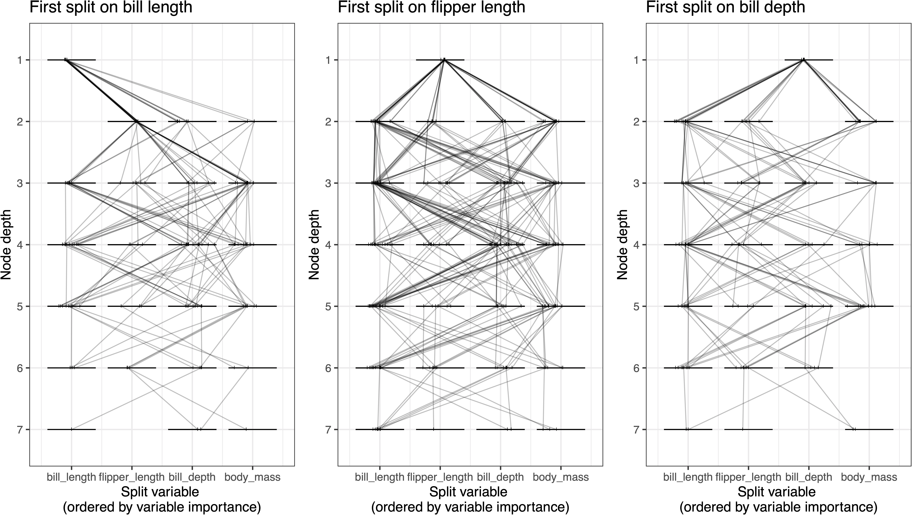
```

---

## Extensions: .red[Structural Augmentations]

**Facets**: Separate trees using facets

**Use of color and line size**: Highlight individual or groups of trees

```{r fig.width = 12, fig.height = 9, out.width = "80%"}
penguins_tree_data <-
   purrr::map_df(
      .x = 1:penguins_rf$ntree,
      .f = get_tree_data,
      rf = penguins_rf
   )

penguins_first_fl <-
   penguins_tree_data %>%
   filter(node_depth == 1, tree_branch == 1) %>%
   filter(split_var == "flipper_length") %>%
   pull(tree)

trace_plot(
   rf = penguins_rf,
   train = penguins_train %>% select(-species),
   tree_ids = penguins_first_fl,
   max_depth = 7,
   alpha =  1,
   facet_by_id = TRUE,
   color_by_id = TRUE,
   nrow = 3
) +
   theme_bw(base_family = "Helvetica") +
   theme(
      legend.position = "none",
      axis.text.x = element_text(angle = 45, vjust = 1, hjust=1)
   ) +
   scale_color_manual(values = c(
      rep(penguin_colors[5], 3),
      penguin_colors[9],
      rep(penguin_colors[5], 17)
   ))
```

---

## Extensions: .red[Structural Augmentations]

**Maximum node depth**: Focus on upper node depths where global structures may exist (e.g., considering the "canopy")

```{r out.width = "80%"}
include_graphics("figures/bullet-trace-plot-canopy.png")
```

---

## Extensions: .medium_grey[Tree Summaries] 

**Background (summarizing tree ensembles)**

.pull-left[

.red[Representative tree] .small[`r Citep(bib, c("shannon:1999", "banerjee:2012", "weinberg:2019"))`]

- Identify a tree that is representative of the forest

- One approach: Find tree that has smallest average distance to all other trees

```{r out.width = "90%"}
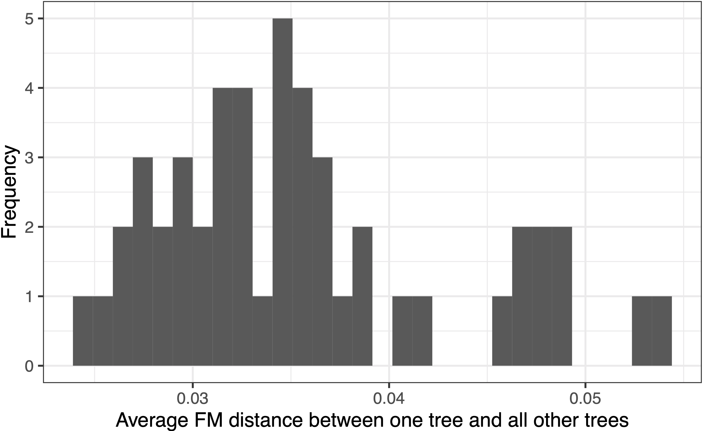
```

]

.pull-right[

.red[Clusters of trees] .small[`r Citep(bib, c("chipman:1998", "sies:2020"))`]

- Compute distances between trees

- Identify clusters via MDS, K-means, etc.
  
<br> 

```{r out.width = "100%"}
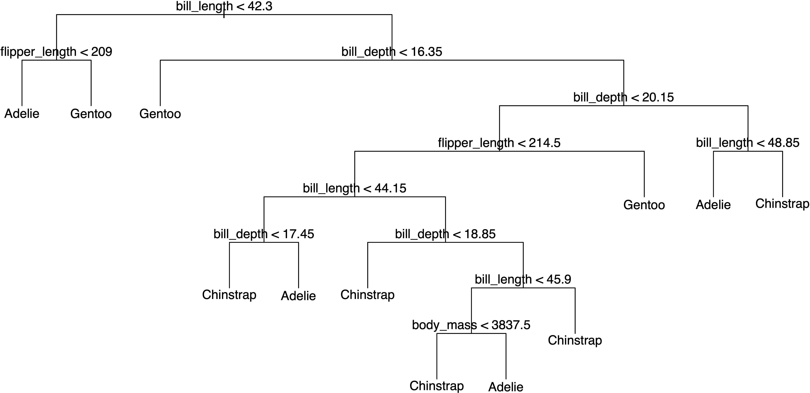
```

]

---

## Extensions: .medium_grey[Tree Summaries] 

**Benefits of trace plots:** Example of representative trees from clusters within a tree ensemble .small[`r Citep(bib, c("chipman:1998", "sies:2020"))`]

.pull-left[
```{r out.width = "100%"}
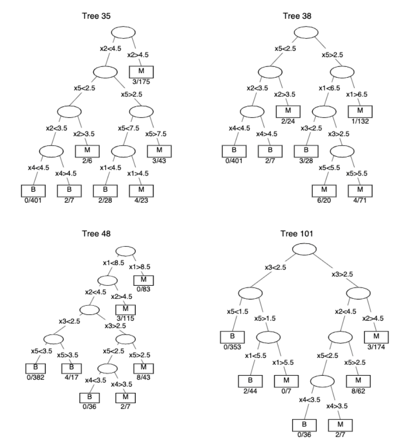
```
]

.pull-right[
```{r out.width = "100%"}
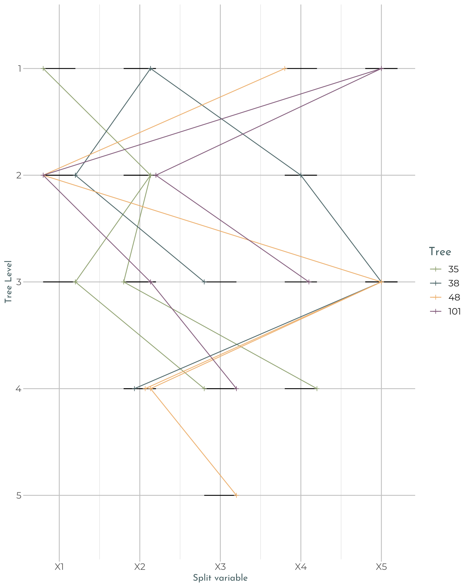
```
]

---

## Extensions: .medium_grey[Tree Summaries] 

**Benefits of trace plots:** Two scenarios of visualizing representative trees with variability

.pull-left[
```{r out.width = "100%"}
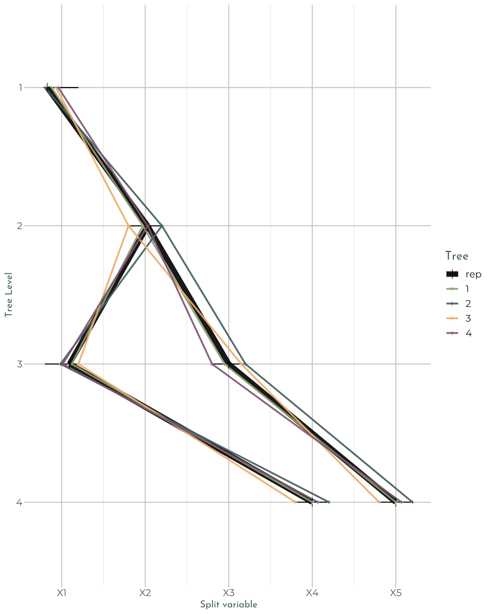
```
]

.pull-right[
```{r out.width = "100%"}
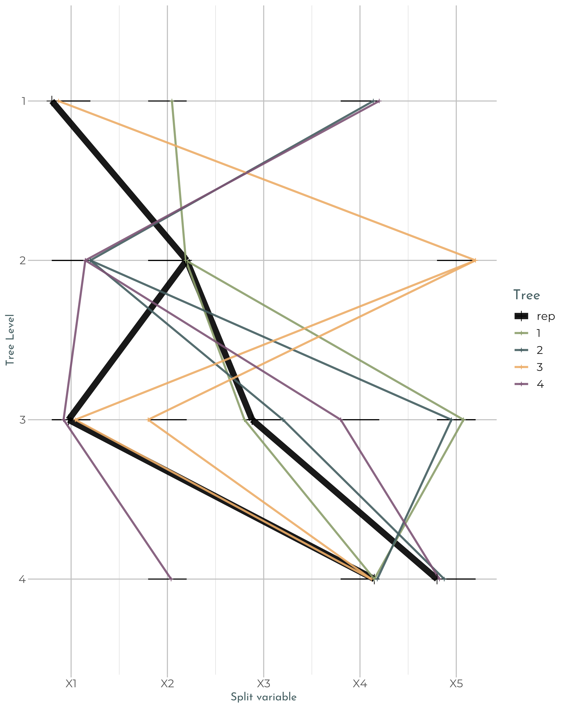
```
]

---

## Extensions: .medium_grey[Tree Summaries] 

**Background (distances between trees)**: Various metrics proposed .small[`r Citep(bib, c("chipman:1998", "shannon:1999", "miglio:2004", "banerjee:2012", "sies:2020"))`]

.pull-left-v4[

.center[.red[Comparing Predictions]]

```{r out.width = "100%"}
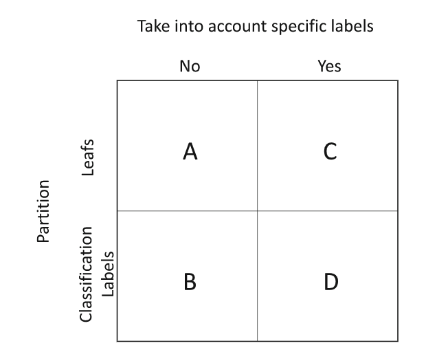
```
]

.pull-right-v4[

.center[.red[Comparing Topology]]

```{r out.width = "100%"}
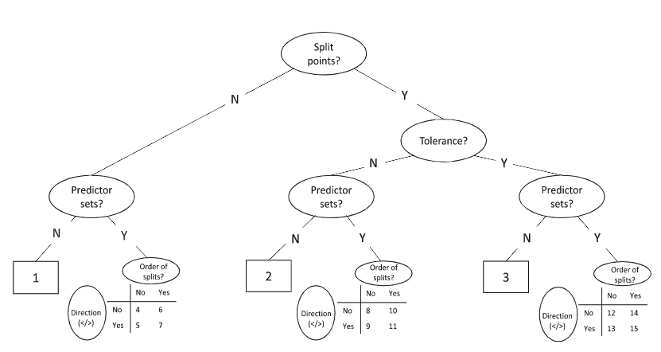
```

]

.right[.small[Image source: `r Citet(bib, "sies:2020")`]]

---

## Extensions: .medium_grey[Tree Summaries] 

**Example Distance Metrics**

.medium[
.red[Covariate metric:] Compares split variables from two trees .small[`r Citep(bib, "banerjee:2012")`] 

.medium[$$d_{CM}(T_1, T_2)=\frac{\mbox{Number of covariate mismatches between } T_1 \mbox{ and } T_2}{k}.$$]

<br>

.red[Fit metric:] Compares predictions from two trees .small[`r Citep(bib, "chipman:1998")`]

.medium[
$$d_{FM}\left(T_1,T_2\right)=\frac{1}{n}\sum_{i=1}^n m\left(\hat{y}_{i1},\hat{y}_{i2}\right)$$
]

<br>

.red[Partition metric:] Compares how observations are divided between leaves .small[`r Citep(bib, "chipman:1998")`]

.medium[
$$d_{PM}\left(T_1, T_2\right)=\frac{\sum_{i>j}\left|I_1(i,j)-I_2(i,j)\right|}{{n\choose2}}$$
]

.medium[
$$I_t(i,j) =\begin{cases} 1 & \mbox{if } T_t \mbox{ places observations } i \mbox{ and } j \mbox{ in the same terminal node} \\ 0 & \mbox{o.w.} \end{cases}$$
]
]

.medium[
.grey[
Details:
.medium[
.pull-left[
- Observation: $i$ with $i\in\{1,...,n\}$ or $j$ with $j\in\{1,...,n\}$
- Response: $y_i$
- Predictor variables: $\textbf{x}_{i}=(x_{i1},...,x_{ik})$
- Fitted value: $\hat{y}_{it}$
- Trees: $T_t$ with $t\in\{1,2\}$
]
.pull-right[
- Metric: $m$
  - Regression: $m\left(\hat{y}_{i1},\hat{y}_{i2}\right)=\left(\hat{y}_{i1}-\hat{y}_{i2}\right)^2$
  - Classification: $m\left(\hat{y}_{i1},\hat{y}_{i2}\right)=\begin{cases} 1 & \mbox{if} \ \ \hat{y}_{i1}\not=\hat{y}_{i2} \\ 0 & \mbox{o.w.} \end{cases}$
] 
]
]

]
---

## Extensions: .medium_grey[Tree Summaries] 

**Penguins Example:** .red[Clusters] identified using *multidimensional scaling* with fit metric and .red[representative trees] from clusters based on smallest average fit metric distance to all other trees in cluster

.pull-left[

```{r out.width = "75%"}
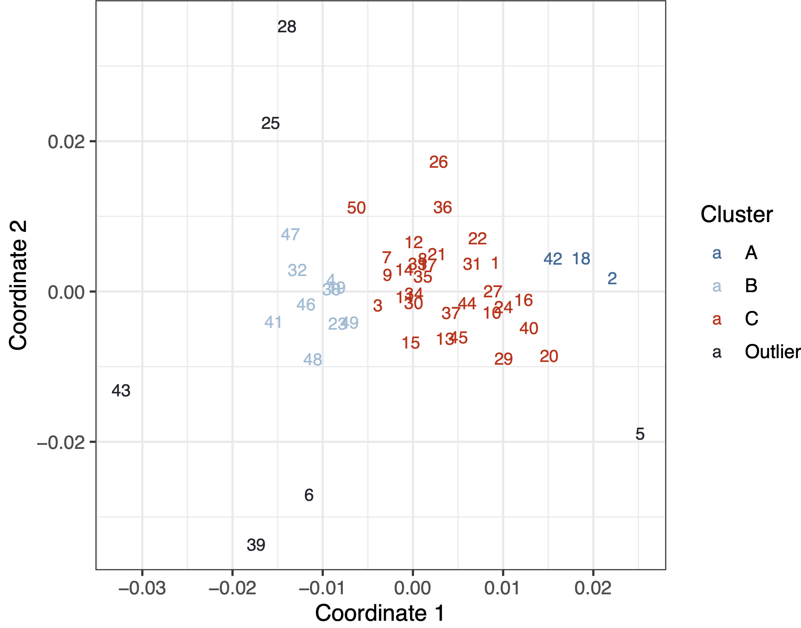
```

```{r out.width = "75%"}
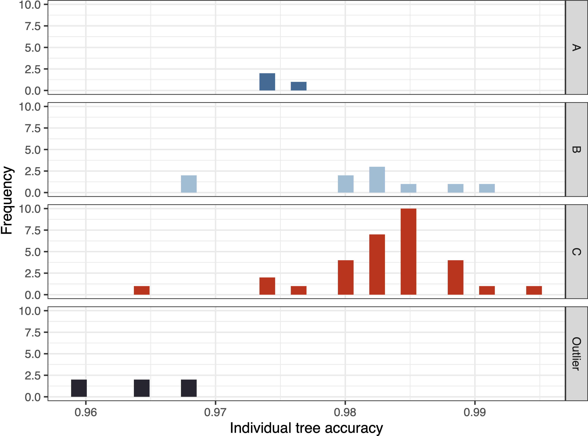
```

]

.pull-right[

```{r out.width = "65%"}
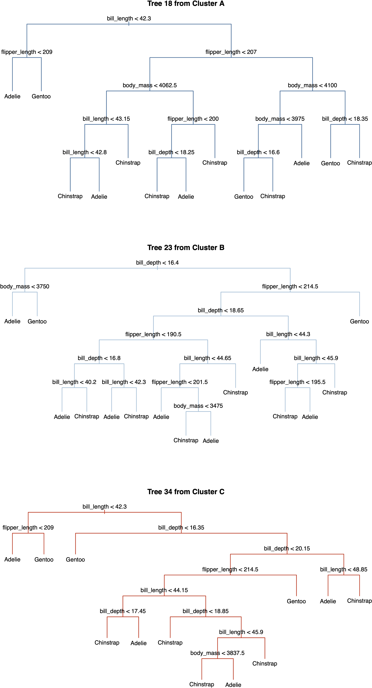
```

]

---

## Extensions: .medium_grey[Tree Summaries] 

**Example 1**: Visualizing representative trees with a trace plot

.pull-left[
```{r out.width = "70%"}

```
]

.pull-right[
```{r out.width = "100%"}
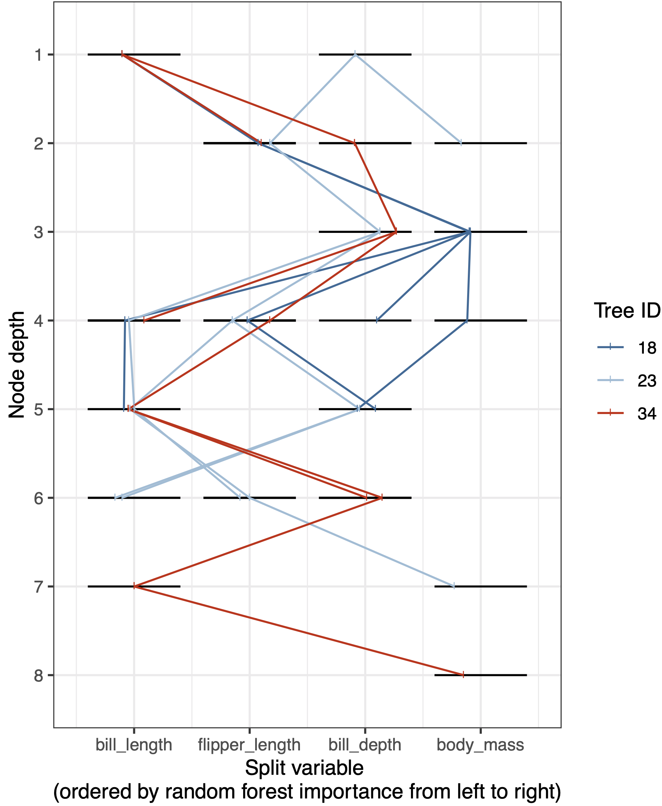
```
]

---

## Extensions: .medium_grey[Tree Summaries] 

**Example 2**: Incorporating variability within a cluster

```{r out.width = "100%"}
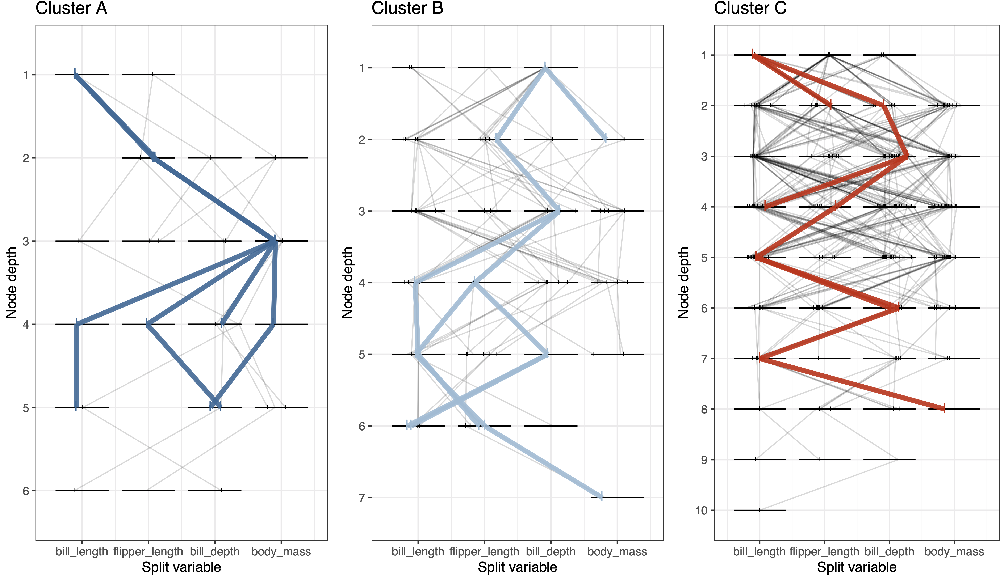
```

---

class: inverse, middle, center

# .dark_grey[Music Example:] Application with "larger" random forest

---

## Music Example

```{r music-data}
# Load the music data
music_all = read.csv("data/music-all.csv") %>% rename("song" = "X")

# Get the training portion of the data
music_train <-
   music_all %>%
   filter(!stringr::str_detect(song, "Unknown")) %>%
   mutate_at(.vars = c("song", "artist", "type"), .funs = factor) %>%
   na.omit()

# Get the testing portion of the data
music_test <-
   music_all %>%
   filter(stringr::str_detect(song, "Unknown")) %>%
   mutate_at(.vars = c("song", "artist", "type"), .funs = factor)

# Determine the number of observations and predictor variables
music_nobs = dim(music_train %>% select(-song,-artist,-type))[1]
music_nvars = dim(music_train %>% select(-song,-artist,-type))[2]
music_nartists = length(unique(music_train$artist))
music_ntypes = length(unique(music_train$type))
```

```{r music-rf}
# Fit a random forest to the tree data to predict genre
music_ntrees = 500
set.seed(20210510)
music_rf = randomForest(type ~ ., music_train %>% select(-song,-artist), ntree = music_ntrees)

# Extract the classes and corresponding OOB class errors
music_class_types = stringr::str_remove_all(rownames(music_rf$confusion), " ")
music_class_errors = round(as.numeric(music_rf$confusion[,4]), 2)

# Compute the variable importance
music_vi <-
   music_rf$importance %>%
   data.frame() %>%
   tibble::rownames_to_column(var = "Variable") %>%
   arrange(desc(MeanDecreaseGini))
```

```{r music-dists}

# Function for computing and saving or loading the metrics for the paper
get_dist_res <- function(rf, metric, fp, data = NULL, tree_preds = NULL) {

   # If the results already exist, load them
   if (file.exists(fp)) {

      # Load results
      res = readRDS(fp)

   # If not, create them
   } else {

      # Compute the distances
      if (metric == "cm") {
         dist_df = compute_covariate_metric(rf = rf)
      } else if (metric == "fm") {
         dist_df = compute_fit_metric(rf = rf, data = data)
      } else if (metric == "pm") {
         dist_df = compute_partition_metric(rf = rf, tree_preds = tree_preds)
      }

      # Covert the distances to a matrix
      dist <- TreeTracer::get_dist_matrix(dist_df)

      # Perform MDS and store in a data frame
      mds <-
         cmdscale(dist) %>%
         data.frame() %>%
         rename("coord1" = "X1", "coord2" = "X2") %>%
         tibble::rownames_to_column("tree") %>%
         mutate(tree = stringr::str_remove(tree, "tree")) %>%
         mutate(metric = metric) %>%
         select(metric, tree, everything())

      # Join all results in a list
      res <-
         list(
            "dist_df" = dist_df,
            "dist_matrix" = dist,
            "mds" = mds
         )

      # Save the results
      saveRDS(res, fp)
   }

   # Return the results
   res

}

# Compute the covariate metric
music_cm_res <-
   get_dist_res(
      rf = music_rf,
      fp ="data/music-cm-res.rds",
      metric = "cm"
   )

# Compute the fit metric
music_fm_res <-
   get_dist_res(
      rf = music_rf,
      fp = "data/music-fm-res.rds",
      metric = "fm",
      data = music_train
   )

# Compute the predictions for each tree
music_tree_preds_fp = "data/music-tree-preds.rds"
music_tree_preds <- readRDS(music_tree_preds_fp)

# Compute the partition metric
music_pm_res <-
   get_dist_res(
      rf = music_rf,
      fp = "data/music-pm-res.rds",
      metric = "pm",
      tree_preds = music_tree_preds
   )

# Join the results
music_mds = bind_rows(music_cm_res$mds, music_fm_res$mds, music_pm_res$mds)
music_dists <-
   bind_rows(
      music_cm_res$dist_df %>% mutate("metric" = "cm"),
      music_fm_res$dist_df %>% mutate("metric" = "fm"),
      music_pm_res$dist_df %>% mutate("metric" = "pm")
   )
```

```{r music-ave-dists}
# Compute the average distance between a tree and all
# other trees (for each metric)
music_ave_dists <-
   music_dists %>%
   group_by(metric, t1) %>%
   summarise(ave_dist = mean(distance), .groups = "drop") %>%
   arrange(metric, ave_dist)

# Compute the top trees with the smallest average
# distances to all other trees for each metric (based on 1 SD)
music_top_trees <-
   music_ave_dists %>%
   group_by(metric) %>%
   mutate(
      min_ave_dist = min(ave_dist),
      ave_dist_sd = sd(ave_dist)
   ) %>%
   ungroup() %>%
   mutate(min_ave_dist_plus_sd = min_ave_dist + ave_dist_sd) %>%
   mutate(first_sd = ifelse(ave_dist < min_ave_dist_plus_sd,
                            "rep", "not-rep")) %>%
   rename("tree" = "t1") %>%
   mutate(tree = as.character(tree)) %>%
   filter(first_sd == "rep")

# Compute the trees with the smallest average distance
# to all other trees for each metric
music_rep_trees <-
   music_ave_dists %>%
   group_by(metric) %>%
   filter(ave_dist == min(ave_dist)) %>%
   mutate(rep_tree = TRUE) %>%
   rename("tree" = "t1") %>%
   mutate(tree = as.character(tree))
```

.pull-left[

**Objective/Response**: 

- Predict song genre of 40 songs

**Features**

- 70 numeric variables 
- Extracted from WAV files `r Citep(bib, "cook:2007")`
- Ex: left and right channel frequencies

**Model**

- Random forest (`randomForest` R package)
- Default tuning parameters (e.g., 500 trees)
- Out-of-bag class errors: 
    - Classical = 0.15 
    - New wave = 0.67
    - Rock = 0.24
]

.pull-right[
<br>
```{r music-table}
music_train %>%
   count(type, artist) %>%
   rename("Genre" = "type", "Artist" = "artist", "Number of Songs" = "n") %>%
   knitr::kable(booktabs = T, align = "c") %>%
   kableExtra::kable_styling(position = "center") %>%
   kableExtra::collapse_rows(columns = 1)
```
]

---

## Trace Plot of Model 

```{r fig.height = 10, fig.width = 16}
music_trace_plot <- 
  trace_plot(
   rf = music_rf,
   train = music_train %>% select(-type,-artist,-song),
   tree_ids = 1:music_rf$ntree,
   alpha = 0.05
) +
   theme_bw() +
   theme(axis.text.x = element_text(angle = 45, hjust = 1))
music_trace_plot
```

---

## Average Distances

Vertical lines indicate location of smallest average distance plus one standard deviation of distances for a metric
 
```{r fig.width = 8, fig.height = 5}
music_ave_dists %>%
   mutate(metric = as.factor(metric)) %>%
   mutate(
      metric = forcats::fct_recode(
         metric,
         "Covariate metric" = "cm",
         "Fit metric" = "fm",
         "Partition metric" = "pm"
      )
   ) %>%
   ggplot(aes(x = ave_dist, fill = metric)) +
   geom_histogram(bins = 40) +
   geom_vline(
      data = music_top_trees %>%
         select(metric, min_ave_dist_plus_sd) %>%
         distinct() %>%
         mutate(metric = as.factor(metric)) %>%
   mutate(
      metric = forcats::fct_recode(
         metric,
         "Covariate metric" = "cm",
         "Fit metric" = "fm",
         "Partition metric" = "pm"
      )
   ),
      aes(xintercept = min_ave_dist_plus_sd)
   ) +
   facet_grid(metric ~ .) +
   scale_fill_manual(values = penguin_colors[c(9, 2, 11)]) +
   theme_bw() +
   theme(legend.position = "none") +
   labs(x = "Average distance",
        y = "Frequency",
        title = "Average distances between one tree and the rest")
```

---

## MDS Results 

```{r fig.height = 10, fig.width = 15}

# Create plot
music_mds %>%
   left_join(music_top_trees, by = c("metric", "tree")) %>%
   left_join(music_rep_trees, by = c("metric", "tree", "ave_dist")) %>%
   mutate(
      top_tree = ifelse(is.na(ave_dist), "non-top", metric),
      rep_tree = ifelse(is.na(rep_tree), "No", "Yes")
   ) %>%
   mutate(metric = as.factor(metric)) %>%
   mutate(
      metric = forcats::fct_recode(
         metric,
         "Covariate metric" = "cm",
         "Fit metric" = "fm",
         "Partition metric" = "pm"
      ),
      top_tree = forcats::fct_recode(
         top_tree,
         "Covariate metric" = "cm",
         "Fit metric" = "fm",
         "Partition metric" = "pm",
         "Not in top ten" = "non-top"
      )
   ) %>%
   mutate(
      rep_tree = forcats::fct_relevel(rep_tree,
                                      "Yes",
                                      "No"),
      top_tree = forcats::fct_relevel(
         top_tree,
         "Covariate metric",
         "Fit metric",
         "Partition metric",
         "Not in top ten",
      )
   ) %>%
   arrange(desc(top_tree)) %>%
   ggplot(aes(
      x = coord1,
      y = coord2,
      color = top_tree,
      size = rep_tree
   )) +
   geom_text(aes(label = tree)) +
   facet_wrap(. ~ metric, scales = "free", nrow = 2) +
   theme_bw() +
   theme(aspect.ratio = 1) +
   scale_size_manual(values = c(10, 4)) +
   scale_color_manual(values = penguin_colors[c(9, 2, 11, 1)]) +
   labs(color = "Lower One \nStandard Deviation \n(within a metric)",
        size = "Representative \nTree",
        x = "Coordinate 1",
        y = "Coordinate 2")

```

---

## Covariate Metric

```{r fig.height = 10, fig.width = 16}
trace_plot(
      rf = music_rf,
      train = music_train %>% select(-type,-artist,-song),
      tree_ids = music_top_trees %>% filter(metric == "cm") %>% pull(tree) %>% as.numeric(),
      alpha = 0.25,
      tree_color = penguin_colors[8],
      rep_tree = get_tree_data(
         rf = music_rf,
         k = music_rep_trees %>% filter(metric == "cm") %>% pull(tree) %>% as.numeric()
      ),
      rep_tree_size = 2,
      rep_tree_alpha = 0.9,
      rep_tree_color = penguin_colors[9]
   ) +
   theme_bw() +
   theme(axis.text.x = element_text(angle = 45, hjust = 1)) +
   labs(title = "Covariate Metric: Rep tree with top trees")
```

---

## Fit Metric

```{r fig.height = 10, fig.width = 16}
trace_plot(
      rf = music_rf,
      train = music_train %>% select(-type,-artist,-song),
      tree_ids = music_top_trees %>% filter(metric == "fm") %>% pull(tree) %>% as.numeric(),
      alpha = 0.25,
      tree_color = penguin_colors[8],
      rep_tree = get_tree_data(
         rf = music_rf,
         k = music_rep_trees %>% filter(metric == "fm") %>% pull(tree) %>% as.numeric()
      ),
      rep_tree_size = 2,
      rep_tree_alpha = 0.9,
      rep_tree_color = penguin_colors[2]
   ) +
   theme_bw() +
   theme(axis.text.x = element_text(angle = 45, hjust = 1)) +
   labs(title = "Fit Metric: Rep tree with top trees")
```

---

## Partition Metric

```{r fig.height = 10, fig.width = 16}
trace_plot(
      rf = music_rf,
      train = music_train %>% select(-type,-artist,-song),
      tree_ids = music_top_trees %>% filter(metric == "pm") %>% pull(tree) %>% as.numeric(),
      alpha = 0.25,
      tree_color = penguin_colors[8],
      rep_tree = get_tree_data(
         rf = music_rf,
         k = music_rep_trees %>% filter(metric == "pm") %>% pull(tree) %>% as.numeric()
      ),
      rep_tree_size = 2,
      rep_tree_alpha = 0.9,
      rep_tree_color = penguin_colors[11]
   ) +
   theme_bw() +
   theme(axis.text.x = element_text(angle = 45, hjust = 1)) +
   labs(title = "Parition Metric: Rep tree with top trees")
```

---

## Interactive Version

```{r}
music_trace_plot_int <- plotly::ggplotly(music_trace_plot + theme_bw(base_size = 8) + theme(axis.text.x = element_text(angle = 45, hjust = 1)))
htmlwidgets::saveWidget(music_trace_plot_int, paste0("figures/music-trace-plot-int.html"))
```

<iframe src="figures/music-trace-plot-int.html" width="1400" height="550" id="igraph" scrolling="no" seamless="seamless" frameBorder="0"> </iframe>

---

class: inverse, middle, center

# .dark_grey[Conclusions:] Pros, Cons, and Possible Research Directions

---

## Summary

**Proposed trace plot extensions**

- Structural augmentations
  
- Repurpose trace plots for visualizing tree summaries

<br>

**Implemented trace plots**

- *TreeTracer* R package

<br>

**Benefits of trace plot extensions**

- Help extract patterns from random forest architectures

- Inspire new questions and hypotheses 

---


## Strenths and Weaknesses

.pull-left[
**Strengths**

- Added organization of traces 

- Reduction in the cognitive load

- Increased ability to visually compare trees

]

.pull-right[

**Weaknesses** 

- Simplification leads to loss of information

  - May be worthwhile to view signal among noise
  
  - May present a view that is not practically helpful
  
- Not simplified enough

  - Too much information to expose patterns
  
- Finding optimal balance

  - Can be challenging
  
  - Dependent on model
  
]

---

## Future Work

.pull-left-v2[
**Interactivity**

- Link trace plot to visualizations focused on more nuanced aspects of random forests: 
  - Click on intersection of node depth and split variable 
  - Produces plot of split in data space
- Zoom in on large trace plots
  
**Computation**

- R package for management of tree data
- Create a geom for trace plots 
- Implementation in Python

**Other**

- Color branches based on dominate class or average value of observations
- How to select maximum depth? 
- Consider other metrics more focused on topology
]

.pull-right-v2[
```{r out.width = "100%"}
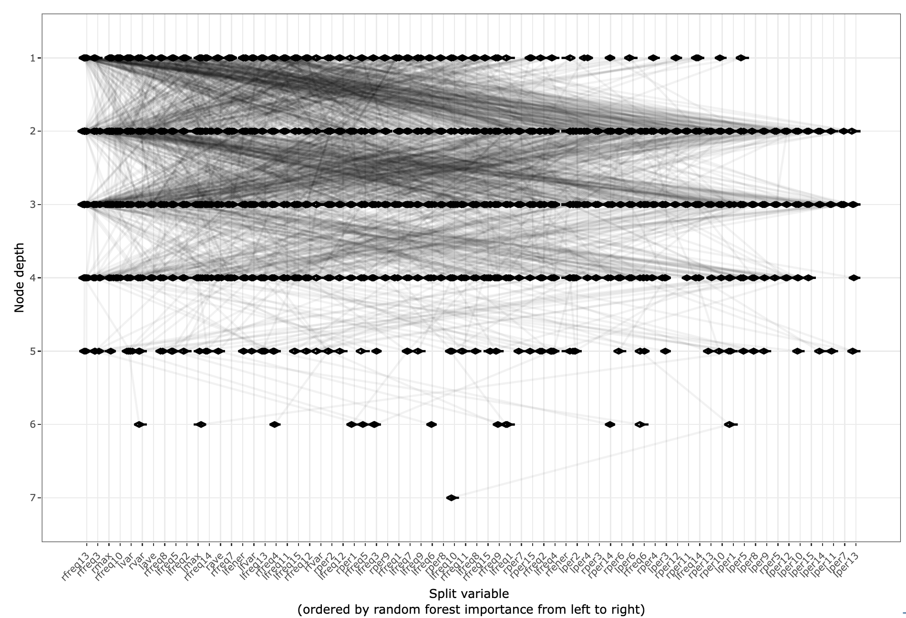
```

<br>
<br>

```{r out.width = "100%"}
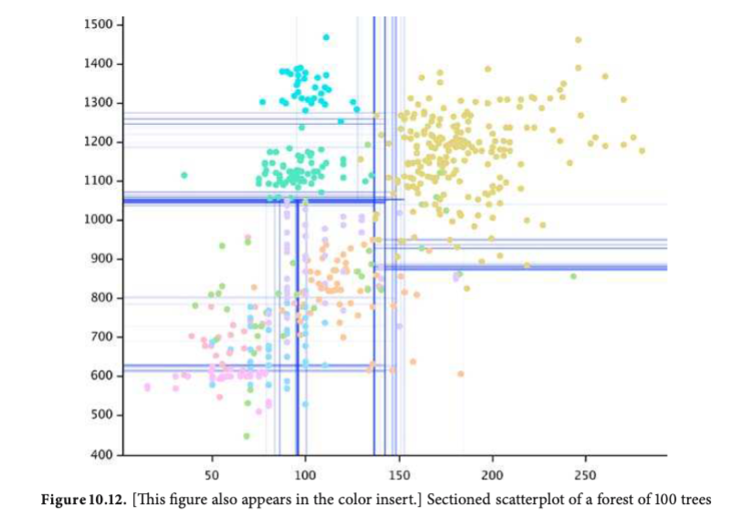
```

.right[.small[Sectioned scatter plot image source: `r Citet(bib, "urbanek:2008")`]]
]

---

## References

.smallmedium[
```{r results = 'asis'}
PrintBibliography(bib, start = 1)
```
]

---

class: inverse, middle, center
name: mylastslide

# Thank you!

```{r out.width = "30%"}

```
