```{css, echo = FALSE}
.smaller{font-size: 45%}
.small{font-size: 50%}
.smallmedium{font-size: 60%}
.medium{font-size: 75%}
.mediumlarge{font-size: 80%}

.pull-left-small{
  width: 35%;
  float: left;
}
.pull-right-large{
  width: 65%;
  float: right;
}
.pull-right-small{
  width: 35%;
  float: right;
}
.pull-left-large{
  width: 65%;
  float: left;
}
.pull-left-smallish{
  width: 46%;
  float: left;
}
.pull-right-largeish{
  width: 53%;
  float: right;
}
.pull-right-smaller{
  width: 20%;
  float: right;
}
.pull-left-larger{
  width: 76%;
  float: left;
}
.pull-left-smaller{
  width: 22%;
  float: left;
}
.pull-right-larger{
  width: 76%;
  float: right;
}
```

```{r setup, include = FALSE, echo = FALSE, message = FALSE, warning = FALSE}
# Knitr options
options(htmltools.dir.version = FALSE)
knitr::opts_chunk$set(
  echo = FALSE,
  warning = FALSE,
  message = FALSE,
  fig.align = "center", 
  dpi = 300
)

# Packages
library(knitr)
library(RefManageR)

# Bib options
BibOptions(
  check.entries = FALSE,
  bib.style = "numeric",
  cite.style = "numeric",
  style = "markdown",
  hyperlink = FALSE,
  dashed = FALSE
)
bib <- ReadBib("refs.bib", check = FALSE)
```

# Outline

<br>

- .blue[Motivation]: Climate Interventions and Pathways

<br>

- .blue[Approach]: Echo State Networks and Feature Importance

<br>

- .blue[Climate Application]: Mount Pinatubo

<br>

- .blue[Conclusions and Future Work]

---

class: inverse, center, middle

# Motivation

### .bright-teal[Climate Interventions and Pathways]

---

## Climate Interventions

.pull-left-large[

```{r out.width = "90%"}
include_graphics("figs/solar-climate-interventions.png")
```

.center[.smallmedium[Image source: [https://eos.org/science-updates/improving-models-for-solar-climate-intervention-research](https://eos.org/science-updates/improving-models-for-solar-climate-intervention-research)]]

]

.pull-right-small[
Threat of climate change has led to...

- Proposed possible interventions 

  - Stratospheric aerosol injections

  - Marine cloud brightening

  - Cirrus cloud thinning

  - etc.
]

<br>

--
.pull-right-small[
.center[**What are the downstream effects of such mitigation strategies?**]
]

---

## Our Objective

Develop algorithms to .blue[characterize (i.e., quantify) relationships between climate variables] related to a climate event (with observed data)

--

.pull-left[

**Climate Pathway** (associated with a climate event)

- Source variable

- Intermediate variables

- Impact variable

```{r out.width = "70%"}
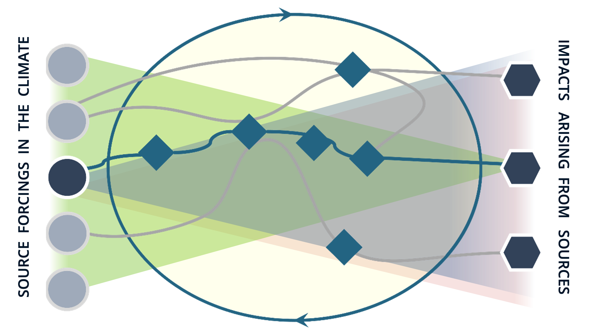
```

]

--

.pull-right[

**Example**

- Mount Pinatubo eruption in 1991

- Released 18-19 Tg of sulfur dioxide

- Proxy for anthropogenic stratospheric aerosol injection

```{r out.width = "60%"}
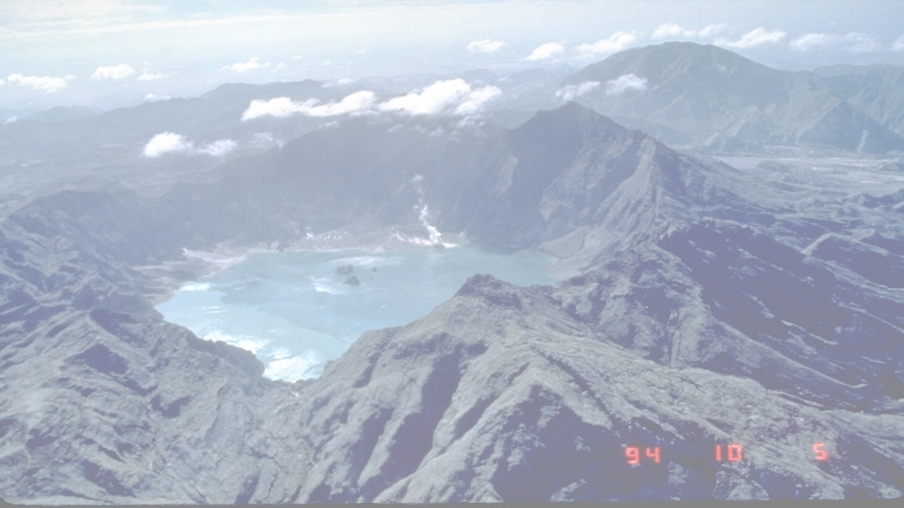
```

]

---

## Mount Pintabuo Example Pathway

.pull-left-smallish[.blue[Sulfur dioxide] (Source)

- .medium[Injection of sulfur dioxide (18-19 Tg) into atmosphere `r Citep(bib, "guo2004")`] 

```{r out.width = "5%", fig.align = "center"}
include_graphics("figs/arrow.png")
```

.blue[Aerosol optical depth (AOD)] (Intermediate)

- .medium[Vertically integrated measure of aerosols in air from surface to stratosphere] .medium[`r Citep(bib, "sato1993")`]

```{r out.width = "5%", fig.align = "center"}
include_graphics("figs/arrow.png")
```

.blue[Stratospheric temperature] (Impact)

- .medium[Temperatures at pressure levels of 30-50 mb rose 2.5-3.5 degrees centigrade compared to 20-year mean `r Citep(bib, "labitzke1992")`] 

.smaller[Figure generated using Modern-Era Retrospective Analysis for Research and Applications, Version 2 (MERRA- 2) data `r Citep(bib, "gelaro2017")`]
]

.pull-right-largeish[

```{r out.width = "83%"}
fp_plot_merra <- "figs/merra2_heatmap.png"
include_graphics(fp_plot_merra)
```

]

---

## Our Approach

--

Use machine learning...

--

.pull-left[

**Step 1**: Model pathway variables with echo state network

- Allow complex machine learning model to capture complex pathway variable relationships

<br>

```{r out.width = "100%"}
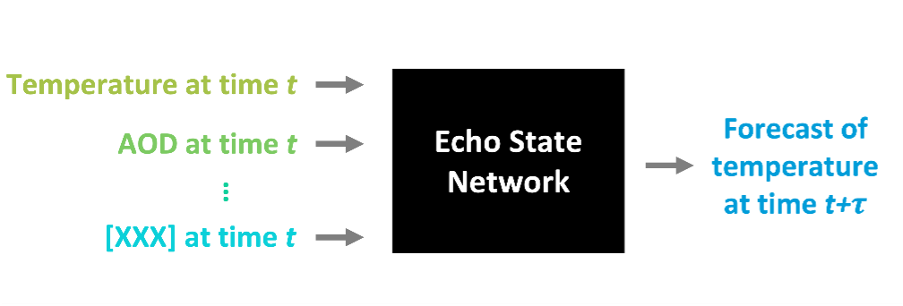
```
]

--

.pull-right[

**Step 2**: Understand pathways via explainability

- Apply explainability techniques (feature importance) to understand pathways captured by model

<br>

```{r out.width = "100%"}
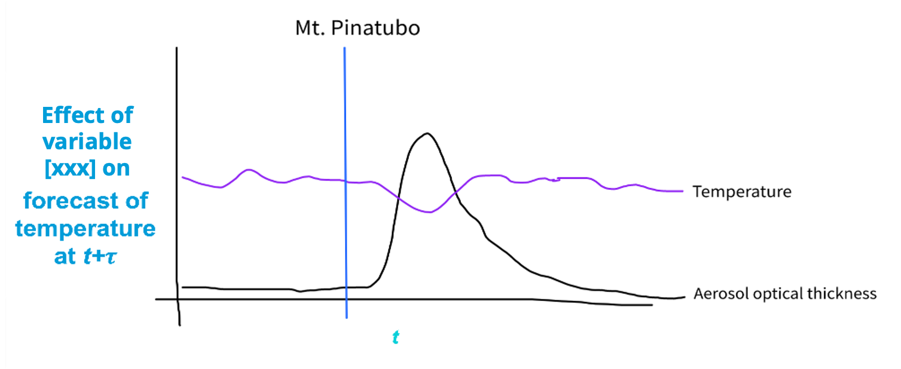
```
]

---

class: inverse, center, middle

# Approach

### .bright-teal[Echo State Networks and Feature Importance]

---

## Echo-State Networks

.pull-left[

- Machine learning model for temporal data

  - Sibling to recurrent neural network (RNN)

- Computationally efficient

  - Compared to RNNs and spatio-temporal statistical models
  
  - ESN reservoir parameters randomly sampled instead of estimated

- Previous work demonstrated use of ESN for long-term spatio-temporal forecasting .medium[(`r Citet(bib, "mcdermott2019")`)]
  
]

.pull-right[

.blue[Output stage] (ridge regression):

$$\textbf{y}_{t} = \mathbf{V} \mathbf{h}_t + \boldsymbol{\epsilon}_{t}$$

$${\bf \epsilon_t } \sim N(\textbf{0}, \sigma^2_\epsilon \textbf{I})$$

.blue[Hidden stage] (nonlinear stochastic transformation):

$$\mathbf{h}_t = g_h \left(\frac{\nu}{|\lambda_w|} \mathbf{W} \mathbf{h}_{t-1} + \mathbf{U} \mathbf{\tilde{x}}_{t-\tau}\right)$$

$$\tilde{\mathbf{x}}_{t-\tau}=\left[\textbf{x}'_{t-\tau},\textbf{x}'_{t-\tau-\tau^*},...,\mathbf{x}'_{t-\tau-m\tau^*}\right]'$$

<br>
<br>
<br>

Note: Only parameters estimated are in $\textbf{V}$.
]

---

## Echo-State Networks: Spatio-Temporal Context

--

Spatio-temporal processes at spatial locations $\{\textbf{s}_i\in\mathcal{D}\subset\mathbb{R}^2;i=1,...,N\}$ over times $t=1,...,T$...

--

.pull-left[
.blue[Impact variable] (e.g., stratospheric temperature): 
  
$${\bf Z}_{Y,t} = \left(Z_{Y,t}({\bf s}_1),Z_{Y,t}({\bf s}_2),...,Z_{Y,t}({\bf s}_N)\right)'$$

]

--

.pull-right[

.blue[Source/intermediate variables] (e.g., aerosol optical depth):
  
$${\bf Z}_{k,t} = \left(Z_{k,t}({\bf s}_1),Z_{k,t}({\bf s}_2),...,Z_{k,t}({\bf s}_N)\right)'$$ $$\mbox{ for } k=1,...,K$$ 
]

--

| Stage | Formula | Description |
| ----- | ------- | ----------- |
| Data stage (outputs) | ${\bf Z}_{Y,t}\approx\boldsymbol{\Phi}_Y\textbf{y}_{t}$ | Basis function decomposition (e.g., PCA) |
| Output stage | $\textbf{y}_{t} = \mathbf{V} \mathbf{h}_t + \boldsymbol{\epsilon}_{t}$ | Ridge regression |
| Hidden stage | $\mathbf{h}_t = g_h \left(\frac{\nu}{\lvert\lambda_w\rvert} \mathbf{W} \mathbf{h}_{t-1} + \mathbf{U} \mathbf{\tilde{x}}_{t-\tau}\right)$ | Nonlinear stochastic transformation |
| Data stage (inputs) | ${\bf Z}_{k,t}\approx\boldsymbol{\Phi}_k\textbf{x}_{k,t} \ \ \ \ \ \mbox{ where } \textbf{x}_t=[\textbf{x}'_{1,t},...,\textbf{x}'_{K,t}]'$ | Basis function decomposition (e.g., PCA) |

---

## Feature Importance

--

.pull-left[

**Goal**

- Feature importance aims to quantify effect of input variable on a model's predictions

<br>

**Background**

- Permutation feature importance `r Citep(bib, "fisher2019")`
- Pixel absence affect with ESNs `r Citep(bib, "arrieta2022")`
- Temporal permutation feature importance `r Citep(bib, "sood2021")`

<br>

**Our Work**

- Adapt for ESNs in context of spatio-temporal data
]

--

.pull-right[

**In particular...**

Compute feature importance on trained ESN model for:

- .blue[input variable] over .blue[block of times]

- on forecasts of .teal[response variable] at a time

<br>

```{r out.width = "100%"}

```
]

---

## Feature Importance for ESNs

--

.pull-left-smallish[

**Concept**

- "Adjust" inputs at times(s) of interest

- Quantify effect on model performance

- Large decrease in performance indicates important time(s)

<br>

**Two Approaches**: "Adjust" inputs by either

- .blue[Permute values]: spatio-temporal permutation feature importance (stPFI)

- .blue[Set values to zero]: spatio-temporal zeroed feature importance (stZFI)

]

.pull-right-largeish[

<br>

```{r out.width = "95%"}
include_graphics("figs/fi.png")
```
]

---

class: inverse, center, middle

# Climate Application

### .bright-teal[Mount Pinatubo]

---

## Mount Pinatubo Example: Data

.pull-left[

**Data**

- Modern-Era Retrospective Analysis for Research and Applications, Version 2 (MERRA- 2)

- Training Years: 1980 to 1995 
  
  - Includes eruptions of Mount Pinatubo (1991) and El Chichón (1982)
  
- Time Interval: Monthly

- Latitudes: -86 to 86 degrees

]

.pull-right[
```{r out.width = "90%"}
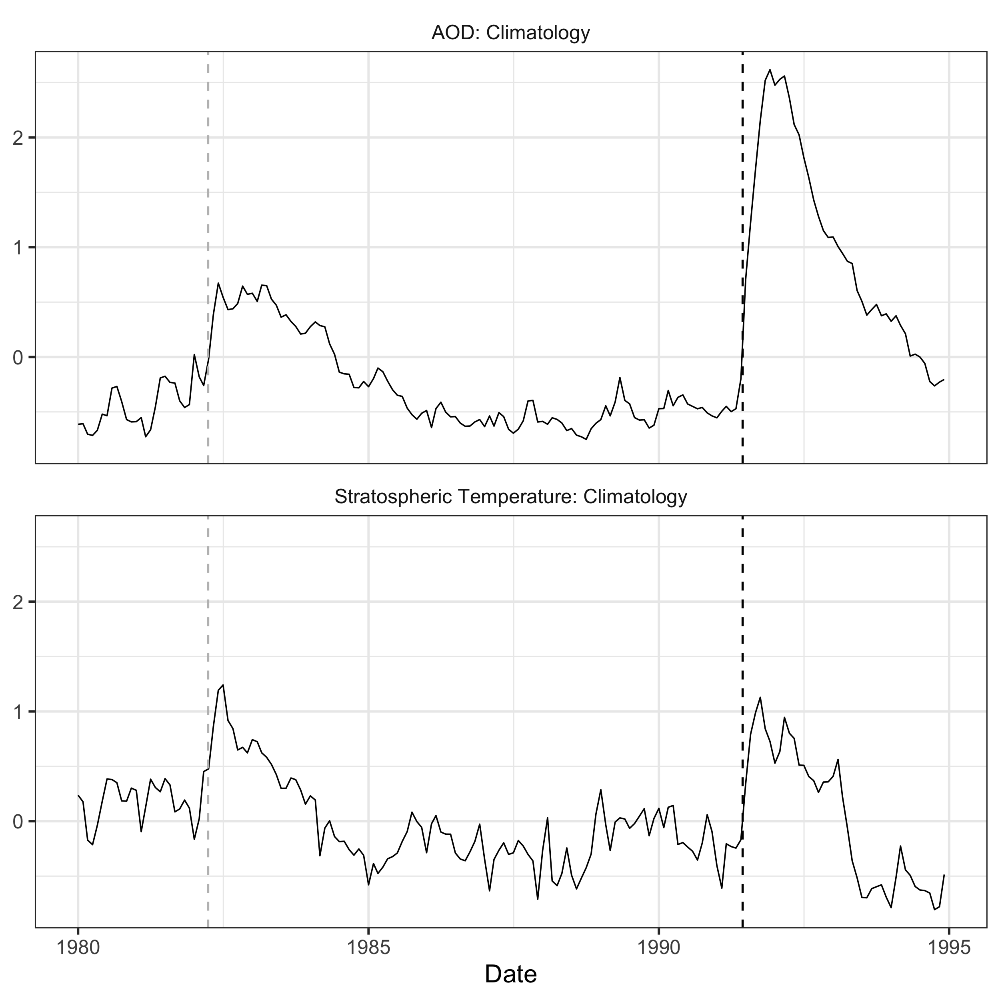
```
]

---

## Mount Pinatubo Example: Model

.pull-left[

**ESN Output**

- Stratospheric Temperature (50mb)

**ESN Inputs**
  
- Lagged Stratospheric Temperature (50mb; one month lag)
- Lagged AOD (one month lag)

**Preprocessing (all variables)**

- Climatologies
- Principal components (first 5)

]

.pull-right[
```{r out.width = "85%"}
include_graphics("figs/merra2_rmse.png")
```
]

---

## Mount Pinatubo Example: Feature Importance

.pull-left-smaller[
**Key Point**

Peak of importance for AOD (and lack of peak of importance for lagged stratospheric temperatures), provides evidence that volcanic eruption impact on temperature can be traced through AOD

**FI Metric** 

Weighted RMSE (weighted by cosine of the latitude)

]

.pull-right-larger[
```{r out.width = "98%"}
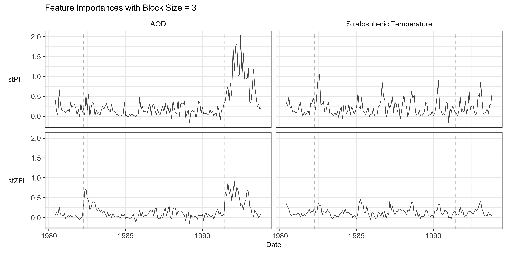
```
]

---

class: inverse, center, middle

# Conclusions and Future Work

---

## Summary and Conclusions

--

**Summary**

- Interested in quantifying relationships between climate variables associated with pathway of climate event

- Motivated by increasing possibility of climate interventions

- Our machine learning approach:

  - Use ESN to model variable relationships

  - Understand variable relationships using proposed spatio-temporal feature importance

--

**Conclusion**

- Approach provided evidence of AOD being an intermediate variable in Mount Pinatubo climate pathway affecting stratospheric temperature

---

## Future (Current) Work

--

**ESN extensions**

- Addition of multiple layers
- ESN ensembles
- Bayesian ESNs

--

**Spatio-temporal feature importance**

- Implement proposed retraining technique `r Citep(bib, "hooker2021")` to lessen detection of spurious relationships
- Adapt to visualize on spatial scale
- Comparison to other newly proposed explainability techniques for ESNs (layer-wise relevance propagation)  `r Citep(bib, "landt2022")` 

--

**Mount Pinatubo application**

- Inclusion of additional pathway variables (e.g., SO2, radiative flux, surface temperature)
- Importance of grouped variables

---

## References

.smallmedium[
```{r results = 'asis'}
PrintBibliography(bib, start = 1)
```
]

---

class: inverse, center, middle

<br>

# Thank you

.sky-blue[Katherine Goode]

.white[kjgoode@sandia.gov]

.sky-blue[goodekat.github.io]

---

class: inverse, center, middle

# Back-Up Slides

---

## ESN Details

```{r out.width = "100%"}
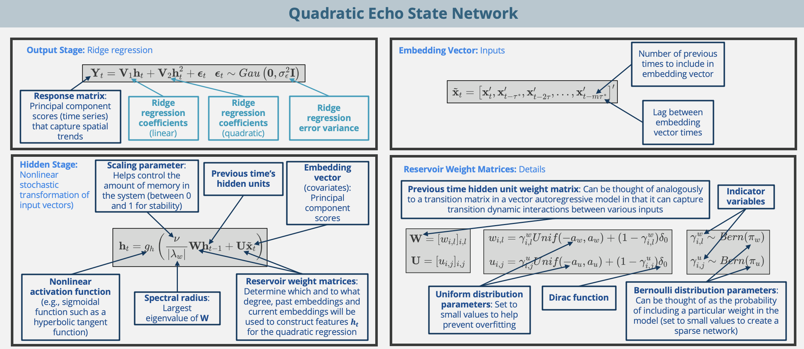
```

---

## ESN Details

```{r out.width = "100%"}
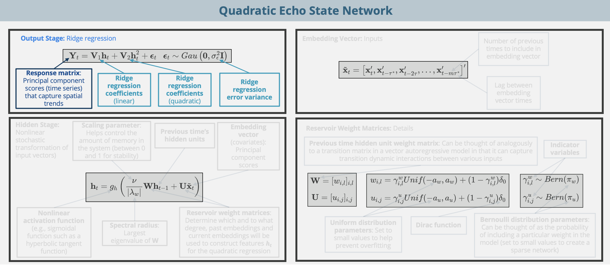
```

---

## ESN Details

```{r out.width = "100%"}
include_graphics("figs/esn-details-3.png")
```

---

## ESN Details

```{r out.width = "100%"}
include_graphics("figs/esn-details-4.png")
```

---

## ESN Details

```{r out.width = "100%"}

```

---

## Issue and Solution

**Black-box**:

- ESN parameters NOT interpretable (unlike spatio-temporal statistical models)
- Objective is to quantify variable relationships...

```{r out.width = "50%"}

```

--

**Interpretable**: A model is interpretable if it is possible to assign meaning to the model's parameters in the context of the application, which provides insight into how the model inputs relate to the model outputs.

  - Consider a linear model: $\hat{y}=\hat{\beta_0}+\hat{\beta_1}x_1.$ We can interpret the coefficient $\hat{\beta}_1$ as the amount the response variable $\hat{y}$ increases for a one unit increase in the predictor variable $x_1$.

--

**Explainable**: A model is explainable if it is possible to implement post hoc investigations on a trained model that infer how the model inputs relate to the model outputs.

  - Feature importance: Aims to quantify the effect of an input variable on a model's predictions. Various techniques have been proposed for computing FI

--

## Feature Importance

Feature importance aims to quantify effect of input variable on a model's predictions

--

.pull-left-smallish[
**Background**

- Permutation feature importance `r Citep(bib, "fisher2019")`
- Pixel absence affect with ESNs `r Citep(bib, "arrieta2022")`
- Temporal permutation feature importance `r Citep(bib, "sood2021")`

**Our Work**

- Adapt for ESNs in context of spatio-temporal data

**Concept**

- "Adjust" inputs at times(s) of interest
- Quantify effect on model performance
- Large decrease in performance indicates important time(s)

]

--

.pull-right-largeish[

<br>

```{r out.width = "95%"}
include_graphics("figs/fi.png")
```
]

---

## Feature Importance: Spatio-Temporal Context

--

**Compute FI on the trained ESN model** for...

- spatio-temporal input variable $k$

- over the block of times $\{t, t-1,..., t-b+1\}$

- on the forecasts of the spatio-temporal response variable at time $t+\tau$.

<br>

--

```{r out.width = "90%"}
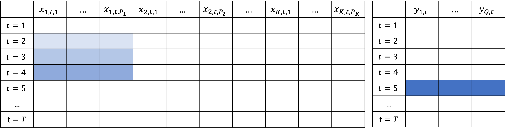
```

---

## Feature Importance: Spatio-Temporal Context

```{r out.width = "80%"}

```

--

**Two Approaches**: "Adjust" inputs by either

- Permutation: .blue[spatio-temporal permutation feature importance (stPFI)]

- Set values to zero: .blue[spatio-temporal zeroed feature importance (stZFI)]

--

**Feature Importance**: Difference in RMSEs from observed and "adjusted" spatial predictions

$$\mathcal{I}^{(k,b)}_{t,t+\tau}=\mathcal{M}\left(\textbf{y}_{t+\tau}, \hat{\textbf{y}}^{(k,b)}_{t+\tau}\right) - \mathcal{M}\left(\textbf{y}_{t+\tau}, \hat{\textbf{y}}_{t+\tau}\right)$$

---

## Feature Importance: Spatio-Temporal Context

```{r out.width = "80%"}

```

--

**Visualization**: Feature importance of $\textbf{x}_1$ during times $\{t, t-1, t-2\}$ on forecast of $\textbf{y}_t$ at time $t+1$:

```{r out.width = "45%"}
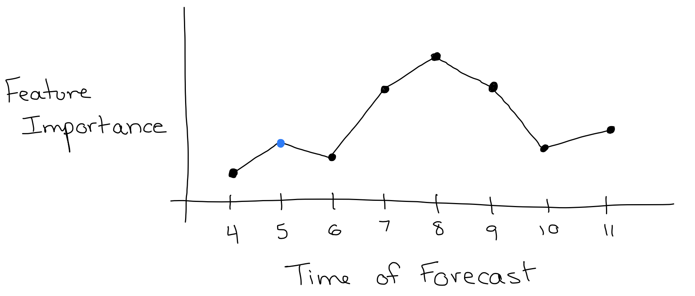
```

---

## Feature Importance Details

Let $\mathcal{I}^{(k,b)}_{t,t+\tau}$ denote the FI on the trained ESN model $f$ for

- spatio-temporal input variable $k$
- over the block of times $\{t, t-1,..., t-b+1\}$
- on the forecasts of the spatio-temporal response variable at time $t+\tau$.

<br>

--

We compute the FI $\mathcal{I}^{(k,b)}_{t,t+\tau}$ as follows:

--

**Step 1**: Obtain forecasts $f(\textbf{x}_t, \textbf{x}_{t-1},..., \textbf{x}_{1})=\hat{\textbf{y}}_{t+\tau}$ at time $t+\tau$.

--

**Step 2**: Let $\mathcal{M}$ be a model prediction performance metric comparing observed to predicted values with the constraint that smaller values indicated better model performance (e.g., root mean squared error). Compute the performance metric on the trained model $f$ at time $t+\tau$ as: $$\mathcal{M}\left(\textbf{y}_{t+\tau}, \hat{\textbf{y}}_{t+\tau}\right).$$

---

## Feature Importance Details

**Step 3**: Generate *adjusted* forecasts using one of the following two methods:

--

  - .blue[Permutation (stPFI)]: For replicate $r=1,2,...,R$, randomly permute the values within each vector $\textbf{x}_{k,t}, \textbf{x}_{k,t-1},..., \textbf{x}_{k,t-b+1}$. Replace the corresponding observed values within $\textbf{x}_t, \textbf{x}_{t-1},...,\textbf{x}_{t-b+1}$ with the permuted versions. Let the versions of $\textbf{x}_t, \textbf{x}_{t-1},...,\textbf{x}_{t-b+1}$ containing the permuted values associated with variable $k$ and replicate $r$ be denoted as $$\textbf{x}^{(k,r)}_t, \textbf{x}^{(k,r)}_{t-1},..., \textbf{x}^{(k,r)}_{t-b+1},$$ respectively. Then obtain forecasts at time $t+\tau$ as $$f\left(\textbf{x}^{(k,r)}_t, \textbf{x}^{(k,r)}_{t-1},... \textbf{x}^{(k,r)}_{t-b+1}, \textbf{x}_{t-b},..., \textbf{x}_{1}\right)=\hat{\textbf{y}}^{(k,b,r)}_{t+\tau}.$$ The $R$ replications are implemented to account for variability among permutations.

---

## Feature Importance Details

**Step 3**: Generate *adjusted* forecasts using one of the following two methods:

  - .blue[Zeroing (stZFI)]: Replace the vectors of $\textbf{x}_{k,t}, \textbf{x}_{k,t-1},..., \textbf{x}_{k,t-b+1}$ within $\textbf{x}_t, \textbf{x}_{t-1},...,\textbf{x}_{t-b+1}$ with zeros. Let the versions of $\textbf{x}_t, \textbf{x}_{t-1},...,\textbf{x}_{t-b+1}$ containing the inserted zeros associated with variable $k$ be denoted as $$\textbf{x}^{(k)}_t, \textbf{x}^{(k)}_{t-1},..., \textbf{x}^{(k)}_{t-b+1},$$ respectively. Then obtain forecasts at time $t+\tau$ as $$f\left(\textbf{x}^{(k)}_t, \textbf{x}^{(k)}_{t-1},... \textbf{x}^{(k)}_{t-b+1}, \textbf{x}_{t-b},...,\textbf{x}_1\right)=\hat{\textbf{y}}^{(k,b)}_{t+\tau}.$$ Note that no replications are needed to account for variability with zeroing.

---

## Feature Importance Details

**Step 4**: Compute the prediction performance metric on the forecasts obtained by inputting the adjusted predictions into the trained model $f$. That is, with stPFI compute

$$\mathcal{M}\left(\textbf{y}_{t+\tau}, \hat{\textbf{y}}^{(k,b,r)}_{t+\tau}\right),$$

for $r=1,...,R$, and with stZFI compute

$$\mathcal{M}\left(\textbf{y}_{t+\tau}, \hat{\textbf{y}}^{(k,b)}_{t+\tau}\right).$$

---

## Feature Importance Details

**Step 5**: Finally, compute:

<br>

.blue[stPFI] at time $t+\tau$ as the average change in model prediction performance when inputs $\textbf{x}_{k,t}, \textbf{x}_{k,t-1},..., \textbf{x}_{k,t-b+1}$ are permuted:

\begin{align}
    \mathcal{I}^{(k,b)}_{t,t+\tau}=\left[\frac{1}{R}\sum_{r=1}^R\mathcal{M}\left(\textbf{y}_{t+\tau}, \hat{\textbf{y}}^{(k,b,r)}_{t+\tau}\right)\right] - \mathcal{M}\left(\textbf{y}_{t+\tau}, \hat{\textbf{y}}_{t+\tau}\right),
\end{align}

<br>

or .blue[stZFI] at time $t+\tau$ as the change in model prediction performance when inputs $\textbf{x}_{k,t}, \textbf{x}_{k,t-1},..., \textbf{x}_{k,t-b+1}$ are set to 0:

\begin{align}
    \mathcal{I}^{(k,b)}_{t,t+\tau}=\mathcal{M}\left(\textbf{y}_{t+\tau}, \hat{\textbf{y}}^{(k,b)}_{t+\tau}\right) - \mathcal{M}\left(\textbf{y}_{t+\tau}, \hat{\textbf{y}}_{t+\tau}\right).
\end{align}

---

## Simulated Data Demonstration

.pull-left[

**Simulated response**

$$Z_{Y,t}({\bf s}_i)=Z_{2,t}({\bf s}_i) \beta + \delta_t({\bf s}_i) + \epsilon_t({\bf s}_i)$$

where

- $Z_{2,t}$ spatio-temporal covariate
- $\delta_t({\bf s}_i)$ spatio-temporal random effect
- $\epsilon_t({\bf s}_i) \overset{iid}{\sim}  N(0,\sigma_{\epsilon}^2)$

```{r out.width = "75%"}
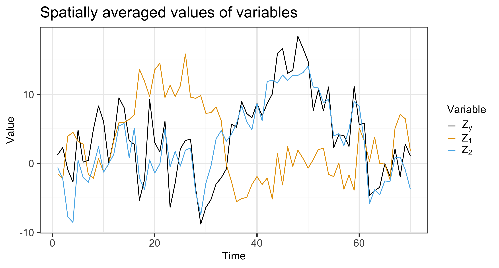
```

]

.pull-right[
```{r out.width = "95%"}
include_graphics("figs/syn_data_heat.png")
```
]

---

## Simulated Data Demonstration

.pull-left-smaller[

**Fit an ESN**

- Forecast $Z_{Y,t}$ 

- Inputs $Z_{1,t-\tau}$ and $Z_{2,t-\tau}$

**Compute stPFI and stZFI**

  - Blocks of size 1 to 3

]

--

.pull-right-larger[

```{r out.width="98%"}
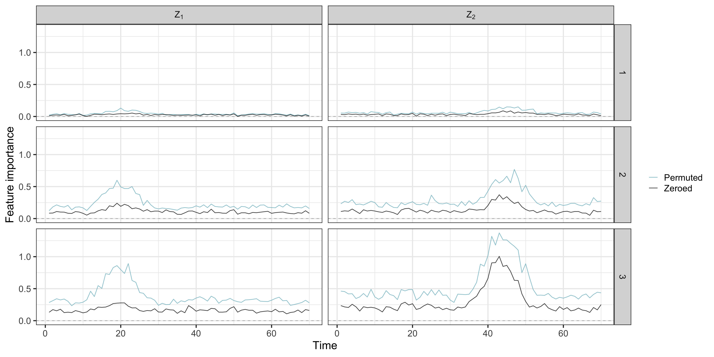
```

Each line represents the importance of the block of lagged times of an input variable on the forecast at time $t$

]

---

## Simulated Data: Effect of Variability on FI

```{r out.width = "67%"}
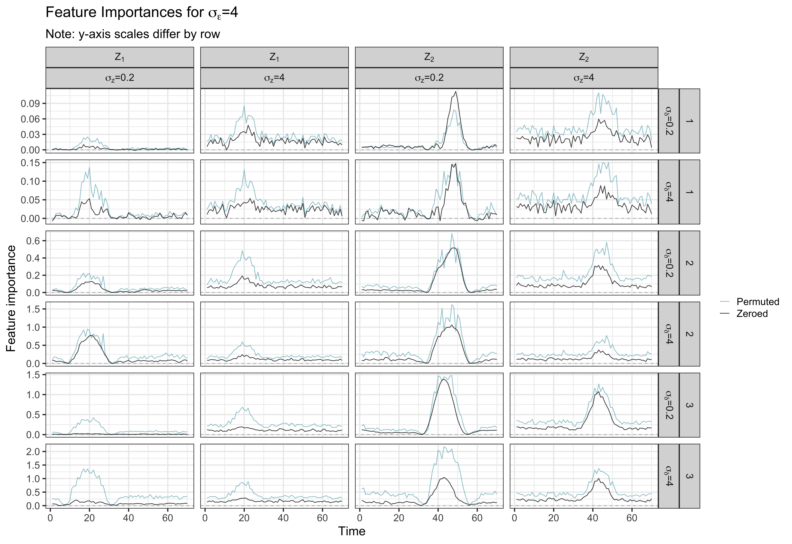
```

---

## Simulated Data: Effect of Variability on FI

```{r out.width = "92%"}
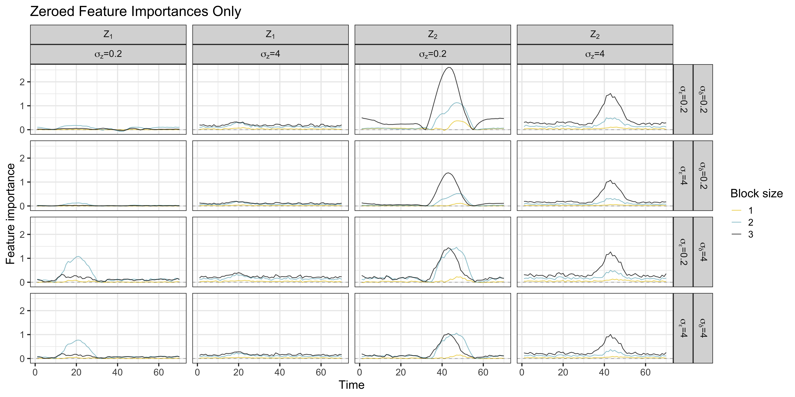
```

---

## Effect of Correlation on FI

```{r out.width = "100%"}
include_graphics("figs/effect-corr.png")
```
