```{css, echo = FALSE}
.smaller{font-size: 45%}
.small{font-size: 50%}
.smallmedium{font-size: 55%}
.medium{font-size: 75%}
.mediumlarge{font-size: 80%}

.pull-left-small{
  width: 35%;
  float: left;
}
.pull-right-large{
  width: 60%;
  float: right;
}
.pull-right-small{
  width: 35%;
  float: right;
}
.pull-left-large{
  width: 65%;
  float: left;
}
.pull-left-smallish{
  width: 46%;
  float: left;
}
.pull-right-largeish{
  width: 53%;
  float: right;
}
.pull-right-smaller{
  width: 20%;
  float: right;
}
.pull-left-larger{
  width: 76%;
  float: left;
}
.pull-left-smaller{
  width: 22%;
  float: left;
}
.pull-right-larger{
  width: 76%;
  float: right;
}
```

```{r setup, include = FALSE, echo = FALSE, message = FALSE, warning = FALSE}
# Knitr options
options(htmltools.dir.version = FALSE)
knitr::opts_chunk$set(
  echo = FALSE,
  warning = FALSE,
  message = FALSE,
  fig.align = "center", 
  dpi = 300,
  fig.path = "figs"
)

# Packages
library(knitr)
library(RefManageR)

# Bib options
BibOptions(
  check.entries = FALSE,
  bib.style = "numeric",
  cite.style = "numeric",
  style = "markdown",
  hyperlink = FALSE,
  dashed = FALSE
)
bib <- ReadBib("refs.bib", check = FALSE)
```

## Climate Interventions

.pull-left-large[

```{r out.width = "90%"}
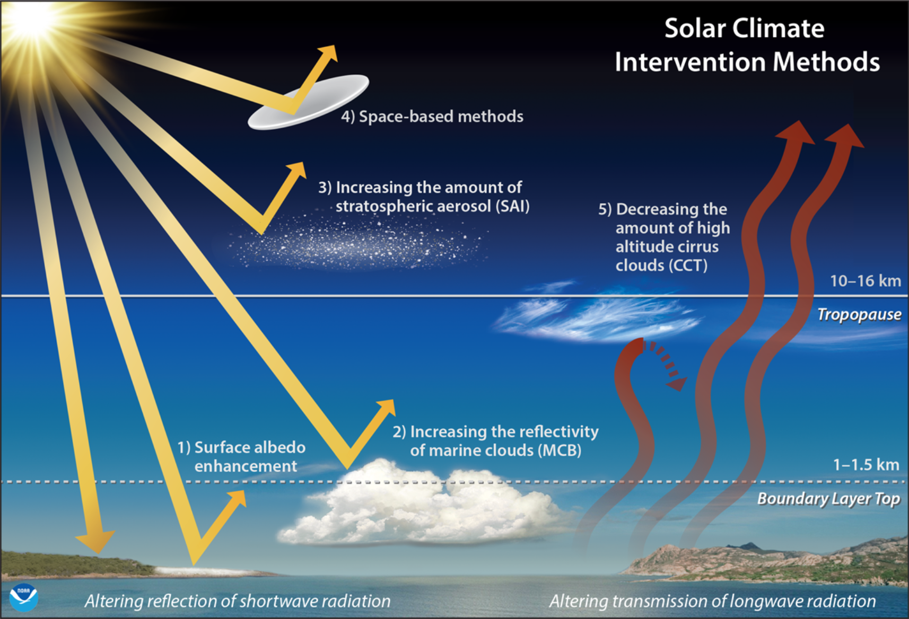
```

.center[.smallmedium[Image source: [https://eos.org/science-updates/improving-models-for-solar-climate-intervention-research](https://eos.org/science-updates/improving-models-for-solar-climate-intervention-research)]]

]

.pull-right-small[
Threat of climate change has led to .blue[proposed interventions]...

  - Stratospheric aerosol injections

  - Marine cloud brightening

  - Cirrus cloud thinning

  - etc.
]

--

<br>

.center[**What are the downstream effects of such mitigation strategies?**]

---

## CLDERA Grand Challenge

```{r out.width = "100%"}
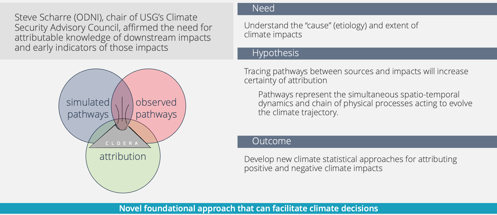
```

.center[.smallmedium[Image credit: CLDERA leadership]]

---

## Climate Event Exemplar

- Mount Pinatubo eruption in 1991

- Released 18-19 Tg of sulfur dioxide

- Proxy for anthropogenic stratospheric aerosol injection

.pull-left[
```{r out.width = "95%"}
include_graphics("figs/pinatubo.jpg")
```
<br>
<br>
.center[.smallmedium[Image source: [https://volcano.si.edu/volcano.cfm?vn=273083](https://volcano.si.edu/volcano.cfm?vn=273083)]]
]

.pull-right[
```{r out.width = "95%"}
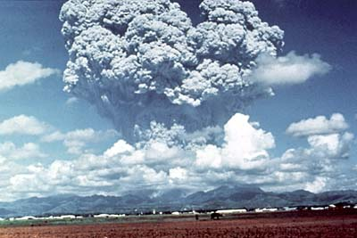
```
.center[.smallmedium[Image source: [https://pubs.usgs.gov/fs/1997/fs113-97/](https://pubs.usgs.gov/fs/1997/fs113-97/)]]
]

---

## Observational Thrust

**Objective**: Develop algorithms to .blue[characterize (i.e., quantify) relationships between climate variables] related to a climate event using observational data

.pull-left-smaller[
```{r out.width = "60%"}

```
]

.pull-right-larger[
```{r out.width = "100%"}
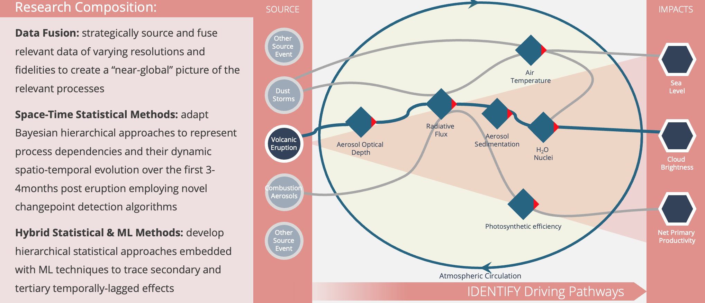
```
<br>
.center[.smallmedium[Image credit: CLDERA leadership]]
]

---

## Mount Pintabuo Pathway

.center[
.blue[Sulfur dioxide]

.medium[Injection of sulfur dioxide (18-19 Tg) into atmosphere `r Citep(bib, "guo2004")`] 

```{r out.width = "5%", fig.align = "center"}
include_graphics("figs/arrow.png")
```

.blue[Aerosol optical depth (AOD)]

.medium[Vertically integrated measure of aerosols in air from surface to stratosphere `r Citep(bib, "sato1993")`

AOD increased as a result of injection of sulfur dioxide `r Citep(bib, c("guo2004", "sato1993"))`]

```{r out.width = "5%", fig.align = "center"}
include_graphics("figs/arrow.png")
```

.blue[Stratospheric temperature]

.medium[Temperatures at pressure levels of 30-50 mb rose 2.5-3.5 degrees centigrade compared to 20-year mean `r Citep(bib, "labitzke1992")`] 
]

---

## Mount Pintabuo Pathway

```{r out.width="77%"}
include_graphics("figs/merra2_heatmaps_1991.png")
```

.center[.smaller[Figure generated using Modern-Era Retrospective Analysis for Research and Applications, Version 2 (MERRA- 2) data `r Citep(bib, "gelaro2017")`.]]

---

## Our Approach

--

Use machine learning...

--

.pull-left[

**Step 1: Model climate event variables with echo state network**

Allow complex machine learning model to capture complex variable relationships

<br>

```{r out.width = "95%"}
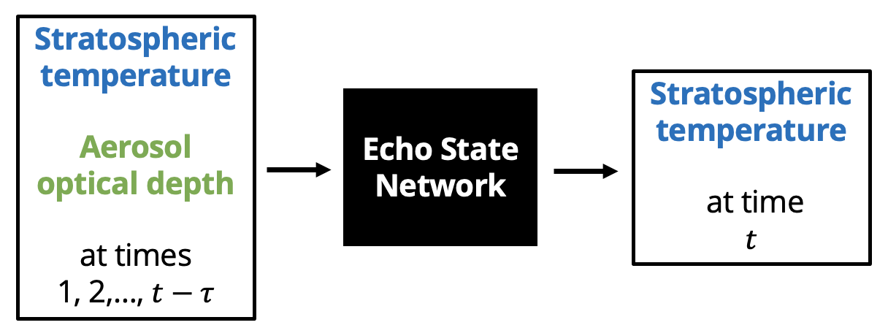
```
]

--

.pull-right[

**Step 2: Quantify relationships via explainability**

Apply feature importance to understand relationships captured by model

<br>

```{r out.width = "100%"}
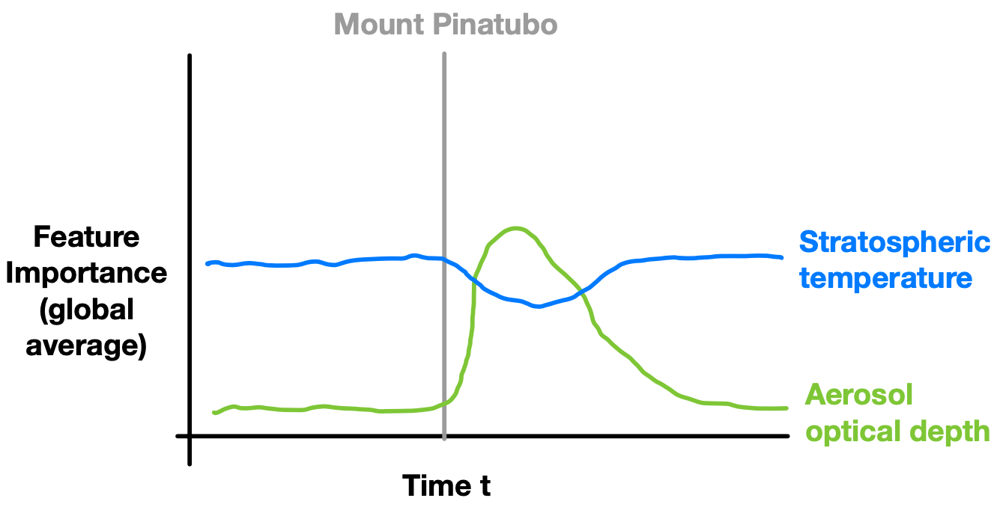
```
]

---

## Remainder of Talk...

<br>

- .blue[Approach]: Echo State Networks and Feature Importance

<br>

- .blue[Climate Application]: Mount Pinatubo

<br>

- .blue[Conclusions and Future/Current Work]

---

class: inverse, center, middle

# Approach

### .bright-teal[Step 1: Echo State Networks]

---

## Echo-State Networks

.pull-left[

**Overview**

- Nonlinear machine learning model for temporal data

  - Sibling to recurrent neural network (RNN)

  - Known for forecasting with chaotic systems

- Computationally efficient model

  - Compared to RNNs and spatio-temporal statistical models
  
  - ESN reservoir parameters randomly sampled instead of estimated

]

--

.pull-right[

**Recent work** 

ESN for spatio-temporal forecasting:
  
  - Sea surface temperature: .medium[`r Citet(bib, "mcdermott2017")`]
  - Soil moisture: .medium[`r Citet(bib, "mcdermott2019")`]
  - Wind power: .medium[`r Citet(bib, "huang2022")`]
  - Air pollution: .medium[`r Citet(bib, "bonas2023")`]

]

---

## Echo-State Networks

**Single-Layer Echo State Network**

.pull-left[
.blue[Output stage]: ridge regression

$$\textbf{y}_{t} = \mathbf{V} \mathbf{h}_t + \boldsymbol{\epsilon}_{t} \ \ \ \ \ \ {\bf \epsilon_t } \sim N(\textbf{0}, \sigma^2_\epsilon \textbf{I})$$

<br>

.blue[Hidden stage]: nonlinear stochastic transformation

$$\mathbf{h}_t = g_h \left(\frac{\nu}{|\lambda_w|} \mathbf{W} \mathbf{h}_{t-1} + \mathbf{U} \mathbf{\tilde{x}}_{t-\tau}\right)$$

$$\tilde{\mathbf{x}}_{t-\tau}=\left[\textbf{x}'_{t-\tau},\textbf{x}'_{t-\tau-\tau^*},...,\mathbf{x}'_{t-\tau-m\tau^*}\right]'$$

]

--

.pull-right[

Only parameters estimated are in $\textbf{V}$.

Elements of $\textbf{W}$ and $\textbf{U}$ randomly sampled...

\begin{align}
    \textbf{W}[h,c_w] &=\gamma_{h,c_w}^w\mbox{Unif}(-a_w,a_w)+(1-\gamma_{h,c_w}^w)\delta_0,\\
    \textbf{U}[h,c_u] &=\gamma_{h,c_u}^u\mbox{Unif}(-a_u,a_u)+(1-\gamma_{h,c_u}^u)\delta_0,
\end{align}

where

- $\gamma_{h,c_w}^w \sim Bern(\pi_w)$
- $\gamma_{h,c_u}^u \sim Bern(\pi_u)$
- $\delta_0$ is a Dirac function 

and values of $a_w$, $a_u$, $\pi_w$, and $\pi_u$ are pre-specified and set to small values.

]

---

## Echo-State Networks

<br>
<br>

```{r out.width = "60%"}

```

---

## Echo-State Networks: Spatio-Temporal Context

Recall that we are working with spatio-temporal data...

```{r out.width = "95%"}
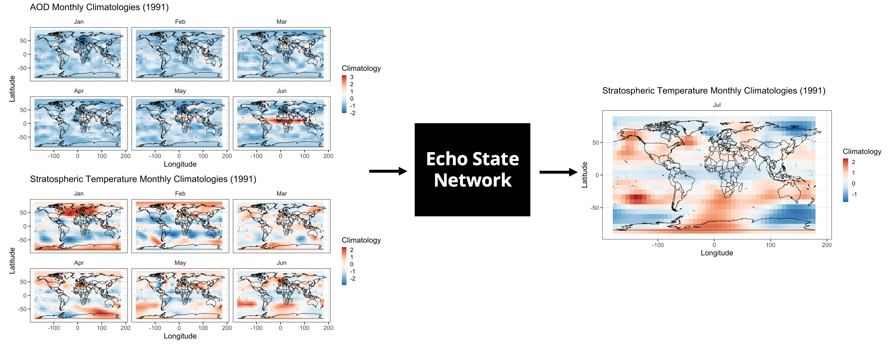
```

---

## Echo-State Networks: Spatio-Temporal Context

--

Spatio-temporal processes at spatial locations $\{\textbf{s}_i\in\mathcal{D}\subset\mathbb{R}^2;i=1,...,N\}$ over times $t=1,...,T$...

--

.pull-left[
.blue[Output variable] (e.g., stratospheric temperature): 
  
$${\bf Z}_{Y,t} = \left(Z_{Y,t}({\bf s}_1),Z_{Y,t}({\bf s}_2),...,Z_{Y,t}({\bf s}_N)\right)'$$

]

--

.pull-right[

.blue[Input variables] (e.g., lagged aerosol optical depth and stratospheric temperature): For $k=1,...,K$
  
$${\bf Z}_{k,t} = \left(Z_{k,t}({\bf s}_1),Z_{k,t}({\bf s}_2),...,Z_{k,t}({\bf s}_N)\right)'$$
]

--

| Stage | Formula | Description |
| ----- | ------- | ----------- |
| Output data stage | ${\bf Z}_{Y,t}\approx\boldsymbol{\Phi}_Y\textbf{y}_{t}$ | Basis function decomposition (e.g., PCA) |
| Output stage | $\textbf{y}_{t} = \mathbf{V} \mathbf{h}_t + \boldsymbol{\epsilon}_{t}$ | Ridge regression |
| Hidden stage | $\mathbf{h}_t = g_h \left(\frac{\nu}{\lvert\lambda_w\rvert} \mathbf{W} \mathbf{h}_{t-1} + \mathbf{U} \mathbf{\tilde{x}}_{t-\tau}\right)$ $\tilde{\mathbf{x}}_{t-\tau}=\left[\textbf{x}'_{t-\tau},\textbf{x}'_{t-\tau-\tau^*},...,\mathbf{x}'_{t-\tau-m\tau^*}\right]'$ | Nonlinear stochastic transformation |
| Input data stage | ${\bf Z}_{k,t}\approx\boldsymbol{\Phi}_k\textbf{x}_{k,t}$ $\ \ \ \ \ \ \textbf{x}_t=[\textbf{x}'_{1,t},...,\textbf{x}'_{K,t}]'$ | Basis function decomposition (e.g., PCA) |

---

## Echo-State Networks: Spatio-Temporal Context

<br>

```{r out.width="100%"}
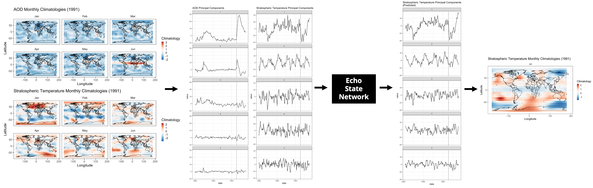
```

---

class: inverse, center, middle

# Approach

### .bright-teal[Step 2: Feature Importance]

---

## Feature Importance for ESNs

--

**Feature importance**: Aims to quantify effect of input variable on a model's predictions

- Permutation feature importance `r Citep(bib, "fisher2019")`, pixel absence affect with ESNs `r Citep(bib, "arrieta2022")`, temporal permutation feature importance `r Citep(bib, "sood2021")`

--

**Our Goal**: Quantify the effect of .blue[input variable] $k$ over .blue[block of times] $(t-b,...,t-1)$ on .blue[forecasts] at time $t$

```{r out.width = "85%"}

```

---

## Feature Importance for ESNs

--

.pull-left-large[
```{r out.width = "90%"}
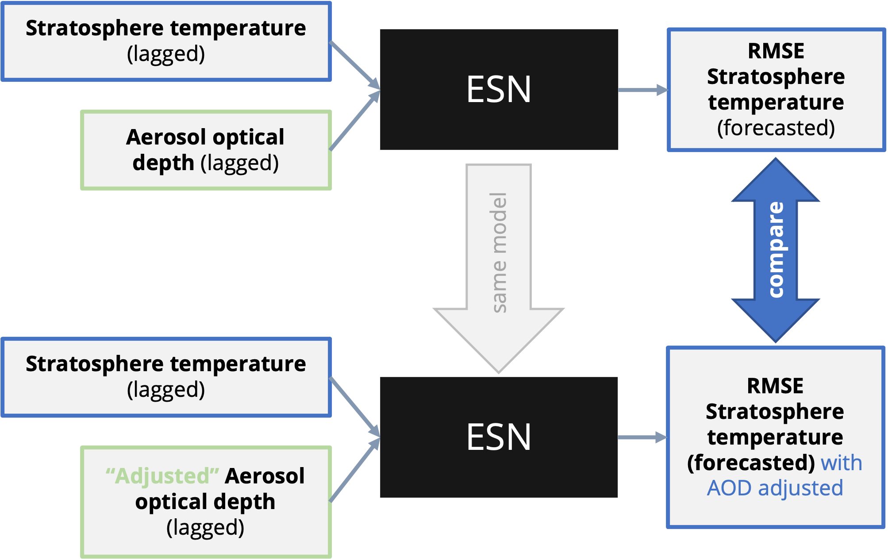
```
]

.pull-right-small[
**Concept**: Set inputs at times(s) of interest to zero and quantify effect on model performance (.blue[ spatio-temporal zeroed feature importance (stZFI)])

]

--

**Feature Importance**: Difference in RMSEs from "zeroed" and observed spatial predictions:

$$RMSE_{zeroed,t}-RMSE_{obs,t}$$

--

**Interpretation**: Large feature importance indicates "zeroed" inputs lead to a decrease in model performance indicating the model uses those inputs for prediction (i.e., inputs 'important' to model)

---


## Feature Importance for ESNs

Computing feature importance of variable 1 at time $t=5$ using a block size of 3:

<br>

$$RMSE_{adj,5}-RMSE_{obs,5}$$

<br>

```{r out.width = "90%"}
include_graphics("figs/fi-demo.png")
```


---

class: inverse, center, middle

# Climate Application

### .bright-teal[Mount Pinatubo]

---

## Mount Pinatubo Example: Data

**Data** Monthly values from 1980 to 1995 and -86 to 86 degrees latitude 

**Source** Modern-Era Retrospective Analysis for Research and Applications, Version 2 (MERRA- 2)

.pull-left-smaller[
**Normalized anomalies**

$$\frac{Z_{k,mth,yr}({\bf s}_i)-\bar{Z}_{k,mth,\cdot}({\bf s}_i)}{sd(Z_{k,mth,\cdot}({\bf s}_i))}$$

<br>

where $\bar{Z}_{k,mth,\cdot}({\bf s}_i)$ and $sd(Z_{k,mth,\cdot}({\bf s}_i))$ are average and standard deviation at location ${\bf s}_i$ during month $mth$ for variable $k$
]

.pull-right-larger[
```{r out.width = "90%"}
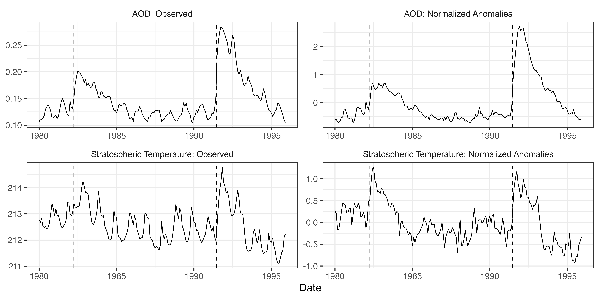
```
]

---

## Mount Pinatubo Example: Model

.pull-left-small[
**Goal** Forecast stratospheric temperature (50mb) one month ahead given lagged values of stratospheric temperature (50mb) and AOD

**Details**

- All variables: First 5 principal components computed on normalized anomalies

- Hyperparameters selected via grid search when years of 1994 and 1995 were held out 

- Fit 25 ESNs to account for random variability
]

.pull-right-large[

```{r out.width = "90%"}
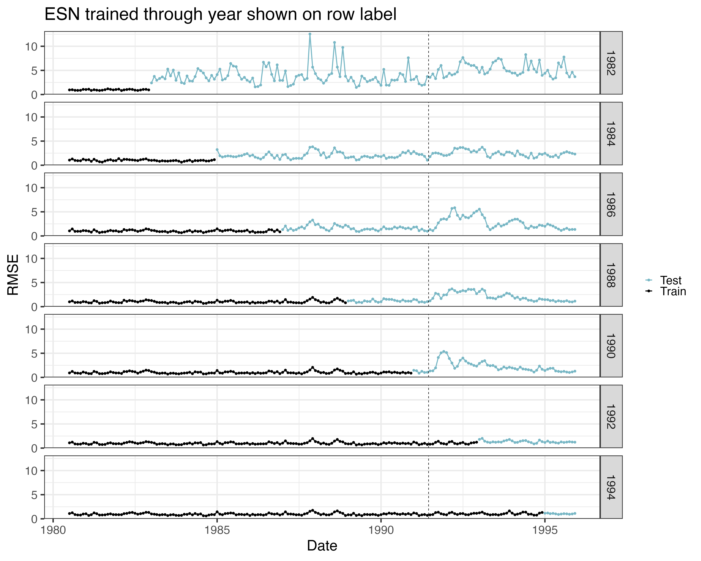
```
]

---

## Mount Pinatubo Example: Feature Importance

**Block size** 6 months (e.g., How important are February, March, April, May, June, and July in 1991 for forecasting August in 1991?)

**Metric** Weighted RMSE to compute feature importance (weighted by cos latitude):

$$\mbox{weighted RMSE}_t =\sqrt{\frac{\sum_{loc}w_{loc}(y_{t,loc}-\hat{y}_{t,loc,adj})^2}{\sum_{loc}w_{loc}}} - \sqrt{\frac{\sum_{loc}w_{loc}(y_{t,loc}-\hat{y}_{t,loc})^2}{\sum_{loc}w_{loc}}}$$

```{r out.width = "70%"}
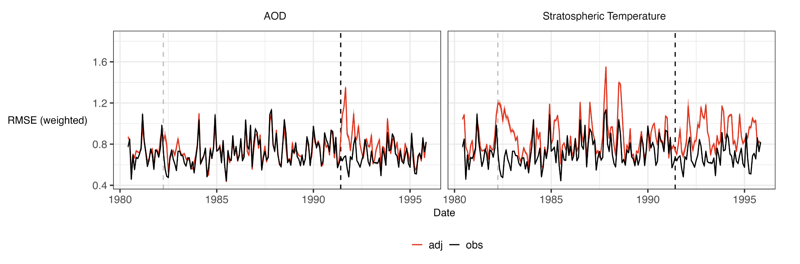
```

---

## Mount Pinatubo Example: Feature Importance

Block size of 6 months (including variability across 25 ESNs)

```{r out.width = "100%"}
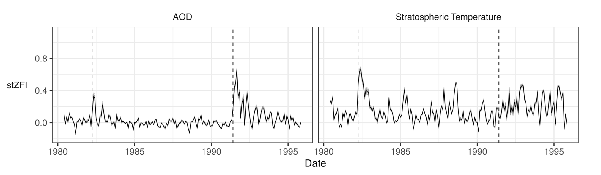
```

---

## Mount Pinatubo Example: Feature Importance

Block sizes of 1-6 months (averaged over 25 ESNs)

```{r out.width = "100%"}
include_graphics("figs/merra2_fi_blocks.png")
```

---

class: inverse, center, middle

# Conclusions and Future Work

---

## Summary and Conclusions

--

**Key Take Aways**

- Interested in quantifying relationships between climate variables associated with pathway of climate event

- Motivated by increasing possibility of climate interventions

- Our machine learning approach:

  - Use ESN to model variable relationships

  - Understand variable relationships using proposed spatio-temporal feature importance

- Approach provided evidence of AOD being an intermediate variable in Mount Pinatubo climate pathway affecting stratospheric temperature

---

## Future (Current) Work

--

**ESN extensions**

- ESN ensembles
- Addition of multiple layers

--

**Feature importance**

- Implement proposed retraining technique `r Citep(bib, "hooker2021")` to lessen detection of spurious relationships due to correlation
- Adapt to visualize on spatial scale
- Comparison to other newly proposed explainability techniques for ESNs (layer-wise relevance propagation)  `r Citep(bib, "landt2022")` 

--

**Mount Pinatubo application**

- Inclusion of additional pathway variables (e.g., SO2, radiative flux, surface temperature)
- Importance of grouped variables
- Application to climate simulation ensembles
- Use of climate simulation ensembles for method assessment

---

## References

.smallmedium[
```{r results = 'asis'}
PrintBibliography(bib, start = 1)
```
]

---

class: inverse, center, middle

<br>

# Thank you

.white[kjgoode@sandia.gov]

.sky-blue[goodekat.github.io]

.white[Slides: [goodekat.github.io/presentations/2023-acasa/slides.html](https://goodekat.github.io/presentations/2023-acasa/slides.html)]

---

class: inverse, center, middle

# Back-Up Slides

---

## MERRA2 Data: Climatologies with variability

<br>

```{r out.width = "40%"}
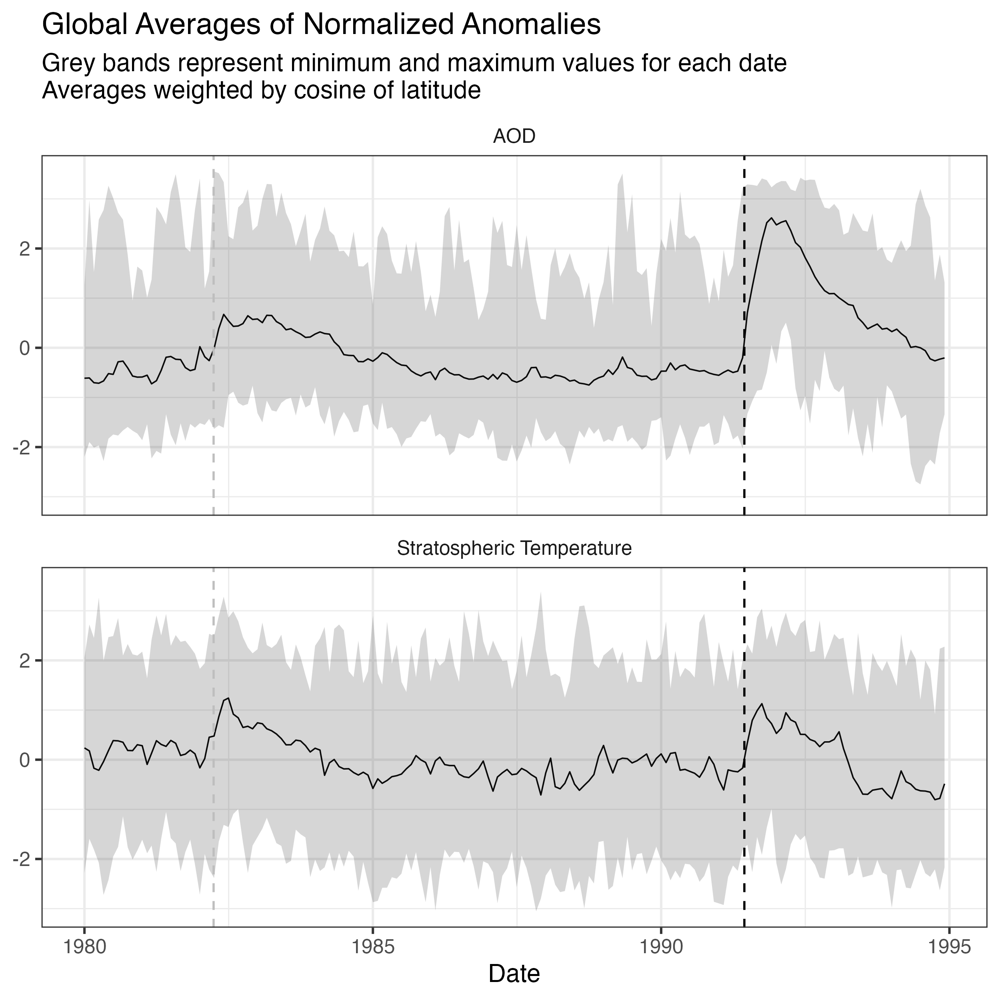
```

---

## Feature Importance: Spatio-Temporal Context

--

**Compute FI on the trained ESN model** for...

- spatio-temporal input variable $k$

- over the block of times $\{t, t-1,..., t-b+1\}$

- on the forecasts of the spatio-temporal response variable at time $t+\tau$.

<br>

--

```{r out.width = "90%"}
include_graphics("figs/fi-demo.png")
```

---

## Feature Importance: Spatio-Temporal Context

Contribution of spatial locations to ZFI: $\sqrt{\frac{w_{loc}(y_{t,loc}-\hat{y}_{t,loc,zeroed})^2}{\sum_{loc}w_{loc}}} - \sqrt{\frac{w_{loc}(y_{t,loc}-\hat{y}_{t,loc})^2}{\sum_{loc}w_{loc}}}$

```{r out.width = "75%"}
include_graphics("figs/fi-cont-aod.png")
```

---

## Feature Importance: Spatio-Temporal Context

Contribution of spatial locations to ZFI: $\sqrt{\frac{w_{loc}(y_{t,loc}-\hat{y}_{t,loc,zeroed})^2}{\sum_{loc}w_{loc}}} - \sqrt{\frac{w_{loc}(y_{t,loc}-\hat{y}_{t,loc})^2}{\sum_{loc}w_{loc}}}$

```{r out.width = "75%"}
include_graphics("figs/fi-cont-temp.png")
```

---

## Simulated Data Demonstration

.pull-left[

**Simulated response**

$$Z_{Y,t}({\bf s}_i)=Z_{2,t}({\bf s}_i) \beta + \delta_t({\bf s}_i) + \epsilon_t({\bf s}_i)$$

where

- $Z_{2,t}$ spatio-temporal covariate
- $\delta_t({\bf s}_i)$ spatio-temporal random effect
- $\epsilon_t({\bf s}_i) \overset{iid}{\sim}  N(0,\sigma_{\epsilon}^2)$

```{r out.width = "80%"}
include_graphics("figs/syn_data.png")
```

]

.pull-right[


```{r out.width = "90%"}
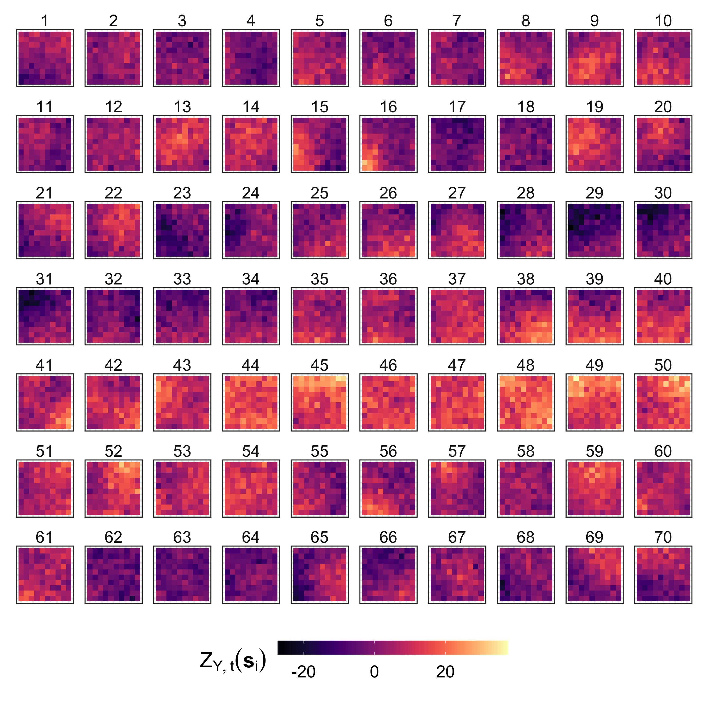
```
]

---

## Simulated Data: Effect of Variability on FI

```{r out.width = "90%"}
include_graphics("figs/zfi_nblock.png")
```


---

## Effect of Correlation on FI

```{r out.width = "100%"}
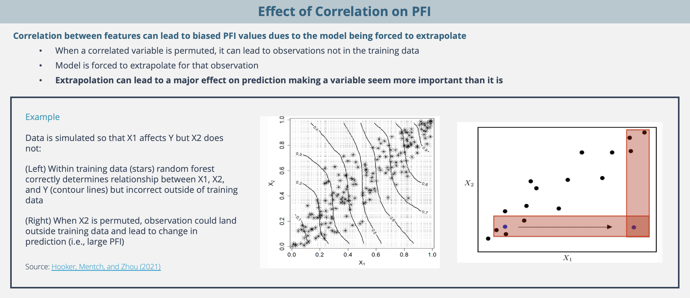
```